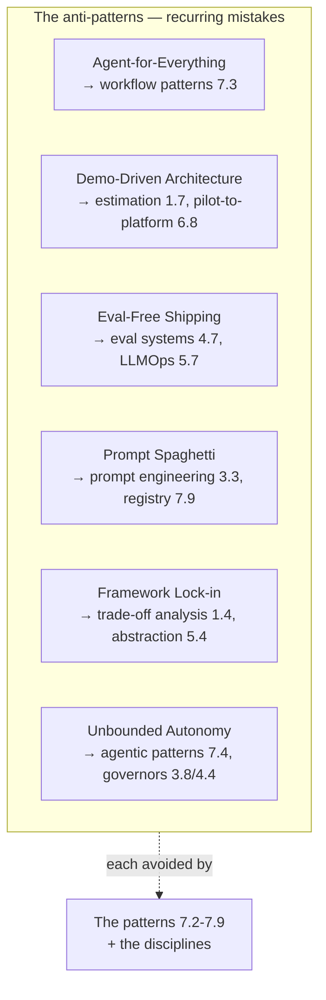

# Chapter 7.10 — Anti-patterns

| | |
|---|---|
| **Part** | 7 — Enterprise AI Architecture Patterns |
| **Maturity level** | 4 — Architect |
| **Difficulty** | Advanced |
| **Estimated study time** | 3 hours (reading 90 min, exercise 90 min) |
| **Prerequisites** | Parts 3–6 (the anti-patterns are the mistakes those chapters warned against) |

## Learning Objectives

After this chapter you will be able to:

1. Recognize the GenAI anti-patterns in pattern-language form: agent-for-everything, demo-driven architecture, eval-free shipping, prompt spaghetti, framework lock-in, and unbounded autonomy.
2. Identify the anti-patterns in proposed and existing systems, using each anti-pattern's context, symptoms, and refactoring.
3. Prevent the anti-patterns through the patterns (7.2–7.9) that avoid them.
4. Use the anti-patterns as the reference for what to avoid, as valuable as the patterns for what to do.

## Introduction

This closing chapter of Part 7 catalogs the anti-patterns — the recurring GenAI mistakes the curriculum warned against, named and presented in pattern form (7.1). An *anti-pattern* is a recurring solution that looks reasonable but produces bad outcomes — the tempting mistake, named so it can be recognized and avoided. The anti-patterns are as valuable as the patterns (7.1): the patterns show what to do, the anti-patterns show what to avoid, and the architect needs both.

The framing: **anti-patterns are the recurring mistakes named, as valuable as the patterns** — the tempting mistakes (agent-for-everything, demo-driven architecture, eval-free shipping, prompt spaghetti, framework lock-in, unbounded autonomy) that look reasonable but produce bad outcomes, named so they can be recognized and avoided, and this chapter is the reference for what to avoid.

## Business Motivation

The anti-patterns are the recurring failure modes that cost the enterprise — the tempting mistakes that produce the incidents, the waste, and the failures the curriculum documented. Recognizing the anti-patterns prevents the costs: the agent-for-everything (the agent complexity and cost where a workflow fit — 3.8), the demo-driven architecture (the demo that didn't scale — 1.7), the eval-free shipping (the ungated regressions — 4.7), the prompt spaghetti (the un-versioned prompt chaos — 3.3), the framework lock-in (the lock-in cost — 7.10), the unbounded autonomy (the runaway — 3.8/4.4). The business case is the failure-prevention one: the anti-patterns are the recurring, costly failure modes, named so the architect recognizes and avoids them (the prevention — the incidents, waste, and failures avoided), and the anti-pattern family is the reference for what to avoid — the mistakes named, the failure-prevention the enterprise needs as much as the success-patterns.

## Theory — The Anti-pattern Catalog

### Anti-pattern: Agent-for-Everything

- **Context** — a GenAI problem where an agent is proposed (3.8).
- **Symptoms** — the agent used where a workflow pattern fits (3.8's spectrum — the fixed path, the reaching-for-agents because it's fashionable), the un-needed complexity and cost.
- **Why it's tempting** — the agent is fashionable, the "agentic" framing appealing (3.8).
- **Consequences** — the un-needed agent complexity, cost, and variance (3.8 — the workflow would have been simpler, cheaper, debuggable).
- **Refactoring** — the autonomy-grid check (3.8), the workflow patterns (7.3) where the path is fixed, the agent only where undiscoverable (3.8's spectrum).
- **Avoided by** — the workflow patterns (7.3), the autonomy grid (3.8).

### Anti-pattern: Demo-Driven Architecture

- **Context** — a GenAI system whose architecture is driven by the demo (1.7).
- **Symptoms** — the impressive demo that doesn't scale to production (1.7's demo-to-production gap — the demo-region-not-operating-region — 3.1, the pilot-that-went-nowhere — 6.8).
- **Why it's tempting** — the demo impresses, the demo-to-production multiplier under-appreciated (1.7).
- **Consequences** — the demo that didn't productionize (1.7's ambush — the 4-10× multiplier, the missing evals/governance/scale).
- **Refactoring** — the demo-to-production discipline (1.7 — the full estimate, Part 4's industrialization), the pilot-to-platform sequencing (6.8).
- **Avoided by** — the estimation (1.7), the pilot-to-platform (6.8), the production disciplines (Part 4).

### Anti-pattern: Eval-Free Shipping

- **Context** — a GenAI system shipped without evals (4.7).
- **Symptoms** — the changes shipped ungated (4.7 — the prompt hotfix, the silent model change, the majority-of-incidents cause), the demo-based "evaluation" (2.7's fluency-flattered impressions).
- **Why it's tempting** — the evals seem optional, the demo impressive (2.7).
- **Consequences** — the ungated regressions (4.7 — the majority of production incidents), the un-measured quality (2.7).
- **Refactoring** — the eval systems (4.7 — the golden sets, the gates), the eval-as-tests (5.7 — the LLMOps gates), the eval-before-feature (4.7).
- **Avoided by** — the evaluation patterns (4.7), the LLMOps (5.7), the evaluation discipline (2.7).

### Anti-pattern: Prompt Spaghetti

- **Context** — a GenAI system with un-versioned, accreted prompts (3.3).
- **Symptoms** — the prompts scattered, un-versioned, live-edited, accreted (3.3's live-edit and rule-pile anti-patterns — the 9K-token barnacle — 2.5's Vantora, the prompt chaos).
- **Why it's tempting** — the prompts seem like simple strings, the live-edit quick (3.3).
- **Consequences** — the un-versioned prompt chaos (3.3 — the un-rollbackable, un-tested, un-owned prompts, the drift).
- **Refactoring** — the prompt engineering discipline (3.3 — versioned, owned, suite-covered, deployed-not-edited), the prompt registry (7.9/5.7).
- **Avoided by** — the prompt engineering (3.3), the prompt registry (7.9), the LLMOps (5.7).

### Anti-pattern: Framework Lock-in

- **Context** — a GenAI system built on a heavily-locking framework (7.10).
- **Symptoms** — the framework fixing the trajectory format, the checkpoint model, the gate semantics (4.4/4.6 — the framework adopted by demo appeal, the lock-in), especially the central components (the gateway — 5.4, the platform — 5.10).
- **Why it's tempting** — the framework is convenient, the demo appealing (1.4).
- **Consequences** — the lock-in cost (the framework hard to change, especially the central components — 5.4/5.10), the constrained architecture.
- **Refactoring** — the build-vs-buy discipline (1.4/6.8 — the framework evaluated against the requirements, the lock-in weighed), the abstraction (the gateway abstracting the model — 5.4/3.10).
- **Avoided by** — the trade-off analysis (1.4), the model selection (3.10 — the reversibility), the platform patterns (7.9 — the abstraction).

### Anti-pattern: Unbounded Autonomy

- **Context** — an agent without the governors (3.8/4.4).
- **Symptoms** — the agent without the caps, budgets, stuck detector, kill switch (3.8's governors — the unbounded loop, the runaway — 4.4's 3am tail, the denial-of-wallet — 4.9).
- **Why it's tempting** — the autonomy seems powerful, the governors seem restrictive (3.8).
- **Consequences** — the runaway (the unbounded cost, the runaway loop — 3.8/4.4), the uncontained blast radius (4.9).
- **Refactoring** — the bounded agent loop (7.4 — the governors), the production envelope (4.4 — the budgets, the kill switch), the autonomy grid (3.8).
- **Avoided by** — the agentic patterns (7.4 — the bounded loop), the governors (3.8/4.4).

## Architecture Perspective

Readings. **Each anti-pattern is avoided by a pattern or discipline** — the agent-for-everything by the workflow patterns (7.3), the demo-driven architecture by the estimation (1.7) and pilot-to-platform (6.8), the eval-free shipping by the eval systems (4.7) and LLMOps (5.7), the prompt spaghetti by the prompt engineering (3.3) and registry (7.9), the framework lock-in by the trade-off analysis (1.4) and abstraction (5.4), the unbounded autonomy by the agentic patterns (7.4) and governors (3.8/4.4) — the anti-patterns and the patterns as the two sides (7.1 — the patterns show what to do, the anti-patterns show what to avoid). **The anti-patterns are the recurring mistakes named** — the tempting mistakes (the fashionable agent, the impressive demo, the optional evals, the simple prompts, the convenient framework, the powerful autonomy) that look reasonable but produce bad outcomes (the complexity, the un-scaling, the regressions, the chaos, the lock-in, the runaway), named so they can be recognized and avoided (7.1's anti-patterns). **And the anti-patterns are the governance's risk-surfacing** — the anti-patterns are what the governance (6.9) surfaces (the review catching the anti-patterns — 6.9's risk-surfacing), so the anti-patterns are the reference for what the governance avoids (6.9).

## Real-world Example

**The recurring companies** illustrate the anti-patterns avoided — the case studies' architects recognizing and avoiding the anti-patterns. Halvard & Roth avoided the agent-for-everything (4.5's rejected persona-agents — the workflow patterns preferred — 7.3, the 90/10 shape) and the unbounded autonomy (3.8/4.4's governors on the investigation agent). Bellhaven avoided the demo-driven architecture (1.7's full estimate on the intake platform, the pilot-to-platform — 6.8) and the eval-free shipping (4.7's evals on the extraction). Vantora avoided the prompt spaghetti (3.3's prompt engineering, the prompt registry — 7.9, after the early live-edit incident — 3.3) and the framework lock-in (5.4's gateway abstracting the model — 3.10's reversibility, the build-vs-buy — 1.4). Kestrel avoided the eval-free shipping (4.7's evals on the correspondence) and the unbounded autonomy (the human-in-the-loop — 7.5, the draft-not-send). The anti-patterns-avoided note (across the companies): *"The case studies' architects recognized and avoided the anti-patterns. Halvard & Roth avoided agent-for-everything (the persona-agents rejected, the workflow patterns — 7.3) and unbounded autonomy (the governors). Bellhaven avoided demo-driven architecture (the full estimate — 1.7, the pilot-to-platform — 6.8) and eval-free shipping (the evals — 4.7). Vantora avoided prompt spaghetti (the prompt engineering — 3.3, after the early live-edit) and framework lock-in (the gateway abstraction — 5.4). Kestrel avoided eval-free shipping and unbounded autonomy (the human-in-the-loop — 7.5). The anti-patterns are the recurring mistakes named — the tempting mistakes that look reasonable but produce bad outcomes. Recognizing them (and applying the patterns that avoid them) is as valuable as knowing the patterns — the architect needs both: what to do (the patterns — 7.2-7.9) and what to avoid (the anti-patterns — 7.10)."*

## Hands-on Exercise

**Identify and refactor the anti-patterns.** ~90 minutes. For a GenAI system (real or a case study), or a set of proposed designs.

1. **Anti-pattern identification (30 min).** For a GenAI system or proposed design, identify the anti-patterns: the agent-for-everything (the agent where a workflow fits — 3.8), the demo-driven architecture (the un-scaling demo — 1.7), the eval-free shipping (the ungated changes — 4.7), the prompt spaghetti (the un-versioned prompts — 3.3), the framework lock-in (the locking framework — 1.4), the unbounded autonomy (the un-governed agent — 3.8/4.4). List the anti-patterns present or risked.
2. **The anti-pattern form (20 min).** For one identified anti-pattern, write its full anti-pattern form (Context, Symptoms, Why it's tempting, Consequences, Refactoring, Avoided by).
3. **The refactoring (25 min).** For the identified anti-patterns, design the refactoring (the pattern or discipline that avoids each — the workflow patterns for agent-for-everything, the eval systems for eval-free shipping, etc.). Show how each anti-pattern is avoided.
4. **The prevention (15 min).** Describe how the governance (6.9) would surface and prevent the anti-patterns (the review's risk-surfacing — 6.9).

**Acceptance criteria:**
- [ ] The anti-patterns identified in the system/design
- [ ] One anti-pattern in the full anti-pattern form
- [ ] The refactoring designed (the pattern/discipline that avoids each anti-pattern)
- [ ] The governance prevention described (6.9's risk-surfacing)

## Enterprise Considerations

The anti-patterns are the enterprise's what-to-avoid reference, surfaced by the governance. **They're the what-to-avoid reference** (7.1): the anti-pattern family is the enterprise's reference for the recurring mistakes to avoid (the failure-prevention), as valuable as the patterns (the success). **They're the governance's risk-surfacing** (6.9): the anti-patterns are what the governance (6.9) surfaces and prevents (the review catching the agent-for-everything, the eval-free shipping — 6.9's risk-surfacing), so the anti-patterns are the governance's checklist of what to avoid (6.9). **They're the review-and-onboarding reference** (6.9/8.7): the anti-patterns are the reference for the architecture review (6.9 — the anti-patterns the review catches) and the onboarding (8.7 — the new architect learning the anti-patterns to avoid), so the anti-patterns are the review and onboarding asset. **And the anti-patterns evolve** (7.1's living catalog): the anti-patterns evolve as new mistakes emerge (the pattern catalog living — 7.1), so the anti-pattern family is a living reference (the emerging mistakes named).

## Trade-offs

The anti-patterns are mistakes to avoid, not trades — but recognizing them involves the trade-off discipline:

| Recognizing | The anti-pattern | The pattern/discipline | The tell |
|----------|----------|----------|----------|
| Agent vs. workflow | Agent-for-everything | Workflow patterns (7.3), autonomy grid (3.8) | The path is fixed but an agent is proposed |
| Demo vs. production | Demo-driven architecture | Estimation (1.7), pilot-to-platform (6.8) | The demo impresses but the production plan is missing |
| Evals | Eval-free shipping | Eval systems (4.7), LLMOps (5.7) | The change ships ungated, the "eval" is a demo |
| Prompts | Prompt spaghetti | Prompt engineering (3.3), registry (7.9) | The prompts are live-edited, un-versioned, accreted |
| Framework | Framework lock-in | Trade-off analysis (1.4), abstraction (5.4) | The framework is adopted by demo appeal, the lock-in un-weighed |
| Autonomy | Unbounded autonomy | Agentic patterns (7.4), governors (3.8/4.4) | The agent lacks the caps, budgets, kill switch |

## Common Mistakes (Meta: the mistakes about the anti-patterns)

1. **Not knowing the anti-patterns** — the architect who knows the patterns but not the anti-patterns (the what-to-do without the what-to-avoid); the anti-patterns as valuable as the patterns (7.1).
2. **Recognizing too late** — the anti-pattern recognized after the incident (the un-caught anti-pattern); the governance's risk-surfacing (6.9 — the anti-patterns caught in review).
3. **The anti-pattern's temptation** — falling for the anti-pattern's appeal (the fashionable agent, the impressive demo — the temptation); the discipline (the autonomy grid, the estimation — the anti-pattern's refactoring).
4. **The un-refactored anti-pattern** — the anti-pattern recognized but not refactored (the known-but-not-fixed); the refactoring (the pattern that avoids it).
5. **The static anti-pattern catalog** — the anti-patterns not evolving (the new mistakes un-named); the living catalog (7.1 — the emerging anti-patterns).
6. **The anti-pattern as a purity test** — treating every use of an agent/framework as the anti-pattern (the over-application); the anti-pattern's context (the agent-for-everything is the agent-*where-a-workflow-fits*, not all agents).
7. **Ignoring the governance's role** — not using the governance to surface the anti-patterns (6.9); the governance's risk-surfacing (the anti-patterns caught in review).

## Best Practices

1. **Know the anti-patterns as well as the patterns** — the what-to-avoid (7.10) as valuable as the what-to-do (7.2-7.9), the architect needs both.
2. **Recognize the anti-patterns early** — the governance's risk-surfacing (6.9 — the anti-patterns caught in review, not after the incident).
3. **Resist the anti-pattern's temptation with the discipline** — the autonomy grid (3.8) against the agent-for-everything, the estimation (1.7) against the demo-driven, the eval systems (4.7) against the eval-free.
4. **Refactor the anti-patterns with the patterns** — the workflow patterns (7.3) for the agent-for-everything, the prompt engineering (3.3) for the prompt spaghetti, etc.
5. **Use the governance to surface the anti-patterns** — the review's risk-surfacing (6.9), the anti-patterns as the governance's checklist.
6. **Apply the anti-pattern's context** — the anti-pattern is the mistake-in-context (the agent-*where-a-workflow-fits*), not the over-applied purity test.
7. **Keep the anti-pattern catalog living** — the emerging anti-patterns named (7.1's living catalog).

## Architecture Checklist

For avoiding the anti-patterns:

- [ ] Agent-for-everything avoided (the autonomy grid — 3.8, the workflow patterns — 7.3 where the path is fixed)
- [ ] Demo-driven architecture avoided (the full estimate — 1.7, the pilot-to-platform — 6.8, the production disciplines — Part 4)
- [ ] Eval-free shipping avoided (the eval systems — 4.7, the LLMOps gates — 5.7)
- [ ] Prompt spaghetti avoided (the prompt engineering — 3.3, the prompt registry — 7.9)
- [ ] Framework lock-in avoided (the trade-off analysis — 1.4, the abstraction — 5.4, the reversibility — 3.10)
- [ ] Unbounded autonomy avoided (the agentic patterns — 7.4, the governors — 3.8/4.4)
- [ ] The governance surfaces the anti-patterns (6.9's risk-surfacing); the anti-pattern catalog living (7.1)

## Interview Questions

1. *"What are the most common GenAI architecture anti-patterns?"* — Strong answers give the family (agent-for-everything, demo-driven architecture, eval-free shipping, prompt spaghetti, framework lock-in, unbounded autonomy), each with its symptoms and the pattern/discipline that avoids it (the workflow patterns, the estimation, the eval systems, the prompt engineering, the trade-off analysis, the governors).
2. *"Why is agent-for-everything an anti-pattern?"* — Strong answers give the symptom (the agent used where a workflow pattern fits — 3.8's spectrum, the fashionable agent), the consequences (the un-needed complexity, cost, variance — the workflow would have been simpler), and the refactoring (the autonomy grid — 3.8, the workflow patterns — 7.3, the agent only where the path is undiscoverable).
3. *"How do you prevent eval-free shipping?"* — Strong answers give the eval systems (4.7 — the golden sets, the gates), the eval-as-tests (5.7 — the LLMOps CI gates wired into the change paths), the eval-before-feature (4.7), so the changes are gated (the majority-of-incidents cause prevented — 4.7).
4. *"Why are anti-patterns as valuable as patterns?"* — Strong answers give the two-sides (7.1 — the patterns show what to do, the anti-patterns show what to avoid), the recurring mistakes named (the tempting mistakes recognized and avoided), the governance's risk-surfacing (6.9 — the anti-patterns the review catches), the architect needing both.

## Further Reading

- The chapters the anti-patterns draw from: 3.8 (agent-for-everything, unbounded autonomy), 1.7/6.8 (demo-driven architecture), 4.7 (eval-free shipping), 3.3 (prompt spaghetti), 1.4/5.4 (framework lock-in) — the source of the anti-patterns.
- The AntiPatterns literature (Brown et al., *AntiPatterns*) — the anti-pattern concept and form this chapter adapts.
- 7.1 A Pattern Language for GenAI (the pattern/anti-pattern two-sides) and 6.9 Architecture Governance (the risk-surfacing) — the framing chapters.
- The [case studies](../../case-studies/README.md) — the anti-patterns avoided (the case studies' architects recognizing and avoiding them).

## Summary

- **Anti-patterns are the recurring mistakes named** — agent-for-everything (the agent where a workflow fits — 3.8), demo-driven architecture (the un-scaling demo — 1.7), eval-free shipping (the ungated changes — 4.7), prompt spaghetti (the un-versioned prompts — 3.3), framework lock-in (the locking framework — 1.4), unbounded autonomy (the un-governed agent — 3.8/4.4) — the tempting mistakes that look reasonable but produce bad outcomes.
- **Each anti-pattern is avoided by a pattern or discipline** — the workflow patterns (7.3), the estimation (1.7), the eval systems (4.7), the prompt engineering (3.3), the trade-off analysis (1.4), the governors (3.8/4.4) — the anti-patterns and the patterns as the two sides (7.1).
- The anti-patterns are **as valuable as the patterns** — the patterns show what to do, the anti-patterns show what to avoid, the architect needs both.
- The anti-patterns are the **governance's risk-surfacing** (6.9) — the recurring mistakes the review catches, the reference for what to avoid, applied in context (the mistake-in-context, not the over-applied purity test).
- The anti-patterns close Part 7 — the pattern catalog (7.2-7.9, the what-to-do) and the anti-patterns (7.10, the what-to-avoid), the reference core cross-linked from the case studies. **Part 8** turns to the professional excellence that surrounds all this architecture.

---

**Previous:** [Chapter 7.9 — Platform & Multi-tenancy Patterns](chapter-09-platform-multitenancy-patterns.md) · **Next:** [Part 8 — Professional Excellence & Career Development](../part-8-professional-excellence/) · **Related:** [7.1 A Pattern Language for GenAI](chapter-01-pattern-language.md), [3.8 Agents](../part-3-core-building-blocks-of-genai/chapter-08-agents-concepts.md), [6.9 Architecture Governance](../part-6-enterprise-architecture/chapter-09-architecture-governance.md)
