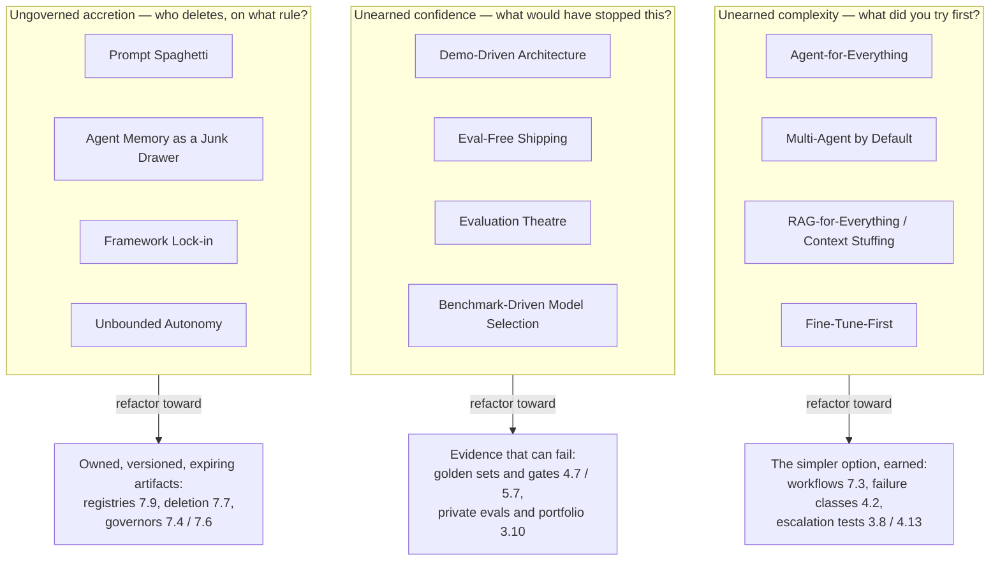

# Chapter 7.10 — Anti-patterns

| | |
|---|---|
| **Part** | 7 — Enterprise AI Architecture Patterns |
| **Maturity level** | 4 — Architect |
| **Difficulty** | Advanced |
| **Estimated study time** | 2 hours (reading 40 min, exercise 75 min) |
| **Prerequisites** | Parts 3–6 (the anti-patterns are the mistakes those chapters warned against) |

## Learning Objectives

After this chapter you will be able to:

1. Read any entry in its load-bearing parts — the seduction, the checkable symptom, the cost, and the refactoring.
2. Sort the catalog into its three families — unearned complexity, unearned confidence, ungoverned accretion — and use the family to pick a review's first question.
3. Detect the twelve anti-patterns from evidence in a design or a running system, not from the architect's description of it.
4. Separate each anti-pattern from the legitimate use of the same technology, and extend the catalog in the same form.

## Introduction

An anti-pattern is a recurring solution that looks reasonable and produces bad outcomes. The second half is why the catalog exists; the first half is why writing it is hard. A mistake that announced itself would not survive a review, so an entry that fails to explain the *seduction* is useless — the reader will never recognize the moment they are being seduced. Every entry below leads with why a competent architect chooses it, then gives a symptom you can check, a cost you can price, and a refactoring you can schedule.

Three families organize the catalog, each with its own opening question. **Unearned complexity** — machinery adopted before the simpler thing was shown to fail: *what did you try first, and how did it fail?* **Unearned confidence** — shipping on evidence that could not have failed: *what result would have stopped this?* **Ungoverned accretion** — artifacts growing without an owner, a version, or an expiry: *who deletes things, and on what rule?*

Half these entries are the mistakes of the first production wave. The other half were added because the estate changed: retrieval became a reflex, agent fleets a default topology, leaderboards a procurement instrument, fine-tuning a one-click product, eval suites something to display rather than to fail, and agent memory persistent state nobody owns ([7.1](chapter-01-pattern-language.md)'s living-catalog rule).

## Business Motivation

The costs come in three shapes, and the shape sets the urgency.

**Waste** is complexity bought that changes no outcome: the fleet whose accuracy matches one prompted call, the retrieval stage installed against a failure class nobody measured, the fine-tune of behavior a system prompt already carried. It arrives as an invoice and a slower roadmap — the cheapest failure and the most common, because every item on that list is defensible in a slide.

**Exposure** is shipping on evidence that could not fail, and it lands in law and press rather than in the error budget. The publicly reported class of incident is instructive because it is boring: a customer-facing assistant states a policy that does not exist, a customer relies on it, and the company is held to the answer. No novel capability, no adversary — the missing control was a gate on a change nobody classified as risky. The [prompt injection](../../GLOSSARY.md) literature describes the same shape with the payload inside ordinary retrieved content.

**Drag** is accretion: prompts nobody can roll back, a framework whose semantics became your architecture, a store that only grows. It causes no incident the day it is created and makes every later change more expensive, which is why it is under-priced in the estimate ([1.7](../part-1-professional-foundation/chapter-07-estimation.md)).

Against all three the catalog is cheap, because its function is conversion: it turns *I don't like this design* into a named symptom, a priced cost, and a scheduled refactoring.

## Theory — The Anti-pattern Catalog

### Family 1 — Unearned complexity

#### Anti-pattern: Agent-for-Everything

- **Context** — a task with fixed or predictable steps, for which an agent is proposed.
- **Why it's tempting** — autonomy generalizes. A workflow must be re-specified as requirements move; an agent seems to absorb that for free, and it demos better.
- **Symptoms** — the happy path is drawable as a flowchart; traces repeat one tool sequence; debugging means reading transcripts rather than inspecting a failed step.
- **Consequences** — cost multiplies with the loop, latency turns unpredictable, evaluation drops from per-step assertions to impressions. Variance is the real bill: a fixed pipeline fails the same way twice and gets fixed once.
- **Refactoring** — run the autonomy-grid check ([3.8](../part-3-core-building-blocks-of-genai/chapter-08-agents-concepts.md)); build fixed paths as a chain or router ([7.3](chapter-03-workflow-patterns.md)); reserve the agent for the undiscoverable slice.
- **Avoided by** — workflows as the default; the agent as a written escalation.

#### Anti-pattern: Multi-Agent by Default

- **Context** — a problem split into a fleet of specialists before one agent has been built and measured.
- **Why it's tempting** — the decomposition mirrors how a competent human team divides work, so it feels like design rather than fashion; each prompt stays short; and an org chart is a diagram executives already read fluently.
- **Symptoms** — no single-agent baseline on the same golden set; failures blamed on "the handoff" rather than localized; a trace nobody reads end to end; token spend several times the single-call figure with no quality delta.
- **Consequences** — coordination overhead is paid per request, and per-step error compounds along the chain instead of averaging out, so a fleet of decent agents can land below one careful agent. Attribution collapses, leaving the system undebuggable and effectively un-gateable.
- **Refactoring** — earn each agent: measure the single-agent baseline, then add the second only where the fleet beats it on the same set, with per-agent evaluation in place first ([4.5](../part-4-enterprise-genai-systems/chapter-05-multi-agent-systems.md)). A fixed sequence of specialists is a workflow.
- **Avoided by** — the baseline as an admission requirement; a bounded loop around each survivor ([7.4](chapter-04-agentic-patterns.md)).

#### Anti-pattern: RAG-for-Everything (Context Stuffing)

- **Context** — retrieval bolted onto a problem that is not a knowledge problem, or a stack "improved" by adding context instead of the right context.
- **Why it's tempting** — [RAG](../../GLOSSARY.md) fixed the first and worst GenAI failure, so it becomes the reflex for every later one; and with long windows cheap enough to abuse, stuffing feels safer than choosing.
- **Symptoms** — retrieval added to a task whose difficulty is style, judgment, or arithmetic; a stage whose removal doesn't move the score; prompts near the window limit by construction; cost rising while quality is flat; nobody can name the failure class the last three changes addressed.
- **Consequences** — money burned on tokens carrying no signal, plus a quality *decline*: models attend unevenly across a long window and recover buried material least reliably, so real evidence competes with padding and sometimes loses. The stage becomes unfalsifiable.
- **Refactoring** — apply the named-failure-class discipline of [4.2](../part-4-enterprise-genai-systems/chapter-02-advanced-retrieval.md): taxonomize the misses, name the class, install the technique that targets it, re-measure per class. Ablate every stage once; one that cannot show its lift is deleted.
- **Avoided by** — requirement classification before architecture ([4.13](../part-4-enterprise-genai-systems/chapter-13-prompting-rag-finetuning.md)); a token budget with an owner.

#### Anti-pattern: Fine-Tune-First

- **Context** — a quality gap that prompting and retrieval have not been seriously tried against, met with a proposal to fine-tune.
- **Why it's tempting** — it sounds like the serious engineering answer and is now one click on several platforms. It promises permanent consistency rather than argument with a prompt, it shortens the prompt, and "we trained our own model" is the sentence executives repeat.
- **Symptoms** — no measured prompting baseline, or one built from a first-draft prompt; the thing being trained in is *knowledge* ("fine-tune on the policy manuals") rather than behavior; demonstrations assembled from reachable text; no plan for base-model deprecation.
- **Consequences** — you buy a training pipeline, a data-rights position on the demonstrations, a refresh obligation as behavior drifts, and migration debt: every deprecation becomes a re-training project rather than a config change. Knowledge in weights is uncitable and stale by construction, forfeiting the audit trail regulated work needs.
- **Refactoring** — apply [4.13](../part-4-enterprise-genai-systems/chapter-13-prompting-rag-finetuning.md)'s escalation test in full: demonstrable behavior, a *measured* prompting ceiling, volume that justifies the project, no cheaper lever left. Knowledge goes to retrieval, hard lines to guardrails.
- **Avoided by** — a mandatory prompted baseline; the deprecation drill priced in ([3.10](../part-3-core-building-blocks-of-genai/chapter-10-model-selection-benchmarking.md)).

### Family 2 — Unearned confidence

#### Anti-pattern: Demo-Driven Architecture

- **Context** — an architecture whose shape was set by what made the pilot work, carried forward as the production design.
- **Why it's tempting** — the demo is the only working artifact anyone has seen, and it *did* work. Sunk effort, executive enthusiasm, and a real speed advantage all argue for keeping its shape; proposing a rebuild sounds like self-indulgence.
- **Symptoms** — no evals, no failure taxonomy, no cost model, but a launch date; the pilot's region, data snapshot, or single-tenant assumption still in the design; scale and permissions deferred to "phase two"; the plan totals roughly the pilot's cost.
- **Consequences** — the demo-to-production multiplier ([1.7](../part-1-professional-foundation/chapter-07-estimation.md)) ambushes the team after the date is public, and what gets cut to save the date is exactly the evaluation, permissioning, and observability the demo never needed. The usual outcome is a stalled pilot estate.
- **Refactoring** — estimate the production system (evals, guardrails, permissioning, observability, support), and sequence pilot-to-platform so the second system inherits infrastructure ([6.8](../part-6-enterprise-architecture/chapter-08-legacy-modernization-ai-adoption.md)).
- **Avoided by** — the full estimate at proposal time; Part 4's disciplines as scope, not follow-up.

#### Anti-pattern: Eval-Free Shipping

- **Context** — prompt edits, model swaps, and retrieval changes reaching production without a gate.
- **Why it's tempting** — prompt changes feel like copy edits, not deploys; no compiler fails and no test goes red, so the ceremony feels disproportionate. Early on everything genuinely works, which teaches the wrong lesson fast.
- **Symptoms** — a change path (a prompt file, a model version pin, a chunking parameter) with no gate on it; "we checked a few examples" as release evidence; regressions found by users; no golden set for last month's feature.
- **Consequences** — the ordinary cause of GenAI production incidents ([4.7](../part-4-enterprise-genai-systems/chapter-07-evaluation-systems.md)), and where exposure lands: an assistant stating a policy the company does not have can create an obligation it must honor. Meanwhile quality drifts invisibly, because nothing measures it.
- **Refactoring** — a golden set per feature before the feature ships; suites wired as CI gates on every change path, model pins included ([5.7](../part-5-cloud-infrastructure-platform/chapter-07-llmops.md)); release evidence is a diff of scores.
- **Avoided by** — eval-before-feature as policy; the change path, not the artifact, as the unit of gating.

#### Anti-pattern: Evaluation Theatre

- **Context** — a system that *has* an eval suite, and the suite always passes.
- **Why it's tempting** — this is the anti-pattern of teams doing the right thing, which is what makes it dangerous. A green dashboard satisfies reviewers, unblocks releases, and rewards its builders; every individual compromise is locally reasonable — that flaky case really was ambiguous, that threshold really was too aggressive for launch.
- **Symptoms** — a golden set unchanged for two quarters while the product added features; incidents that never became cases; a judge never calibrated against human labels, or calibrated once at inception; thresholds set *after* seeing the candidate's scores; failures quarantined as "known ambiguous" forever.
- **Consequences** — worse than no evals, because the suite manufactures confidence and consumes the review's attention. The gate becomes a formality regressions pass through while the organization believes quality is measured, and an uncalibrated judge drifts toward rewarding something other than what users value.
- **Refactoring** — make the suite capable of failing: incidents become cases within the week, the set grows with the feature surface, judges are re-calibrated on a schedule with agreement reported ([4.7](../part-4-enterprise-genai-systems/chapter-07-evaluation-systems.md)), thresholds are version-controlled before scoring, quarantined cases carry an owner and an expiry.
- **Avoided by** — suite-health metrics (growth, incident coverage, judge agreement) reviewed beside the pass rate.

#### Anti-pattern: Benchmark-Driven Model Selection

- **Context** — a model chosen, or a migration triggered, on public leaderboard position.
- **Why it's tempting** — leaderboards are free, current, quantitative, and comparable, which is exactly what a procurement decision appears to need. They settle arguments in an afternoon, where a private harness costs weeks before it answers anything.
- **Symptoms** — an ADR whose evidence is a rank; no golden set from your own traffic in the comparison; one winner declared org-wide rather than per task class; a shortlist containing only models above the team's instinct tier; a migration proposed days after a launch announcement.
- **Consequences** — three independent defects, each sufficient to invalidate the decision: contamination (public test material leaks into pretraining corpora, so the score partly measures memorization), distribution mismatch (your extraction task over your documents is not the benchmark's task), and optimization pressure (providers tune toward what they are ranked on). Practically: frontier prices for tasks a cheaper tier handles at parity, or a cheap model on a task that punishes it, misdiagnosed for months as a prompt problem.
- **Refactoring** — use public signals for triage only, then decide on private evals over your own golden sets per task class, and output a *portfolio* — primary, cross-provider fallback, routing policy, named re-evaluation triggers ([3.10](../part-3-core-building-blocks-of-genai/chapter-10-model-selection-benchmarking.md)).
- **Avoided by** — a reusable bake-off harness; a gateway that keeps the choice reversible ([5.4](../part-5-cloud-infrastructure-platform/chapter-04-api-integration-layer.md)).

### Family 3 — Ungoverned accretion

#### Anti-pattern: Prompt Spaghetti

- **Context** — prompts living as strings across a codebase, a console, and a few notebooks, edited in place.
- **Why it's tempting** — a prompt is text, and text feels weightless. Live editing is the fastest fix in the stack, and during an incident that speed is genuinely valuable — which is how the best engineers establish the habit.
- **Symptoms** — nobody can answer "what prompt served this response?" for last week's request; the same instruction appears in three places with two wordings; rules accumulate because each incident added a line and none removed one; no owner, version, or test suite.
- **Consequences** — an un-rollbackable production surface. Regressions cannot be bisected without history; the pile costs tokens and dilutes attention on every call (2.5's multi-thousand-token barnacle); behavior drifts as instructions contradict each other in ways nobody sees at once.
- **Refactoring** — treat prompts as deployed artifacts: versioned, owned, reviewed, eval-covered, released through the code path ([3.3](../part-3-core-building-blocks-of-genai/chapter-03-prompt-engineering.md)); a registry makes the serving version answerable at request time ([7.9](chapter-09-platform-multitenancy-patterns.md)).
- **Avoided by** — no console editing in production; the registry as the only serving source.

#### Anti-pattern: Agent Memory as a Junk Drawer

- **Context** — an agent given persistent memory across sessions, with a write path and no policy governing it.
- **Why it's tempting** — memory is what makes an assistant feel like a colleague rather than a stranger, and the cheapest implementation — append everything, retrieve by similarity — demos beautifully and requires no product decisions. Deciding what *not* to remember is hard design work with no visible payoff.
- **Symptoms** — the store grows monotonically and nothing has been deleted; no write policy separating a durable fact from a passing remark; no expiry, confidence, or provenance on entries; retrieved memories that are stale or contradictory; a deletion request nobody can honor because entry lineage is unknown.
- **Consequences** — retrieval degrades as the store grows, since relevant memories compete with years of noise, and the agent acts on superseded facts confidently. Sharper still, memory is a persistence path: content injected once through a document or a ticket can be *written* to memory and re-read every session, turning a one-shot injection into a durable instruction the agent trusts ([4.9](../part-4-enterprise-genai-systems/chapter-09-genai-security-threat-modeling.md)).
- **Refactoring** — govern memory as a data store: a write policy (what qualifies, who may write, at what confidence), expiry and supersession rules, provenance per entry, and a deletion path built at the start — [7.7](chapter-07-knowledge-data-patterns.md)'s Forgetting/Deletion applied to memory, not only to the corpus. Memory is untrusted input on read, never instruction. Note the gap: [7.4](chapter-04-agentic-patterns.md)'s bounded loop governs a single run, while memory outlives it, and the write policy is the pattern Part 7 does not yet name.
- **Avoided by** — memory reviewed as a data-governance surface, with retention and deletion specified before launch.

#### Anti-pattern: Framework Lock-in

- **Context** — an orchestration or agent framework adopted at a central position: the gateway, the platform, the trajectory store.
- **Why it's tempting** — it compresses weeks of plumbing into an afternoon, and at the start it *only* helps. Its abstractions are also the vocabulary the team learns first, so its model of the world quietly becomes the team's model of the problem.
- **Symptoms** — its trajectory format, checkpoint model, and gate semantics have become your architecture's semantics; a requirement (per-task credentials, typed exits, budget hierarchies) is declined because the framework cannot express it; no adoption ADR, or one whose evidence is a demo.
- **Consequences** — the binding constraint moves from your requirements to someone else's roadmap, and exit cost compounds with every system built on it. At the center of the estate this is the expensive kind: a gateway swap touches every consumer, so the decision becomes irreversible while its quality was never tested.
- **Refactoring** — evaluate frameworks against your envelope requirements rather than demo appeal ([1.4](../part-1-professional-foundation/chapter-04-tradeoff-analysis.md)); hold your own abstraction at the seams that matter so the model, and ideally the orchestrator, stay swappable ([5.4](../part-5-cloud-infrastructure-platform/chapter-04-api-integration-layer.md)); write the exit cost into the ADR while it is still small.
- **Avoided by** — reversibility as a selection criterion; central components held to a higher bar than leaf ones.

#### Anti-pattern: Unbounded Autonomy

- **Context** — an agent in production without caps, budgets, a stuck detector, or a kill switch.
- **Why it's tempting** — governors look like distrust of a system the team has watched behave well for weeks; each costs engineering time and occasionally fires on a legitimate long-running task. Removing them smooths the demo, and nothing bad happens for a while.
- **Symptoms** — no per-run step or token cap; no per-tenant or per-day budget; no detector for a loop that stopped making progress; no single control that halts the fleet; a broad, long-lived credential.
- **Consequences** — the tail is where the money is: a small fraction of runs looping overnight can dominate a month's spend, discovered on the invoice ([4.11](../part-4-enterprise-genai-systems/chapter-11-cost-engineering.md)). The security consequence is larger — with a broad credential and no kill switch, the blast radius of one injection or one bad tool election is the credential's entire scope.
- **Refactoring** — the bounded agent loop ([7.4](chapter-04-agentic-patterns.md)) with all four governors, plus per-task, user-scoped, short-lived credentials and a kill switch exercised in a drill ([7.6](chapter-06-safety-guardrail-patterns.md)).
- **Avoided by** — autonomy as a budgeted, revocable grant per agent type, sized to its risk classification.

## Architecture Perspective

**The family predicts the refactoring.** You rarely need twelve remedies: complexity entries are fixed by making the simple option the default and the complex one an escalation with evidence; confidence entries by building evidence capable of failing; accretion entries by giving an artifact an owner, a version, and an expiry.

**Symptoms beat self-description.** Every entry is written so a reviewer can check it against a trace, a repository, an ADR, or a dashboard. No team calls its own suite theatre — but the golden set's growth over two quarters is checkable in a minute, which is what makes the catalog usable in the governance lane ([6.9](../part-6-enterprise-architecture/chapter-09-architecture-governance.md)) instead of turning a review into an argument about intent.

**Anti-patterns cluster**, being failures of one missing discipline: demo-driven architecture almost always ships eval-free; agent-for-everything and unbounded autonomy share an absent autonomy grid; evaluation theatre is what eval-free shipping becomes after the first incident forces a suite into existence. One finding is a lead, not a conclusion.

## Real-world Example

**Vantora Systems** ($, eleven product teams) ran this catalog as a review form, and the findings clustered as the families predict.

The first review of the pre-gateway estate returned three entries at once. **Prompt Spaghetti** was the visible one — prompts live-edited in a console, one a multi-thousand-token rule pile grown an incident at a time, with no way to say which version served last Tuesday's complaint. Under it sat **Benchmark-Driven Model Selection**: six models across eleven teams, the flagship team's choice traceable to a conference demo, no private eval anywhere. With no golden sets there was no gate either — **Eval-Free Shipping** by construction rather than by decision. Three findings, one missing discipline: nothing in the estate was an owned, versioned, measured artifact.

The refactoring took the family's shape. A registry gave prompts versions and owners; a bake-off harness over the estate's own traffic replaced rank with per-task-class evidence and produced a portfolio with routing; those same suites then became CI gates.

The instructive part is the review a year later, which found a new entry. Six features had shipped, the golden sets had not moved, the judge had never been re-calibrated, and two incidents were fixed in prompts without becoming cases. The pass rate was 100%, and had been for months. **Evaluation Theatre** appears specifically in organizations that fixed eval-free shipping — which is why the review asks not "do you have evals?" but "when did your evals last fail?"

## Hands-on Exercise

**Run the catalog as a review form.** ~75 minutes. Use a GenAI system you can inspect, or a case study plus its architecture section.

1. **Symptom sweep (25 min).** Walk all twelve entries. Record *found / not found / cannot tell*, and cite the evidence you checked — a trace, a repository path, an ADR, a dashboard, a golden-set size. Self-description does not count; "cannot tell" is a legitimate finding.
2. **One full entry (15 min).** Take your most serious finding and write it in the catalog's form (Context, Why it's tempting, Symptoms, Consequences, Refactoring, Avoided by). The seduction must be one you would defend to the team that made the choice.
3. **Priced refactoring (20 min).** For your top three findings, write the refactoring with an owner, a rough effort, and the cost shape it addresses (waste / exposure / drag). Order by cost shape, not by annoyance.
4. **The defense (15 min).** Pick one finding and argue the opposite: describe the context in which the same choice is correct. If you cannot construct it, you have probably mis-identified the anti-pattern.

**Acceptance criteria:**
- [ ] All twelve entries assessed, each with a cited evidence source rather than a statement of intent
- [ ] At least one "cannot tell" recorded, naming the artifact that would settle it
- [ ] One finding written in the full six-part form, including a defensible seduction paragraph
- [ ] Top three findings each carry an owner, an effort estimate, and a cost shape
- [ ] One finding argued in the opposite direction, with the legitimate context stated concretely

## Enterprise Considerations

The catalog earns its keep in four lanes. **Governance** ([6.9](../part-6-enterprise-architecture/chapter-09-architecture-governance.md)): a board working from named symptoms produces findings that reproduce across reviewers, and the symptom-not-intent rule keeps the conversation technical when the design belongs to a senior person. **Procurement**: two entries are purchasing decisions in disguise — benchmark-driven selection is a sourcing failure, framework lock-in a contract-term failure — and both belong in third-party risk assessment, which already knows how to ask what exit costs. **Onboarding**: this is the fastest transfer of hard-won judgment to a new architect, because each entry carries the seduction as well as the verdict. **Maintenance**: your own incidents produce entries this chapter lacks; a catalog that gained nothing in a year is not stable, it is unmaintained.

## Trade-offs

Each anti-pattern is a legitimate technique used outside its context. Telling them apart:

| Anti-pattern | The checkable tell | Correct when… |
|---|---|---|
| Agent-for-Everything | The happy path is drawable; traces repeat one sequence | The path is genuinely undiscoverable and varies per request |
| Multi-Agent by Default | No single-agent baseline on the same set | The fleet beats that baseline, with per-agent attribution |
| RAG-for-Everything | Removing the stage doesn't move the score | The need is current, citable knowledge and the lift is measured |
| Fine-Tune-First | No measured prompting ceiling; the target is knowledge | All four escalation conditions hold |
| Demo-Driven Architecture | The production plan totals the pilot's cost | The pilot was scoped as disposable and is being discarded |
| Eval-Free Shipping | A change path with no gate | Never in production — this entry has no legitimate context |
| Evaluation Theatre | The set hasn't grown in two quarters; nothing fails | The set grows with the surface and recently failed a real candidate |
| Benchmark-Driven Model Selection | The ADR's evidence is a rank | Leaderboards shortlist 3–5 candidates for private evaluation |
| Prompt Spaghetti | "Which prompt served this?" is unanswerable | Prompts are versioned artifacts released through the code path |
| Agent Memory as a Junk Drawer | Nothing deleted; no write policy | Writes are policied, entries carry provenance and expiry, deletion works |
| Framework Lock-in | No answer to "what would leaving cost?" | The exit cost is written down, small, and at the edge, not the center |
| Unbounded Autonomy | No cap, budget, stuck detector, or exercised kill switch | Never; governors scale with risk tier but never reach zero |

## Common Mistakes — Using the Catalog Badly

1. **The purity test** — treating every agent, framework, or fine-tune as a finding. Each entry is a mistake *in context*; strip the context and the review becomes an obstacle teams route around.
2. **Reviewing intent instead of evidence** — accepting "we have evals" as an answer; ask for the set's size history, the ADR, the trace.
3. **Finding one and stopping** — entries cluster by missing discipline, so the first is a lead.
4. **Naming without scheduling** — a finding never refactored is worse than none, because the organization now believes it is handled. Owner, effort, date.
5. **Pricing every finding alike** — drag and exposure are not comparable urgencies; sort by cost shape before effort.
6. **Catching them only post-incident** — the value is pre-commitment detection; a catalog used only in postmortems is a vocabulary, not a control.
7. **Letting the catalog freeze** — if no local entry appeared this year, someone stopped writing them down.

## Best Practices

1. **Lead with the seduction** — an anti-pattern nobody can imagine choosing is one they will not notice themselves choosing.
2. **Write symptoms as checks, not adjectives** — "the golden set has not grown in two quarters" is reviewable; "insufficient rigor" is an opinion.
3. **Make the simple option the default and complexity an escalation with evidence** — the single fix for the whole first family.
4. **Require evidence that could have failed** — ask what result would have stopped the launch before asking to see results.
5. **Give every accreting artifact an owner, a version, and an expiry** — prompts, memory entries, quarantined cases, framework dependencies.
6. **Hunt the family after the first finding**, and record the missing discipline rather than only the symptom.
7. **Add an entry after every incident that surprised you**, with the seduction written honestly.

## Architecture Checklist

For reviewing a GenAI design against the catalog:

- [ ] Autonomy grid applied; agents only where the path is undiscoverable
- [ ] Single-agent baseline measured before any fleet; per-agent attribution in place
- [ ] Every retrieval stage justified by a named failure class and shown to move the score
- [ ] Fine-tuning, if present, passes all four escalation conditions against a measured ceiling
- [ ] Production estimate covers evals, guardrails, permissioning, observability, and support
- [ ] Every change path — prompt, model pin, retrieval parameter — carries an eval gate
- [ ] Eval suite can fail: growing set, incident coverage, calibrated judge, thresholds fixed before scoring
- [ ] Model choice rests on private evals per task class, with portfolio, fallback, and re-evaluation triggers
- [ ] Prompts versioned, owned, served from a registry; no console editing in production
- [ ] Agent memory has a write policy, provenance, expiry, and a working deletion path; untrusted on read
- [ ] Framework exit cost written into the adoption ADR; central components held to the higher bar
- [ ] All four governors present, credentials scoped and short-lived, kill switch exercised in a drill
- [ ] Findings carry owner, effort, and cost shape; the local catalog gained entries this year

## Interview Questions

1. *"What are the most common GenAI architecture anti-patterns today?"* — Strong answers give families rather than a list and include post-2024 material: multi-agent by default, context stuffing, evaluation theatre, memory without a write policy. Naming each seduction is the senior signal.
2. *"When is multi-agent the wrong architecture?"* — Strong answers demand the single-agent baseline first, explain compounding per-step error and coordination overhead, and note the attribution collapse that makes fleets un-gateable.
3. *"A team shows you a green eval dashboard. What do you ask?"* — Strong answers go to falsifiability: when did the suite last fail, how has the set grown against the feature surface, when was the judge calibrated, were thresholds fixed before scoring.
4. *"Fine-tune or prompt better?"* — Strong answers route by requirement type first (knowledge → retrieval, behavior → prompting), then apply the four escalation conditions, and price fine-tuning's real bill: data rights, refresh obligation, migration debt.

## Further Reading

- Brown et al., *AntiPatterns* — the concept and the entry form this chapter adapts.
- [7.1 A Pattern Language for GenAI](chapter-01-pattern-language.md) and [6.9 Architecture Governance](../part-6-enterprise-architecture/chapter-09-architecture-governance.md) — the framing chapter and the lane where the catalog is used.
- Source chapters for the refactorings: [3.8](../part-3-core-building-blocks-of-genai/chapter-08-agents-concepts.md)/[4.5](../part-4-enterprise-genai-systems/chapter-05-multi-agent-systems.md), [4.2](../part-4-enterprise-genai-systems/chapter-02-advanced-retrieval.md), [4.13](../part-4-enterprise-genai-systems/chapter-13-prompting-rag-finetuning.md), [4.7](../part-4-enterprise-genai-systems/chapter-07-evaluation-systems.md)/[5.7](../part-5-cloud-infrastructure-platform/chapter-07-llmops.md), [3.10](../part-3-core-building-blocks-of-genai/chapter-10-model-selection-benchmarking.md), [4.9](../part-4-enterprise-genai-systems/chapter-09-genai-security-threat-modeling.md).
- The published long-context evaluations on positional recall, and the indirect prompt-injection literature — external grounding for context stuffing and for memory as a persistence path.
- The [architecture review checklist](../../checklists/architecture-review-checklist.md) — where these symptom checks become a form.

## Summary

- An entry earns its place by explaining the **seduction** — why a competent architect chooses it — then giving a checkable symptom, a priced cost, and a scheduled refactoring.
- Twelve entries in three families: **unearned complexity** (agent-for-everything, multi-agent by default, RAG-for-everything, fine-tune-first), **unearned confidence** (demo-driven architecture, eval-free shipping, evaluation theatre, benchmark-driven model selection), and **ungoverned accretion** (prompt spaghetti, agent memory as a junk drawer, framework lock-in, unbounded autonomy).
- The family predicts the fix: make the simple option the default and complexity an escalation with evidence; require evidence capable of failing; give every accreting artifact an owner, a version, and an expiry.
- **Review symptoms, not intent** — traces, repositories, ADRs, golden-set growth — and expect findings to cluster, since they share a missing discipline.
- Every entry has a legitimate context, so the catalog is a diagnostic rather than a purity test — and half of these exist only because the estate changed, which is the argument for keeping it alive. **Part 8** turns to the professional excellence that surrounds all this architecture.

---

**Previous:** [Chapter 7.9 — Platform & Multi-tenancy Patterns](chapter-09-platform-multitenancy-patterns.md) · **Next:** [Chapter 7.11 — Predictive & Scoring Patterns](chapter-11-predictive-scoring-patterns.md) · **Related:** [7.1 A Pattern Language for GenAI](chapter-01-pattern-language.md), [3.8 Agents](../part-3-core-building-blocks-of-genai/chapter-08-agents-concepts.md), [6.9 Architecture Governance](../part-6-enterprise-architecture/chapter-09-architecture-governance.md)
