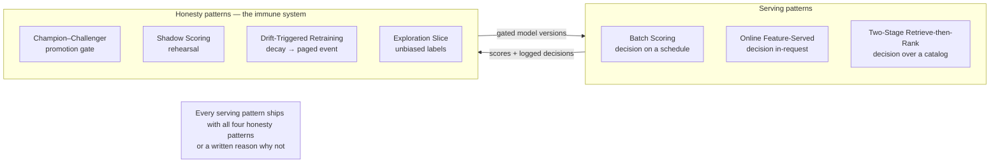

# Chapter 7.11 — Predictive & Scoring Patterns

| | |
|---|---|
| **Part** | 7 — Enterprise AI Architecture Patterns |
| **Maturity level** | 4 — Architect |
| **Difficulty** | Advanced |
| **Estimated study time** | 3 hours (reading 90 min, exercise 90 min) |
| **Prerequisites** | [2.9 Classical ML System Design](../part-2-artificial-intelligence/chapter-09-classical-ml-system-design.md); [2.14](../part-2-artificial-intelligence/chapter-14-ranking-recommenders-anomaly-detection.md); [2.15](../part-2-artificial-intelligence/chapter-15-mlops-engineering.md) |

## Learning Objectives

After this chapter you will be able to:

1. Apply the predictive & scoring pattern family in pattern-language form: batch scoring, online feature-served inference, two-stage retrieve-then-rank, champion–challenger promotion, shadow scoring, drift-triggered retraining, and the exploration slice.
2. Select the serving and promotion pattern matched to a model's decision cadence, risk tier, and feedback pathology.
3. Compose these patterns into complete classical-ML architectures — and recognize them running underneath the GenAI patterns of 7.2–7.9.
4. Name the patterns at work in the classical case studies (CS51–CS56) and projects (P21/P22), and spot the missing pattern in a broken design.

## Introduction

This chapter extends the pattern language across the estate the rest of Part 7 doesn't cover: trained models scoring structured decisions. The patterns here are older than the GenAI patterns — batch scoring predates the transformer by decades — and they compress the classical track (2.9–2.17) the way 7.2–7.9 compress Parts 3–5. They also *interlock* with the GenAI catalog rather than paralleling it: Confidence-Based Routing (7.5) is the shared seam between both lanes, the GenAI gateway's model-tiering (7.8) is a cousin of champion–challenger, and hybrid systems ([P22](../../projects/p22-hybrid-claims-intake/README.md)) compose patterns from both families stage by stage.

One structural observation organizes the family: **classical patterns divide into serving patterns (how scores reach decisions) and honesty patterns (how the system keeps learning truthfully)**. The serving patterns — batch, online, two-stage — are settled engineering. The honesty patterns — champion–challenger, shadow, drift-triggered retraining, exploration — all exist because a deployed model decays and biases its own future ([2.14](../part-2-artificial-intelligence/chapter-14-ranking-recommenders-anomaly-detection.md)'s feedback-loop hazard); they are the immune system, and their absence is the most common defect in classical designs that reach review.

## Business Motivation

These patterns carry direct money in both directions. Serving-pattern mistakes are pure waste: online infrastructure for a decision made nightly ([2.9](../part-2-artificial-intelligence/chapter-09-classical-ml-system-design.md)'s batch-by-default violated) buys ~10× the cost for zero benefit — [CS51](../../case-studies/cs51-demand-forecasting-replenishment.md)'s entire platform runs at ~$14K/month *because* it is batch; [CS52](../../case-studies/cs52-card-fraud-scoring.md) pays ~$75K/month for online serving because fraud genuinely decides in-request, and the difference is an architecture decision worth ~$700K/year. Honesty-pattern absence is slower and worse: an unmonitored champion decays silently (Bellhaven's $1.1M of renewal mispricing — [2.15](../part-2-artificial-intelligence/chapter-15-mlops-engineering.md)); a scoring system without an exploration slice hardens its own blind spots until the missed pattern is a market segment ([CS30](../../case-studies/cs30-subrogation-opportunity-detection.md)); an un-shadowed promotion is a production experiment on customers. The pattern family is how those lessons stop being anecdotes and become review-checklist items an architect applies in minutes ([architecture review checklist](../../checklists/architecture-review-checklist.md)'s trained-model lane, which this chapter backs).

## Theory — The Predictive & Scoring Pattern Catalog

### Serving patterns

#### Pattern: Batch Scoring

- **Context** — a trained model whose consuming decision happens on a schedule: retention campaigns, replenishment orders, risk reviews, queue prioritization.
- **Problem** — how to serve scores at minimum cost and operational surface when no request is waiting.
- **Forces** — infrastructure cost and simplicity vs. score freshness; the decision cadence sets the freshness bar, not engineering ambition.
- **Solution** — score the full population on the decision cadence (nightly, weekly); write scores to a table the consuming system reads. The scorer imports the same feature definitions as training ([2.12](../part-2-artificial-intelligence/chapter-12-data-engineering-feature-platforms.md)); a missed batch falls back loudly to the incumbent rule, never silently to stale scores.
- **Structure** — pipeline trigger → point-in-time features → score population → write table → consuming system reads; monitoring on completion, freshness, and score distribution.
- **Consequences** — radically cheap and operable (CPU-scale, no serving fleet); scores age between runs — acceptable by construction when cadence is derived from the decision; the fallback path must be tested, not assumed.
- **Known uses** — P21's nightly churn table; [CS51](../../case-studies/cs51-demand-forecasting-replenishment.md)'s 04:00 forecast batch; [CS30](../../case-studies/cs30-subrogation-opportunity-detection.md)'s closure-time scoring.
- **Related** — Online Feature-Served Inference (the fork); Batch Lanes (7.8 — the GenAI cousin); Drift-Triggered Retraining (watches the batch's distributions).

#### Pattern: Online Feature-Served Inference

- **Context** — the decision happens *inside* a live request with a hard latency budget: fraud at authorization, search ranking, real-time routing.
- **Problem** — scoring needs fresh features (velocity counters, session state) in single-digit milliseconds, and training–serving skew is fatal at this speed.
- **Forces** — latency budget vs. feature freshness vs. consistency; availability of the *decision path* vs. availability of the scorer (they must be decoupled).
- **Solution** — an online feature store fed by streams serves precomputed features; a stateless scoring service joins them with request data; the same feature definitions compute offline for training ([2.12](../part-2-artificial-intelligence/chapter-12-data-engineering-feature-platforms.md)); an explicit fail-open/fail-closed policy, signed by the risk owner, governs timeouts.
- **Structure** — stream → online store; request → fetch features (< 10 ms) → score → decision bands; timeout → fallback policy; daily online/offline parity check.
- **Consequences** — enables in-request decisions; buys an always-on serving estate and a feature-freshness SLO per feature; the fail-open ADR is the pattern's most important artifact — an availability incident must not become a decision outage ([CS52](../../case-studies/cs52-card-fraud-scoring.md)).
- **Known uses** — [CS52](../../case-studies/cs52-card-fraud-scoring.md)'s 80 ms authorization path; [CS54](../../case-studies/cs54-product-recommendations.md)'s 120 ms page-load serving.
- **Related** — Batch Scoring (choose it unless the decision is genuinely in-request); Two-Stage Retrieve-then-Rank (its heaviest consumer); the GenAI gateway's latency engineering (5.4/4.12).

#### Pattern: Two-Stage Retrieve-then-Rank

- **Context** — ranking against a catalog too large to score per request: recommendations, search, next-best-action over thousands-to-millions of candidates.
- **Problem** — the precise model cannot afford the full catalog; the cheap method cannot afford to be the final answer.
- **Forces** — recall (don't lose the right answer early) vs. precision (order the shortlist well) vs. latency; each stage's failure is invisible without per-stage instrumentation.
- **Solution** — cheap high-recall candidate generation (ANN over embeddings, co-occurrence, segment popularity — several generators in union) reduces the catalog to hundreds; an expensive ranker orders them; deterministic business rules (stock, eligibility, diversity floors, caps) apply after the ranker, exactly ([2.14](../part-2-artificial-intelligence/chapter-14-ranking-recommenders-anomaly-detection.md)).
- **Structure** — request → generators (union, ~10²–10³) → ranker (→ top-k) → rules → serve; **candidate-coverage instrumentation** (was the chosen item in the candidate set?) as the stage-localizing diagnostic.
- **Consequences** — makes large-catalog ranking affordable; failures now have two homes, so per-stage metrics are mandatory — the funnel without coverage instrumentation is the funnel debugged blind (Loomora's plateau, [2.14](../part-2-artificial-intelligence/chapter-14-ranking-recommenders-anomaly-detection.md)).
- **Known uses** — [CS54](../../case-studies/cs54-product-recommendations.md)'s marketplace funnel; [CS45](../../case-studies/cs45-learning-development-recommender.md)'s taxonomy-first variant; the retrieval funnel of 4.2 is this pattern's GenAI descendant.
- **Related** — Reranked RAG (7.2 — the same shape over documents); Online Feature-Served Inference (the serving substrate); Exploration Slice (feeds unbiased labels into both stages).

### Honesty patterns

#### Pattern: Champion–Challenger Promotion

- **Context** — any production model that will ever be replaced — which is every production model.
- **Problem** — "the new model is better" claimed on the new model's own terms, on favorable data, promoted by enthusiasm.
- **Forces** — improvement velocity vs. regression risk; comparability (same data, same operating point) vs. recency of evaluation data.
- **Solution** — the incumbent (champion) is only ever displaced by a challenger that beats it on a *frozen evaluation set plus matured recent production data, at the operating point, by segment* — through a gate that is the registry's only path to production ([2.15](../part-2-artificial-intelligence/chapter-15-mlops-engineering.md)). Demotion is symmetric: a champion losing to the *baseline* pages someone.
- **Structure** — challenger trains → gate compares at operating point → promote/reject recorded with evidence → (optionally) Shadow Scoring first; baselines run forever as the floor.
- **Consequences** — regressions stop shipping on narrative; the gate's evaluation data must itself be governed (frozen sets go stale); promotion cadence becomes a *policy* per model's risk tier — one platform, risk-scaled autonomy ([CS52](../../case-studies/cs52-card-fraud-scoring.md) weekly vs. [CS55](../../case-studies/cs55-credit-risk-scoring-mrm.md) annually, on the same machinery).
- **Known uses** — P21's promotion gate; [CS51](../../case-studies/cs51-demand-forecasting-replenishment.md)'s champion-demotion alert; [CS55](../../case-studies/cs55-credit-risk-scoring-mrm.md)'s governed annual event.
- **Related** — Shadow Scoring (the rehearsal); Model Tiering (7.8 — eval-gated routing is this pattern per task class); the MRM inventory ([6.11](../part-6-enterprise-architecture/chapter-11-model-risk-management.md)).

#### Pattern: Shadow Scoring

- **Context** — a challenger (or a first model) whose production behavior is unknown; a promotion whose failure would be expensive.
- **Problem** — offline evaluation cannot see production's data quirks, skew, and load; promoting on offline evidence alone is a live experiment on customers.
- **Forces** — evidence quality vs. time and serving cost; label lag (shadow comparisons need matured outcomes to mean anything).
- **Solution** — the challenger scores live traffic in parallel; its scores are logged, never acted on; comparison happens on matured labels. Promote only after a sustained shadow win. For systems whose outputs change user behavior (ranking), shadow is insufficient — graduate to a canary *inside an experiment* ([2.17](../part-2-artificial-intelligence/chapter-17-online-experimentation.md)).
- **Structure** — request → champion (decides) + challenger (logs) → matured-label comparison dashboard → promotion evidence.
- **Consequences** — near-zero-risk rehearsal on real data; costs double scoring compute for the duration; blind to interaction effects — know when it isn't enough.
- **Known uses** — [CS52](../../case-studies/cs52-card-fraud-scoring.md)'s always-on challenger shadow; [2.15](../part-2-artificial-intelligence/chapter-15-mlops-engineering.md)'s rollout ladder (shadow → canary → full).
- **Related** — Champion–Challenger (consumes shadow evidence); the experiment-gated canary (2.17); Dual-Model Verification (7.6 — a different two-model pattern; don't confuse rehearsal with runtime checking).

#### Pattern: Drift-Triggered Retraining

- **Context** — any model whose world moves: customer behavior, fraud tactics, product mix, sensor fleets.
- **Problem** — scheduled retraining is either too slow for fast drift or wasteful for slow drift; unmonitored models decay silently until a KPI notices.
- **Forces** — retraining cost and risk vs. decay cost; drift signals are proxies (early, cheap) while outcome truth is lagged ([2.9](../part-2-artificial-intelligence/chapter-09-classical-ml-system-design.md)'s three layers).
- **Solution** — monitor input distributions (PSI-class), score distributions, and matured-outcome decay per segment; breaches trigger retraining *through the same champion–challenger gate as any candidate* — automation without the gate turns a data incident into a production model ([2.15](../part-2-artificial-intelligence/chapter-15-mlops-engineering.md)'s corrupted-batch drill). Fleet-wide simultaneous drift is triaged as an upstream data change first.
- **Structure** — monitoring planes → trigger (schedule ∨ drift ∨ decay ∨ label-volume) → retrain → gate → promote/reject; runbook freezes threshold changes during investigation.
- **Consequences** — decay becomes a paged event instead of a quarterly surprise; requires the trigger's *owner* to be named; adversarial domains need a faster parallel lane (rules in hours) because even triggered retraining is weeks ([CS52](../../case-studies/cs52-card-fraud-scoring.md)'s two-speed design).
- **Known uses** — P21's corrupted-column drill; [CS53](../../case-studies/cs53-predictive-maintenance.md)'s baseline-age monitoring; [drift & model monitoring checklist](../../checklists/drift-model-monitoring-checklist.md) as the review form.
- **Related** — Champion–Challenger (the gate it feeds); Freshness Pipeline (7.7 — the corpus is the GenAI estate's drifting artifact); sensor/instrument health as the sibling monitor ([CS53](../../case-studies/cs53-predictive-maintenance.md)).

#### Pattern: Exploration Slice

- **Context** — a system whose own decisions determine which labels it will ever receive: declined transactions never labeled, unpursued cases never resolved, unshown items never clicked, treated customers never observed untreated.
- **Problem** — the model's training diet is censored by the model's actions; blind spots harden, selection bias compounds, and offline metrics stay green throughout.
- **Forces** — the cost of deliberately suboptimal decisions (approving borderline risk, working low-scored cases, showing unproven items) vs. the compounding cost of a self-blinded model; the slice must be *randomized* to carry inferential weight.
- **Solution** — reserve a small, risk-budgeted, randomized slice of decisions that bypasses the model's policy: approve a sampled borderline band, work sampled below-cut-line cases, expose sampled unproven items, hold out a control group from treatment. The slice's outcomes are the only unbiased labels the system will ever get; its size is an explicit business decision, priced.
- **Structure** — decision point → policy path (majority) ∥ randomized slice (bounded %) → both outcome streams labeled and flagged → training and evaluation weight them appropriately.
- **Consequences** — keeps the training data honest and doubles as the measurement holdout ([2.17](../part-2-artificial-intelligence/chapter-17-online-experimentation.md)'s uplift design); costs real money by design — the budget line makes the epistemics visible; in regulated decisions the slice may be impermissible, and the design must say what replaces it ([CS55](../../case-studies/cs55-credit-risk-scoring-mrm.md)'s reject-inference-plus-consortium answer).
- **Known uses** — P21's untreated control slice; [CS52](../../case-studies/cs52-card-fraud-scoring.md)'s randomized borderline approvals; [CS30](../../case-studies/cs30-subrogation-opportunity-detection.md)'s below-cut-line sampling; [CS54](../../case-studies/cs54-product-recommendations.md)'s exploration traffic.
- **Related** — the randomized holdout (2.17); Review Sampling (7.5 — the human-lane sibling); the feedback-loop hazard it exists to break ([2.14](../part-2-artificial-intelligence/chapter-14-ranking-recommenders-anomaly-detection.md)).

## Architecture Perspective

The composition rule the diagram states: **serving patterns are chosen (one per decision shape); honesty patterns are defaults (all four, or a recorded waiver).** A design review that finds a serving pattern without its immune system has found the defect — the [architecture review checklist](../../checklists/architecture-review-checklist.md)'s trained-model items are this rule in checkbox form. The GenAI catalog connects at three seams: Confidence-Based Routing (7.5) consumes any calibrated score from either lane; model tiering (7.8) is champion–challenger per task class; and hybrid systems (P22) assign patterns per stage — batch-scored risk beside LLM-drafted letters, each with its own promotion lane.

## Real-world Example

**Tembusu Bank** ([CS52](../../case-studies/cs52-card-fraud-scoring.md)/[CS55](../../case-studies/cs55-credit-risk-scoring-mrm.md)) reads as a pattern composition across two models on one platform. The fraud model: **Online Feature-Served Inference** (80 ms, fail-open ADR) + **Shadow Scoring** (always-on challenger) + **Champion–Challenger** (weekly, one-click approval) + **Drift-Triggered Retraining** (decay-tied cadence, rules as the fast lane) + **Exploration Slice** (randomized borderline approvals against decline-censoring). The credit model: **Batch-plus-on-application serving** + the *same* champion–challenger and drift machinery at a different autonomy setting (annual, independently validated) + reject inference where the exploration slice is impermissible. The architecture review that approved the platform's second year took ninety minutes, because every question was a pattern question: *which serving pattern, and why? where is the shadow evidence? what triggers retraining, and who owns it? where do unbiased labels come from?* The reviewer's summary is the chapter's thesis: "two very different models, zero new concepts — the patterns did the explaining."

## Hands-on Exercise

**Compose predictive patterns.** ~90 minutes. Take one classical case study you have *not* yet studied closely (CS51–CS56).

1. **Pattern inventory (25 min).** Read only the Business Problem and Requirements. Choose the serving pattern and justify it from the decision cadence; then specify all four honesty patterns for this system (or write the waiver — e.g., the exploration slice in a regulated decision, with its replacement).
2. **Pattern-language form (20 min).** Write one of your choices in full pattern form (Context → Problem → Forces → Solution → Structure → Consequences → Known uses → Related).
3. **Compare (25 min).** Now read the case's Architecture and Monitoring sections. Diff your composition against the given one; for each difference, decide which side you'd defend.
4. **The seam (20 min).** Identify where a GenAI pattern would legitimately attach to this system (a drafting lane, a routing seam) and name the 7.x pattern that governs that seam.

**Acceptance criteria:**
- [ ] Serving pattern derived from decision cadence, not preference
- [ ] All four honesty patterns specified or explicitly waived with a replacement
- [ ] One full pattern-language write-up
- [ ] The diff against the case study argued both ways
- [ ] The GenAI seam named with its governing pattern

## Enterprise Considerations

This pattern family is where classical governance attaches: the champion–challenger gate is the model inventory's promotion evidence ([6.11](../part-6-enterprise-architecture/chapter-11-model-risk-management.md)), the exploration slice is a *risk acceptance* someone senior signs (and in credit/insurance may be legally unavailable — the waiver-and-replacement discipline is a compliance artifact, not a footnote), and drift monitoring feeds the periodic attestation regulated models owe ([CS55](../../case-studies/cs55-credit-risk-scoring-mrm.md)'s monthly pack). Platform economics: the honesty patterns are exactly what a shared ML platform should provide once ([2.15](../part-2-artificial-intelligence/chapter-15-mlops-engineering.md)'s level-2 trigger) — registries, gates, shadow infrastructure, and drift monitors amortize across every model, which is why the second model on Tembusu's platform cost a fraction of the first. And the org-design reading: each honesty pattern implies an *owner* (who reviews the gate? who is paged on drift? who prices the slice?) — patterns without owners are diagrams.

## Trade-offs

| Decision | Option A | Option B | Choose A when… | Choose B when… |
|----------|----------|----------|----------------|----------------|
| Serving | Batch Scoring | Online Feature-Served | The decision happens on a schedule — the default ([2.9](../part-2-artificial-intelligence/chapter-09-classical-ml-system-design.md)) | The decision is genuinely in-request, with the latency budget and fail-policy to prove it |
| Promotion evidence | Shadow Scoring first | Straight to experiment-gated canary | Label lag permits offline comparison; outputs don't change behavior | Outputs shape user behavior (ranking) — shadow is blind to interaction effects ([2.17](../part-2-artificial-intelligence/chapter-17-online-experimentation.md)) |
| Retraining | Scheduled | Drift-triggered (+ schedule as floor) | Slow drift, cheap training, stable domain | Monitored decay between schedules; adversarial or fast-moving domains |
| Label honesty | Exploration Slice | Observational corrections (reject inference, consortium data) | The slice is permissible and its cost is priceable | Differential treatment is impermissible — document the weaker assumptions ([CS55](../../case-studies/cs55-credit-risk-scoring-mrm.md)) |

## Common Mistakes

1. **Online serving for a nightly decision** — the most expensive way to be equally accurate; derive the serving pattern from the decision cadence, always.
2. **Promotion by narrative** — "the new model is better" without a frozen-set, operating-point, by-segment gate. The gate is the pattern; enthusiasm is not evidence.
3. **Shadow skipped because offline looked great** — offline cannot see skew, quirks, or load; the rehearsal costs weeks and prevents quarters.
4. **Automation without the gate** — drift-triggered retraining that auto-ships whatever trained; the corrupted batch becomes the champion ([2.15](../part-2-artificial-intelligence/chapter-15-mlops-engineering.md)).
5. **No exploration anywhere** — every scored decision censors tomorrow's labels; a system with zero randomized decisions is hardening its blind spots by design ([2.14](../part-2-artificial-intelligence/chapter-14-ranking-recommenders-anomaly-detection.md)).
6. **The funnel without coverage instrumentation** — two-stage systems debugged at the wrong stage for a quarter (Loomora); per-stage metrics are part of the pattern, not observability garnish.
7. **Patterns without owners** — a gate nobody reviews, a drift alert nobody is paged for, a slice nobody prices. Assign the human or delete the box.

## Best Practices

1. **One serving pattern per decision shape; all four honesty patterns by default** — waivers written, with replacements.
2. **Baselines run forever** — seasonal-naive, the incumbent rule, the logistic floor; champion demotion against the baseline pages someone ([CS51](../../case-studies/cs51-demand-forecasting-replenishment.md)).
3. **Risk-scale the promotion autonomy, not the machinery** — one platform, per-model checkpoints ([CS52](../../case-studies/cs52-card-fraud-scoring.md)/[CS55](../../case-studies/cs55-credit-risk-scoring-mrm.md)).
4. **Price the exploration slice explicitly** — the budget line is what makes the epistemics governable.
5. **Instrument every stage boundary** — candidate coverage, feature parity, gate evidence; localization is the debugging superpower across the whole family.
6. **Read hybrid systems per stage** — P22's discipline: each stage gets its own serving pattern, promotion lane, and eval regime; patterns compose at stage boundaries.

## Architecture Checklist

For applying the predictive & scoring patterns:

- [ ] Serving pattern (batch / online / two-stage) derived from the decision cadence, with fallback policy tested
- [ ] Champion–challenger gate specified: frozen set + matured data, operating point, segments; demotion symmetric
- [ ] Shadow evidence required before consequential promotions; canary-in-experiment where outputs shape behavior
- [ ] Retraining triggers (schedule ∨ drift ∨ decay) with named owners; automated retrains face the same gate
- [ ] Exploration slice sized and priced — or waived in writing with the replacement inference documented
- [ ] Two-stage systems carry candidate-coverage instrumentation
- [ ] Every honesty pattern has an owner; the review can name who is paged
- [ ] GenAI seams (routing, drafting lanes) governed by the corresponding 7.x pattern

## Interview Questions

1. *"Walk me through the serving options for a trained model and how you choose."* — Strong answers give the three serving patterns, derive the choice from decision cadence ("batch unless the decision is in-request"), and price the difference; the fail-open/fail-closed ADR earns senior marks.
2. *"How does a new model safely replace the old one?"* — Strong answers chain the honesty patterns: challenger → gate (frozen set, operating point, segments) → shadow on live traffic → matured-label comparison → risk-scaled approval → rehearsed rollback; and name when shadow is insufficient (behavior-shaping outputs → experiment-gated canary).
3. *"Your fraud model's training data only contains transactions you approved. So what?"* — Strong answers name decline-censoring, its compounding blind spots, the exploration-slice remedy with its risk budget, and the regulated-domain alternative (reject inference, external labels) with its weaker assumptions.
4. *"Name the patterns in play in any classical case study you know."* — Strong answers read a system as a composition (e.g., CS52: online feature-served + shadow + champion–challenger + drift-triggered + exploration slice + rules fast-lane) and identify the one pattern whose absence would be the review finding.

## Further Reading

- [2.9](../part-2-artificial-intelligence/chapter-09-classical-ml-system-design.md), [2.14](../part-2-artificial-intelligence/chapter-14-ranking-recommenders-anomaly-detection.md), [2.15](../part-2-artificial-intelligence/chapter-15-mlops-engineering.md), [2.17](../part-2-artificial-intelligence/chapter-17-online-experimentation.md) — the chapters this family compresses.
- [CS51](../../case-studies/cs51-demand-forecasting-replenishment.md)–[CS56](../../case-studies/cs56-network-anomaly-detection.md) and [P21](../../projects/p21-churn-prediction-service/README.md)/[P22](../../projects/p22-hybrid-claims-intake/README.md) — the known-uses corpus; read one with the pattern inventory in hand.
- The [drift & model monitoring](../../checklists/drift-model-monitoring-checklist.md) and [ML model validation](../../checklists/ml-model-validation-checklist.md) checklists — the review forms these patterns back.
- Sculley et al., "Hidden Technical Debt in Machine Learning Systems" — the paper that explains why the honesty patterns exist.

## Summary

- The predictive & scoring family splits into **serving patterns** (batch, online feature-served, two-stage retrieve-then-rank — choose one, from the decision cadence) and **honesty patterns** (champion–challenger, shadow, drift-triggered retraining, exploration slice — all four by default, waivers in writing).
- The honesty patterns are the immune system against the family's shared disease: deployed models decay and censor their own future labels.
- Promotion autonomy is risk-scaled policy on shared machinery — fraud-speed and credit-governance on one platform.
- Per-stage instrumentation (candidate coverage, parity checks, gate evidence) is part of the patterns, not optional observability.
- The family interlocks with the GenAI catalog at named seams — confidence routing (7.5), tiering (7.8), hybrid stage assignment (P22) — completing a pattern language that now spans the whole AI estate.

---

**Previous:** [Chapter 7.10 — Anti-patterns](chapter-10-anti-patterns.md) · **Next:** [Part 8 — Professional Excellence & Career Development](../part-8-professional-excellence/) · **Related:** [2.9 Classical ML System Design](../part-2-artificial-intelligence/chapter-09-classical-ml-system-design.md), [2.15 MLOps Engineering](../part-2-artificial-intelligence/chapter-15-mlops-engineering.md), [7.5 Human-in-the-Loop Patterns](chapter-05-human-in-the-loop-patterns.md), [6.11 Model Risk Management](../part-6-enterprise-architecture/chapter-11-model-risk-management.md)
