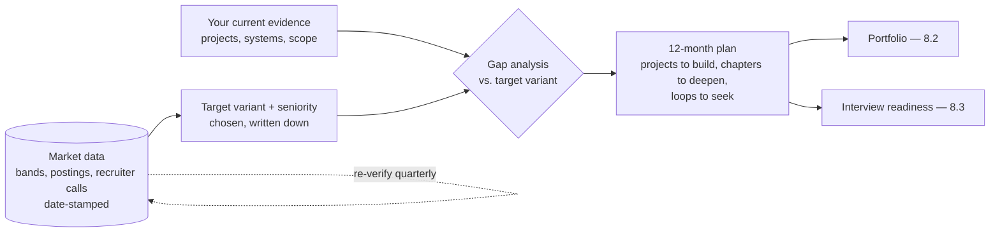

# Chapter 8.1 — The AI Solution Architect Role & Market

| | |
|---|---|
| **Part** | 8 — Professional Excellence & Career Development |
| **Maturity level** | 3 — Engineer (career planning starts before Level 4 arrives) |
| **Difficulty** | Intermediate |
| **Estimated study time** | 3 hours (reading 90 min, exercise 90 min) |
| **Prerequisites** | [1.1 From Engineer to Architect](../part-1-professional-foundation/chapter-01-from-engineer-to-architect.md) |

## Learning Objectives

After this chapter you will be able to:

1. Distinguish the four architect variants (solution, enterprise, platform, principal) by what they are accountable for, and identify which one a given job posting actually describes regardless of its title.
2. Read the market with real numbers: know the current compensation bands for your region, where they come from, and how fast they decay.
3. Decide, with reasons, which certifications are worth your hours and which are résumé decoration for this role.
4. Write a positioning statement that names your target variant, your evidence gap, and your 12-month plan to close it.

## Introduction

Chapter 1.1 defined what an architect *does*. This chapter is about the job market that pays for it: what the role variants look like from inside, what companies actually pay, what a posting's title does and does not tell you, and how to position yourself deliberately instead of drifting into whatever your current employer calls you.

One warning governs everything here: **market facts decay**. Every number in this chapter is date-stamped to early 2026 and sourced so you can re-verify it. A salary band quoted without a date is folklore; treat this chapter's numbers as a worked example of *how to find current ones*, not as permanent truth.

## Business Motivation

The gap between knowing the market and not knowing it is measured in money and years. Two concrete costs of ignorance:

- **Mispriced offers.** Recruiters anchor low when candidates cannot cite market data. The spread between the 25th and 75th percentile for senior AI-architecture roles in the US is roughly $80–120K of total compensation (levels.fyi aggregates, early 2026). A candidate who cannot name the band negotiates inside the bottom half of it. Over a five-year stretch, accepting the 25th percentile instead of the 60th is a six-figure decision.
- **Misdirected preparation.** An engineer who spends a year earning certifications a hiring loop ignores, while their portfolio has no running system in it, has optimized the wrong variable (this chapter's certification section and [8.2](chapter-02-architecture-portfolio.md) exist to prevent exactly this). Preparation aimed at the wrong variant costs the same year.

The positive case: role clarity compounds. Knowing that you are targeting, say, the *platform architect* variant tells you which projects to build (P16, P25), which chapters to go deep on (5.10, 7.9, 2.15), and which interview loops to seek. Vague ambition ("become an AI architect") produces scattered evidence; a named target produces a portfolio.

## Theory

### The four variants, by accountability

Titles vary wildly; accountability does not. Ask "what is this person blamed for when it fails?" and the variant reveals itself:

| Variant | Accountable for | Typical scope | Curriculum backbone |
|---|---|---|---|
| **Solution Architect** | One system (or family) meeting its business case: quality, cost, risk, delivery | A product line, a major initiative | Parts 2–5 |
| **Enterprise Architect** | The portfolio's coherence: standards, integration, target state, spend | Many systems across an organization | Part 6 |
| **Platform Architect** | The shared internal machinery other teams build on: gateways, eval services, ML delivery platforms | The internal developer/ML platform | 5.10, 7.9, 2.15 |
| **Principal Architect** | The organization's technical trajectory: standards that stick, bets that pay, people who grow | Org-wide, multi-year | [8.8](chapter-08-principal-architect.md) |

Three practical notes. First, the variants overlap in real jobs; a solution architect at a 200-person company does platform and enterprise work on Tuesdays. Second, the *AI* prefix changes the content, not the structure: an AI Solution Architect is a solution architect whose systems carry the failure modes and economics this curriculum teaches (probabilistic quality, token and training economics, model risk). Third, seniority and variant are different axes: there are junior platform architects and principal-level solution architects. Compensation tracks seniority and company tier more than variant.

### The market, with numbers (early 2026 — verify before using)

Compensation for AI-architecture roles, from levels.fyi aggregates, LinkedIn/Indeed posting bands (which US postings must now disclose in many states), and recruiting-firm salary guides, as of Q4 2025–Q1 2026:

| Market | Senior (L5/L6-equivalent) total comp | Staff/Principal total comp | Notes |
|---|---|---|---|
| **US — large tech & AI-forward product companies** | $250–400K | $400–700K+ | Equity-heavy at the top; "AI" premium over generalist SA roles roughly 10–25% |
| **US — enterprises, consultancies, non-tech F500** | $170–260K | $250–350K | Base-heavy; consultancies add utilization bonuses |
| **UK / Western Europe** | £90–150K / €100–170K | £150–220K / €170–260K | Wide country variance; Switzerland and Netherlands at the top |
| **India — product companies & GCCs** | ₹45–80 LPA | ₹90 LPA–1.8 Cr | Top AI labs and US-headquartered GCCs pay the upper band; services firms pay materially less |

How to keep these current (the durable skill): levels.fyi for large-company bands; the posted salary ranges now legally required in several US states and the EU (pay-transparency directive phasing in from 2026); one recruiting-firm salary guide per year for your region; and two or three actual conversations with recruiters, which beat every aggregate. Re-check before any negotiation; these bands have moved 10–20% in single years during the AI demand surge.

What drives position *within* a band: company tier and funding, scope evidence (a platform serving 40 teams beats a title), scarcity of your specific combination (the two-lane breadth this curriculum builds is genuinely scarcer than GenAI-only profiles), and negotiation itself.

### Reading a posting: scope signals beat titles

The same title spans absurd ranges, so read for scope markers. Signals the role is real architecture: named accountability for outcomes ("owns the reliability and cost of…"), stakeholder breadth ("works with security, finance, and product leadership"), and artifacts ("produces reference architectures, ADRs, review standards"). Signals it is a senior-engineer role wearing the title: "hands-on coding 80% of the time," no governance or stakeholder language, reporting into a delivery manager rather than a technical leadership chain. Neither is bad; mismatched expectations are.

### Certifications: an honest position (early 2026)

The curriculum is not a certification course, but refusing to *advise* on certifications would leave you guessing about a real market mechanism. The honest map:

- **Cloud architect certifications** (AWS Solutions Architect Professional, Azure Solutions Architect Expert, GCP Professional Cloud Architect) still function as HR screening filters and consultancy staffing currency. Consultancies need them for partner-tier requirements, so if you are heading into consulting they are close to mandatory. At product companies they rarely move a senior loop but sometimes unblock the recruiter screen.
- **Cloud AI/ML specialty certifications** are weaker signals for architect roles: they test service catalogs, not judgment. Take one only if your target employer names it.
- **ISO/IEC 42001 and AI-governance credentials** are organizational instruments ([6.11](../part-6-enterprise-architecture/chapter-11-model-risk-management.md)); an individual "AI governance certified" line is beginning to appear in risk-function postings, mostly in banking and insurance. Relevant if you target that niche.
- **Vendor GenAI badges** (short-course completions) carry near-zero weight in architect hiring loops and can read as padding on a senior résumé.

The rule: a certification is worth your hours when a *named* gate requires it (a consultancy tier, a specific employer's screen, a regulated-industry role). It is never a substitute for the portfolio evidence of [8.2](chapter-02-architecture-portfolio.md), and no interview loop this curriculum prepares you for will ask about one.

## Architecture Perspective

Career positioning is an architecture problem applied to yourself: current state, target state, gap analysis, and a roadmap with dated milestones (the Part 6 method, one person wide). The market data is an external dependency with a fast decay rate; the diagram's only loop is the re-verification cadence, because every other box depends on it being current.

## Real-world Example

**Priya**, a staff engineer at a mid-size fintech (fictional, as all examples here are), decided in January to target an AI Solution Architect role within a year. Her gap analysis was blunt: strong delivery record, but every system she could talk about was owned by someone else's architecture, and her market knowledge was two years stale. Her plan had three lines: build two systems she owned end-to-end with written decision records (a fraud-scoring service against the IEEE-CIS public dataset; a RAG assistant over her company's public docs, with an eval suite); book four recruiter conversations by March to price the market ("senior AI architect, Bangalore GCCs" came back at ₹55–75 LPA, 20% above her guess); and skip the Azure certification she had planned, because none of her five target companies screened for it — that decision alone recovered ~80 hours for the portfolio work. In November she took an offer at ₹68 LPA, up 42% from her staff-engineer package. The offer conversation cited the fraud system's decision memo, not her title history. The plan's most valuable line turned out to be the one that *removed* work.

## Hands-on Exercise

Produce your own positioning file (~2 pages, kept in version control, revised quarterly):

1. **Variant and seniority target** — one sentence, specific ("platform architect, staff level, at an AI-forward product company or GCC").
2. **Market snapshot** — your region's band for that target, from at least two named sources, date-stamped. Include one number from a live posting and, if possible, one from a recruiter conversation.
3. **Evidence inventory** — what you can currently *show* (systems, scope, artifacts), each with one line on what it proves.
4. **Gap list** — the three biggest differences between your evidence and what postings for the target demand.
5. **12-month plan** — projects (from P01–P25 or your own), chapters to deepen, certifications (only if a named gate requires one), and the date of your next market re-check.

**Acceptance criteria:**
- [ ] The target names a variant and seniority, not just "AI architect"
- [ ] Every market number carries a source and a date
- [ ] At least one planned item was *removed* because the market data didn't support it
- [ ] The evidence inventory contains only things you could show in an interview this week
- [ ] A calendar reminder exists for the quarterly revision

## Enterprise Considerations

Inside a large organization, this chapter's logic runs on internal ladders too: promotion committees are hiring loops with better memory, and the scope-beats-title rule applies doubly (an "architect" title granted without portfolio-visible scope will not survive an external interview). If you are the *hiring* side of this market: post the salary band (increasingly a legal requirement, always a filter-quality improvement), write the accountability sentence into the job description, and screen for evidence of decisions rather than vocabularies — Part 8's later chapters ([8.7](chapter-07-mentoring-building-teams.md)) return to this. Consultancies and GCCs should note the certification asymmetry above: what is staffing currency inside the firm is near-invisible to product-company loops, and architects moving between the two worlds need to re-weight their evidence accordingly.

## Trade-offs

| Decision | Option A | Option B | Choose A when… | Choose B when… |
|----------|----------|----------|----------------|----------------|
| Target variant | Solution architect | Platform architect | You want business proximity and per-system ownership; strongest external market | You are energized by leverage and internal customers; fewer roles, stickier ones |
| Employer class | Product company / GCC | Consultancy | Depth, equity upside, one estate to know deeply | Breadth, forced reps across industries, faster title progression |
| Preparation spend | Portfolio systems | Certifications | Always the default at architect level | A named gate (consultancy tier, specific screen, regulated niche) requires the credential |
| Market timing | Move for the role | Grow in place | Current employer cannot offer the scope within ~a year | Scope is genuinely available internally; internal evidence transfers |

## Common Mistakes

1. **Positioning by title instead of scope.** "I'm a senior architect" means nothing across companies; carry the accountability sentence and the evidence instead.
2. **Negotiating without current data.** Bands move 10–20% a year in this market; last year's number is a discount you hand the other side.
3. **Certification-first preparation.** Weeks of service-catalog cramming that no architect loop will probe, while the portfolio stays empty. Invert it.
4. **Treating the "AI premium" as automatic.** The premium attaches to demonstrated AI-systems judgment (evals, cost engineering, model risk), not to the word on the résumé; loops have learned to probe.
5. **One-variant blindness.** Applying solution-architect evidence to platform-architect loops and wondering why the internal-customer and leverage questions land badly. Match the evidence to the variant.

## Best Practices

1. **Write the positioning file and version it.** Careers drift without written target state; you already know this discipline from Part 6.
2. **Date-stamp every market fact you collect**, and schedule the re-check. Treat undated numbers as expired.
3. **Book recruiter conversations before you need them.** Two per quarter prices the market and builds the pipeline; the worst time to start is with an offer in hand.
4. **Spend preparation hours where loops probe**: systems you own, decisions you can defend, numbers you measured. [8.2](chapter-02-architecture-portfolio.md) and [8.3](chapter-03-architecture-interviews.md) operationalize this.
5. **Re-run the gap analysis after every real interview** — loops are free market research; what they probed that you couldn't answer is the next quarter's plan.

## Architecture Checklist

Before acting on a role decision:

- [ ] Target variant and seniority written down, with the accountability sentence for that variant
- [ ] Market band for the target, from ≥2 named sources, dated within the last quarter
- [ ] Evidence inventory maps to what postings for the target actually demand
- [ ] Certification spend justified by a named gate, or zero
- [ ] The 12-month plan contains more building than studying
- [ ] Next market re-check is on the calendar

## Interview Questions

1. *"Walk me through how you'd decide between two offers: a staff solution-architect role at a product company and a platform-architect role at a GCC paying 15% more."* — Strong answers price the whole position (scope, equity trajectory, what each role's evidence enables in three years), name the variant difference explicitly, and treat the 15% as one variable among five rather than the decision.
2. *"What's the market rate for your target role, and how do you know?"* — Strong answers give a band with sources and a date, note the spread's width, and describe a verification habit. Weak answers give one number with no provenance.
3. *"Your title has been 'architect' for three years, but this loop is probing your scope hard. Why do loops do that?"* — Strong answers explain title inflation, give the accountability test, and pivot to scope evidence without defensiveness.
4. *"Would you recommend a cloud architecture certification to someone targeting this role?"* — Strong answers refuse the yes/no: they name the gates where certifications matter (consultancy tiers, HR screens, regulated niches), state where they don't (senior product-company loops), and rank them below portfolio evidence with reasons.

## Further Reading

- levels.fyi — the most current large-company compensation aggregates; read the percentile spreads, not just medians.
- Posted salary bands on major boards for your target title and region — now legally required in several US states and phasing in across the EU; the closest thing to ground truth.
- One recruiting-firm salary guide for your region, current year — directionally useful, methodology-opaque; triangulate, don't trust.
- *The Software Architect Elevator* (Hohpe) — the best description in print of what enterprise-scale architects are actually accountable for, and the source of Part 6's sensibilities.

## Summary

- Four variants — solution, enterprise, platform, principal — distinguished by accountability, not title; identify a posting's real variant by asking what the role is blamed for.
- The market has knowable numbers: early-2026 bands run roughly $170–400K+ total comp in the US, £90–220K/€100–260K in Western Europe, and ₹45 LPA–1.8 Cr in India depending on tier and seniority — all decaying facts that must be re-verified from named sources before use.
- Certifications are gate-dependent: near-mandatory for consultancy tracks, marginal at product companies, never a substitute for portfolio evidence.
- Scope signals beat titles when reading postings; the accountability sentence is the test.
- Positioning is an architecture exercise on yourself: written target, dated market data, evidence inventory, gap list, 12-month plan, quarterly revision.

---

**Previous:** [Part 7 — Enterprise AI Architecture Patterns](../part-7-enterprise-ai-architecture-patterns/) · **Next:** [8.2 Building an Architecture Portfolio](chapter-02-architecture-portfolio.md) · **Related:** [1.1 From Engineer to Architect](../part-1-professional-foundation/chapter-01-from-engineer-to-architect.md), [8.2 Portfolio](chapter-02-architecture-portfolio.md), [8.3 Interviews](chapter-03-architecture-interviews.md)
