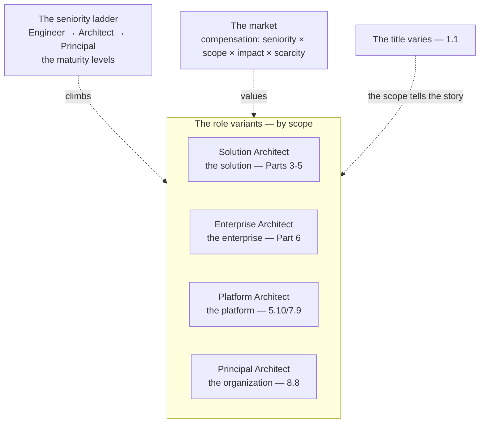

# Chapter 8.1 — The GenAI Solution Architect Role & Market

| | |
|---|---|
| **Part** | 8 — Professional Excellence & Career Development |
| **Maturity level** | 3 — Engineer |
| **Difficulty** | Intermediate |
| **Estimated study time** | 2–3 hours (reading 90 min, exercise 60 min) |
| **Prerequisites** | [1.1 From Software Engineer to Solution Architect](../part-1-professional-foundation/chapter-01-from-engineer-to-architect.md) |

## Learning Objectives

After this chapter you will be able to:

1. Map the GenAI Solution Architect role variants (solution, enterprise, platform, principal), their seniority ladders, and their scope differences.
2. Understand the market: what the role is worth, what drives compensation, and how the role is evolving.
3. Position yourself in the role landscape: which variant fits your strengths, and how to grow into the seniority you're targeting.
4. Read the role behind the title, since titles vary wildly and scope tells the real story.

## Introduction

Part 8 closes the curriculum by turning the competence Parts 1–7 built into a career — the professional machinery around the technical judgment. This first chapter maps the role itself: the GenAI Solution Architect role, its variants, its market, and how to position within it. 1.1 defined what the role *is* (the architect's job — decisions, not code); this chapter maps the role's *variants and market* — the landscape of the role as it exists in the industry, so you can position yourself within it.

The framing: **the GenAI Solution Architect role has variants and a market, and the title hides the scope** — the role variants (solution, enterprise, platform, principal), the seniority ladders, the compensation drivers, and the reality that the titles vary wildly (1.1's title inflation/deflation) so the scope tells the real story, and this chapter is the map of the role landscape.

## Business Motivation

Understanding the role and market is the foundation of the career — the map that lets you position, grow, and negotiate within the role landscape. Without it: you can't position yourself (the role variant that fits your strengths un-identified), you can't target your growth (the seniority ladder un-mapped), and you can't read the market (the compensation drivers, the title-vs-scope). With it: you position yourself (the right variant, the targeted seniority), you grow deliberately (the ladder mapped, the growth targeted), and you read the market (the compensation, the scope behind the title). The business case is the career-foundation one: understanding the role and market is what lets you build the career deliberately (the positioning, the growth, the negotiation), and this chapter is the map — the role landscape that the rest of Part 8 (the portfolio — 8.2, the interviews — 8.3, the career progression — 8.7/8.8) builds the career within.

## Theory

### The role variants

The GenAI Solution Architect role has variants, differing by scope:

- **Solution Architect** — the architect of a *solution* (a specific system or set of systems — the solution to a business problem); the scope is the solution (the system architecture — Parts 3–5, the business problem — 1.3). The most common variant, the system-level architect.
- **Enterprise Architect** — the architect of the *enterprise* (the portfolio, the target-state, the standards — Part 6); the scope is the enterprise (the portfolio — 6.1, the governance — 6.9, the strategy — 6.10). The strategic variant, the portfolio-level architect.
- **Platform Architect** — the architect of the *platform* (the internal GenAI platform — 5.10, 7.9); the scope is the platform (the shared capabilities — 7.9, the platform engineering — 5.10). The platform variant, the shared-infrastructure architect.
- **Principal Architect** — the *principal* (the standards, the portfolio stewardship, the organizational leadership — 8.8); the scope is the organization (the standards — 6.9, the strategy — 6.10, the leadership — 8.8). The most senior variant, the organizational-leadership architect (8.8).

The variants differ by scope (the solution, the enterprise, the platform, the organization), and they overlap (the solution architect doing enterprise work, the platform architect doing principal work) — the variants as a landscape, not rigid categories (the scope tells the variant).

### The seniority ladder

The seniority ladder (the five maturity levels — the curriculum's, mapped to the career):

- **The maturity levels** (the curriculum's five — Understand, Build, Engineer, Architect, Principal) map to the seniority (the junior architect at Engineer/Architect, the senior at Architect/Principal, the principal at Principal — 8.8); the ladder from the building competence (Level 2-3) to the architecting judgment (Level 4) to the organizational leadership (Level 5 — 8.8).
- **The progression** — the seniority progression (the Engineer building the systems, the Architect designing them, the Principal leading the organization — 8.8), each level a broader scope (the system → the enterprise → the organization); the ladder the career climbs (the maturity levels — the curriculum's — as the career ladder).

### The market

The market (the compensation and the demand):

- **The compensation drivers** — the compensation driven by the seniority (the level — Engineer to Principal), the scope (the solution to the organization), the impact (the business value — 1.3/6.10, the strategic contribution — 8.8), and the scarcity (the AI-capable architect is scarce — the market demand); the compensation as a function of the seniority, scope, impact, and scarcity.
- **The demand** — the demand for the role (the enterprise AI adoption — 6.8, the scarcity of the AI-capable architect — the demand); the market demand driven by the AI adoption and the scarcity.
- **The evolution** — the role evolving (the AI adoption maturing — 6.8, the role variants differentiating, the seniority ladders forming); the market evolving as the role matures.

### The title-vs-scope

The title-vs-scope reality (1.1's title inflation/deflation):

- **The title varies** — the titles vary wildly (1.1 — "solution architect" ranging from pre-sales support to principal-level system ownership); the title unreliable (the title inflation/deflation — 1.1).
- **The scope tells the story** — the scope (the actual responsibility, the decisions owned — 1.1) tells the real story (the scope, not the title); the scope as the reliable signal (the actual role behind the title).
- **Reading the role** — reading the role behind the title (the scope — the decisions owned, the responsibility — 1.1), positioning by the scope (the actual role), not the title (the unreliable label).

## Architecture Perspective

Readings. **The role variants differ by scope** — the solution (Parts 3-5), the enterprise (Part 6), the platform (5.10/7.9), the organization (8.8) — the variants as a landscape by scope (the solution to the organization), overlapping, the scope telling the variant. **The seniority ladder climbs the maturity levels** — the Engineer (building) → the Architect (designing) → the Principal (leading — 8.8), each a broader scope (the system → the enterprise → the organization), the curriculum's maturity levels as the career ladder. **And the title hides the scope** — the titles vary wildly (1.1's inflation/deflation), so the scope (the decisions owned, the responsibility) tells the real story (the actual role behind the title), and you position by the scope, not the title.

## Real-world Example

The recurring architects illustrate the role variants and the ladder. Tomás (Bellhaven — 1.3 onward) began as a *solution architect* (the submission-intake solution — the system architecture, the business case — 1.3) and grew toward *enterprise architect* (the AI portfolio — 6.1, the business case at the portfolio level — 6.10) — the solution-to-enterprise progression, the scope broadening (the system → the portfolio). Adaeze (Vantora — 1.8 onward) was a *platform architect* (the internal GenAI platform — 5.10/7.9, the gateway, the shared capabilities) — the platform variant, and her arc (1.8's influence, 5.10's platform, 6.9's governance) grew toward *principal* (the organizational leadership — the standards, the enabling governance — 6.9, the platform strategy — 8.8). The seniority ladder was visible: the architects climbing the maturity levels (the building — the systems, the designing — the architecture, the leading — the organization — 8.8), each broader scope. And the title-vs-scope was real: the architects' actual roles (the scope — the decisions owned) told the story, not the titles (which varied — 1.1). The role-and-market note (across the architects): *"The role has variants — solution (the system), enterprise (the portfolio), platform (the shared capabilities), principal (the organization) — by scope. Tomás grew solution-to-enterprise (the system to the portfolio), Adaeze platform-to-principal (the platform to the organizational leadership). The seniority ladder climbs the maturity levels — building, designing, leading — each broader scope. And the title hides the scope — the actual role (the decisions owned — 1.1) tells the story, not the title (which varies wildly). Position by the scope, target the seniority, read the market — that's the role landscape the career is built within."*

## Hands-on Exercise

**Position yourself in the role landscape.** ~60 minutes. Self-assessment and market research.

1. **The variant fit (20 min).** Assess which role variant fits your strengths (solution — the system architecture, enterprise — the portfolio/strategy, platform — the shared infrastructure, principal — the organizational leadership). Identify your current variant and your target variant.
2. **The seniority self-assessment (15 min).** Assess your current seniority on the maturity ladder (Engineer, Architect, Principal — the curriculum's levels), and your target. Identify the gap (the growth needed — the scope broadening).
3. **The market research (15 min).** Research the market for your target variant and seniority (the compensation, the demand — the current market). Note the compensation drivers (seniority, scope, impact, scarcity) that apply to you.
4. **The positioning statement (10 min).** Write your positioning statement: your current role (the scope, not the title), your target role (the variant and seniority), and the growth to get there.

**Acceptance criteria:**
- [ ] The variant fit assessed (current and target)
- [ ] The seniority self-assessed on the maturity ladder (current and target, the gap)
- [ ] The market researched for the target (compensation, demand, drivers)
- [ ] The positioning statement written (current scope, target role, growth)

## Enterprise Considerations

The role and market are shaped by the enterprise's AI maturity and structure. **The role variants reflect the enterprise's AI maturity** (6.8): the enterprise's AI adoption maturity (6.8 — the pilots-to-platform-to-enterprise-enabled) shapes the role variants (the early-adoption enterprise needing solution architects, the mature enterprise needing platform and enterprise architects — 5.10/6.1), so the role landscape reflects the enterprise's AI maturity. **The org structure shapes the role** (5.10/8.7): the platform/product split (5.10 — the platform team vs. the application teams) shapes the platform-architect vs. solution-architect roles (the platform architect on the platform team, the solution architect on the application teams — 8.7's org design), so the role reflects the org structure (Conway's law — 6.4). **The compensation reflects the enterprise's valuation** (6.10): the enterprise's valuation of the AI architecture (6.10 — the business case, the strategic importance) shapes the compensation (the AI architect valued for the strategic contribution — 6.10/8.8), so the compensation reflects the enterprise's AI valuation. **And the career progression is an enterprise-and-market concern** (8.7/8.8): the career progression (the ladder — the Engineer to Principal — 8.8) is shaped by the enterprise's ladder (the enterprise's seniority levels) and the market (the external opportunities), so the progression is an enterprise-and-market concern.

## Trade-offs

| Decision | Option A | Option B | Choose A when… | Choose B when… |
|----------|----------|----------|----------------|----------------|
| Variant focus | Deep in one variant (e.g., platform) | Broad across variants | Building deep expertise in a variant (the specialization) | Building broad experience (the generalist path to principal — 8.8) |
| Seniority target | Architect (system/portfolio design) | Principal (organizational leadership) | The design work is your strength (the architecting) | The leadership is your path (the organizational — 8.8) |
| Positioning | By scope (the actual role) | By title | Always — the scope tells the story (1.1) | Never by title alone; the title varies wildly (1.1) |
| Growth | Deliberate (targeted ladder climb) | Opportunistic | Always — the targeted growth (the ladder mapped) | Never purely opportunistic; the deliberate growth (the target) |

## Common Mistakes

1. **Positioning by title** — positioning by the unreliable title (1.1's inflation/deflation), not the scope; position by the scope (the actual role — 1.1).
2. **The un-mapped ladder** — the seniority ladder un-mapped, the growth un-targeted; map the ladder (the maturity levels), target the growth.
3. **The variant mismatch** — the variant that doesn't fit the strengths (the platform architect who prefers the system design); fit the variant to the strengths.
4. **Ignoring the market** — the market un-read (the compensation, the demand un-researched); read the market (the compensation drivers, the demand).
5. **The opportunistic-only career** — the career purely opportunistic (no deliberate growth); the deliberate growth (the targeted ladder climb).
6. **Confusing the variants** — treating the variants as rigid categories (not the overlapping landscape); the variants overlap (the scope tells the variant).
7. **The static role view** — the role viewed as static (not evolving — the market evolving); the role evolves (the AI adoption maturing — 6.8).

## Best Practices

1. **Position by the scope, not the title** — the actual role (the decisions owned, the responsibility — 1.1), not the unreliable title.
2. **Map the seniority ladder, target the growth** — the maturity levels (the curriculum's — the career ladder), the targeted growth (the scope broadening).
3. **Fit the variant to your strengths** — the solution (the system design), the enterprise (the strategy), the platform (the shared infrastructure), the principal (the leadership — 8.8) — the variant that fits.
4. **Read the market** — the compensation drivers (seniority, scope, impact, scarcity), the demand, the evolution.
5. **Grow deliberately** — the targeted ladder climb (the target variant and seniority), not purely opportunistic.
6. **Recognize the variants overlap** — the landscape (the scope tells the variant), not the rigid categories.
7. **Track the role's evolution** — the market evolving (the AI adoption maturing — 6.8), the role differentiating.

## Architecture Checklist

For positioning in the role landscape:

- [ ] The role variant identified (current and target — solution, enterprise, platform, principal — by scope)
- [ ] The seniority self-assessed on the maturity ladder (current and target, the gap)
- [ ] The market researched (compensation drivers, demand, evolution)
- [ ] The positioning by scope, not title (1.1)
- [ ] The growth targeted (the deliberate ladder climb)
- [ ] The variant fit to the strengths
- [ ] The role's evolution tracked (the market maturing — 6.8)

## Interview Questions

1. *"What are the variants of the GenAI Solution Architect role?"* — Strong answers give the variants by scope (solution — the system, enterprise — the portfolio/strategy, platform — the shared infrastructure, principal — the organizational leadership — 8.8), noting they overlap (the scope tells the variant) and the titles vary (the scope tells the story — 1.1).
2. *"How do you read the role behind a job title?"* — Strong answers give the title-vs-scope (1.1's inflation/deflation — the titles vary wildly), the scope as the reliable signal (the decisions owned, the responsibility), reading the actual role by the scope (not the title).
3. *"What drives compensation for the role?"* — Strong answers give the drivers (the seniority — the level, the scope — the solution to the organization, the impact — the business value — 1.3/6.10, the scarcity — the AI-capable architect is scarce), the compensation as a function of these.
4. *"How would you plan your growth as a GenAI architect?"* — Strong answers give the deliberate growth (the maturity ladder mapped — the Engineer to Principal, the target variant and seniority identified, the scope broadening — the system to the enterprise/organization), the targeted ladder climb (not purely opportunistic).

## Further Reading

- 1.1 From Software Engineer to Solution Architect (the role definition, the title inflation/deflation) — the foundation this chapter maps the variants and market onto.
- The AI/architecture job market research (the compensation surveys, the role postings — read critically for the scope behind the titles) — the market this chapter maps.
- 8.8 Operating as a Principal Architect (the principal variant, the top of the ladder) — the senior end of the role landscape.
- Gregor Hohpe, *The Software Architect Elevator* (re-linked from Part 1) — the architect's role and altitude, the through-line of the role landscape.

## Summary

- The **GenAI Solution Architect role has variants** — solution (the system — Parts 3-5), enterprise (the portfolio — Part 6), platform (the shared capabilities — 5.10/7.9), principal (the organization — 8.8) — differing by scope, overlapping (the scope tells the variant).
- The **seniority ladder climbs the maturity levels** — Engineer (building) → Architect (designing) → Principal (leading — 8.8), each a broader scope (the system → the enterprise → the organization) — the curriculum's maturity levels as the career ladder.
- The **market** values the role by seniority × scope × impact × scarcity — the compensation drivers, driven by the AI adoption (6.8) and the scarcity (the AI-capable architect), evolving as the role matures.
- **The title hides the scope** (1.1's inflation/deflation) — the titles vary wildly, so the scope (the decisions owned, the responsibility) tells the real story; **position by the scope, not the title**.
- Positioning in the role landscape (the variant fit, the seniority target, the market read, the deliberate growth) is the **career foundation** the rest of Part 8 builds within. The portfolio that presents your judgment is next: **building an architecture portfolio** (8.2).

---

**Previous:** [Part 8 index](README.md) · **Next:** [Chapter 8.2 — Building an Architecture Portfolio](chapter-02-architecture-portfolio.md) · **Related:** [1.1 From Software Engineer to Solution Architect](../part-1-professional-foundation/chapter-01-from-engineer-to-architect.md), [8.8 Operating as a Principal Architect](chapter-08-principal-architect.md), [6.10 TCO & the Business Case](../part-6-enterprise-architecture/chapter-10-tco-business-case.md)
