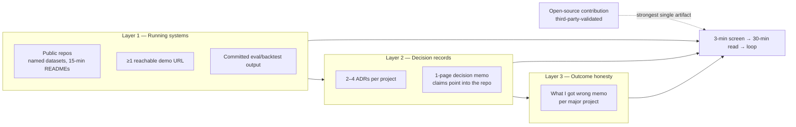

# Chapter 8.2 — Building an Architecture Portfolio

| | |
|---|---|
| **Part** | 8 — Professional Excellence & Career Development |
| **Maturity level** | 3→4 — Engineer → Architect |
| **Difficulty** | Intermediate |
| **Estimated study time** | 3 hours (reading 90 min, exercise 90 min) |
| **Prerequisites** | [8.1](chapter-01-role-and-market.md); [1.5 Communicating Architecture](../part-1-professional-foundation/chapter-05-communicating-architecture.md) |

## Learning Objectives

After this chapter you will be able to:

1. Build a three-layer portfolio — running systems, decision records, and honest outcome memos — and explain why all three layers are load-bearing for someone *entering* the architect role.
2. Apply the credibility rules that separate verifiable evidence from claims an interviewer must take on faith, including the hard rule about fictional numbers.
3. Convert curriculum projects (P01–P25) into portfolio artifacts a hiring manager can click, run, and interrogate.
4. Write the two documents that do the most interview work per page: the decision memo and the "what I got wrong" memo.

## Introduction

A portfolio answers one question a résumé cannot: *can this person actually do the work, and how would I know?* For a practicing principal with fifteen years of shipped systems, the answer can rest on reputation and war stories. For someone entering the architect role — this curriculum's reader — it cannot. Your evidence must be **verifiable by a stranger**, and that constraint drives everything in this chapter.

Be direct about a tempting mistake, because an earlier edition of this very chapter made it: the idea that an architect's portfolio is "judgment, not code." That is how established architects *describe their value*, and it is terrible advice for building entry evidence. A hiring manager screening an unknown candidate cannot verify judgment claims; they can click a link, read a repo, and run a system. **Code is not the point of your portfolio, but it is the proof layer everything else stands on.** Judgment artifacts without running systems beneath them read as fiction — because, from the screener's chair, they might be.

## Business Motivation

Portfolio quality changes outcomes at two funnel stages, and the effect sizes are large. At the screen: recruiters and hiring managers spend, by their own accounts, one to three minutes on an unknown candidate's materials; a pinned repo with a live demo link and a one-page decision memo survives that pass, while a list of project *descriptions* does not. At the loop: interviewers probe claimed experience hard (see [8.3](chapter-03-architecture-interviews.md)), and candidates whose evidence is interrogable get easier loops — the interviewer can spend the hour going deep instead of testing whether anything is real. The cost side is equally concrete: a credible three-layer portfolio built from this curriculum's Tier 1–2 projects is roughly 100–150 hours of work. Set against the salary spread it influences (8.1's $80–120K band width in the US market), it is among the best-paid work you will ever do per hour.

## Theory

### The three layers

1. **Running systems** — the proof layer. Two to four projects, each with: a public repo; a **named public dataset** (IEEE-CIS for fraud, M5 for forecasting, MovieLens for ranking, your own document corpus for RAG — never an unnamed "a dataset"); a README that gets a stranger to a running state in under fifteen minutes; the eval or backtest harness with its actual output committed; and, for at least one project, a **reachable demo URL**. The curriculum's projects were designed for this: P01/P06 (RAG with evals), P21 (churn with a gate that rejects a corrupted challenger), P23 (forecasting with an honest backtest), P24 (recommender with funnel diagnostics), P25 (the delivery platform operating the others).
2. **Decision records** — the judgment layer, *anchored to layer 1*. Per project: 2–4 ADRs in the repo ([templates/adr-template.md](../../templates/adr-template.md)), one page each, with real rejected alternatives; and one **decision memo** — a single page stating the problem, the three decisions that mattered, what each cost, and what you measured. This is where trade-off skill ([1.4](../part-1-professional-foundation/chapter-04-tradeoff-analysis.md)) becomes visible. The difference from the fiction-portfolio version: every claim in the memo points at something in the repo a reader can check.
3. **Outcome honesty** — the differentiating layer. One **"what I got wrong" memo** per major project: the decision you reversed, the evidence that forced it, what the reversal cost, and what you now check first. This is the single most senior-reading artifact a junior portfolio can contain, it directly manufactures your answer to the hardest behavioral question in the loop ("tell me about a call you got wrong"), and almost nobody has one.

Optional fourth element, high value when real: an **open-source contribution** (to an eval framework, a feature-store tool, a documentation fix with substance). It is the only portfolio evidence carrying third-party validation — a maintainer accepted it — and therefore the only kind a skeptic cannot suspect you of authoring into a vacuum.

### The credibility rules

- **Never present fictional numbers as experience.** The curriculum's case studies are teaching devices with invented metrics (the catalog says so explicitly). "I designed a fraud platform handling 1,400 TPS at 80ms p99" when the source is CS52 is, from the interviewer's chair, indistinguishable from lying — and interviewers who catch one invented number discount everything else you say. The honest framing is strong on its own: *"I studied and re-designed the standard fraud-scoring architecture, then built a working version against the IEEE-CIS public dataset; here is my repo, my precision-recall curve at my chosen operating point, and what my numbers don't tell me about production."* That last clause reads as seniority, not weakness.
- **NDA'd real work needs anchors.** Abstracted war stories from employment are legitimate, but pair every abstracted claim with something verifiable (the public-dataset rebuild of the same problem class, the open-source contribution, the talk). Unverifiable claims should carry the load nowhere.
- **Show the measurement, not just the result.** "recall@5 of 0.87" is a number; the committed eval harness that produced it is evidence. Interviewers increasingly ask "show me how you measured that" — make the answer a link.
- **Keep it small and deep.** Two projects a reviewer can run beat eight they must take on faith. Depth is checkable; breadth is a claim.

### Presentation: one door, three depths

Structure for the three-minute screen, the thirty-minute read, and the loop. A single landing page (GitHub profile README or a simple site) with: one paragraph of positioning (8.1's target, stated plainly); the two-to-four projects, each as *one line + demo link + decision-memo link*; and the talks/writing if any ([8.4](chapter-04-technical-writing-speaking.md)). Each project repo carries the full depth: README (run it in 15 minutes), ADRs, memos, eval outputs. The [1.5](../part-1-professional-foundation/chapter-05-communicating-architecture.md) discipline applies: conclusion first, audience-matched, no artifact without a named reader.

## Architecture Perspective

The dependency direction is the chapter's argument: layer 2 without layer 1 is unverifiable, and layer 3 without layer 2 has nothing to be honest about. Build bottom-up; present top-down.

## Real-world Example

Two candidates (fictional) reached the same fintech loop for a senior AI-architect role. **Candidate A** submitted a polished site describing five architectures — diagrams, cost tables, threat models — all from unnamed engagements, none runnable. **Candidate B** submitted two repos: a churn service (public telco-style dataset with timestamps, promotion gate, drift drill with committed output) and a RAG assistant over public documentation (golden set of 90 questions, faithfulness harness, live demo), plus three one-page memos, one titled "Where my reranker decision was wrong." The screen took A and B both through. The loop did not: A's interviewer spent forty minutes probing whether the five architectures were real ("what was the p99? who ran it? what broke?") and ended unconvinced — the feedback said "impressive materials, couldn't validate depth." B's interviewer cloned the churn repo *during the interview*, ran the corrupted-batch drill, watched the gate reject it, and spent the remaining time on genuine design discussion at the edge of B's knowledge. B's offer letter arrived with the hiring manager's note: "the wrong-memo did it — nobody shows us those." The delta in preparation time between A and B was small; the delta in *verifiability* decided the loop.

## Hands-on Exercise

Convert one completed curriculum project (P01, P21, or P23 recommended) into a portfolio artifact:

1. **Repo hygiene** — public repo, named dataset with acquisition instructions, README tested against the 15-minute rule by someone other than you (or by you, on a clean machine, timed).
2. **Commit the proof** — the eval/backtest harness and one representative output (the gate log, the coverage table, the golden-set scores).
3. **Write the decision memo** — one page: problem, the three decisions that mattered, each with its rejected alternative and its measured consequence, links into the repo.
4. **Write the wrong-memo** — one page on a decision you reversed during the build (if nothing was reversed, your acceptance criteria were too soft — find the reranker you dropped, the chunk size that failed, the feature that leaked).
5. **Wire the landing** — add the project to your profile page as one line + two links.

**Acceptance criteria:**
- [ ] A stranger (or clean-machine you) reached a running state in ≤15 minutes, measured
- [ ] Every number in the decision memo is reproducible from the repo
- [ ] The wrong-memo names the evidence that forced the reversal, not just the reversal
- [ ] No claim anywhere presents curriculum case-study figures as your experience
- [ ] The landing page passes the 3-minute test: positioning, projects, links — nothing else

## Enterprise Considerations

Employed readers have constraints and assets. Constraints: employment agreements often restrict publishing work artifacts — the public-dataset rebuild of the same problem class is the standard lawful route, and it is *better* evidence anyway because it is verifiable. Check your agreement before publishing anything adjacent to employer work; when in doubt, build on public data on personal equipment. Assets: internal scope can be converted to verifiable form through talks ([8.4](chapter-04-technical-writing-speaking.md)) cleared through your employer's process, and through open-source contributions made on work time where policy allows (many enterprises now encourage this — it is their third-party validation too). For hiring managers reading this chapter in reverse: asking candidates to walk through *their own repo's* decision memo is a better senior screen than any whiteboard puzzle, and takes ten minutes.

## Trade-offs

| Decision | Option A | Option B | Choose A when… | Choose B when… |
|----------|----------|----------|----------------|----------------|
| Evidence base | Public-dataset rebuilds | Abstracted employer war stories | Entering the role; anything must be verifiable | Established reputation exists and stories have anchors (talks, references) |
| Breadth | 2–3 deep, runnable projects | 6–8 described projects | Always at entry — depth is checkable | Late-career, where the portfolio is a map of a known territory |
| Demo hosting | Live URL (small cost, ops burden) | Repo + 15-min README only | At least one project; the click is worth the hosting bill (~$5–20/month) | Projects whose value is the harness, not the UI (P10, P25) |
| Wrong-memo subject | A costly, evidence-forced reversal | A minor course-correction | The build produced one — it reads senior and survives follow-ups | Early builds where nothing big broke yet; feature the small one honestly and upgrade when reality provides better material |

## Common Mistakes

1. **Fiction as experience.** Presenting case-study numbers (this curriculum's or anyone's) as personal track record. One caught instance poisons the whole loop.
2. **Judgment-only portfolios.** Diagrams and memos with no running layer beneath them. From the screener's chair, indistinguishable from confident fiction — the failure this chapter's earlier edition taught, now its central warning.
3. **The unnamed dataset.** "Trained on customer data" (whose?), "a churn dataset" (which?). Named datasets are what make your numbers mean anything.
4. **README rot.** The 15-minute claim untested for months while dependencies drift. Test it on every meaningful change; it is the portfolio's uptime.
5. **Breadth signaling.** Eight half-projects to look prolific. Reviewers sample one; if the sample disappoints, the other seven are never opened.
6. **Skipping the wrong-memo** because nothing feels finished enough to have failures. The memo is what makes the rest believable; write it first, not last.

## Best Practices

1. **Build bottom-up, present top-down** — proof layer first, then decisions, then honesty; landing page last.
2. **Name every dataset and commit every measurement** — verifiability is the entire game.
3. **One live demo minimum** — the clicked link outperforms every described architecture.
4. **Write the wrong-memo while the wound is fresh** — reversals sanitize themselves in memory within weeks.
5. **Maintain the portfolio like production** — the 15-minute test on change, quarterly link checks, dataset licenses honored.
6. **Let one open-source contribution carry the third-party weight** — a single merged, substantive PR outranks any self-published artifact for skeptical readers.

## Architecture Checklist

Before calling the portfolio interview-ready:

- [ ] 2–4 projects, each: public repo, named dataset, tested 15-minute README
- [ ] Eval/backtest harness and representative output committed per project
- [ ] ≥1 reachable demo URL
- [ ] Decision memo per project; every number traceable into the repo
- [ ] Wrong-memo per major project, with evidence and cost of the reversal
- [ ] Zero fictional figures presented as experience anywhere
- [ ] Landing page passes the 3-minute screen
- [ ] Employment-agreement check done for anything adjacent to employer work

## Interview Questions

1. *"Walk me through the most important decision in this repo."* — Strong answers go straight to a decision memo's contents: the alternative that lost, the measured reason, the link to the harness. Weak answers narrate features.
2. *"These numbers — where do they come from?"* — Strong answers name the dataset, point at the committed harness, and volunteer the limits ("public data, no concept drift, no adversary — here's what production would add"). The volunteered limits are the senior tell.
3. *"Tell me about a call you got wrong on this project."* — Strong answers are pre-written: the wrong-memo, told with the forcing evidence and the cost. Weak answers improvise a humble-brag.
4. *"Your real work is under NDA. How should I trust your claims?"* — Strong answers don't ask for trust: they route to the public rebuild of the same problem class, the merged OSS contribution, the cleared talk — and note that this is exactly how they would evaluate a candidate too.

## Further Reading

- Your target companies' actual job postings — the portfolio exists to answer them; read ten before deciding what to build.
- The [project catalog](../../projects/README.md) and its Definitions of Done — each DoD was written to be a portfolio artifact's acceptance test.
- *The Pragmatic Programmer* (Hunt & Thomas), the "portfolio" thread — the origin of treating your knowledge and evidence as an investment portfolio.
- One genuinely good public example: search GitHub for ML-engineering portfolios with committed eval harnesses and read the best one you find critically — what convinced you, and what did you have to take on faith?

## Summary

- The entry-level architect portfolio is three layers: running systems (the proof), decision records (the judgment, anchored to the proof), and wrong-memos (the honesty that makes both believable).
- Code is not the point, but it is the verification layer — "judgment, not code" is how established architects describe value, not how entrants demonstrate it.
- Credibility rules are absolute: named datasets, committed measurements, no fictional numbers as experience, NDA claims always paired with verifiable anchors.
- Depth beats breadth because depth is checkable; one live demo and one merged OSS contribution carry disproportionate weight.
- Present in three depths — 3-minute landing, 30-minute repo read, loop-depth memos — and maintain it like production.

---

**Previous:** [8.1 The AI Solution Architect Role & Market](chapter-01-role-and-market.md) · **Next:** [8.3 Architecture Interviews](chapter-03-architecture-interviews.md) · **Related:** [1.4 Trade-off Analysis](../part-1-professional-foundation/chapter-04-tradeoff-analysis.md), [1.5 Communicating Architecture](../part-1-professional-foundation/chapter-05-communicating-architecture.md), [Projects](../../projects/README.md)
