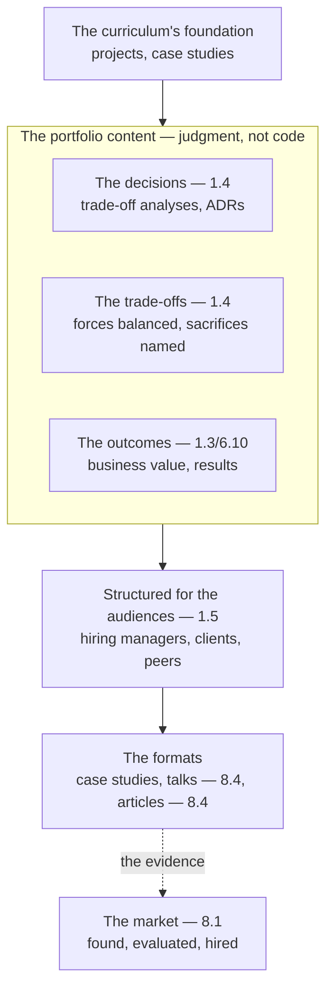

# Chapter 8.2 — Building an Architecture Portfolio

| | |
|---|---|
| **Part** | 8 — Professional Excellence & Career Development |
| **Maturity level** | 4 — Architect |
| **Difficulty** | Intermediate |
| **Estimated study time** | 3 hours (reading 90 min, exercise 90 min) |
| **Prerequisites** | [1.5 Communicating Architecture](../part-1-professional-foundation/chapter-05-communicating-architecture.md); [8.1](chapter-01-role-and-market.md) |

## Learning Objectives

After this chapter you will be able to:

1. Build an architecture portfolio that presents your projects and case studies as evidence of judgment, not just code.
2. Present the architecture decisions, trade-offs, and outcomes that demonstrate the architect's value (the judgment).
3. Structure the portfolio for the audiences (the hiring managers, the clients, the peers) using the communication discipline (1.5).
4. Use the curriculum's projects and case studies as the portfolio's foundation.

## Introduction

This chapter builds the architecture portfolio — the evidence of your judgment that presents you as an architect. 8.1 mapped the role; this chapter builds the portfolio that gets you the role — the presentation of your projects and case studies as evidence of the architect's judgment (the decisions, the trade-offs, the outcomes), not just the code. The portfolio is how the architect's value (the judgment — 1.1) is made visible and evaluable.

The framing: **the architecture portfolio presents your judgment as evidence, not your code** — the portfolio showing the architecture decisions (1.4), the trade-offs (1.4), and the outcomes (1.3/6.10) that demonstrate the architect's judgment (1.1's decisions-not-code), structured for the audiences (1.5), and this chapter is how to build it.

## Business Motivation

The portfolio is how the architect is found, evaluated, and hired — the evidence that makes the architect's judgment visible. Without it: the architect's judgment is invisible (the judgment in the head, not presented — the un-evaluable architect), and the architect is evaluated on the code (not the judgment — the architect-as-coder). With it: the architect's judgment is visible (the portfolio showing the decisions, trade-offs, outcomes), and the architect is evaluated as an architect (the judgment — 1.1). The business case is the career one, in 8.1's market: the portfolio is how the architect is found (the visible judgment), evaluated (the evidence), and hired (the demonstrated value — 1.1) — the portfolio as the architect's evidence in the market, and this chapter is how to build it (the judgment presented, not the code).

## Theory

### The portfolio's content: judgment, not code

The portfolio presents the judgment (1.1's decisions-not-code):

- **The decisions** (1.4) — the architecture decisions (the trade-off analyses — 1.4, the ADRs — 1.4/6.3), the decisions that show the architect's judgment (the options considered, the decision, the rationale — 1.4); the decisions as the judgment evidence.
- **The trade-offs** (1.4) — the trade-offs (the forces balanced — 1.4, the sacrifices named — 1.4), the trade-offs that show the architect's reasoning (the trade-off analysis — 1.4); the trade-offs as the reasoning evidence.
- **The outcomes** (1.3/6.10) — the outcomes (the business value — 1.3, the results — the benefits realization — 4.11/6.10), the outcomes that show the architect's impact (the value delivered — 1.3); the outcomes as the impact evidence.
- **Not the code** — the portfolio is not the code (the code is the engineer's evidence, not the architect's); the judgment (the decisions, trade-offs, outcomes), not the code (1.1's decisions-not-code).

### The portfolio's structure: for the audiences

The portfolio structured for the audiences (1.5's audience-artifact):

- **The audiences** (1.5) — the hiring managers (the evaluators — the judgment), the clients (the consulting — 8.5), the peers (the community — 8.4); the audiences the portfolio serves (1.5's audience-matching).
- **The presentation** (1.5) — the portfolio presented for the audiences (the SCQA — 1.5, the compelling narrative — the problem, the architecture, the outcome — 1.5's communication), structured for the audience's question (the hiring manager's "can this architect deliver?" — the judgment evidence); the presentation for the audience (1.5).
- **The formats** — the portfolio's formats (the written case studies — the deep evidence, the talks — 8.4, the articles — 8.4, the public portfolio — the visible evidence); the formats the portfolio uses (the written, the spoken — 8.4).

### The portfolio's foundation: the curriculum's projects and case studies

The portfolio built on the curriculum's projects and case studies:

- **The projects** (the [project catalog](../../projects/README.md)) — the 25 projects (the built systems — the portfolio-grade projects, the capstones — P17-P20), the projects as the portfolio's built evidence (the systems built, the decisions made, the outcomes delivered); the projects as the portfolio's foundation.
- **The case studies** (the [case-study catalog](../../case-studies/README.md)) — the 56 case studies (the analyzed architectures — the case-study analyses, the pattern applications — 7.1), the case studies as the portfolio's analytical evidence (the architectures analyzed, the judgment demonstrated); the case studies as the portfolio's analytical foundation.
- **The curriculum's structure** — the curriculum's projects and case studies (the project template — the decisions, trade-offs, outcomes, the case-study template — the analysis) as the portfolio's structure (the templates the portfolio uses); the curriculum as the portfolio's foundation and structure.

## Architecture Perspective

Readings. **The portfolio presents judgment, not code** — the decisions (1.4), the trade-offs (1.4), the outcomes (1.3/6.10) — the judgment evidence (1.1's decisions-not-code), not the code (the engineer's evidence). **The portfolio is structured for the audiences** — the hiring managers (the judgment evaluators), the clients (8.5), the peers (8.4) — structured for the audience's question (1.5's audience-matching), presented compellingly (1.5's SCQA/communication). **And the portfolio is built on the curriculum's foundation** — the projects (the built evidence — the capstones), the case studies (the analytical evidence — the pattern applications — 7.1), the curriculum's templates (the structure) — the curriculum as the portfolio's foundation and structure, the projects and case studies as the portfolio's evidence in the market (8.1).

## Real-world Example

The curriculum itself is the portfolio's foundation — the learner building the portfolio from the projects and case studies. Consider the learner completing the curriculum (the maturity levels — the ladder — 8.1): the portfolio built from the capstone projects (P17-P20 — the regulated-industry assistant, the multi-tenant platform, the sovereign RAG, the AI CoE reference architecture — the built evidence, documented portfolio-grade — the decisions, trade-offs, outcomes), and the case-study analyses (the 56 case studies analyzed — the pattern applications — 7.1, the judgment demonstrated). The portfolio presented the judgment (1.1): the decisions (the trade-off analyses — 1.4, the ADRs — 1.4/6.3 — the options, the decisions, the rationale), the trade-offs (the forces balanced — 1.4), the outcomes (the business value — 1.3/6.10) — the judgment evidence, not the code. And it was structured for the audiences (1.5): the hiring managers (the judgment evidence — "can this architect deliver?"), presented compellingly (1.5's SCQA), in the formats (the written case studies, the talks — 8.4, the articles — 8.4). The portfolio note (the curriculum's framing): *"The portfolio presents the architect's judgment, not the code. Built from the curriculum's projects (the capstones — the built evidence) and case studies (the analytical evidence — the pattern applications), it shows the decisions (the trade-off analyses, the ADRs), the trade-offs (the forces balanced), the outcomes (the business value). Structured for the audiences (the hiring managers, the clients, the peers), presented compellingly (the SCQA). The curriculum is the portfolio's foundation — the projects and case studies are the evidence, the templates are the structure. The portfolio is how the architect's judgment (1.1's decisions-not-code) is made visible and evaluable in the market — the evidence that gets the architect found, evaluated, and hired."*

## Hands-on Exercise

**Build the portfolio's foundation.** ~90 minutes. Using the curriculum's projects and case studies.

1. **The project write-up (35 min).** Take a project you've built (a curriculum project or a real one) and write it up portfolio-grade (the project template — the business problem, the architecture, the decisions/trade-offs — 1.4, the outcomes — 1.3). Present the judgment (the decisions, trade-offs, outcomes), not the code.
2. **The case-study analysis (25 min).** Take a case study (a curriculum case study or a real architecture) and write the analysis (the architecture, the patterns applied — 7.1, the judgment demonstrated). Present the analytical judgment.
3. **The audience structure (15 min).** Structure the portfolio for the hiring-manager audience (1.5 — the "can this architect deliver?" question, the judgment evidence, the SCQA presentation).
4. **The portfolio plan (15 min).** Plan the portfolio: the projects and case studies to include (the capstones, the analyses), the formats (the written, the talks — 8.4), the presentation (the audiences — 1.5).

**Acceptance criteria:**
- [ ] A project written up portfolio-grade, presenting the judgment (decisions, trade-offs, outcomes — 1.4/1.3), not the code
- [ ] A case-study analysis presenting the analytical judgment (the patterns — 7.1)
- [ ] The portfolio structured for the hiring-manager audience (1.5)
- [ ] The portfolio plan (the projects/case studies, the formats, the presentation)

## Enterprise Considerations

The portfolio is shaped by the enterprise and consulting contexts. **The enterprise portfolio is internal-and-external** (8.1): the enterprise architect's portfolio serves the internal (the promotion — 8.1's ladder, the internal reputation) and the external (the market — 8.1, the opportunities), so the portfolio is internal-and-external. **The consulting portfolio is client-facing** (8.5): the consultant's portfolio is client-facing (8.5 — the client engagement, the credibility), so the portfolio serves the consulting (8.5's client credibility). **The confidentiality is a constraint** (4.14): the portfolio's content (the enterprise's systems, the client's engagements) has confidentiality constraints (4.14 — the sensitive details), so the portfolio anonymizes/abstracts (the judgment presented without the confidential details — the curriculum's fictional-companies approach). **And the public portfolio is a reputation asset** (8.4): the public portfolio (the articles, the talks — 8.4, the open contributions) is a reputation asset (8.4 — the public voice, the community), so the portfolio connects to the public presence (8.4's writing/speaking).

## Trade-offs

| Decision | Option A | Option B | Choose A when… | Choose B when… |
|----------|----------|----------|----------------|----------------|
| Content | Judgment (decisions, trade-offs, outcomes) | Code | Always — the architect's evidence is the judgment (1.1) | Never code-only; the architect-as-coder (1.1) |
| Depth | Deep case studies (few, thorough) | Broad list (many, shallow) | The depth shows the judgment (the thorough analysis) | Breadth for the range — but depth beats breadth for the judgment |
| Confidentiality | Anonymize/abstract (the judgment, not the details) | Full details | Always where confidentiality applies (4.14) | Never the confidential details; the judgment abstracted |
| Format | Written + spoken (case studies + talks — 8.4) | Written only | The range (the written depth + the spoken reach — 8.4) | Written-only limits the reach (the spoken adds — 8.4) |

## Common Mistakes

1. **The code portfolio** — the portfolio presenting the code (the engineer's evidence), not the judgment (the architect's — 1.1); the judgment (the decisions, trade-offs, outcomes).
2. **The judgment invisible** — the judgment in the head, not presented (the un-evaluable architect); the portfolio (the visible judgment).
3. **The un-structured portfolio** — the portfolio not structured for the audiences (1.5); the audience-matching (the audience's question).
4. **The confidentiality breach** — the portfolio exposing the confidential details (4.14); the anonymize/abstract (the judgment, not the details).
5. **The shallow breadth** — the broad-but-shallow portfolio (the many-but-thin); the deep case studies (the thorough judgment).
6. **The written-only** — the portfolio written-only, missing the spoken reach (8.4); the written + spoken (8.4).
7. **The un-foundation'd portfolio** — the portfolio not built on the projects/case studies (the un-grounded); the curriculum's foundation (the projects, case studies).

## Best Practices

1. **Present the judgment, not the code** — the decisions (1.4), the trade-offs (1.4), the outcomes (1.3/6.10) — the architect's evidence (1.1's decisions-not-code).
2. **Structure for the audiences** — the hiring managers, the clients, the peers (1.5's audience-matching), the audience's question, the compelling presentation (1.5's SCQA).
3. **Build on the curriculum's foundation** — the projects (the built evidence — the capstones), the case studies (the analytical evidence — 7.1), the templates (the structure).
4. **Go deep** — the deep case studies (the thorough judgment), depth over breadth.
5. **Anonymize/abstract for confidentiality** — the judgment presented without the confidential details (4.14, the fictional-companies approach).
6. **Use the written and spoken formats** — the case studies (the depth) + the talks/articles (the reach — 8.4).
7. **Connect to the public presence** — the public portfolio (the articles, the talks — 8.4), the reputation asset.

## Architecture Checklist

For building the architecture portfolio:

- [ ] The content presents the judgment (decisions — 1.4, trade-offs — 1.4, outcomes — 1.3/6.10), not the code (1.1)
- [ ] The portfolio structured for the audiences (hiring managers, clients, peers — 1.5)
- [ ] Built on the curriculum's foundation (projects — the capstones, case studies — 7.1)
- [ ] Deep case studies (the thorough judgment, depth over breadth)
- [ ] Confidentiality handled (anonymize/abstract — 4.14)
- [ ] The written and spoken formats (case studies + talks/articles — 8.4)
- [ ] Connected to the public presence (8.4)

## Interview Questions

1. *"What should an AI architect's portfolio contain?"* — Strong answers give the judgment (the decisions — 1.4, the trade-offs — 1.4, the outcomes — 1.3/6.10), not the code (the architect's evidence is the judgment — 1.1's decisions-not-code), structured for the audiences (1.5), built on the projects and case studies (the curriculum's foundation).
2. *"How do you present an architecture project in a portfolio?"* — Strong answers give the judgment presentation (the business problem — 1.3, the architecture — the decisions and trade-offs — 1.4, the outcomes — 1.3/6.10), the compelling narrative (1.5's SCQA), the judgment (not the code), anonymized for confidentiality (4.14).
3. *"How do you demonstrate architectural judgment to a hiring manager?"* — Strong answers give the portfolio's judgment evidence (the decisions with rationale — 1.4, the trade-offs with sacrifices named — 1.4, the outcomes with business value — 1.3/6.10), structured for the hiring manager's question ("can this architect deliver?" — 1.5), the deep case studies (the thorough judgment).
4. *"How do you build a portfolio without exposing confidential work?"* — Strong answers give the anonymize/abstract (4.14 — the judgment presented without the confidential details, the fictional-companies approach — the curriculum's), the judgment (the decisions, trade-offs, outcomes) abstracted from the specifics.

## Further Reading

- 1.5 Communicating Architecture (the audience-artifact, the SCQA) — the communication discipline the portfolio uses.
- 1.4 Trade-off Analysis (the decisions, the trade-offs) and 1.3 Business Understanding (the outcomes) — the judgment the portfolio presents.
- The [project catalog](../../projects/README.md) and [case-study catalog](../../case-studies/README.md) — the portfolio's foundation.
- 8.4 Technical Writing & Public Speaking (the formats, the public presence) — the portfolio's spoken/written formats.

## Summary

- The **architecture portfolio presents your judgment as evidence, not your code** — the decisions (1.4), the trade-offs (1.4), the outcomes (1.3/6.10) — the architect's evidence (1.1's decisions-not-code).
- The portfolio is **structured for the audiences** — the hiring managers (the judgment evaluators), the clients (8.5), the peers (8.4) — using the communication discipline (1.5's audience-matching, SCQA).
- The portfolio is **built on the curriculum's foundation** — the projects (the built evidence — the capstones), the case studies (the analytical evidence — the pattern applications — 7.1), the templates (the structure).
- The portfolio goes **deep** (the thorough case studies, depth over breadth), **anonymizes** for confidentiality (4.14), and uses the **written and spoken formats** (the case studies + the talks/articles — 8.4).
- The portfolio is how the architect's judgment is made **visible and evaluable in the market** (8.1) — the evidence that gets the architect found, evaluated, and hired. The interviews the portfolio gets you into are next: **architecture interviews** (8.3).

---

**Previous:** [Chapter 8.1 — The AI Solution Architect Role & Market](chapter-01-role-and-market.md) · **Next:** [Chapter 8.3 — Architecture Interviews](chapter-03-architecture-interviews.md) · **Related:** [1.5 Communicating Architecture](../part-1-professional-foundation/chapter-05-communicating-architecture.md), [1.4 Trade-off Analysis](../part-1-professional-foundation/chapter-04-tradeoff-analysis.md), [8.4 Technical Writing & Public Speaking](chapter-04-technical-writing-speaking.md)
