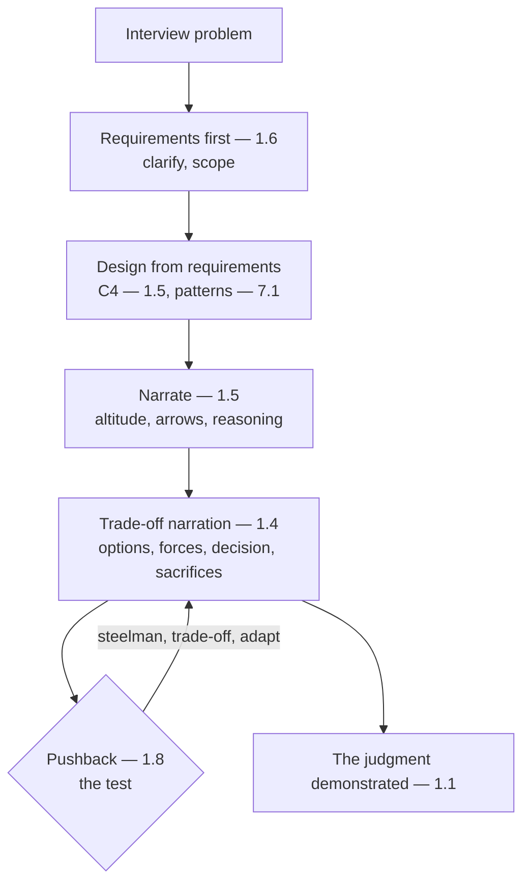

# Chapter 8.3 — Architecture Interviews

| | |
|---|---|
| **Part** | 8 — Professional Excellence & Career Development |
| **Maturity level** | 4 — Architect |
| **Difficulty** | Intermediate |
| **Estimated study time** | 3 hours (reading 90 min, exercise 90 min) |
| **Prerequisites** | [1.4 Trade-off Analysis](../part-1-professional-foundation/chapter-04-tradeoff-analysis.md); [1.5](../part-1-professional-foundation/chapter-05-communicating-architecture.md); [8.2](chapter-02-architecture-portfolio.md) |

## Learning Objectives

After this chapter you will be able to:

1. Perform in architecture and system-design interviews: the whiteboarding method, the trade-off narration, and handling pushback.
2. Structure the interview response using the architect's disciplines (requirements, trade-offs, communication).
3. Demonstrate the architect's judgment in the interview (the decisions, trade-offs, reasoning).
4. Use the curriculum's interview questions (every chapter's) as the interview preparation.

## Introduction

This chapter is the architecture interview — how to perform in the system-design and architecture interviews that the portfolio (8.2) gets you into. The interview is where the architect's judgment (1.1) is tested live, and this chapter is the method for demonstrating it — the whiteboarding, the trade-off narration, the handling of pushback. Every chapter of this curriculum has ended with interview questions; this chapter is how to answer them well.

The framing: **the architecture interview tests your judgment live — demonstrate it with the architect's disciplines** — the interview testing the architect's judgment (1.1) through the system-design whiteboarding (the design), the trade-off narration (1.4), and the pushback handling (1.8's disagreement), demonstrated with the architect's disciplines (the requirements — 1.6, the trade-offs — 1.4, the communication — 1.5), and this chapter is the method.

## Business Motivation

The interview is the gate to the role — the live test of the judgment that decides the hire. Without interview skill: the architect's judgment (real but un-demonstrated live) fails the interview (the judgment not shown under the interview's pressure); with it: the architect's judgment is demonstrated (the interview passed — the judgment shown). The business case is the career-gate one, in 8.1's market: the interview is the gate to the role (the live test — the judgment demonstrated), and interview skill (the whiteboarding, the trade-off narration, the pushback handling) is what gets the architect through the gate — the demonstrated judgment that decides the hire, and this chapter is the method.

## Theory

### The whiteboarding method

The system-design whiteboarding (the architect's design method, live):

- **The requirements first** (1.6) — start with the requirements (1.6 — the functional, the non-functional, the constraints, the wrong-answer policy — the requirements before the design), clarifying the problem (1.6's elicitation — the questions that scope the design); the requirements-first (not diving into the design — the requirements scope it).
- **The design from the requirements** — the design derived from the requirements (the architecture — the components, the flow — Parts 3-5, the patterns — 7.1), the design the requirements demand (the requirements-driven design — 1.6/1.4); the design (the C4-style — 1.5, the patterns — 7.1).
- **The narration** (1.5) — narrate the design (1.5's communication — the altitude — 1.5, the arrows labeled — 1.5, the reasoning aloud), the design communicated (the interviewer following the reasoning — 1.5); the narration (the design communicated live).

### The trade-off narration

The trade-off narration (1.4, live):

- **The trade-offs narrated** (1.4) — narrate the trade-offs (1.4 — the options, the forces, the decision, the sacrifices — the trade-off analysis aloud), the reasoning shown (the interviewer seeing the judgment — 1.4's reasoning); the trade-offs narrated (the judgment shown).
- **The decisions justified** (1.4) — justify the decisions (1.4 — the decision with the rationale, the revisit trigger), the decision defended (the reasoning — 1.4); the decisions justified (the judgment defended).
- **The judgment demonstrated** (1.1) — the trade-off narration demonstrating the judgment (1.1's decisions-not-code — the architect's judgment shown live), the interview's core (the judgment demonstrated — 1.1); the judgment (the interview's test).

### The pushback handling

The pushback handling (1.8's disagreement, in the interview):

- **The pushback as a test** — the interviewer's pushback (the challenge — "why not X?", the constraint added — "what if the scale is 100×?") as a test (the judgment under pressure — the pushback testing the reasoning); the pushback (the test — not a hostility).
- **The disagreement handling** (1.8) — handle the pushback (1.8's disagreement — steelman the challenge — 1.8, convert to the trade-off — 1.4, the reasoning — the judgment); the pushback handled (the reasoning — 1.8/1.4), not the defensiveness (the challenge engaged — 1.8's steelman).
- **The adaptation** — adapt to the pushback (the design revised — the new constraint handled — 1.4, the reasoning updated), the design adapted (the judgment flexible — the new information incorporated); the adaptation (the design revised — the judgment flexible).

## Architecture Perspective

Readings. **The interview method is the architect's disciplines, live** — the requirements-first (1.6), the design (1.5's C4, 7.1's patterns), the trade-off narration (1.4), the pushback handling (1.8's disagreement) — the architect's disciplines demonstrated live (the interview as the disciplines applied). **The trade-off narration is the interview's core** — the judgment (1.1) demonstrated through the trade-off narration (1.4 — the options, forces, decision, sacrifices aloud), the interviewer seeing the judgment (the reasoning shown — 1.4); the trade-off narration as the judgment demonstration (the interview's test — 1.1). **And the pushback is the test handled with the disagreement discipline** — the pushback (the challenge, the constraint) as the test (the judgment under pressure), handled with the disagreement discipline (1.8's steelman, the trade-off conversion — 1.4, the adaptation), the reasoning engaged (not the defensiveness — 1.8), the design adapted (the judgment flexible).

## Real-world Example

The curriculum's interview questions are the interview preparation — every chapter's interview questions being the preparation for the architecture interview. Consider the learner preparing (the curriculum's interview questions — the 90 chapters' questions): the interview questions covering the disciplines (the requirements — 1.6, the trade-offs — 1.4, the design — Parts 3-5, the patterns — 7.1, the governance — Part 6), the preparation being the questions answered (the judgment practiced). And the interview method (this chapter's) applied: the requirements-first (1.6 — the clarifying questions), the design (1.5's C4, 7.1's patterns), the trade-off narration (1.4 — the options, forces, decision, sacrifices aloud — the judgment shown), the pushback handling (1.8's steelman, the trade-off conversion, the adaptation). The interview note (the curriculum's framing): *"Every chapter's interview questions are the interview preparation — the 90 chapters' questions covering the disciplines (requirements, trade-offs, design, patterns, governance). The interview method is the architect's disciplines applied live: requirements-first (clarify the problem — 1.6), design from the requirements (the C4 — 1.5, the patterns — 7.1), narrate the trade-offs (the options, forces, decision, sacrifices aloud — 1.4 — the judgment shown), handle the pushback (steelman, convert to the trade-off, adapt — 1.8/1.4). The trade-off narration is the core — the judgment (1.1's decisions-not-code) demonstrated live. The interview tests the judgment; the method demonstrates it. The curriculum's interview questions are the preparation, the method is how to answer them well."*

## Hands-on Exercise

**Perform an architecture interview.** ~90 minutes. Mock interview (with a peer, or self-recorded).

1. **The interview problem (5 min).** Take an interview problem (a system-design — "design a RAG system for X", or use a curriculum interview question).
2. **The whiteboarding (30 min).** Perform the whiteboarding: requirements-first (1.6 — clarify, scope), design from the requirements (1.5's C4, 7.1's patterns), narrate (1.5 — the altitude, the arrows, the reasoning). Whiteboard the design.
3. **The trade-off narration (25 min).** Narrate the trade-offs (1.4 — the options, forces, decision, sacrifices aloud), justify the decisions (1.4 — the rationale, the revisit trigger). Demonstrate the judgment.
4. **The pushback drill (30 min).** Have the peer (or yourself) add pushback (the challenge — "why not X?", the constraint — "100× scale"). Handle it (1.8's steelman, the trade-off conversion — 1.4, the adaptation). Handle 3 pushbacks.

**Acceptance criteria:**
- [ ] The whiteboarding starts with the requirements (1.6), designs from them (1.5/7.1), narrates (1.5)
- [ ] The trade-offs narrated (1.4 — options, forces, decision, sacrifices), the decisions justified
- [ ] The pushback handled (1.8's steelman, the trade-off conversion, the adaptation) for 3 challenges
- [ ] The judgment demonstrated (1.1 — the decisions, trade-offs, reasoning)

## Enterprise Considerations

The architecture interview is shaped by the enterprise's hiring and the role's seniority. **The interview reflects the role's seniority** (8.1): the interview's depth reflects the role's seniority (8.1 — the solution architect's system design, the enterprise architect's portfolio/strategy — 6.1/6.10, the principal's leadership — 8.8), so the interview reflects the seniority (the deeper the role, the broader the interview). **The interview loop is the enterprise's process** (the multi-round loop): the enterprise's interview loop (the multi-round — the system design, the trade-offs, the leadership — 8.8, the culture) is the process (the architect performing across the loop), so the interview is the enterprise's loop (the rounds). **The behavioral rounds test the judgment-and-leadership** (1.8/8.8): the behavioral rounds (the past-experience — the judgment, the leadership — 1.8/8.8) test the judgment-and-leadership (the architect's past decisions, the influence — 1.8), so the interview includes the behavioral (the judgment-and-leadership — 1.8/8.8). **And the interview is a two-way evaluation** (8.1): the interview is a two-way evaluation (the architect evaluating the role — 8.1's positioning, the enterprise evaluating the architect), so the architect evaluates too (the role fit — 8.1).

## Trade-offs

| Decision | Option A | Option B | Choose A when… | Choose B when… |
|----------|----------|----------|----------------|----------------|
| Interview start | Requirements first (clarify) | Design first | Always — the requirements scope the design (1.6) | Never design-first; the un-scoped design (1.6) |
| Trade-off handling | Narrate the trade-offs (1.4) | State the decision only | Always — the reasoning shown (the judgment — 1.4) | Never decision-only; the judgment not shown (1.4) |
| Pushback | Steelman + adapt (1.8) | Defend rigidly | Always — the reasoning engaged (1.8's steelman) | Never rigid defense; the un-adapted design (1.8) |
| Depth | Match the role's seniority (8.1) | Uniform depth | Always — the interview reflects the seniority (8.1) | Never uniform; the seniority-matched depth (8.1) |

## Common Mistakes

1. **Design-first** — diving into the design without the requirements (1.6); requirements-first (clarify, scope — 1.6).
2. **The un-narrated trade-offs** — stating the decision without the trade-off narration (the judgment not shown — 1.4); narrate the trade-offs (the reasoning — 1.4).
3. **The rigid pushback defense** — defending rigidly against the pushback (the un-adapted design — 1.8); the steelman + adapt (1.8/1.4).
4. **The code focus** — focusing on the code (the engineer's), not the architecture judgment (the architect's — 1.1); the judgment (the decisions, trade-offs — 1.1).
5. **The un-scoped design** — the design not scoped to the requirements (the un-clarified problem — 1.6); the requirements-scoped design (1.6).
6. **The un-narrated design** — the design not narrated (1.5 — the reasoning un-shown); the narration (the reasoning aloud — 1.5).
7. **Ignoring the behavioral** — the behavioral rounds un-prepared (the judgment-and-leadership — 1.8/8.8); the behavioral preparation (the past decisions, the influence — 1.8).

## Best Practices

1. **Start with the requirements** — clarify, scope (1.6 — the requirements scope the design), the clarifying questions.
2. **Design from the requirements, narrate** — the design derived (1.5's C4, 7.1's patterns), narrated (1.5 — the altitude, arrows, reasoning).
3. **Narrate the trade-offs** — the options, forces, decision, sacrifices aloud (1.4 — the judgment shown), the decisions justified.
4. **Handle the pushback with the disagreement discipline** — the steelman (1.8), the trade-off conversion (1.4), the adaptation (the design revised — the judgment flexible).
5. **Demonstrate the judgment** — the decisions, trade-offs, reasoning (1.1's decisions-not-code — the interview's core).
6. **Match the depth to the seniority** — the interview reflecting the role's seniority (8.1).
7. **Prepare the behavioral** — the past decisions, the influence, the leadership (1.8/8.8 — the behavioral rounds).

## Architecture Checklist

For the architecture interview:

- [ ] The whiteboarding starts with the requirements (1.6 — clarify, scope), designs from them (1.5/7.1), narrates (1.5)
- [ ] The trade-offs narrated (1.4 — options, forces, decision, sacrifices), the decisions justified
- [ ] The pushback handled (1.8's steelman, the trade-off conversion, the adaptation)
- [ ] The judgment demonstrated (1.1 — the decisions, trade-offs, reasoning)
- [ ] The depth matched to the role's seniority (8.1)
- [ ] The behavioral prepared (the judgment-and-leadership — 1.8/8.8)
- [ ] The interview as a two-way evaluation (the role fit — 8.1)

## Interview Questions

1. *"How do you approach a system-design interview?"* — Strong answers give the method (requirements-first — clarify and scope — 1.6, design from the requirements — the C4 and patterns — 1.5/7.1, narrate — the reasoning aloud — 1.5, trade-off narration — the options, forces, decision, sacrifices — 1.4, pushback handling — steelman and adapt — 1.8), the judgment demonstrated (1.1).
2. *"How do you handle an interviewer's pushback on your design?"* — Strong answers give the disagreement discipline (1.8 — steelman the challenge, convert to the trade-off — 1.4, adapt the design), the pushback as the test (the judgment under pressure), the reasoning engaged (not the defensiveness — 1.8), the design adapted (the judgment flexible).
3. *"What are interviewers really testing in an architecture interview?"* — Strong answers give the judgment (1.1's decisions-not-code — the architect's judgment, not the code), tested through the design (the requirements-to-design — 1.6/1.4), the trade-offs (the reasoning — 1.4), the pushback (the judgment under pressure — 1.8), the trade-off narration as the core (the judgment demonstrated).
4. *"How do you demonstrate architectural judgment live?"* — Strong answers give the trade-off narration (1.4 — the options, forces, decision, sacrifices aloud — the reasoning shown), the requirements-first (1.6 — the judgment in the scoping), the pushback handling (1.8 — the judgment under pressure), the judgment (1.1) demonstrated through the disciplines applied live.

## Further Reading

- Every chapter's interview questions (the 90 chapters') — the interview preparation, the questions covering the disciplines.
- 1.4 Trade-off Analysis (the trade-off narration), 1.5 Communicating Architecture (the whiteboarding/narration), 1.6 Requirements Engineering (the requirements-first), 1.8 Leadership & Influence (the pushback handling) — the disciplines the interview applies.
- The system-design interview literature (the system-design interview references — read for the method, adapted to GenAI) — the interview method.
- 8.2 Building an Architecture Portfolio (the portfolio that gets the interview) and 8.1 (the role the interview is for) — the connected chapters.

## Summary

- The **architecture interview tests your judgment live** — the interview testing the architect's judgment (1.1) through the system-design whiteboarding, the trade-off narration (1.4), and the pushback handling (1.8), demonstrated with the architect's disciplines.
- The **whiteboarding method** is requirements-first (1.6 — clarify, scope), design-from-the-requirements (1.5's C4, 7.1's patterns), narrate (1.5 — the reasoning aloud) — the architect's design method live.
- The **trade-off narration is the interview's core** — the judgment (1.1) demonstrated through the trade-offs narrated (1.4 — the options, forces, decision, sacrifices aloud), the reasoning shown.
- The **pushback is the test** — handled with the disagreement discipline (1.8's steelman, the trade-off conversion — 1.4, the adaptation), the reasoning engaged (not the defensiveness), the design adapted (the judgment flexible).
- Every chapter's **interview questions are the preparation** — the curriculum's questions covering the disciplines, the method being how to answer them well. The interview is the gate to the role (8.1); the writing and speaking that build your reputation are next: **technical writing & public speaking** (8.4).

---

**Previous:** [Chapter 8.2 — Building an Architecture Portfolio](chapter-02-architecture-portfolio.md) · **Next:** [Chapter 8.4 — Technical Writing & Public Speaking](chapter-04-technical-writing-speaking.md) · **Related:** [1.4 Trade-off Analysis](../part-1-professional-foundation/chapter-04-tradeoff-analysis.md), [1.5 Communicating Architecture](../part-1-professional-foundation/chapter-05-communicating-architecture.md), [1.8 Leadership & Influence](../part-1-professional-foundation/chapter-08-leadership-influence.md)
