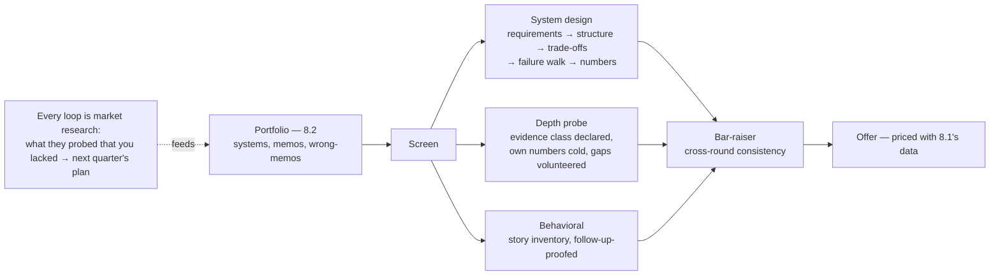

# Chapter 8.3 — Architecture Interviews

| | |
|---|---|
| **Part** | 8 — Professional Excellence & Career Development |
| **Maturity level** | 3→4 — Engineer → Architect |
| **Difficulty** | Intermediate |
| **Estimated study time** | 3 hours (reading 90 min, exercise 90 min) |
| **Prerequisites** | [8.2](chapter-02-architecture-portfolio.md); [1.4](../part-1-professional-foundation/chapter-04-tradeoff-analysis.md); [1.5](../part-1-professional-foundation/chapter-05-communicating-architecture.md) |

## Learning Objectives

After this chapter you will be able to:

1. Map the standard architect loop — screen, system design, depth probe, behavioral, bar-raiser — and know what each round is actually scoring.
2. Run the system-design method under time pressure: requirements first, honest trade-off narration, and the failure-mode walk that separates architect answers from senior-engineer answers.
3. Survive depth probes honestly when your evidence is portfolio work rather than production war stories — the specific situation this curriculum's graduates are in.
4. Build a behavioral story inventory from your own history, structured so the stories hold up under follow-up.

## Introduction

Architecture interviews test judgment under observation. The loop is not a quiz about patterns; it is a simulation of the job's hardest hour — an underspecified problem, a skeptical audience, and a clock. This chapter covers the loop's anatomy, the method for each round, and one problem head-on that most interview advice skips: **how to be credible when your evidence is built rather than battle-tested.** A graduate of this curriculum walks in with strong frameworks and portfolio projects, not with five years of production incidents. There is an honest way to play that hand, and a dishonest way that loses the loop the moment it is detected. We teach the honest way, and it wins more often than you would expect.

## Business Motivation

Interviews are a high-variance, high-stakes skill with cheap training available. The stakes: the same candidate, interviewing well versus badly, lands offers that differ by a level and by the width of 8.1's compensation band — for a US senior role, that spread is a five-to-six-figure annual difference decided in roughly four hours of conversation. The variance: loop outcomes for equally qualified candidates differ mostly on preparation-sensitive behaviors (requirements discipline, trade-off narration, recovery from pushback), which is why interview skill compounds — every loop you run well also prices the market (8.1) and stress-tests the portfolio (8.2). The cost of the training is 20–40 hours of deliberate practice. Few investments in this part of your career have a better ratio, and none decays slower: the loop's shape has been stable for a decade even as the technical content moved from microservices to ML to GenAI.

## Theory

### The loop's anatomy, and what each round scores

| Round | Typical form | What is actually scored |
|---|---|---|
| **Recruiter/HM screen** | 30 min conversation | Coherent positioning (8.1), scope evidence, red-flag absence; the portfolio link earns the next round |
| **System design** | 45–60 min whiteboard | Requirements discipline, structure, trade-off narration, failure-mode literacy, cost awareness |
| **Depth probe** | 45–60 min on *your* claimed work | Whether your evidence is real; how deep the understanding goes below the diagram |
| **Behavioral** | 45 min stories | Judgment in conflict, influence without authority, honesty about failure |
| **Bar-raiser / hiring committee** | Varies | Level calibration and cross-round consistency — contradictions between rounds kill here |

### System design: the method

The method is Part 1 compressed into an hour, and interviewers can tell within ten minutes whether you have it:

1. **Requirements before boxes (first 10 minutes).** Ask for the business objective, the users, the scale, the latency and cost constraints, the failure tolerance, and the regulatory posture. Then *state your assumptions out loud and write them down* — the interviewer is scoring whether you build on declared assumptions or hidden ones ([1.6](../part-1-professional-foundation/chapter-06-requirements-stakeholders.md)). For AI systems, add the [2.11](../part-2-artificial-intelligence/chapter-11-choosing-the-right-ai-approach.md) triage: rules, classical ML, or GenAI, and say why — proposing an LLM before establishing the decision shape is the single most common AI-loop failure.
2. **Structure at container level, then one deep dive.** A C4-ish container sketch ([1.5](../part-1-professional-foundation/chapter-05-communicating-architecture.md)), then let the interviewer pick the deep-dive (or propose the riskiest component yourself — a strong move). Do not tour every box.
3. **Narrate trade-offs as you make them.** "Batch here, because the decision is nightly; online would cost roughly 5× for no benefit — the trigger to revisit is an in-request use case" is an architect sentence: option, reason, cost, revisit trigger ([1.4](../part-1-professional-foundation/chapter-04-tradeoff-analysis.md)). Interviewers score the *narration*; silent good decisions read as luck.
4. **Walk the failure modes unprompted.** What breaks, what the blast radius is, what degrades gracefully, what pages a human. For AI systems: where the evals sit, what the drift story is, what the fallback serves. This walk is the strongest architect signal in the round.
5. **Say the numbers.** Rough cost ("about $2 per thousand sessions at these token counts"), rough capacity, rough latency budget. Precision is not expected; *numeracy* is ([1.7](../part-1-professional-foundation/chapter-07-estimation.md)).

Handling pushback is scored as its own skill: steelman the objection before answering ([1.8](../part-1-professional-foundation/chapter-08-leadership-influence.md)), convert it to a trade-off ("you're right that adds latency; the question is whether 120ms buys enough precision — here's how I'd measure it"), and change your design *visibly* when the objection is good. Interviewers plant good objections to see whether you can lose an argument gracefully; candidates who defend every choice to the death fail loops they were otherwise winning.

### The depth probe, and the honest hand

The depth probe exists because inflated claims are epidemic. The interviewer takes something you claimed and drills: *what was the p99, and how did you get there? What broke in the first month? Show me how you measured that.* Production veterans answer from scar tissue. Your hand is different, and playing it honestly is a three-part move:

1. **Declare the evidence class up front.** "This is a system I built against the IEEE-CIS public dataset to production patterns — gate, drift monitor, rollback drill — not a system that has taken production traffic." Said *before* the probe, this is credibility; said after being cornered, it is a confession.
2. **Know your own numbers cold.** Your recall at your operating point, your backtest's WAPE by segment, your measured rollback time. The probe's real question is whether you understand your system below its diagram; portfolio work answers that as well as production work *if you actually ran the drills* (which is why the project DoDs demand them).
3. **Volunteer the gap.** "What my numbers don't tell me: adversarial drift, label lag at production scale, the organizational half. Here's specifically what I'd instrument first in production to close that gap." Naming your evidence's limits *and the plan past them* is the most senior sentence available to you — it demonstrates the exact epistemic honesty the depth probe is hunting for.

What never works: presenting fictional or borrowed numbers as experience (8.2's rule — one detection ends the loop), and vague deflection ("we didn't really measure that"), which reads as either dishonesty or unseriousness. The honest hand loses only to candidates with real *and equally well-understood* production experience — and fewer of those exist than you fear.

### The behavioral inventory

Behavioral rounds probe stories under follow-up, so pre-build an inventory from *your own history* — engineering history counts; the stories need judgment, not the word "architect." Prepare one story per slot, each with situation, the decision *you* made, the follow-up-proof details (names of forces, actual numbers, what you'd do differently):

- **Conflict**: a technical disagreement with someone senior, and how it resolved (the 1.8 arc).
- **Failure**: a call you got wrong — your 8.2 wrong-memo is this story, pre-written.
- **Influence without authority**: something you changed that you didn't own.
- **Scope/ambiguity**: a time the real problem differed from the assigned one ([1.6](../part-1-professional-foundation/chapter-06-requirements-stakeholders.md)).
- **Delivery under constraint**: the corner you chose to cut, and how you chose.

The follow-up-proofing matters more than the stories: interviewers ask "what did the other person say then?" and improvised stories collapse on the second question.

## Architecture Perspective

The rounds are not independent: the bar-raiser reads for consistency, so the portfolio's claims, the depth probe's answers, and the behavioral stories must be the same person. This is the practical reason honesty is also strategy — invented evidence has to be kept consistent across four interviewers taking notes, and it never is.

## Real-world Example

**Dmitri** (fictional), a GSAC-track candidate, ran a senior AI-architect loop at an insurer. System design: "design our claims-intake automation." He spent nine minutes on requirements and the 2.11 triage, split the pipeline into stages with different rungs (extraction bought, risk scored classically, letters drafted with review), and was interrupted by the planted objection — "legal says no LLM anywhere near customer communication." He steelmanned it, moved letter generation to templated text with an LLM proposing *internal* summaries only, and said what the change cost (personalization, roughly two points of projected deflection). The interviewer's notes, shared later by the recruiter: "changed his design in real time without ego; narrated every trade." Depth probe: on his churn repo, he was asked the p99 question — and answered with his evidence-class declaration, his actual gate logs, and the volunteered gap ("no adversary, no label lag at scale; first production instrument would be PSI by segment, weekly"). The probe interviewer tried twice more to find the diagram's bottom and didn't. Behavioral: his wrong-memo story (a leaked feature that inflated his backtest, caught by the replay test) drew the follow-up "what do you check first now?" — which he answered instantly, because it was written down. The offer came in at the 65th percentile of the band he had priced via 8.1. The recruiter's summary sentence is worth keeping: "every claim survived contact."

## Hands-on Exercise

Run one full mock loop against your own portfolio (with a peer if available; alone with recordings if not — and see [CONTRIBUTING](../../CONTRIBUTING.md) for finding peers through the project):

1. **System design (60 min, recorded).** Take a case study's Business Problem + Requirements *only* (pick one you haven't studied — CS31 or CS47 work well), and run the five-step method aloud against the clock. Then compare your design to the case's and write the diff-defense (which differences you'd defend, which you concede).
2. **Depth probe (30 min).** Have your peer (or your recording, brutally reviewed) drill one portfolio project with the standard probes: the p99-class question, "show me how you measured that," "what broke?" Score yourself: evidence class declared before cornered? Own numbers answered without looking? Gap volunteered with a plan?
3. **Behavioral inventory (60 min, written).** All five slots, from your real history, each with the three follow-up-proofing details written down.
4. **The red-flag drill (15 min).** Write, verbatim, your honest answer to: "Have you actually run this in production?" — then say it aloud until it sounds like confidence instead of apology.

**Acceptance criteria:**
- [ ] Recorded design shows ≥8 minutes of requirements/triage before the first box
- [ ] At least one trade-off narrated with option, reason, cost, and revisit trigger
- [ ] Depth-probe self-score: all three honest-hand moves present
- [ ] Five behavioral stories written with follow-up-proofing details
- [ ] The red-flag answer written and rehearsed — no hedging words ("just", "only", "unfortunately")

## Enterprise Considerations

Internal promotion loops are interviews with better memory: the committee has your artifact trail, so the portfolio discipline (8.2) and the consistency requirement apply for years, not hours. If you conduct interviews: the depth probe is your best instrument, but aim it at the candidate's *own* materials rather than trivia — "walk me through the most important decision in your repo" screens senior judgment in ten minutes and produces almost no false positives; and calibrate your loop against the honest-hand reality, or you will systematically select for confident inflation over honest evidence (many loops do, and regret it within the year). Regulated industries add a round this chapter's method already serves: the governance conversation (6.9/6.11 vocabulary — review boards, model risk, evidence trails) — candidates from this curriculum are unusually well-armed there; use it.

## Trade-offs

| Decision | Option A | Option B | Choose A when… | Choose B when… |
|----------|----------|----------|----------------|----------------|
| Design-round opening | Deep requirements interrogation (8–12 min) | Fast sketch, refine under fire | Default — the discipline *is* the signal | Interviewer explicitly forces early structure; comply, but narrate assumptions as you go |
| Depth-probe posture | Evidence class declared up front | Let the work speak first | Always for portfolio-based evidence | Genuine production history where the war stories carry their own anchors |
| Pushback response | Concede and redesign visibly | Defend the original | The objection is good — losing gracefully scores higher than winning | You have evidence the objection lacks; then defend with the evidence, not volume |
| Preparation split | Deep on 2–3 own projects | Broad pattern review | Loops with depth probes (most senior loops) | Early-career screens that quiz breadth; know your target's loop shape |

## Common Mistakes

1. **Boxes before requirements.** The most common failure at every level; ten minutes of questions is not slowness, it is the score.
2. **Proposing the LLM first.** AI loops increasingly plant classical-shaped problems to catch it; run the 2.11 triage aloud.
3. **Silent good decisions.** Un-narrated trade-offs earn no points; the reasoning is the product.
4. **The borrowed war story.** Presenting studied material (including this curriculum's case studies) as lived experience; the second follow-up question finds the bottom, and the loop is over.
5. **Defending everything.** The planted objection is a gift; candidates who cannot lose an argument gracefully are scored as unpromotable.
6. **Improvised behavioral stories.** They collapse at the second follow-up; the inventory exists because memory under pressure invents details that contradict round four.

## Best Practices

1. **Rehearse the method, not answers** — the five-step design skeleton on three different problems beats memorizing one great design.
2. **Know your own numbers cold** — the depth probe is won or lost on whether you understand your systems below their diagrams.
3. **Declare, know, volunteer** — the honest-hand triple for portfolio evidence, in that order, before being cornered.
4. **Write the inventory; refresh it after every real loop** — each loop's hardest question is next loop's prepared one.
5. **Treat every loop as paid market research** — what they probed, what they valued, where the band landed: it all feeds 8.1's file.
6. **Debrief in writing within 24 hours** — memory of your own performance inflates within days, exactly like the case-study numbers you're trained to distrust.

## Architecture Checklist

Before a real loop:

- [ ] Target company's loop shape known (rounds, who runs them) — recruiters tell you if asked
- [ ] Five-step design method rehearsed aloud on ≥3 problems, at least one classical-shaped
- [ ] Own-project numbers memorized: operating points, costs, measured drill results
- [ ] Evidence-class declaration and red-flag answer rehearsed verbatim
- [ ] Behavioral inventory current, follow-up-proofed
- [ ] Market band for the role in hand (8.1), with your walk-away number
- [ ] Post-loop debrief template ready

## Interview Questions

*(This chapter's questions are the ones a candidate should ask themselves — the loop's own questions fill the other 89 chapters.)*

1. *"An interviewer asks: 'your fraud design — what was its p99 in production?' Your system has never seen production. Say your answer out loud, now."* — Strong answers are the rehearsed honest hand: evidence class, own measured numbers, volunteered gap with an instrumentation plan. If your actual answer contained an apology, rehearse again.
2. *"The interviewer's objection is correct and breaks your design. What do the next ninety seconds look like?"* — Strong answers: steelman it aloud, name what it costs your design, redesign the affected part visibly, and thank them without groveling. The score is for the recovery, not the original.
3. *"Which of your five behavioral stories is weakest under a second follow-up, and what detail is missing?"* — Strong answers name the story and the specific unverifiable spot — then go fix the inventory, which was the point.
4. *"What did your last loop probe that you couldn't answer, and where is that gap in your current quarter's plan?"* — Strong answers treat the question as the 8.1 feedback loop working; no answer means no debrief discipline.

## Further Reading

- Your two or three target companies' interview-process pages and engineering blogs — loop shapes are public more often than candidates check.
- *Decisive* (Heath & Heath) — the widen-options/reality-test framing behind good trade-off narration under pressure.
- The [case-study catalog](../../case-studies/README.md) used as a problem bank: Business Problem + Requirements sections only, clock running — 56 design-round rehearsals, with reference solutions to diff against.
- Recordings of yourself. Nothing in print substitutes; the gap between how you think you narrate and how you actually narrate is the training signal.

## Summary

- The loop scores method, depth, and consistency: requirements-first design with narrated trade-offs and a failure-mode walk; depth probes that find whether you understand your systems below their diagrams; behavioral stories that survive follow-ups; a bar-raiser reading for contradictions.
- The portfolio-evidence hand is played honestly in three moves — declare the evidence class, know your own numbers cold, volunteer the gap with a plan — and it beats everything except equally-well-understood production experience.
- Fictional or borrowed numbers presented as experience end loops; the consistency requirement across four note-taking interviewers makes honesty the only maintainable strategy.
- Build the behavioral inventory from your real history and follow-up-proof it; your wrong-memo is the failure story, pre-written.
- Every loop is market research and portfolio stress-testing; the debrief feeds the 8.1 file and the next quarter's plan.

---

**Previous:** [8.2 Building an Architecture Portfolio](chapter-02-architecture-portfolio.md) · **Next:** [8.4 Technical Writing & Public Speaking](chapter-04-technical-writing-speaking.md) · **Related:** [1.4 Trade-off Analysis](../part-1-professional-foundation/chapter-04-tradeoff-analysis.md), [1.8 Leadership & Influence](../part-1-professional-foundation/chapter-08-leadership-influence.md), [2.11 Choosing the Right AI Approach](../part-2-artificial-intelligence/chapter-11-choosing-the-right-ai-approach.md)
