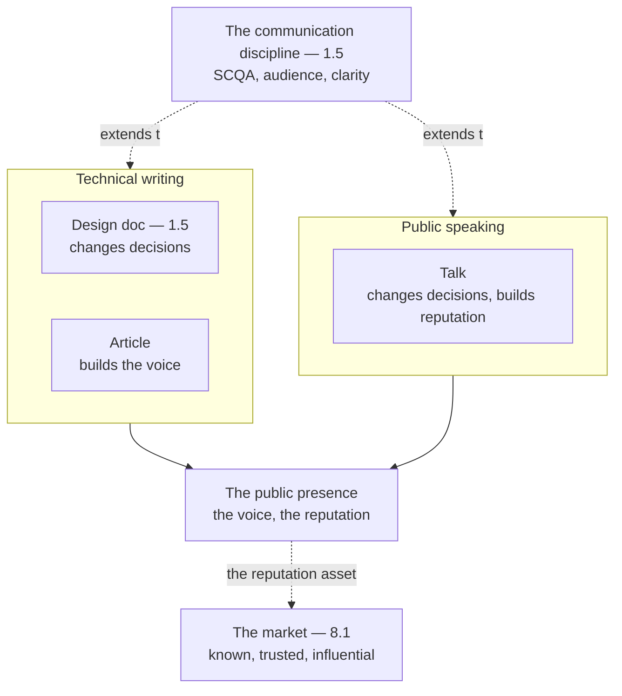

# Chapter 8.4 — Technical Writing & Public Speaking

| | |
|---|---|
| **Part** | 8 — Professional Excellence & Career Development |
| **Maturity level** | 4 — Architect |
| **Difficulty** | Intermediate |
| **Estimated study time** | 3 hours (reading 90 min, exercise 90 min) |
| **Prerequisites** | [1.5 Communicating Architecture](../part-1-professional-foundation/chapter-05-communicating-architecture.md); [8.2](chapter-02-architecture-portfolio.md) |

## Learning Objectives

After this chapter you will be able to:

1. Write design docs and articles that change decisions and build a public voice.
2. Give talks that change decisions and build the reputation.
3. Build a public presence (the writing, the speaking) that establishes the architect's reputation and voice.
4. Extend the communication discipline (1.5) into the public writing and speaking.

## Introduction

This chapter is the technical writing and public speaking that build the architect's reputation — the public voice that extends the communication discipline (1.5) beyond the individual system to the public presence. 1.5 built the architecture communication (the artifacts, the audiences); this chapter extends it to the *public* — the writing (the design docs, the articles) and the speaking (the talks) that change decisions and build the reputation, the public voice that is the architect's reputation asset.

The framing: **technical writing and public speaking build the architect's reputation and public voice** — the writing (the design docs that change decisions — 1.5, the articles that build the voice) and the speaking (the talks that change decisions and build the reputation), extending the communication discipline (1.5) to the public presence, and this chapter is how to build it.

## Business Motivation

The public voice is the architect's reputation asset — the writing and speaking that make the architect known, trusted, and influential beyond the immediate work. Without it: the architect is known only to the immediate colleagues (the un-public architect — the reputation local), and the influence is local (the immediate work); with it: the architect is known publicly (the public voice — the articles, the talks), and the influence is broad (the reputation, the community). The business case is the reputation one, in 8.1's market: the public voice is the architect's reputation asset (the writing and speaking — the public presence), which makes the architect known, trusted, and influential (the reputation — the market visibility, the opportunities, the community), and this chapter is how to build it — the public voice that establishes the architect's reputation beyond the immediate work.

## Theory

### Technical writing

The technical writing (1.5's communication, extended to the public):

- **The design doc** (1.5) — the design doc (1.5's communication — the SCQA, the clarity), the design doc that changes decisions (1.5 — the decision changed by the compelling doc); the design doc (the internal writing that changes decisions — 1.5).
- **The article** — the article (the public writing — the concept explained, the experience shared, the voice built), the article that builds the voice (the public writing — the reputation); the article (the public writing that builds the voice).
- **The writing discipline** (1.5) — the writing discipline (1.5's communication — the SCQA, the conclusion-first, the audience-matching, the clarity), the writing that communicates (1.5 — the compelling, the clear); the writing discipline (1.5, extended to the public).

### Public speaking

The public speaking (1.5's communication, spoken):

- **The talk** — the talk (the spoken communication — the concept explained, the experience shared, the reputation built), the talk that changes decisions and builds the reputation (the spoken — the reputation); the talk (the spoken presence that builds the reputation).
- **The speaking discipline** (1.5) — the speaking discipline (1.5's communication — the SCQA, the audience-matching, the clarity, the narrative), the talk that communicates (1.5 — the compelling, the clear, the narrative); the speaking discipline (1.5, spoken).
- **The reach** — the talk's reach (the audience — the conference, the community — the broad reach), the reputation built (the reach — the visibility); the reach (the broad reach — the reputation).

### The public presence

The public presence (the reputation asset):

- **The presence** — the public presence (the writing — the articles, the speaking — the talks, the contributions — the open work), the presence that establishes the reputation (the public voice — the reputation); the presence (the public voice — the reputation asset).
- **The voice** — the architect's voice (the perspective — the judgment shared — 1.1, the experience — the case studies — 8.2, the point of view), the voice that establishes the reputation (the distinctive voice — the reputation); the voice (the distinctive perspective — the reputation).
- **The community** — the community (the peers — the community engagement, the contributions — the giving), the community that amplifies the reputation (the community — the amplification); the community (the peers — the amplification — 8.7's mentoring).

## Architecture Perspective

Readings. **The writing and speaking extend the communication discipline** — the design doc (1.5 — changes decisions), the article (builds the voice), the talk (changes decisions, builds the reputation) — extending the communication discipline (1.5's SCQA, audience-matching, clarity) to the public (the public writing and speaking). **The public presence is the reputation asset** — the writing (the articles), the speaking (the talks), the contributions (the open work) building the public presence (the voice — the distinctive perspective, the reputation), the reputation asset (the public voice — 8.1's market visibility). **And the voice is the distinctive perspective** — the architect's voice (the judgment shared — 1.1, the experience — the case studies — 8.2, the point of view), the distinctive voice establishing the reputation (the perspective — the reputation), amplified by the community (the peers — 8.7).

## Real-world Example

This curriculum is itself a work of technical writing — the curriculum as the example of the technical writing (the writing that explains, teaches, builds the voice). Consider the curriculum's writing (the 79 chapters, the pattern language — 7.1, the case studies — 8.2): the writing discipline (1.5 — the SCQA, the conclusion-first, the audience-matching, the clarity — the compelling, clear chapters), the voice (the perspective — the judgment shared — 1.1, the experience — the recurring companies — the case studies, the point of view — the concepts-over-frameworks — 2.1), the reputation (the curriculum as the reputation asset — the public work). And the public presence (the curriculum as the public presence — the writing, the potential talks — 8.4): the presence establishing the reputation (the public voice — the curriculum), the voice (the distinctive perspective — the concepts-over-frameworks, the enterprise-architecture-for-GenAI), the community (the peers — the learners, the contributors — the community). The technical-writing note (the curriculum's framing): *"This curriculum is a work of technical writing — the writing that explains, teaches, builds the voice. The writing discipline (the SCQA, the conclusion-first, the audience-matching, the clarity — 1.5) makes the chapters compelling and clear. The voice (the perspective — the judgment shared, the experience — the recurring companies, the point of view — the concepts-over-frameworks) establishes the reputation. The public presence (the writing, the talks) is the reputation asset — the public voice that makes the architect known, trusted, influential. Technical writing and public speaking build the reputation — the public voice that extends the communication discipline (1.5) to the public presence, the architect's reputation beyond the immediate work."*

## Hands-on Exercise

**Build the public voice.** ~90 minutes. Writing and speaking practice.

1. **The article (35 min).** Write a short article (a concept explained, an experience shared — from your portfolio — 8.2), using the writing discipline (1.5 — the SCQA, the conclusion-first, the clarity). Build the voice (the perspective, the point of view).
2. **The design doc (20 min).** Write a design doc (a decision to change — 1.5's SCQA), the doc that changes the decision (1.5 — the compelling case).
3. **The talk outline (20 min).** Outline a talk (a concept or experience — the narrative, the SCQA — 1.5), the talk that changes decisions and builds the reputation (the spoken presence).
4. **The public-presence plan (15 min).** Plan the public presence: the writing (the articles), the speaking (the talks), the contributions, the voice (the distinctive perspective).

**Acceptance criteria:**
- [ ] An article written with the writing discipline (1.5 — SCQA, clarity), building the voice
- [ ] A design doc written to change a decision (1.5's SCQA)
- [ ] A talk outlined (the narrative, the SCQA — 1.5), the spoken presence
- [ ] The public-presence plan (the writing, speaking, contributions, voice)

## Enterprise Considerations

The public voice is shaped by the enterprise and the community. **The internal writing is the enterprise influence** (1.8): the internal writing (the design docs — 1.5, the ADRs — 1.4/6.3, the standards — 6.9) is the enterprise influence (1.8 — the writing that changes decisions, the influence), so the internal writing is the enterprise influence (1.8). **The external voice has confidentiality constraints** (4.14/8.2): the external voice (the articles, the talks) has confidentiality constraints (4.14/8.2 — the sensitive details), so the external voice anonymizes/abstracts (the judgment shared without the confidential details — 8.2's approach). **The public presence is a reputation-and-recruiting asset** (8.7): the public presence (the writing, the talks) is a reputation-and-recruiting asset (8.7 — the reputation attracting talent, the community), so the public presence connects to the recruiting (8.7's team-building). **And the community engagement is a give-back** (8.7): the community engagement (the writing, the talks, the mentoring — 8.7) is a give-back (8.7 — the giving, the community, the amplification), so the public voice connects to the mentoring (8.7's giving-back).

## Trade-offs

| Decision | Option A | Option B | Choose A when… | Choose B when… |
|----------|----------|----------|----------------|----------------|
| Communication | Writing + speaking (both) | Writing only | The range (the written depth + the spoken reach) | Writing-only limits the reach (the spoken adds) |
| Voice | Distinctive perspective (the point of view) | Neutral summary | Always — the distinctive voice builds the reputation | Never neutral-only; the un-distinctive voice (no reputation) |
| External content | Anonymize/abstract (the judgment) | Full details | Always where confidentiality applies (4.14/8.2) | Never the confidential details; the judgment abstracted |
| Discipline | The communication discipline (1.5) | Ad-hoc | Always — the compelling, clear writing/speaking (1.5) | Never ad-hoc; the un-disciplined communication (1.5) |

## Common Mistakes

1. **The un-disciplined writing** — the writing without the discipline (1.5 — the SCQA, the clarity); the writing discipline (1.5).
2. **The neutral voice** — the neutral summary (no distinctive perspective), no reputation; the distinctive voice (the point of view).
3. **The confidentiality breach** — the external content exposing the confidential details (4.14/8.2); the anonymize/abstract (8.2).
4. **The writing-only** — the writing without the speaking (the limited reach); the writing + speaking (the range).
5. **The un-built presence** — the public presence un-built (the local reputation); the public presence (the writing, speaking, contributions).
6. **The un-narrated talk** — the talk without the narrative (1.5 — the un-compelling); the narrative (the SCQA — 1.5).
7. **Ignoring the community** — the public voice without the community (no amplification); the community (the peers — 8.7).

## Best Practices

1. **Extend the communication discipline to the public** — the SCQA, the conclusion-first, the audience-matching, the clarity (1.5), the compelling and clear public writing/speaking.
2. **Build a distinctive voice** — the perspective (the judgment shared — 1.1, the experience — 8.2, the point of view), the distinctive voice that builds the reputation.
3. **Use both writing and speaking** — the articles (the depth), the talks (the reach), the range.
4. **Anonymize/abstract for confidentiality** — the judgment shared without the confidential details (4.14/8.2).
5. **Build the public presence** — the writing, the speaking, the contributions, the voice — the reputation asset.
6. **Narrate the talks** — the narrative (the SCQA — 1.5), the compelling spoken presence.
7. **Engage the community** — the peers (the community, the amplification — 8.7), the give-back (8.7).

## Architecture Checklist

For technical writing and public speaking:

- [ ] The writing uses the communication discipline (1.5 — SCQA, conclusion-first, clarity)
- [ ] The voice is distinctive (the perspective, the point of view)
- [ ] Both writing and speaking (the articles + the talks — the range)
- [ ] The external content anonymized/abstracted for confidentiality (4.14/8.2)
- [ ] The public presence built (the writing, speaking, contributions, voice — the reputation asset)
- [ ] The talks narrated (the SCQA — 1.5)
- [ ] The community engaged (the peers, the amplification — 8.7)

## Interview Questions

1. *"How do you build a reputation as a GenAI architect?"* — Strong answers give the public voice (the writing — the articles, the speaking — the talks, the contributions), the distinctive voice (the perspective — the judgment shared — 1.1, the point of view), the communication discipline (1.5), the public presence (the reputation asset — 8.1's market visibility).
2. *"How do you write a design doc that changes decisions?"* — Strong answers give the writing discipline (1.5 — the SCQA, the conclusion-first, the compelling case, the audience-matching), the design doc that changes the decision (the compelling case — 1.5), the clarity (1.5).
3. *"How do you handle confidentiality in public writing?"* — Strong answers give the anonymize/abstract (4.14/8.2 — the judgment shared without the confidential details, the fictional-companies approach), the judgment (the concepts, the decisions, the trade-offs) abstracted from the confidential specifics.
4. *"Why does public speaking matter for an architect?"* — Strong answers give the reputation (the talks building the reputation — 8.1's market visibility, the reach — the broad audience), the influence (the talks changing decisions — the spoken influence), the community (the peers — the amplification — 8.7), the public voice (the reputation asset).

## Further Reading

- 1.5 Communicating Architecture (the SCQA, the audience-artifact, the clarity) — the communication discipline this chapter extends to the public.
- Barbara Minto, *The Pyramid Principle* (re-linked from 1.5) — the SCQA and conclusion-first writing, for the public writing.
- The technical-writing and public-speaking references (the writing and speaking guides — read for the craft) — the writing and speaking craft.
- 8.2 Building an Architecture Portfolio (the content the writing/speaking presents) and 8.7 Mentoring & Building AI Teams (the community, the give-back) — the connected chapters.

## Summary

- **Technical writing and public speaking build the architect's reputation and public voice** — the writing (the design docs that change decisions — 1.5, the articles that build the voice) and the speaking (the talks that change decisions and build the reputation), extending the communication discipline (1.5) to the public presence.
- The **writing and speaking extend the communication discipline** (1.5's SCQA, conclusion-first, audience-matching, clarity) to the public (the compelling, clear public writing/speaking).
- The **public presence is the reputation asset** — the writing, the speaking, the contributions building the voice (the distinctive perspective — the judgment shared — 1.1, the point of view), the reputation asset (8.1's market visibility).
- The public content **anonymizes/abstracts for confidentiality** (4.14/8.2 — the judgment shared without the confidential details), and the public voice **engages the community** (the peers — the amplification — 8.7).
- The public voice makes the architect **known, trusted, and influential** beyond the immediate work (8.1's market) — the reputation asset. The consulting skills that turn the reputation into engagements are next: **consulting & client engagement skills** (8.5).

---

**Previous:** [Chapter 8.3 — Architecture Interviews](chapter-03-architecture-interviews.md) · **Next:** [Chapter 8.5 — Consulting & Client Engagement Skills](chapter-05-consulting-client-engagement.md) · **Related:** [1.5 Communicating Architecture](../part-1-professional-foundation/chapter-05-communicating-architecture.md), [8.2 Building an Architecture Portfolio](chapter-02-architecture-portfolio.md), [8.7 Mentoring & Building AI Teams](chapter-07-mentoring-building-teams.md)
