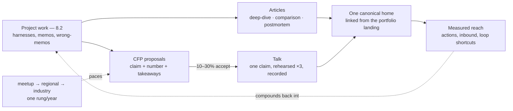

# Chapter 8.4 — Technical Writing & Public Speaking

| | |
|---|---|
| **Part** | 8 — Professional Excellence & Career Development |
| **Maturity level** | 4 — Architect |
| **Difficulty** | Intermediate |
| **Estimated study time** | 3 hours (reading 90 min, exercise 90 min) |
| **Prerequisites** | [1.5 Communicating Architecture](../part-1-professional-foundation/chapter-05-communicating-architecture.md); [8.2](chapter-02-architecture-portfolio.md) |

## Learning Objectives

After this chapter you will be able to:

1. Write the three article shapes that build an architect's public voice — the decision deep-dive, the measured comparison, and the postmortem — and know why these three outperform opinion pieces.
2. Get a conference talk accepted: what CFP reviewers actually select for, realistic acceptance rates, and the proposal structure that survives them.
3. Prepare and deliver a talk that changes what the audience does, using a preparation budget that respects your calendar.
4. Choose publication venues deliberately and measure reach in terms that matter (actions taken, opportunities generated), not vanity counts.

## Introduction

Chapter 1.5 taught communication that changes decisions inside a project. This chapter takes the same discipline public — articles and talks — for a specific professional reason: **public work is the only portfolio evidence that scales beyond people you meet.** A hiring manager, a conference committee, or a future client can encounter your thinking without you in the room. For someone entering the architect market with portfolio evidence rather than a famous title (the 8.2 situation), one well-read technical article does more screening work than a hundred outbound applications.

The bar is craft, not volume. One article a quarter, written to the standard below, beats weekly output at blog-spam quality — and the standard is teachable, which is what this chapter is for.

## Business Motivation

Put numbers on the vague word "reputation." A technical article that ranks for a real problem ("evaluating RAG faithfulness", "champion–challenger promotion for fraud models") draws a steady few hundred to few thousand qualified readers a month for years; among the readers of niche technical content are precisely the hiring managers and staff engineers who run loops. Speakers at even mid-size industry conferences report inbound recruiter and consulting contact measured in dozens per talk — and a recorded talk is a permanent depth-probe answer ("here's twenty minutes of me reasoning about exactly this"). On the inside track, writing pays sooner: architects who write well get their designs funded, because the funding meeting reads a document, not a diagram ([1.5](../part-1-professional-foundation/chapter-05-communicating-architecture.md), [6.10](../part-6-enterprise-architecture/chapter-10-tco-business-case.md)). The cost side is real and should be budgeted honestly: a publishable deep-dive takes 10–20 hours; a conference talk, 30–50 including rehearsal. This chapter's job is making those hours land.

## Theory

### The three article shapes that work

Opinion pieces by unknown authors convert nobody; the shapes that build authority all share one property — **they contain evidence the reader cannot get by having opinions**:

1. **The decision deep-dive.** One real decision from your work: the problem, the options, the measured or reasoned comparison, the choice, and what happened. Your 8.2 decision memos are drafts of these. The credibility rules follow the portfolio's: public-dataset numbers, or employer work cleared and anonymized with verifiable anchors. Anatomy: a title that names the decision ("Why we score fraud in-request but forecast in batch"), the conclusion in the first three sentences (readers of technical posts decide in ten seconds), the reasoning with numbers, the honest limits.
2. **The measured comparison.** Two approaches, one harness, real results: reranker on vs. off at measured latency and recall; GBT vs. logistic at the operating point; batch vs. streaming features at cost. These rank in search for years because practitioners search for exactly them, and they are portfolio evidence wearing an article's clothes — your project harnesses (P10, P21, P23) generate them almost for free.
3. **The postmortem.** What went wrong, why, what you now check first — the public form of the 8.2 wrong-memo. Rarest, most-read, most senior-reading of the three. The discipline: blame systems and assumptions, never people; state the cost honestly; end with the check, not the moral.

Venue strategy is simpler than it looks: your own domain or a developer platform for ownership and search longevity, cross-posted where your audience actually is; company engineering blogs trade reach for clearance friction. What matters is *one* canonical home you control, linked from the 8.2 landing page.

### Getting a talk accepted

CFP arithmetic, so you plan realistically: community and mid-size industry conferences accept roughly 10–30% of proposals; the big-name events run under 10%. Reviewers read hundreds of abstracts in batches, spending a minute or two on each, and they select for three things: **a specific claim** ("we cut our fraud model's decision latency 40% by moving feature computation — here's the architecture and the two failure modes" beats "lessons learned scaling AI"), **evidence it happened** (numbers in the abstract, even approximate ones), and **a fit to their audience's level** (read last year's program; pitch one notch deeper than its median). The proposal structure that survives: one-sentence claim, three sentences of what happened with a number in them, three bullets of what the audience takes home, two sentences on why you. First-time speakers: meetups and regional events accept at far friendlier rates, produce the recording that gets you into bigger CFPs, and are the correct first target — the ladder is meetup → regional → industry, typically one rung per year of consistent proposing.

### Preparing and delivering

The preparation budget that respects both quality and your calendar, for a 30-minute talk:

- **Structure (4–6 h):** one claim, stated in minute one and proven by minute twenty-five. The narrative spine is 1.5's SCQA at talk scale: the situation the audience recognizes, the complication they've felt, the question that names the talk, your answer with evidence. Cut everything that doesn't serve the claim; a 30-minute talk holds one idea well and three ideas badly.
- **Slides (6–10 h):** slides are evidence, not script — one point per slide, diagrams over prose, numbers readable from the back row. If a slide needs you to say "you probably can't read this," it needed to be two slides or zero.
- **Rehearsal (6–10 h):** three full run-throughs minimum, at least one recorded and watched (painful, non-negotiable — the gap between how you think you speak and the recording is the training data), one in front of a person. Timing discipline: write the minute-marks on your notes; the talk that overruns its slot is remembered for that.
- **Q&A preparation (2 h):** list the ten hardest questions, prepare honest answers, and rehearse the two you dread — which are usually depth probes, and the 8.3 honest-hand method answers them.

Delivery mechanics compress to three rules: slow down 20% from what feels natural; land the claim in the first ninety seconds (earn attention before context); and when you don't know, say so and offer to follow up — audiences forgive gaps and never forgive bluffing, exactly like interview loops.

## Architecture Perspective

The system's input is the portfolio work you already did — every article shape and every talk claim is a project artifact re-costumed, which is what makes a one-per-quarter cadence sustainable. The output loops back: public work generates the conversations and opportunities that become next year's material.

## Real-world Example

**Amara** (fictional), a data engineer targeting AI-architect roles, budgeted one public artifact per quarter for a year. Q1: a measured comparison from her P23-style forecasting build — "Seasonal-naïve beat my gradient boosting on a third of my series, and that's the finding" — posted on her own domain, 9,000 reads in six months, mostly from search. Q2: the postmortem of her leaked-feature incident (her wrong-memo, expanded), which a popular ML newsletter picked up; 30,000 reads, and two recruiter contacts citing it specifically. Q3: a CFP to a regional data-engineering conference with the Q1 numbers in the abstract — accepted (the same abstract, minus numbers, had been rejected twice the year before). She spent 38 logged hours on the talk, rehearsed three times, and finished ninety seconds under slot. Q4: the recording went on her landing page; her next loop's depth-probe round opened with the interviewer saying they'd watched it, and the round became a design conversation. Offer at the band's 70th percentile. Total public-work investment for the year: roughly 90 hours. Her own assessment afterward was the honest one: the *writing* was not the hard part — having measured material worth writing about was, and the portfolio work had already paid that cost.

## Hands-on Exercise

Produce one public artifact from work you have already done:

1. **Choose the shape** — comparison if you have a harness with results (P10/P21/P23 exercises qualify), postmortem if you have a wrong-memo, deep-dive otherwise.
2. **Write it (target 1,200–2,000 words):** conclusion in the first three sentences; every number traceable to your repo; limits stated; one diagram if it earns its space.
3. **Edit it against the checklist:** read aloud once (cadence bugs), cut 15% by length (there is always 15%), verify every claim against the source.
4. **Publish** to a home you control; link it from your 8.2 landing page.
5. **Draft the CFP version:** the same material as a 150-word proposal — claim, number, three takeaways, why you. File it against a real CFP deadline (community/regional tier) within the next quarter.

**Acceptance criteria:**
- [ ] The conclusion appears in the first three sentences, verifiably
- [ ] Every number links or traces to a public artifact
- [ ] The limits paragraph exists and names what your evidence doesn't show
- [ ] A person who read it can state your one claim back to you accurately
- [ ] The CFP draft exists with a named conference and deadline

## Enterprise Considerations

Employed writers need the clearance path: most companies require review for anything touching employer work, and the public-dataset rebuild route (8.2) exists partly to keep your public voice unblocked by it — know your policy before drafting, not after. Companies benefit from architects who write, and many will fund conference travel for accepted talks; ask before assuming otherwise. If you run a team: an engineering blog with real content is a hiring asset with measurable pipeline effect, but only under editorial standards — the three shapes and the evidence rule apply to corporate blogs doubly, because bad corporate content damages the brand that hosts it. Finally, the compliance edge: in regulated industries, public claims about your systems can carry disclosure implications ([6.11](../part-6-enterprise-architecture/chapter-11-model-risk-management.md)'s examination trail includes your conference slides); clear that with the same seriousness as the numbers.

## Trade-offs

| Decision | Option A | Option B | Choose A when… | Choose B when… |
|----------|----------|----------|----------------|----------------|
| Canonical home | Own domain | Platform (dev-blogging site) | You want search longevity and ownership; default | Audience lives there and you're optimizing early reach; cross-post to own domain anyway |
| Cadence | One artifact/quarter, edited hard | Weekly output | Always for authority-building; depth is the differentiator | You are optimizing platform algorithms, a different (valid) game this chapter doesn't play |
| First talk venue | Meetup/regional | Big-name industry CFP | First two years; the recording ladder matters more than the logo | You have a distinctive result *and* prior recordings; expect <10% odds regardless |
| Material source | Public-dataset project work | Cleared employer war story | Default; zero clearance friction, verifiable | The story is exceptional, clearance is real, and anchors exist (8.2's NDA rule) |

## Common Mistakes

1. **Opinion pieces first.** "My thoughts on AI agents" from an unknown author converts nobody; evidence shapes convert because they contain something scarce.
2. **Burying the conclusion.** Technical readers give you ten seconds; academic build-up loses them at paragraph two. Conclusion first is the 1.5 rule and it is not optional in public.
3. **Vague CFP abstracts.** "Lessons learned" without a claim or a number is the modal rejection; reviewers select specifics.
4. **Under-rehearsed talks.** The talk read off the slides, the demo that dies live, the overrun — all preventable with the rehearsal budget, all remembered longer than the content.
5. **Vanity metrics.** Ten thousand impressions that generate nothing versus nine hundred readers including two hiring managers: measure actions and inbound, not counts.
6. **Public numbers that violate the credibility rules.** The 8.2 discipline follows your material into public: fictional figures presented as experience are now permanently on the record.

## Best Practices

1. **Mine the portfolio, don't invent content** — every harness result, decision memo, and wrong-memo is an article draft; the material cost is already sunk.
2. **One claim per artifact** — articles and talks fail by addition; the second thesis halves the first one's retention.
3. **Conclusion first, limits always** — the two credibility moves that separate practitioner writing from content marketing.
4. **Climb the venue ladder deliberately** — meetup recording → regional CFP → industry CFP, one rung a year, each rung's artifact feeding the next proposal.
5. **Budget the hours in advance** (10–20 per article, 30–50 per talk) and hold the quarterly cadence — sustainability beats bursts.
6. **Watch your own recording every time** — the only feedback loop for delivery that doesn't require another person.

## Architecture Checklist

Before publishing any public artifact:

- [ ] Shape chosen deliberately (deep-dive / comparison / postmortem) and the one claim stated in a sentence
- [ ] Conclusion in the opening; limits paragraph present
- [ ] Every number traceable; credibility rules (8.2) honored; clearance obtained if employer-adjacent
- [ ] Edited: read aloud, cut 15%, claims verified
- [ ] Canonical home updated and linked from the portfolio landing
- [ ] For talks: three rehearsals done, one recorded and reviewed, timing marks written, ten-question Q&A prep done
- [ ] Reach measured by actions (inbound, citations, loop mentions), reviewed quarterly

## Interview Questions

1. *"I read your comparison post. Your reranker numbers — walk me through the harness."* — Strong answers treat the article as a portfolio door: straight to the repo, the measurement method, and the limits already stated in the post. This is why the traceability rule exists; the article that can't survive this question shouldn't have been published.
2. *"Why should an architect spend thirty hours on a conference talk instead of another project?"* — Strong answers reason about compounding and reach economics (the recording as a permanent depth-probe answer, inbound versus outbound), give the honest budget, and name when the trade goes the other way (portfolio still below the 8.2 bar — build first).
3. *"Your postmortem describes a serious mistake publicly. Wasn't that risky?"* — Strong answers distinguish blame-free system postmortems from self-incrimination, cite the observed market response to honest failure writing, and connect it to the same epistemic honesty the depth probe rewards.
4. *"Pitch me your next talk in ninety seconds."* — Strong answers deliver the CFP structure aloud: claim, number, three takeaways, why-me — because the pitch was written down and rehearsed, which is the entire method of this chapter demonstrated live.

## Further Reading

- *On Writing Well* (Zinsser) — the craft canon; the chapters on clutter and the lead are the 15%-cut and conclusion-first rules, argued better.
- Your target conferences' last two years of programs and accepted-talk recordings — the only reliable guide to what their reviewers select.
- The engineering blogs you actually finish reading — reverse-engineer why; your findings are your style guide.
- *The Official TED Guide to Public Speaking* (Anderson) — one-claim discipline and delivery mechanics, transferable to technical venues.

## Summary

- Public work is portfolio evidence that scales; for entrants it does more screening work per hour than any other professional activity, and its material cost is already sunk in your project work.
- Three shapes build authority — decision deep-dive, measured comparison, postmortem — because each contains evidence opinions can't fake; one per quarter, edited hard, beats volume.
- CFPs are won by specific claims with numbers, matched to the venue's level, climbed meetup-first; budget 30–50 hours per talk and rehearse three times, once recorded.
- The credibility rules follow you into public: traceable numbers, stated limits, cleared employer material — the article that can't survive its own depth probe shouldn't ship.
- Measure reach in actions (inbound, citations, loop shortcuts), and let each artifact feed the next: the memo becomes the post, the post becomes the CFP, the recording becomes the depth-probe answer.

---

**Previous:** [8.3 Architecture Interviews](chapter-03-architecture-interviews.md) · **Next:** [8.5 Consulting & Client Engagement Skills](chapter-05-consulting-client-engagement.md) · **Related:** [1.5 Communicating Architecture](../part-1-professional-foundation/chapter-05-communicating-architecture.md), [8.2 Portfolio](chapter-02-architecture-portfolio.md)
