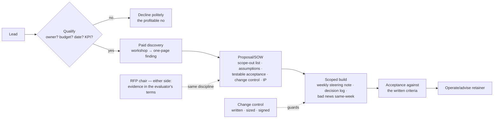

# Chapter 8.5 — Consulting & Client Engagement Skills

| | |
|---|---|
| **Part** | 8 — Professional Excellence & Career Development |
| **Maturity level** | 4 — Architect |
| **Difficulty** | Advanced |
| **Estimated study time** | 3 hours (reading 90 min, exercise 90 min) |
| **Prerequisites** | [1.3 Business Understanding](../part-1-professional-foundation/chapter-03-business-understanding.md); [1.6](../part-1-professional-foundation/chapter-06-requirements-stakeholders.md); [1.7](../part-1-professional-foundation/chapter-07-estimation.md) |

## Learning Objectives

After this chapter you will be able to:

1. Run discovery that finds the fundable problem: qualification, the stakeholder sweep, and the workshop that converts "we want AI" into a scoped engagement.
2. Scope and price engagements across the three models (time-and-materials, fixed-scope, value-linked), with current day-rate context and the risk math behind each.
3. Write the proposal and SOW sections that prevent the standard engagement failures: scope boundaries, assumptions, acceptance criteria, and change control.
4. Operate both sides of the RFP table — answering them credibly as a consultant, and running vendor evaluation properly as a buyer.

## Introduction

Every architect consults, whether or not the word appears in the title: an internal architect pitching a platform to skeptical product teams is running a consulting engagement with worse pricing leverage. This chapter teaches the commercial machinery around the technical work — discovery, scoping, pricing, proposals, delivery governance, and the RFP game from both chairs. The technical judgment is Parts 1–7; here we make it *buyable*.

One framing carries the chapter: **consulting failures are contract failures before they are technical failures.** The engagements that end in write-offs and resentment were mis-scoped, mis-assumed, or mis-governed in week zero — usually all three, usually visibly, in a proposal nobody read critically. The disciplines here are cheap; the failures they prevent are not.

## Business Motivation

The numbers on both sides of the table are large enough to justify the discipline. For the seller: AI-architecture consulting day rates as of early 2026 run roughly $1,500–3,000/day for independent senior architects in Western markets ($800–1,500 mid-market; more via top-tier firms, of which the consultant sees a fraction), and ₹40,000–1,20,000/day in the Indian market depending on client class — but realized income is rate × utilization, and unpriced scope creep is the silent utilization killer: a fixed-fee engagement that runs 40% over its estimate has quietly cut your effective rate by 29%. For the buyer: enterprises burn seven-figure sums annually on AI engagements whose deliverables were never acceptance-tested against written criteria, and the AI-specific failure — paying for a demo that cannot survive the demo-to-production multiplier ([4.11](../part-4-enterprise-genai-systems/chapter-11-cost-engineering.md)) — is now the modal disappointment in corporate AI spending. Both failure classes are prevented by the same documents, which is why this chapter teaches both chairs at once.

## Theory

### Discovery: finding the fundable problem

Discovery has two jobs — qualify the client, and find the real problem — and they run in the same conversations.

**Qualification** (before investing unpaid days): Is there a named budget owner? A decision date? A problem with a KPI attached, or only enthusiasm? Has anything been tried (a failed pilot is a *good* sign — budget existed and lessons exist)? The disqualifiers that save you weeks: "we're exploring AI" with no owner; procurement-led sourcing before problem definition; a stakeholder map where your sponsor has no budget authority ([1.6](../part-1-professional-foundation/chapter-06-requirements-stakeholders.md)'s power-interest grid, applied commercially).

**The real-problem dig**: clients present solutions ("we need a chatbot"), and the architect's first deliverable is converting the presented solution back into the underlying problem ([1.6](../part-1-professional-foundation/chapter-06-requirements-stakeholders.md)'s discipline). The reliable instrument is a structured discovery workshop, typically half a day: the KPI walk (which numbers hurt — [1.3](../part-1-professional-foundation/chapter-03-business-understanding.md)'s tree), the process walk (where the hours and errors actually accrue), the data reality check ([2.11](../part-2-artificial-intelligence/chapter-11-choosing-the-right-ai-approach.md)'s triage questions, asked early because they re-scope engagements), and the constraint sweep (regulatory posture, integration reality, political landscape). The workshop's output is one page: the problem as evidenced, three candidate scopes with rough sizes, and a recommendation. Priced or free, that page *is* discovery's deliverable — and writing it forces the qualification answer too.

### Scoping and pricing: the three models and their risk math

| Model | Who carries estimation risk | Right when | AI-specific caution |
|---|---|---|---|
| **Time & materials** | Client | Scope is genuinely unknowable yet (research phases, discovery, embedded advisory) | Cap it or lose the client's trust; uncapped T&M on AI exploration is how programs die |
| **Fixed scope/fee** | You | Scope is definable and you have reference-class data ([1.7](../part-1-professional-foundation/chapter-07-estimation.md)) to price the risk | AI outcomes are probabilistic: fix *deliverables* (a system meeting named eval thresholds on a named dataset), never fix *model quality on unseen data* |
| **Value-linked** | Shared | The KPI is measurable, attributable, and the client will share the measurement ([2.17](../part-2-artificial-intelligence/chapter-17-online-experimentation.md)'s counterfactual problem, now with your invoice attached) | Attribution disputes are the norm; use only with an agreed measurement design, and blend with a base fee |

The phase structure that manages AI uncertainty commercially: **paid discovery** (1–3 weeks, fixed, small) → **scoped build** (fixed or capped T&M against the discovery's page) → **operate/advise** (retainer). Each phase's output prices the next; the client buys certainty incrementally instead of pretending it exists up front. Anchor every estimate in [1.7](../part-1-professional-foundation/chapter-07-estimation.md)'s discipline — reference class, range not point, stated assumptions — because the proposal is where estimation malpractice becomes contractual.

### The proposal and SOW: the sections that prevent the failures

A proposal's job is to be *agreed with*, so it is short and front-loaded ([1.5](../part-1-professional-foundation/chapter-05-communicating-architecture.md)): the problem in the client's words, the approach in one page, and then the sections that do the legal-commercial work — the ones weak proposals skip:

- **Scope boundaries, stated negatively.** "Out of scope: data-quality remediation beyond the named tables; integration with systems not listed in Appendix A; model performance on data classes absent from the evaluation set." The out-list prevents more disputes than the in-list.
- **Assumptions with owners.** "Client provides API access to X by week 1; a data steward is available 4 h/week." Every assumption names who breaks it and what happens then (timeline slides day-for-day is the standard clause).
- **Acceptance criteria, testable.** The DoD discipline from the [projects](../../projects/README.md), contractualized: named eval thresholds on a named dataset, a runnable handover, documentation the client's engineer can operate from. If acceptance cannot be written testably, the scope isn't ready to fix — price that phase as T&M discovery instead.
- **Change control.** A one-paragraph mechanism: changes requested in writing, sized within five working days, signed before work. Boring, and the single highest-ROI paragraph in the document.
- **IP and data terms.** Who owns the delivered code and models; what you may reuse (your templates and harnesses — protect them); what touches client data and where it may run ([4.14](../part-4-enterprise-genai-systems/chapter-14-privacy-compliance-governance.md)'s processor reality, now in your contract).

**Delivery governance** keeps the signed document true: a weekly steering note (one page — done, next, risks, decisions needed, burn vs. budget), a decision log (ADRs travel well into client work), and the discipline of surfacing bad news at the week it happens. Consulting reputations are made in week eight, when the honest "the extraction accuracy is plateauing below threshold; here are three options with costs" note lands before the client discovers it themselves.

### The RFP game, from both chairs

**Answering RFPs (the seller's chair):** qualify hard before writing — RFPs with a wired incumbent (spec written around one vendor's language, timeline too short for real proposals) have single-digit win probability, and a thorough response costs 40–80 hours; the portfolio evidence of [8.2](chapter-02-architecture-portfolio.md) (runnable systems, named datasets) is disproportionately effective in RFP responses because most competitors submit slideware. **Running vendor evaluation (the buyer's chair)** is the same discipline mirrored, and it is an architect's job the market badly under-supplies: write the requirements before meeting vendors (or the first vendor writes them for you); demand evidence in your evaluation's terms — a proof-of-concept on *your* sampled data with *your* eval harness ([3.10](../part-3-core-building-blocks-of-genai/chapter-10-model-selection-benchmarking.md)'s private-evals rule, applied to vendors); score against weighted criteria agreed before demos (the [1.4](../part-1-professional-foundation/chapter-04-tradeoff-analysis.md) matrix, procurement edition); and check the exit — data export, model portability, contract terms at renewal ([6.10](../part-6-enterprise-architecture/chapter-10-tco-business-case.md)'s lock-in line). The vendor demo optimized to hide these questions is the vendor telling you the answers.

## Architecture Perspective

The pipeline's economics live in its gates: the qualification gate protects unpaid time, the discovery gate prices the build honestly, and change control protects the margin the estimate earned. Remove any gate and the engagement's risk silently transfers to whoever failed to write it down.

## Real-world Example

**Rafael** (fictional), an independent AI architect, took a mid-size logistics client's "we need an AI document assistant" inquiry. Qualification found a real owner (COO) and a dated trigger (a contract renewal requiring faster customs processing). The paid discovery week (fixed, $9K) ran the workshop and produced the one-pager: the presented chatbot was actually an extraction problem — 30 document types, but four types drove 70% of the manual hours; the KPI was processing time per shipment, baselined at 41 minutes. His proposal scoped a fixed-fee build ($86K, six weeks) around exactly those four types, with acceptance written testably: field-level extraction ≥95% on a 300-document golden set the *client's* team would label (an assumption with an owner and a day-for-day slip clause), a runnable handover, and everything else — including the other 26 document types — in the out-list. Week four delivered the bad-news note: one document type was plateauing at 91%; the note carried three options priced (accept with review-queue routing, extend two weeks at change-control rates, drop the type and reduce the fee). The client chose the review queue — and later told him that note was why the retainer ($6K/month, advisory) followed. Final measurements: 41 minutes → 12 for the four types, acceptance passed on the golden set, zero scope disputes. Rafael's own margin note: discovery and the out-list took nine hours to write and were worth more than any technical decision in the engagement.

## Hands-on Exercise

Run the commercial machinery against a realistic scenario — take any case study's Business Problem section (CS16 or CS49 fit well) and play the consultant:

1. **Qualification memo (20 min):** who is the budget owner, what is the trigger, what disqualifies this lead — invent plausibly, and defend the invented answers.
2. **Discovery plan (30 min):** the half-day workshop agenda, the five questions per session, and the one-page finding template you would fill.
3. **Proposal core (60 min):** write the four load-bearing sections for a phase-2 build — scope with an explicit out-list, assumptions with owners and slip clauses, testable acceptance criteria (dataset, thresholds, handover), and the change-control paragraph. Price it two ways: fixed fee (with your 1.7-style estimate and risk buffer shown) and capped T&M.
4. **The buyer flip (30 min):** now write the five weighted criteria and the PoC design you would demand *as the client* evaluating three vendors for the same problem.

**Acceptance criteria:**
- [ ] The out-list contains ≥4 items someone would plausibly have assumed was included
- [ ] Every assumption names its owner and its breach consequence
- [ ] Acceptance criteria are testable by a stranger (named data, named thresholds, runnable handover)
- [ ] The fixed price shows its estimate, buffer, and the reference class it leaned on
- [ ] The buyer flip's PoC uses the client's data and harness, not the vendor's demo

## Enterprise Considerations

Internal architects should run this chapter's machinery on internal engagements: a platform team that writes scope-out lists, testable acceptance, and weekly steering notes for its internal customers escapes the unbounded-obligation trap that burns platform teams out — and internal "pricing" (headcount commitments, chargeback — [7.9](../part-7-enterprise-ai-architecture-patterns/chapter-09-platform-multitenancy-patterns.md)) benefits from the same explicitness. On the procurement side, enterprises buying AI services should mandate the buyer-chair discipline as policy: requirements before vendor meetings, PoCs on sampled internal data with internal evals, weighted scoring signed before demos, exit terms reviewed at signature ([6.9](../part-6-enterprise-architecture/chapter-09-architecture-governance.md)'s governance applied to the supply side). And for consultancies: the acceptance-criteria discipline is also your defense — the engagement whose success was never testably defined is the engagement whose failure is negotiated against you.

## Trade-offs

| Decision | Option A | Option B | Choose A when… | Choose B when… |
|----------|----------|----------|----------------|----------------|
| Discovery | Paid, small, fixed | Free, as sales investment | Default — free discovery attracts unqualified buyers and devalues the finding | Strategic logo, tight competition, and you cap the investment explicitly |
| Pricing | Fixed fee with shown risk buffer | Capped T&M | Scope survived discovery and you have reference-class data | Genuine residual uncertainty; the cap keeps the client's trust |
| Bad-news channel | Immediate note with priced options | Fold into the next weekly steering note | Threshold risk, timeline impact, or anything the client could discover first | Minor variances already visible in the weekly note's risk line; escalating everything trains the client to ignore escalations |
| RFP response | Full response with portfolio evidence | Decline or minimal response | Qualified: no wired incumbent, real timeline, evaluable criteria | The spec reads like a vendor wrote it; spend the 60 hours on the pipeline instead |

## Common Mistakes

1. **Skipping qualification because the lead is exciting.** Unqualified engagements consume the calendar that qualified ones needed; the profitable "no" is a skill.
2. **Pricing the presented solution.** The chatbot the client asked for was an extraction pipeline; discovery exists because scoping the wrong problem is the most expensive estimate error available ([1.6](../part-1-professional-foundation/chapter-06-requirements-stakeholders.md)).
3. **Fixing model quality on unseen data.** "95% accuracy" without a named dataset and golden set is an uncollectable promise and an unwinnable dispute; fix deliverables and evaluation terms instead.
4. **The missing out-list.** Every scope dispute in an engagement's post-mortem traces to something both sides assumed differently and nobody wrote down.
5. **Assumptions without owners.** "Client provides data access" with no name and no slip clause converts the client's delay into your margin loss.
6. **Hiding the plateau.** The week-eight quiet-recovery gamble; when it fails, the write-off includes the relationship.
7. **Buying from the demo.** As the buyer: vendor demos are optimized artifacts ([3.10](../part-3-core-building-blocks-of-genai/chapter-10-model-selection-benchmarking.md)'s leaderboard lesson, commercially); evaluation on your data with your harness or it isn't evaluation.

## Best Practices

1. **Gate unpaid time with written qualification** — owner, budget, date, KPI; two minutes per lead, weeks saved per quarter.
2. **Sell certainty incrementally** — paid discovery → scoped build → retainer; each phase prices the next from evidence.
3. **Write the out-list first** — it is the proposal's hardest-working section and the cheapest dispute prevention in commerce.
4. **Contractualize the DoD discipline** — named datasets, thresholds, runnable handover; your project-template habits are literally the acceptance section.
5. **Send the weekly note whether or not it's good news** — one page: done, next, risks, decisions, burn. Retainers are built from week-eight honesty.
6. **Keep your reusable assets out of the client's IP** — harnesses, templates, checklists are your margin; name them in the IP clause.
7. **As buyer, evaluate like 3.10 selects models** — your data, your harness, weighted criteria signed before the first demo, exit terms checked at signature.

## Architecture Checklist

Before signing (either chair):

- [ ] Qualification documented: owner, budget signal, decision date, KPI
- [ ] Discovery finding exists as one page with evidence, not enthusiasm
- [ ] Scope has an explicit out-list; assumptions carry owners and breach consequences
- [ ] Acceptance criteria testable by a stranger; AI quality fixed only on named data
- [ ] Pricing model matched to residual uncertainty; fixed fees show their buffer
- [ ] Change control, IP terms, and data-handling terms present and read
- [ ] Delivery governance defined: steering cadence, decision log, escalation path
- [ ] (Buyer) Criteria weighted and signed pre-demo; PoC on own data; exit terms reviewed

## Interview Questions

1. *"A client asks for a customer-service chatbot. Walk me through your first two weeks."* — Strong answers qualify first, then run the discovery dig (KPI walk, process walk, data reality) and expect the problem to reframe; pricing appears only after the one-page finding. Weak answers start architecting the chatbot.
2. *"How do you price a fixed-fee engagement for a system whose model quality you can't guarantee?"* — Strong answers separate deliverables from outcomes: fix the system, the harness, and thresholds on a named golden set; show the estimate's buffer and reference class; name value-linked pricing's attribution trap.
3. *"Your extraction accuracy plateaus below the acceptance threshold in week four of six. What does the client hear from you, and when?"* — Strong answers send the same-week note with three priced options, and can say why the quiet-recovery gamble is a relationship-sized bet at engagement-sized odds.
4. *"You're the buyer: three vendors claim 98% accuracy on documents like yours. Design the evaluation."* — Strong answers demand PoCs on the buyer's sampled data with the buyer's harness and operating point, weighted criteria signed before demos, and an exit-terms review — and recognize the claim's meaninglessness without a named dataset (the curriculum's oldest rule, wearing a purchase order).

## Further Reading

- *The Trusted Advisor* (Maister, Green, Galford) — the relationship arc underneath every retainer; the trust equation is the chapter's soft half.
- *Million Dollar Consulting* (Weiss) — value-based pricing's strongest advocate; read critically against this chapter's attribution cautions.
- Your jurisdiction's standard consulting-agreement clauses (IP assignment, liability caps, data processing) — one hour with real contract language repays itself on the first signature.
- The [project template](../../templates/project-template.md)'s Definition of Done — the acceptance-criteria discipline this chapter contractualizes; you already practice it.

## Summary

- Consulting failures are contract failures first: qualification, discovery, the out-list, owned assumptions, testable acceptance, and change control prevent the disputes that technical excellence cannot.
- Price by phase — paid discovery, scoped build, retainer — matching the model (T&M, fixed, value-linked) to residual uncertainty, and never fix AI quality on unseen data.
- Day rates (early 2026: roughly $1,500–3,000 senior independent in Western markets; ₹40–120K in India) matter less than realized rate: scope creep and unqualified leads are the utilization killers.
- Delivery governance is a weekly one-page note and same-week bad news with priced options — the behavior retainers are made of.
- The RFP table has two chairs and one discipline: evidence in the evaluator's terms — runnable systems and named datasets when selling, your-data-your-harness PoCs when buying.

---

**Previous:** [8.4 Technical Writing & Public Speaking](chapter-04-technical-writing-speaking.md) · **Next:** [8.6 Staying Current Without Chasing Frameworks](chapter-06-staying-current.md) · **Related:** [1.6 Requirements & Stakeholders](../part-1-professional-foundation/chapter-06-requirements-stakeholders.md), [1.7 Estimation](../part-1-professional-foundation/chapter-07-estimation.md), [6.10 TCO & Business Case](../part-6-enterprise-architecture/chapter-10-tco-business-case.md)
