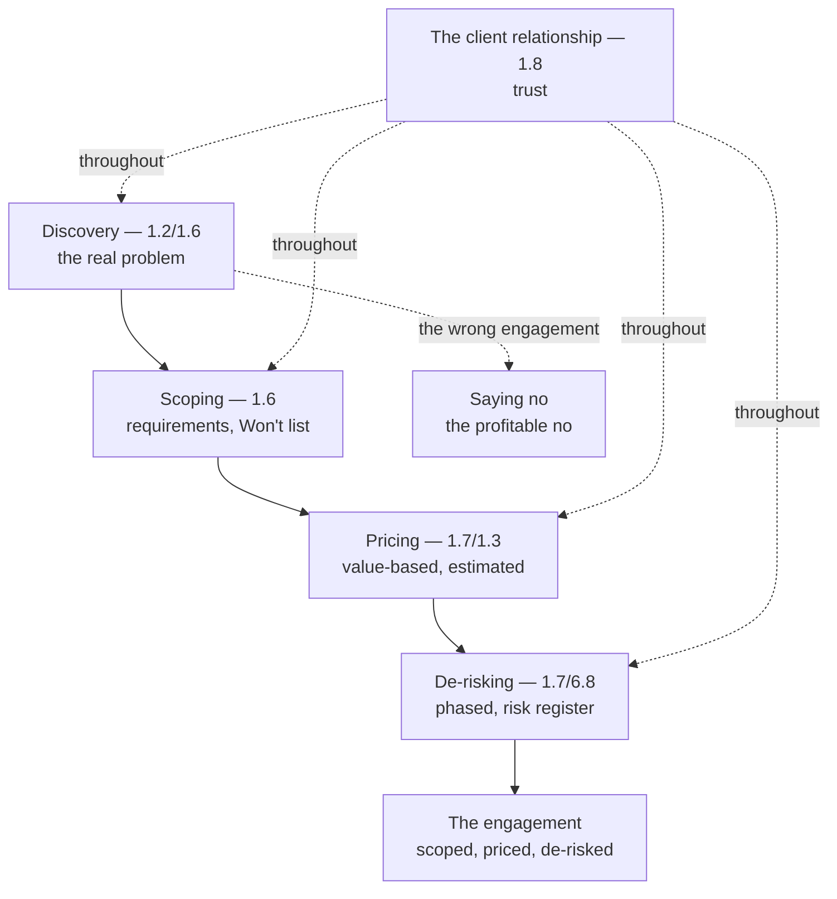

# Chapter 8.5 — Consulting & Client Engagement Skills

| | |
|---|---|
| **Part** | 8 — Professional Excellence & Career Development |
| **Maturity level** | 4 — Architect |
| **Difficulty** | Advanced |
| **Estimated study time** | 3 hours (reading 90 min, exercise 90 min) |
| **Prerequisites** | [1.3 Business Understanding](../part-1-professional-foundation/chapter-03-business-understanding.md); [1.6](../part-1-professional-foundation/chapter-06-requirements-stakeholders.md); [1.7](../part-1-professional-foundation/chapter-07-estimation.md) |

## Learning Objectives

After this chapter you will be able to:

1. Scope, price, and de-risk consulting engagements.
2. Run discovery that finds the client's real problem, not the stated one.
3. Say no profitably — declining the wrong engagement, scoping the right one.
4. Apply the architect's disciplines (business understanding, requirements, estimation) to the consulting engagement.

## Introduction

This chapter is consulting — the client-engagement skills that turn the architect's competence and reputation (8.4) into engagements. Consulting is the architect operating for clients (external or internal), and it needs skills beyond the technical: scoping, pricing, de-risking, discovery, and the discipline to say no. The architect's disciplines (the business understanding — 1.3, the requirements — 1.6, the estimation — 1.7) apply directly, and this chapter is the consulting application.

The framing: **consulting turns the architect's competence into engagements — scoped, priced, de-risked, and discovered** — the consulting skills (scoping, pricing, de-risking, discovery, saying no) that turn the architect's competence and reputation into engagements, applying the architect's disciplines (1.3/1.6/1.7), and this chapter is the consulting application.

## Business Motivation

Consulting is a career path and a skill set — the architect operating for clients (the consulting career, or the internal-consulting role). The consulting skills matter: the scoping (the engagement scoped — 1.6, the right problem), the pricing (the engagement priced — 1.7, the value), the de-risking (the engagement de-risked — 1.7, the phased), the discovery (the real problem found — 1.2/1.6), and the saying no (the wrong engagement declined). Without them: the engagement is mis-scoped (the wrong problem — 1.6), mis-priced (the value un-captured — 1.7), un-de-risked (the risk un-managed — 1.7), and the wrong engagements taken (the un-declined). With them: the engagement is scoped (the right problem), priced (the value), de-risked (the phased), and the right engagements taken. The business case is the consulting-career one: the consulting skills turn the architect's competence and reputation (8.4) into engagements (the scoped, priced, de-risked, discovered engagements), and this chapter is the consulting application — the skills that make the consulting career (or the internal-consulting role) work.

## Theory

### Scoping

The engagement scoping (1.6's requirements, consulting edition):

- **The scope** (1.6) — the engagement scope (the requirements — 1.6 — what the engagement delivers, the boundaries — 1.6's Won't list, what it doesn't); the scope (the requirements — 1.6, the boundaries — the Won't list).
- **The discovery-driven scope** (1.2/1.6) — the scope driven by discovery (1.2's design thinking, 1.6's elicitation — the real problem found, the scope from the real problem); the discovery-driven scope (the real problem — 1.2/1.6).
- **The scope management** — the scope managed (the scope creep prevented — 1.6's Won't list, the change process — the scope change), the scope managed (the Won't list — 1.6); the scope management (the creep prevented — 1.6).

### Pricing

The engagement pricing (1.7's estimation, 1.3's value):

- **The value-based pricing** (1.3) — the pricing based on the value (1.3 — the business value delivered — the value-based pricing, not the cost-plus), the value captured (1.3 — the value); the value-based pricing (the value — 1.3).
- **The estimation** (1.7) — the pricing informed by the estimation (1.7 — the effort, the TCO, the risk), the estimate (1.7 — the realistic); the estimation (the realistic estimate — 1.7).
- **The pricing model** — the pricing model (the fixed-price — the risk on the consultant, the time-and-materials — the risk on the client, the value-based — the value shared), the model matched to the engagement (the risk allocation — 1.4); the pricing model (the risk allocation).

### De-risking

The engagement de-risking (1.7's phased, 6.8's pilot-to-platform):

- **The phased de-risking** (1.7/6.8) — the engagement phased (1.7/6.8 — the pilot-to-platform, each phase converting risk into evidence — 1.7's cone, re-rating the remaining), the risk reduced (1.7/6.8 — the phased); the phased de-risking (the risk reduced — 1.7/6.8).
- **The risk management** (1.7) — the engagement risks managed (1.7 — the risk register, the risks tracked), the risk managed (1.7 — the register); the risk management (the register — 1.7).
- **The de-risking value** — the de-risking as value (the client's risk reduced — the value, the phased engagement the client trusts — the value); the de-risking value (the client's risk reduced).

### Discovery and saying no

The discovery and saying no:

- **The discovery** (1.2/1.6) — the discovery (1.2's design thinking, 1.6's elicitation — the real problem found, not the stated — 1.2's empathize/define), the real problem (1.2/1.6 — the discovery); the discovery (the real problem — 1.2/1.6).
- **The saying no** — the saying no (the wrong engagement declined — the un-scopeable, the un-valuable, the mis-fit), the profitable no (the wrong engagement declined — the focus on the right); the saying no (the wrong declined — the profitable no).
- **The client relationship** (1.8) — the client relationship (1.8's trust, the influence — 1.8, the relationship — the trust), the relationship (1.8 — the trust); the client relationship (the trust — 1.8).

## Architecture Perspective

Readings. **Consulting applies the architect's disciplines** — the discovery (1.2's design thinking, 1.6's elicitation — the real problem), the scoping (1.6's requirements, the Won't list), the pricing (1.7's estimation, 1.3's value), the de-risking (1.7/6.8's phased) — the architect's disciplines applied to the consulting engagement. **The discovery finds the real problem** — the discovery (1.2/1.6 — the real problem, not the stated — 1.2's empathize/define), the scope from the real problem (the discovery-driven scope — 1.2/1.6), the foundation (the real problem — the right engagement). **And saying no is profitable** — the wrong engagement declined (the un-scopeable, the un-valuable, the mis-fit), the profitable no (the focus on the right — the wrong declined), the client relationship (1.8's trust — the trust maintained by the honest no).

## Real-world Example

The consulting skills are illustrated by the architect engaging a client on a GenAI initiative. Consider an architect consulting on a client's GenAI initiative (the client's stated problem — "build us an AI agent"): the discovery (1.2/1.6 — the real problem found — the client's actual problem was a workflow, not an agent — 3.8/7.10's agent-for-everything, the discovery finding the real problem — 1.2's empathize/define); the scoping (1.6 — the engagement scoped to the real problem — the workflow, the Won't list — the agent excluded); the pricing (1.7/1.3 — the value-based pricing — the value delivered, the estimation — 1.7's realistic); the de-risking (1.7/6.8 — the phased — the pilot-to-platform, the risk register — 1.7); and the saying no (the wrong engagement — the agent-for-everything — declined, the right engagement — the workflow — scoped — the profitable no). The consulting note: *"Consulting applies the architect's disciplines to the client engagement. The discovery (the real problem — the client wanted an agent, but the real problem was a workflow — 3.8/7.10) — the discovery finding the real problem, not the stated. The scoping (the requirements, the Won't list — the agent excluded). The pricing (the value-based, the estimated — 1.7/1.3). The de-risking (the phased, the risk register — 1.7/6.8). The saying no (the wrong engagement — the agent-for-everything — declined, the right — the workflow — scoped — the profitable no). Consulting turns the architect's competence into engagements — scoped, priced, de-risked, discovered — applying the disciplines (the business understanding, the requirements, the estimation) to the client engagement, with the trust (1.8) throughout."*

## Hands-on Exercise

**Scope a consulting engagement.** ~90 minutes. For a GenAI consulting scenario (real or hypothetical).

1. **The discovery (30 min).** For a client's stated problem (e.g., "build us an AI chatbot"), run the discovery (1.2/1.6 — the empathize/define, the elicitation), finding the real problem (not the stated). Document the real problem.
2. **The scope (20 min).** Scope the engagement (1.6 — the requirements, the boundaries — the Won't list) from the real problem. Document the scope.
3. **The pricing and de-risking (25 min).** Price the engagement (1.7/1.3 — the value-based, the estimation), and de-risk it (1.7/6.8 — the phased, the risk register). Document the pricing and the phasing.
4. **The saying no (15 min).** Identify what in the stated problem you'd say no to (the wrong engagement — the un-scopeable/un-valuable/mis-fit), and how (the profitable no, the trust maintained — 1.8).

**Acceptance criteria:**
- [ ] The discovery finds the real problem (1.2/1.6 — not the stated)
- [ ] The engagement scoped from the real problem (1.6 — requirements, Won't list)
- [ ] The engagement priced (value-based, estimated — 1.7/1.3) and de-risked (phased, risk register — 1.7/6.8)
- [ ] The saying no identified (the wrong engagement declined, the trust maintained — 1.8)

## Enterprise Considerations

Consulting applies to the enterprise's internal-consulting and the external-consulting careers. **The internal consulting is the architect's role** (8.1): the enterprise architect's internal consulting (the advising the business, the internal engagements — the internal-consulting role) is the architect's role (8.1 — the architect advising), so the internal consulting is the architect's role (8.1). **The external consulting is a career** (8.1): the external consulting (the consulting career — the client engagements) is a career (8.1's variant — the consulting), so the external consulting is a career path (8.1). **The procurement and contracts are the enterprise's** (6.10): the consulting engagement (the pricing, the contract) runs through the enterprise's procurement and contracts (6.10 — the procurement, the vendor management), so the consulting connects to the procurement (6.10). **And the client relationship is a trust-and-reputation asset** (8.4/1.8): the client relationship (1.8's trust, the reputation — 8.4) is a trust-and-reputation asset (the repeat engagements, the referrals — the reputation), so the consulting connects to the reputation (8.4).

## Trade-offs

| Decision | Option A | Option B | Choose A when… | Choose B when… |
|----------|----------|----------|----------------|----------------|
| Problem | The real problem (discovery) | The stated problem | Always — the discovery finds the real problem (1.2/1.6) | Never the stated-only; the un-discovered real problem (1.2/1.6) |
| Pricing | Value-based | Cost-plus | The value is capturable (1.3 — the value shared) | Cost-plus where the value is un-clear — but value-based captures the value (1.3) |
| Engagement | Phased (de-risked) | Big-bang | Always — the phased de-risks (1.7/6.8) | Never big-bang; the un-de-risked engagement (1.7) |
| Wrong engagement | Say no (profitable) | Take it | Always — the profitable no (the focus on the right) | Never the wrong engagement; the mis-fit (the profitable no) |

## Common Mistakes

1. **The stated-problem engagement** — the engagement on the stated problem, not the real (the un-discovered — 1.2/1.6); the discovery (the real problem — 1.2/1.6).
2. **The mis-scoped engagement** — the engagement un-scoped (the scope creep — 1.6); the scoping (the requirements, the Won't list — 1.6).
3. **The mis-priced engagement** — the engagement mis-priced (the value un-captured — 1.7/1.3); the value-based pricing (1.3), the estimation (1.7).
4. **The un-de-risked engagement** — the engagement un-de-risked (the risk un-managed — 1.7); the phased de-risking (1.7/6.8), the risk register (1.7).
5. **Taking the wrong engagement** — the wrong engagement taken (the un-declined — the mis-fit); the saying no (the profitable no).
6. **The un-managed scope** — the scope creep (the un-managed — 1.6); the scope management (the Won't list, the change process — 1.6).
7. **The un-trusted relationship** — the client relationship un-trusted (1.8); the trust (1.8 — the relationship).

## Best Practices

1. **Discover the real problem** — the discovery (1.2's design thinking, 1.6's elicitation — the real problem, not the stated), the foundation.
2. **Scope from the real problem** — the requirements (1.6), the boundaries (the Won't list — 1.6), the scope from the real problem.
3. **Price on the value** — the value-based pricing (1.3 — the value), the estimation (1.7 — the realistic).
4. **De-risk with phasing** — the phased (1.7/6.8 — the pilot-to-platform), the risk register (1.7).
5. **Say no profitably** — the wrong engagement declined (the un-scopeable/un-valuable/mis-fit), the focus on the right.
6. **Manage the scope** — the Won't list (1.6), the change process (the scope creep prevented).
7. **Build the client relationship** — the trust (1.8), the reputation (8.4 — the repeat engagements, the referrals).

## Architecture Checklist

For the consulting engagement:

- [ ] The discovery finds the real problem (1.2/1.6 — not the stated)
- [ ] The engagement scoped from the real problem (1.6 — requirements, Won't list)
- [ ] The engagement priced on the value (1.3), informed by the estimation (1.7)
- [ ] The engagement de-risked (phased — 1.7/6.8, the risk register — 1.7)
- [ ] The wrong engagements declined (the profitable no)
- [ ] The scope managed (the Won't list, the change process — 1.6)
- [ ] The client relationship built on trust (1.8), the reputation (8.4)

## Interview Questions

1. *"How do you scope a consulting engagement?"* — Strong answers give the discovery-driven scope (1.2/1.6 — the real problem found via the discovery, the scope from the real problem, the requirements — 1.6, the boundaries — the Won't list — 1.6), the scope managed (the creep prevented — 1.6).
2. *"How do you price a GenAI consulting engagement?"* — Strong answers give the value-based pricing (1.3 — the value delivered, not the cost-plus), informed by the estimation (1.7 — the realistic effort/TCO/risk), the pricing model matched to the risk allocation (fixed/T&M/value-based — 1.4).
3. *"How do you find the client's real problem?"* — Strong answers give the discovery (1.2's design thinking — the empathize/define, 1.6's elicitation — the real problem, not the stated), the example (the client wants an agent, the real problem is a workflow — 3.8/7.10), the discovery-driven engagement.
4. *"When and how do you say no to an engagement?"* — Strong answers give the profitable no (the wrong engagement — the un-scopeable/un-valuable/mis-fit — declined, the focus on the right), the trust maintained (1.8 — the honest no builds the trust), the profitable no (the right engagements — the focus).

## Further Reading

- 1.3 Business Understanding (the value), 1.6 Requirements Engineering (the scoping, the discovery), 1.7 Estimation (the pricing, the de-risking), 1.2 Systems Thinking (the design-thinking discovery) — the disciplines the consulting applies.
- The consulting literature (the consulting-skills references — the scoping, pricing, discovery, saying no) — the consulting craft.
- 6.8 Legacy Modernization & AI Adoption (the pilot-to-platform de-risking) and 6.10 TCO & the Business Case (the value, the procurement) — the connected chapters.
- 1.8 Leadership & Influence (the trust, the client relationship) — the relationship discipline.

## Summary

- **Consulting turns the architect's competence into engagements** — scoped (1.6), priced (1.7/1.3), de-risked (1.7/6.8), and discovered (1.2/1.6) — applying the architect's disciplines to the client engagement.
- The **discovery finds the real problem** (1.2's design thinking, 1.6's elicitation — the real problem, not the stated — the example of the agent-that-was-really-a-workflow — 3.8/7.10), the discovery-driven scope.
- The engagement is **priced on the value** (1.3 — value-based, not cost-plus), informed by the estimation (1.7), and **de-risked with phasing** (1.7/6.8's pilot-to-platform, the risk register).
- **Saying no is profitable** — the wrong engagement declined (the un-scopeable/un-valuable/mis-fit), the focus on the right, the trust maintained (1.8's honest no).
- Consulting applies the architect's disciplines (business understanding — 1.3, requirements — 1.6, estimation — 1.7) with the client relationship (1.8's trust) throughout — the consulting career (or internal-consulting role — 8.1) built on the architect's competence. Staying current to keep the competence fresh is next: **staying current without chasing frameworks** (8.6).

---

**Previous:** [Chapter 8.4 — Technical Writing & Public Speaking](chapter-04-technical-writing-speaking.md) · **Next:** [Chapter 8.6 — Staying Current Without Chasing Frameworks](chapter-06-staying-current.md) · **Related:** [1.3 Business Understanding](../part-1-professional-foundation/chapter-03-business-understanding.md), [1.6 Requirements Engineering](../part-1-professional-foundation/chapter-06-requirements-stakeholders.md), [1.7 Estimation](../part-1-professional-foundation/chapter-07-estimation.md)
