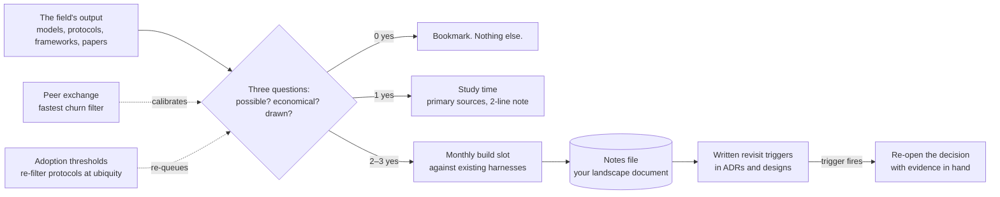

# Chapter 8.6 — Staying Current Without Chasing Frameworks

| | |
|---|---|
| **Part** | 8 — Professional Excellence & Career Development |
| **Maturity level** | 4 — Architect |
| **Difficulty** | Intermediate |
| **Estimated study time** | 2–3 hours (reading 90 min, exercise 60 min) |
| **Prerequisites** | [2.1 The AI Landscape](../part-2-artificial-intelligence/chapter-01-ai-landscape.md); [3.10](../part-3-core-building-blocks-of-genai/chapter-10-model-selection-benchmarking.md) |

## Learning Objectives

After this chapter you will be able to:

1. Apply the three-question filter that separates concept shifts (which change your architecture) from framework churn (which changes your `import` statements).
2. Run a sustainable information diet — roughly three hours a week, from named source classes — that keeps an architect current without becoming a full-time reader.
3. Maintain the build cadence and re-evaluation triggers that keep judgment attached to reality as the field moves.
4. Run the filter honestly on live cases, including ones where this curriculum itself was slow.

## Introduction

The AI field produces more novelty per quarter than any architect can absorb, and the punishment for filtering badly runs in both directions. Chase everything and you become a survey of abandoned frameworks; filter too aggressively and you wake up defending an architecture the field moved past. This chapter is the discipline for filtering well — and it practices what it preaches by running the filter on recent history, including a case where the conservative instinct this curriculum teaches produced a wrong call. Staying current is not a virtue of temperament; it is a process with a time budget, source hygiene, and written revisit triggers, exactly like every other architecture concern in this book.

## Business Motivation

Both failure modes carry price tags. Chasing: a team that rebuilt its orchestration layer on each year's fashionable framework paid the migration tax repeatedly — industry postmortems of framework-hopping teams routinely attribute 15–25% of engineering capacity to self-inflicted migration work, none of it visible in any feature. Ossifying: an architect who missed the reasoning-model shift (below) in 2025 kept designing chain-of-thought scaffolding and multi-call verification pipelines that the new model class did natively, at different economics — proposals priced 2–5× over the achievable, and lost credibility when a competitor's design came in under. The asymmetry worth knowing: churn-chasing costs are paid continuously and visibly; ossification costs arrive suddenly, in a lost deal or a failed review, and are attributed to you personally. Three disciplined hours a week is the insurance premium against both, and it is among the cheapest line items in a professional's calendar.

## Theory

### The filter: three questions

For any new thing — model class, protocol, framework, technique — ask:

1. **Does it change what is *possible*?** New capability class (a model that plans reliably, context that got 10× cheaper, a modality that works now) → concept shift. New packaging of existing capability → churn.
2. **Does it change what is *economical*?** Order-of-magnitude cost or latency moves redraw the [2.11](../part-2-artificial-intelligence/chapter-11-choosing-the-right-ai-approach.md) ladder's rungs even when capability is unchanged. Price cuts within a tier are procurement news, not architecture news.
3. **Does it change what you would *draw*?** If your container diagram, your trade-off tables, or your triage answers change, it is architectural. If only the box's vendor label changes, it is not.

One "yes" earns study time; two or more earn hands-on time and a written note. Zero yeses earns a bookmark and nothing else, whatever the volume of discourse around it.

**The filter on history** (calibration cases): transformers vs. RNNs — yes/yes/yes, the canonical shift ([2.5](../part-2-artificial-intelligence/chapter-05-transformer-architecture.md)). LangChain vs. its successors — no/no/no: orchestration frameworks repackage control flow you could always write; [ADR-0001](../../adr/ADR-0001-concepts-over-frameworks.md)'s bet, correct to date. Vector databases 2021–2024 — capability no, economics briefly yes, drawing no: a component war inside one box; the concept ([3.5](../part-3-core-building-blocks-of-genai/chapter-05-embeddings-semantic-search.md)) outlived every market-share chart.

**The filter on live cases (early 2026):**

- **Reasoning / inference-time-compute models: shift.** Yes on capability (planning and multi-step reliability moved a class), yes on economics (thinking tokens billed as output invert prompt-heavy cost intuitions; latency becomes variable and budgetable), yes on drawing (verification scaffolding shrinks; the model-selection axis gains a reasoning-budget dimension that [3.10](../part-3-core-building-blocks-of-genai/chapter-10-model-selection-benchmarking.md)'s procedure must now include). An architect who filtered this as vendor noise in 2025 mis-priced a year of designs.
- **MCP and agent-interoperability protocols: a shift this curriculum initially filtered as churn — the honest correction.** Question 1 is arguably no (tool calling existed). But question 3 turned yes as adoption compounded: a standard protocol boundary creates *governance surfaces* — tool registries, permission models, supply-chain review of third-party servers ([security checklist](../../checklists/security-checklist.md)) — and enterprise architecture is made of exactly such boundaries. The lesson generalizes: **protocols earn re-filtering at adoption thresholds even when they add no capability**, because ubiquity itself changes what you must draw. An earlier edition of this curriculum dismissed MCP in a footnote; the filter, honestly run a year later, disagrees.
- **Small/edge language models: economics-led shift in progress.** Capability per parameter keeps climbing; when the on-device rung becomes viable for your workload class, sovereignty and latency designs redraw ([2.16](../part-2-artificial-intelligence/chapter-16-perception-systems.md)'s edge logic extends to language). Watch with a named trigger, not continuously.

### The information diet: three hours, five source classes

Volume is the enemy; source hygiene is the defense. The weekly budget that sustains, by source class rather than by name (names churn too):

| Class | Weekly time | What it's for |
|---|---|---|
| **Primary releases** — model cards, provider changelogs and pricing pages, papers behind headline claims | 60 min | The only sources that constrain speculation; pricing pages are architecture documents ([1.7](../part-1-professional-foundation/chapter-07-estimation.md)) |
| **Practitioner engineering blogs** — teams reporting measured production results | 45 min | The reality check on claims; measured beats announced |
| **One curated aggregator** you have validated for taste | 30 min | Coverage insurance; exactly one, or the diet becomes discourse |
| **Peer conversation** — a standing exchange with 2–3 practitioners you trust | 30 min | The fastest churn filter available; "did this survive contact with your production?" |
| **The discourse** (social feeds, hot takes) | ≤15 min, optional | Sentiment sensing only; nothing here earns build time without a primary source behind it |

Two rules make the diet compound. **Write a two-line note on anything that passes the filter** (what changed, what it would redraw) — a year of these is your personal landscape document, and the raw material for [8.4](chapter-04-technical-writing-speaking.md)'s articles. **Let one strong claim per month drive a small experiment** — which is the next section.

### The build cadence and written triggers

Judgment decays faster than knowledge: you can *know* about reasoning models and still misprice them if you have never watched one burn thinking tokens against your own eval set. The cadence: **one small build a month** — an afternoon to two days, always against something you already have (rerun a P10-class eval suite on the new model class; point the P23 backtest at a time-series foundation model; wire one MCP server into a sandboxed tool loop and read its permission surface). The existing-harness rule is what makes the cadence cheap: you are measuring novelty against known baselines, not building from zero ([3.10](../part-3-core-building-blocks-of-genai/chapter-10-model-selection-benchmarking.md)'s private-evals discipline, applied to your own currency).

And the closing loop: **every consequential design carries a written revisit trigger** ([ADR](../../templates/adr-template.md) discipline, [2.11](../part-2-artificial-intelligence/chapter-11-choosing-the-right-ai-approach.md)'s date-stamped verdicts) — "revisit the buy decision when a generic model passes 95% on our holdout" ([2.16](../part-2-artificial-intelligence/chapter-16-perception-systems.md)'s Ironvale clause), "re-run the tiering bake-off when a model class changes the reasoning-cost curve." Staying current is not re-litigating everything continuously; it is having named, in writing, what would change your mind — and then noticing when it happens.

## Architecture Perspective

The system is a funnel with a memory: most novelty exits at the bookmark stage, the filter's survivors get measured against your own baselines, and the notes-plus-triggers store is what converts three weekly hours into decisions that reopen themselves at the right time. The adoption-threshold loop is the MCP lesson, institutionalized.

## Real-world Example

**Lena** (fictional), a platform architect at a healthcare software firm, ran this system through 2025's reasoning-model wave. Her filter note in March (two lines, as prescribed): "reasoning models — yes/yes/yes; our clinical-summary verification pipeline (two extra model calls per summary) may be native now; April build slot." The April build: four hours re-running her existing faithfulness eval suite (a P10-descendant) against a reasoning-class model with the verification calls *removed* — quality held within noise, per-summary cost dropped 31%, but p95 latency doubled and, worse, *varied* 4× run-to-run. Her two-line follow-up: "adopt for batch summaries now; interactive lane blocked on latency variance; revisit trigger: variance under 1.5× or an SLA-priced reasoning tier." She shipped the batch migration in May (a real 31% on that lane's bill), and — because the trigger was written — reopened the interactive question in September when provider-side changes moved the variance, instead of either jumping in April or forgetting by fall. Her team lead's review note captured the method's value better than the savings did: "Lena's April memo was four hours of work and it made three later decisions trivial." The counterfactual colleagues existed at the same firm: one had rebuilt the pipeline on a new agent framework that spring (filter score: zero yeses; migration cost, six weeks; capability delta, none), and one was still pricing verification pipelines into proposals in October.

## Hands-on Exercise

Install the system, sized to one hour of setup and three hours a week of operation:

1. **Run the filter retroactively (30 min):** take the last three AI developments you spent real attention on; score each against the three questions in writing. At least one will score zero — name what that attention cost.
2. **Design your diet (15 min):** pick your five sources — one per class — and put the weekly hours in your actual calendar. Delete (not demote: delete) two sources the exercise reveals as discourse.
3. **Write your first two-line notes (15 min):** run the filter on reasoning models and on MCP *for your context* — your systems, your drawings. Your conclusions may differ from this chapter's; the filter, not the conclusion, is the skill.
4. **Book the build slot:** one calendar block this month, against an existing harness of yours, targeting your highest-scoring filter survivor. Write the two-line result note afterward.
5. **Add one revisit trigger** to a real current design (or a portfolio project's ADR): the named observation that would reopen the decision.

**Acceptance criteria:**
- [ ] Three retroactive filter scores written; the zero-score's cost named
- [ ] Diet on the calendar; two sources deleted
- [ ] Two live filter notes written for *your* context, each ≤2 lines + a consequence
- [ ] Build slot booked against a named existing harness
- [ ] One revisit trigger added to a real ADR, specific enough that a stranger could notice it firing

## Enterprise Considerations

At team scale, currency is an architecture concern with an owner: rotate a lightweight radar duty (one person, one hour, a shared two-line-notes file) rather than assuming osmosis; convert the monthly build slot into a team ritual with a demo (the cheapest internal training that exists); and encode the adoption-threshold rule into governance — protocols and standards get re-filtered at ubiquity milestones, on the calendar, so the MCP-class miss can't hide in anyone's priors ([6.9](../part-6-enterprise-architecture/chapter-09-architecture-governance.md)'s enabling shape). Vendor-driven currency deserves explicit distrust hygiene: provider roadmap briefings are marketing with an NDA on top; the pricing page and the changelog are the honest documents, and your own harness is the only benchmark that owes you nothing ([3.10](../part-3-core-building-blocks-of-genai/chapter-10-model-selection-benchmarking.md)). Budget reality: the three weekly hours and the monthly build slot are, for a team of eight, roughly 2% of capacity — write it into the plan or it will be the first thing delivery pressure deletes, and the deletion's cost will arrive as an ossification surprise with someone's name on it.

## Trade-offs

| Decision | Option A | Option B | Choose A when… | Choose B when… |
|----------|----------|----------|----------------|----------------|
| Filter posture | Conservative (demand two yeses for build time) | Aggressive early adoption | Default for production estates; churn tax is continuous | A capability shift lands squarely on your differentiator; then move fast *with* the harness |
| Diet breadth | Five sources, ruthlessly few | Broad monitoring | Always for individuals; attention is the scarce asset | You hold an explicit radar role for an organization, with hours budgeted for it |
| Build slot target | Filter's highest scorer | The loud thing stakeholders keep asking about | The slot is scarce and the filter has a clear winner | Executive questions about the loud thing are imminent — a measured answer beats a filtered silence, and it usually takes one afternoon |
| Protocol adoption | Wait for the ubiquity threshold | Adopt at announcement | Standards with network effects and no capability delta — most of them | You are placing a deliberate early bet and pricing the re-work if the standard loses |

## Common Mistakes

1. **Filtering by volume of discourse.** Loudness measures marketing budgets and controversy, not architectural significance; the three questions don't have a loudness term.
2. **Reading without building.** Knowledge of the new model class plus untouched intuitions equals confidently wrong pricing; the monthly slot exists because judgment is a muscle, not a cache.
3. **The permanent verdict.** "MCP is plumbing" was a defensible 2024 filter result and a wrong 2026 one; verdicts without revisit triggers become identity, and identity doesn't update.
4. **Diet creep.** The sixth source, the second aggregator, the "just fifteen more minutes" of discourse — attention leaks until the primary-source hour is the one that gets cut.
5. **Notes in your head.** Unwritten filter results can't be reviewed, can't be handed to a team, and silently rewrite themselves to have always been right.
6. **Confusing procurement news with architecture news.** A price cut within a tier changes a spreadsheet; only order-of-magnitude moves change the ladder ([2.11](../part-2-artificial-intelligence/chapter-11-choosing-the-right-ai-approach.md)).

## Best Practices

1. **Score in writing, two lines, every time** — the filter's value is the accumulating notes file, not any single verdict.
2. **Anchor builds to existing harnesses** — your eval suites and backtests make novelty measurable in an afternoon; that cheapness is what makes the cadence survivable.
3. **Name the trigger in the ADR while the decision is fresh** — future-you will not re-derive what would have changed present-you's mind.
4. **Re-filter protocols at adoption milestones** — capability-free standards still redraw governance surfaces at ubiquity; put the milestone check on the calendar.
5. **Keep one deliberate contrarian bet visible** — a filter that never disagrees with the discourse in either direction isn't filtering; review the bet annually with evidence.
6. **Audit the diet quarterly** — sources decay; the aggregator that was signal in spring is a content farm by winter.

## Architecture Checklist

For your currency system (review quarterly):

- [ ] The three-question filter applied in writing to anything that got more than an hour of attention
- [ ] Diet: five named sources, one per class, hours actually on the calendar
- [ ] Monthly build slot executed, against an existing harness, with a two-line result note
- [ ] Notes file alive and reviewed; last quarter's verdicts re-checked against what happened
- [ ] Every consequential design ADR carries a revisit trigger specific enough to notice firing
- [ ] Protocol/standard adoption milestones calendared for re-filtering
- [ ] At least one currency-driven decision (adopt, defer, or drop) made on evidence this quarter

## Interview Questions

1. *"How do you decide what new AI developments to invest time in?"* — Strong answers produce a *system*: filter questions, a time-budgeted diet, builds against existing baselines, written triggers. Weak answers name newsletters.
2. *"Tell me about something you correctly ignored, and something you were late on."* — Strong answers have both, with the filter scores and what the miss taught (the both-directions honesty is the senior tell; candidates with only correct calls are editing).
3. *"Reasoning-heavy models: what did they actually change for a system you know well?"* — Strong answers are concrete about all three filter axes — capability, the thinking-token economics, and what got deleted from the drawing (verification scaffolding, retry loops) — ideally with measured before/after from their own harness.
4. *"A protocol adds no new capability but everyone is adopting it. Architecture concern or not?"* — Strong answers know ubiquity itself redraws governance surfaces (registries, permissions, supply chains) and name the adoption-threshold rule; the answer "no capability, no concern" is the exact miss this decade keeps punishing.

## Further Reading

- Provider changelogs, model cards, and pricing pages for the two or three platforms you actually run — the primary sources this chapter keeps insisting on; read them like architecture documents.
- *Technology Strategy Patterns* (Hewitt) — the mapping and horizon vocabulary for reasoning about when to move, useful beyond its examples.
- The M-competition literature trail (2.13's Further Reading) — a worked, decades-long case study in claims meeting measurement, and the habit of mind this chapter generalizes.
- Your own notes file, twelve months from now — the only reading on this list personalized to your judgment; write it and it will teach you where your filter runs hot or cold.

## Summary

- Filter with three questions — does it change what's possible, what's economical, what you'd draw — and let the yes-count allocate attention: bookmark, study, or build.
- Run a five-source, three-hour diet anchored on primary sources, with peer exchange as the fastest churn filter and discourse capped at sentiment-sensing.
- Keep judgment attached to reality with a monthly build against your existing harnesses, and close every verdict with a written revisit trigger — including adoption-threshold re-filters for capability-free protocols, the lesson of the MCP miss.
- Both failure modes are priced: churn-chasing taxes capacity continuously; ossification arrives as a lost deal with your name on it. Three hours a week is the premium for both.
- The system's output is a notes file that becomes your landscape document, your article pipeline, and the evidence trail that your filter — not your temperament — is making the calls.

---

**Previous:** [8.5 Consulting & Client Engagement Skills](chapter-05-consulting-client-engagement.md) · **Next:** [8.7 Mentoring & Building AI Teams](chapter-07-mentoring-building-teams.md) · **Related:** [2.11 Choosing the Right AI Approach](../part-2-artificial-intelligence/chapter-11-choosing-the-right-ai-approach.md), [3.10 Model Selection & Benchmarking](../part-3-core-building-blocks-of-genai/chapter-10-model-selection-benchmarking.md), [ADR-0001](../../adr/ADR-0001-concepts-over-frameworks.md)
