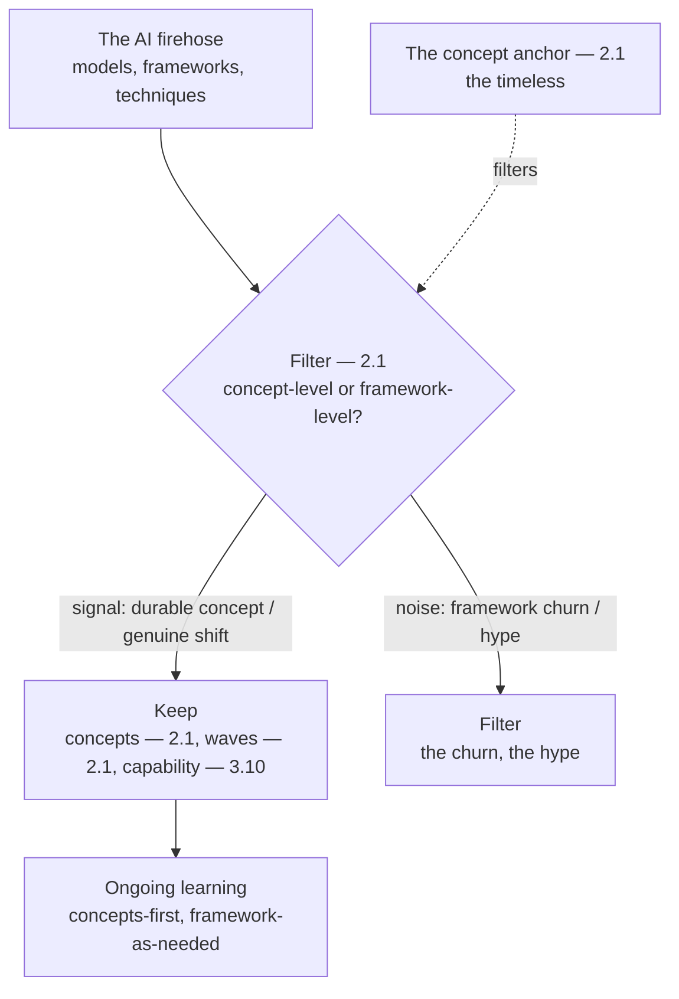

# Chapter 8.6 — Staying Current Without Chasing Frameworks

| | |
|---|---|
| **Part** | 8 — Professional Excellence & Career Development |
| **Maturity level** | 4 — Architect |
| **Difficulty** | Intermediate |
| **Estimated study time** | 2–3 hours (reading 90 min, exercise 60 min) |
| **Prerequisites** | [2.1 The AI Landscape](../part-2-artificial-intelligence/chapter-01-ai-landscape.md); [3.10](../part-3-core-building-blocks-of-genai/chapter-10-model-selection-benchmarking.md) |

## Learning Objectives

After this chapter you will be able to:

1. Build a filtering system for the AI firehose anchored in timeless concepts.
2. Distinguish the signal (the durable concepts, the genuine shifts) from the noise (the framework churn, the hype).
3. Stay current on the genuine developments without chasing every framework.
4. Apply the concepts-over-frameworks discipline (the curriculum's) to the ongoing learning.

## Introduction

This chapter is staying current — the discipline of keeping the competence fresh without drowning in the AI firehose. The AI field moves fast (the models, the frameworks, the techniques — the constant churn), and the architect must stay current — but *current* means the genuine developments (the durable concepts, the real shifts), not the framework churn (the hype, the noise). The curriculum's founding discipline (concepts over frameworks — 2.1, ADR-0001) is the filtering discipline, and this chapter applies it to the ongoing learning.

The framing: **stay current on the timeless concepts and genuine shifts, not the framework churn** — the filtering system anchored in the timeless concepts (2.1's concepts-over-frameworks — the durable), distinguishing the signal (the durable concepts, the genuine shifts) from the noise (the framework churn, the hype), and this chapter is how to build it.

## Business Motivation

Staying current is the architect's ongoing competence — the freshness that keeps the judgment relevant. But the AI firehose is a trap: chasing every framework (the framework churn — the constant new frameworks) wastes the architect's time (the churn — the un-durable) and misses the genuine developments (the signal lost in the noise). The filtering discipline matters: the signal (the durable concepts, the genuine shifts — 2.1's wave-level shifts) kept, the noise (the framework churn, the hype) filtered. Without it: the architect drowns (the firehose — the churn) or falls behind (the genuine shifts missed); with it: the architect stays current (the genuine developments) without drowning (the churn filtered). The business case is the ongoing-competence one: staying current on the genuine developments (the durable concepts, the genuine shifts) keeps the architect's judgment relevant (the freshness — the competence), and the filtering discipline (the concepts-over-frameworks — 2.1) is how — the signal kept, the noise filtered, and this chapter is how to build it.

## Theory

### The signal vs. the noise

The signal-vs-noise distinction (2.1's wave-level vs. framework churn):

- **The signal** — the signal (the durable concepts — the timeless — 2.1, the genuine shifts — the wave-level — 2.1, the real capability changes — 3.10's model improvements); the signal (the durable concepts, the genuine shifts — 2.1).
- **The noise** — the noise (the framework churn — the constant new frameworks — 2.1's tools-not-timeless, the hype — 2.1's hype cycle, the un-durable); the noise (the framework churn, the hype — 2.1).
- **The distinction** — the distinction (the durable vs. the churning — 2.1's concepts-over-frameworks, the wave-level vs. the framework-level — 2.1), the signal from the noise (the durable — the signal, the churning — the noise); the distinction (the concepts-over-frameworks — 2.1).

### The filtering system

The filtering system (anchored in the concepts):

- **The concept anchor** (2.1) — the filtering anchored in the concepts (2.1's timeless — the durable concepts as the anchor, the new development filtered by "is this a concept-level shift or a framework-level churn?"), the concept anchor (2.1 — the durable); the concept anchor (the concepts — 2.1).
- **The wave-level attention** (2.1) — the attention on the wave-level (2.1's waves — the genuine shifts, the wave-level developments — the transformer-level shifts — 2.5, not the framework-level churn), the wave-level (2.1 — the genuine shifts); the wave-level attention (the waves — 2.1).
- **The evaluation** (3.10) — the development evaluated (3.10's model selection — the genuine capability changes evaluated, the eval-driven — 3.10, not the hype-driven), the evaluation (3.10 — the eval-driven); the evaluation (the eval-driven — 3.10).

### The ongoing learning

The ongoing learning (the concepts-over-frameworks discipline):

- **The concepts-first learning** (2.1) — the learning concepts-first (2.1 — the durable concepts learned deeply, the frameworks as the illustrations — 2.1's frameworks-as-examples), the concepts-first (2.1 — the durable); the concepts-first learning (the concepts — 2.1).
- **The framework-as-needed** — the frameworks learned as needed (the framework when it's needed — the just-in-time, not the chase-every-framework), the framework-as-needed (the just-in-time); the framework-as-needed (the just-in-time).
- **The genuine-shift tracking** — the genuine shifts tracked (the wave-level developments — 2.1, the model capability changes — 3.10, the real shifts), the genuine shifts (the wave-level — 2.1); the genuine-shift tracking (the wave-level — 2.1).

## Architecture Perspective

Readings. **The filtering is anchored in the concepts** — the AI firehose filtered by the concept anchor (2.1's timeless — the concept-level shift vs. the framework-level churn), the signal (the durable concepts, the genuine shifts — 2.1) kept, the noise (the framework churn, the hype — 2.1) filtered — the concepts-over-frameworks (2.1) as the filtering discipline. **The attention is on the wave-level** — the genuine shifts (2.1's waves — the wave-level developments, the transformer-level — 2.5, the model capability — 3.10), the wave-level attention (the genuine shifts — 2.1), not the framework-level churn. **And the learning is concepts-first, framework-as-needed** — the concepts learned deeply (2.1's concepts-first — the durable), the frameworks learned just-in-time (the framework-as-needed — not the chase-every-framework), the genuine shifts tracked (the wave-level — 2.1) — the concepts-over-frameworks discipline (2.1) applied to the ongoing learning.

## Real-world Example

The curriculum embodies the staying-current discipline — the concepts-over-frameworks (2.1's ADR-0001) as the filtering discipline. Consider the curriculum's discipline (2.1's ADR-0001 — concepts over frameworks): the concepts-first (the durable concepts — the retrieval, the grounding, the evaluation, the trade-offs — the timeless — 2.1), the frameworks-as-illustrations (the frameworks in the examples/exercises — 2.1, not the subject), the wave-level attention (the genuine shifts — the transformer — 2.5, the foundation models — 2.1, not the framework churn). And the filtering (the curriculum's durability — the concepts durable, the frameworks churning): the curriculum built on the concepts (the durable — the timeless), surviving the framework churn (the concepts durable — 2.1's ADR-0001 rationale). The staying-current note (the curriculum's framing, echoing 2.1's ADR-0001): *"The curriculum embodies the staying-current discipline — concepts over frameworks (2.1's ADR-0001). The concepts-first (the durable concepts — retrieval, grounding, evaluation, trade-offs — the timeless), the frameworks-as-illustrations (in the examples, not the subject), the wave-level attention (the genuine shifts — the transformer, the foundation models — not the framework churn). The filtering is anchored in the concepts — the AI firehose filtered by 'is this a concept-level shift or a framework-level churn?', the signal (the durable, the genuine) kept, the noise (the churn, the hype) filtered. Stay current on the timeless concepts and the genuine shifts, not the framework churn — the concepts-over-frameworks discipline (2.1) as the filtering, the architect's ongoing competence kept fresh without drowning in the firehose."*

## Hands-on Exercise

**Build the filtering system.** ~60 minutes. For your ongoing learning.

1. **The signal-vs-noise audit (20 min).** Audit your current AI-learning inputs (the sources — the newsletters, the feeds, the frameworks): which are signal (the durable concepts, the genuine shifts — 2.1), which are noise (the framework churn, the hype — 2.1)? Categorize.
2. **The concept anchor (15 min).** List the durable concepts (the timeless — 2.1, the curriculum's — retrieval, grounding, evaluation, trade-offs, etc.) that anchor your filtering. Use them to filter (the concept-level vs. framework-level).
3. **The wave-level tracking (15 min).** Identify how you'll track the genuine shifts (the wave-level — 2.1, the model capability — 3.10 — the sources for the genuine developments, the eval-driven — 3.10), the wave-level tracking.
4. **The learning plan (10 min).** Plan the ongoing learning: the concepts-first (the durable — deeply), the frameworks-as-needed (the just-in-time), the genuine-shift tracking (the wave-level).

**Acceptance criteria:**
- [ ] The signal-vs-noise audit categorizes the inputs (durable vs. churning — 2.1)
- [ ] The concept anchor listed (the durable concepts — 2.1), used to filter
- [ ] The wave-level tracking identified (the genuine shifts — 2.1/3.10, the eval-driven)
- [ ] The learning plan (concepts-first, framework-as-needed, genuine-shift tracking)

## Enterprise Considerations

Staying current is shaped by the enterprise's technology strategy and the market. **The enterprise's technology radar is a filtering aid** (6.1): the enterprise's technology radar/strategy (6.1 — the technology assessment, the standards) is a filtering aid (the enterprise's assessment of the genuine developments), so the staying-current connects to the technology strategy (6.1). **The model-selection re-evaluation is the genuine-shift tracking** (3.10): the model-selection re-evaluation triggers (3.10 — the new model generation, the capability change) are the genuine-shift tracking (3.10 — the eval-driven capability tracking), so the staying-current connects to the model selection (3.10). **The framework-lock-in is the anti-pattern** (7.10): the framework-chasing (the framework churn — 8.6) connects to the framework-lock-in anti-pattern (7.10 — the framework adopted by hype), so the staying-current avoids the framework-lock-in (7.10). **And the staying-current is a team-and-culture concern** (8.7): the staying-current (the team's learning — 8.7's team-building) is a team-and-culture concern (8.7 — the team's ongoing learning, the culture), so the staying-current connects to the team-building (8.7).

## Trade-offs

| Decision | Option A | Option B | Choose A when… | Choose B when… |
|----------|----------|----------|----------------|----------------|
| Learning focus | Concepts-first (durable) | Frameworks-first (churning) | Always — the concepts durable (2.1) | Never frameworks-first; the churn (2.1) |
| Framework learning | As-needed (just-in-time) | Chase-every | The framework is needed (the just-in-time) | Never chase-every; the churn (2.1) |
| Attention | Wave-level (genuine shifts) | Framework-level (churn) | Always — the wave-level genuine (2.1) | Never framework-level-only; the churn (2.1) |
| Development evaluation | Eval-driven (3.10) | Hype-driven | Always — the eval-driven (3.10) | Never hype-driven; the un-evaluated (3.10) |

## Common Mistakes

1. **Chasing every framework** — the framework churn chased (2.1's tools-not-timeless — the churn); the framework-as-needed (the just-in-time).
2. **The frameworks-first learning** — the learning frameworks-first (the churning), not concepts-first (the durable — 2.1); the concepts-first (2.1).
3. **The hype-driven** — the developments hype-driven (the un-evaluated — 3.10); the eval-driven (3.10).
4. **Missing the genuine shifts** — the genuine shifts missed (the wave-level un-tracked — 2.1); the wave-level tracking (2.1).
5. **Drowning in the firehose** — the firehose un-filtered (the churn — the drowning); the filtering (the concept anchor — 2.1).
6. **The framework-lock-in** — the framework adopted by hype (7.10's framework-lock-in); the concepts-over-frameworks (2.1), the framework evaluated (1.4).
7. **The un-anchored filtering** — the filtering un-anchored (no concept anchor — 2.1); the concept anchor (the durable concepts — 2.1).

## Best Practices

1. **Learn concepts-first** — the durable concepts (2.1's timeless — deeply), the frameworks as the illustrations (2.1).
2. **Learn frameworks as-needed** — the just-in-time (the framework when needed), not the chase-every.
3. **Anchor the filtering in the concepts** — the concept anchor (2.1 — the concept-level vs. framework-level), the signal from the noise.
4. **Attend to the wave-level** — the genuine shifts (2.1's waves — the wave-level, the model capability — 3.10), not the framework churn.
5. **Evaluate the developments** — the eval-driven (3.10 — the genuine capability, the eval), not the hype-driven.
6. **Track the genuine shifts** — the wave-level developments (2.1), the model capability (3.10), the eval-driven.
7. **Avoid the framework-lock-in** — the framework evaluated (1.4), not adopted by hype (7.10).

## Architecture Checklist

For staying current:

- [ ] The learning is concepts-first (the durable — 2.1), the frameworks as-needed (the just-in-time)
- [ ] The filtering anchored in the concepts (the concept anchor — 2.1, the concept-level vs. framework-level)
- [ ] The attention on the wave-level (the genuine shifts — 2.1, the model capability — 3.10)
- [ ] The developments eval-driven (3.10 — not hype-driven)
- [ ] The genuine shifts tracked (the wave-level — 2.1/3.10)
- [ ] The framework-lock-in avoided (the framework evaluated — 1.4/7.10)
- [ ] The staying-current connected to the technology strategy (6.1) and the team (8.7)

## Interview Questions

1. *"How do you stay current in a fast-moving field without chasing every framework?"* — Strong answers give the concepts-over-frameworks (2.1 — the concepts-first, the durable, the frameworks-as-needed), the filtering anchored in the concepts (the concept-level vs. framework-level), the wave-level attention (the genuine shifts — 2.1), the eval-driven (3.10) — the signal from the noise.
2. *"How do you distinguish a genuine AI development from hype?"* — Strong answers give the signal-vs-noise (2.1 — the wave-level genuine shift vs. the framework-level churn, the durable concept vs. the hype), the eval-driven (3.10 — the genuine capability evaluated, not the hype-driven), the concept anchor (2.1 — the durable).
3. *"How do you decide whether to learn a new framework?"* — Strong answers give the framework-as-needed (the just-in-time — the framework when it's needed, not the chase-every), the framework evaluated (1.4 — the trade-off, the lock-in — 7.10), the concepts-first (2.1 — the framework as the illustration of the concept).
4. *"What's your filtering system for the AI firehose?"* — Strong answers give the concept anchor (2.1 — the durable concepts as the anchor, the concept-level vs. framework-level filter), the wave-level tracking (the genuine shifts — 2.1), the eval-driven (3.10), the concepts-first learning (2.1) — the filtering discipline.

## Further Reading

- 2.1 The AI Landscape (the waves, the hype cycle, the concepts-over-frameworks) and the [ADR-0001](../../adr/ADR-0001-concepts-over-frameworks.md) — the concepts-over-frameworks discipline this chapter applies to the ongoing learning.
- 3.10 Model Selection (the eval-driven, the re-evaluation triggers) — the genuine-shift tracking.
- Rich Sutton, *The Bitter Lesson* (re-linked from 2.1) — the durable direction (scale-plus-learning), the signal.
- 7.10 Anti-patterns (the framework-lock-in) and 8.7 Mentoring & Building AI Teams (the team's learning) — the connected chapters.

## Summary

- **Stay current on the timeless concepts and genuine shifts, not the framework churn** — the filtering anchored in the timeless concepts (2.1's concepts-over-frameworks — the durable), distinguishing the signal (the durable concepts, the genuine shifts) from the noise (the framework churn, the hype).
- The **filtering is anchored in the concepts** (2.1's concept anchor — the concept-level shift vs. the framework-level churn), the signal kept, the noise filtered — the concepts-over-frameworks (2.1) as the filtering discipline.
- The **attention is on the wave-level** (2.1's waves — the genuine shifts, the model capability — 3.10, the eval-driven — 3.10), not the framework-level churn.
- The **learning is concepts-first, framework-as-needed** — the concepts learned deeply (2.1's concepts-first — the durable), the frameworks learned just-in-time (not the chase-every), the genuine shifts tracked (the wave-level — 2.1).
- The staying-current discipline is the **curriculum's founding discipline** (2.1's ADR-0001, concepts over frameworks) applied to the ongoing learning — the architect's competence kept fresh without drowning in the firehose. Growing others through mentoring and team-building is next: **mentoring & building AI teams** (8.7).

---

**Previous:** [Chapter 8.5 — Consulting & Client Engagement Skills](chapter-05-consulting-client-engagement.md) · **Next:** [Chapter 8.7 — Mentoring & Building AI Teams](chapter-07-mentoring-building-teams.md) · **Related:** [2.1 The AI Landscape](../part-2-artificial-intelligence/chapter-01-ai-landscape.md), [3.10 Model Selection](../part-3-core-building-blocks-of-genai/chapter-10-model-selection-benchmarking.md), [ADR-0001 Concepts over Frameworks](../../adr/ADR-0001-concepts-over-frameworks.md)
