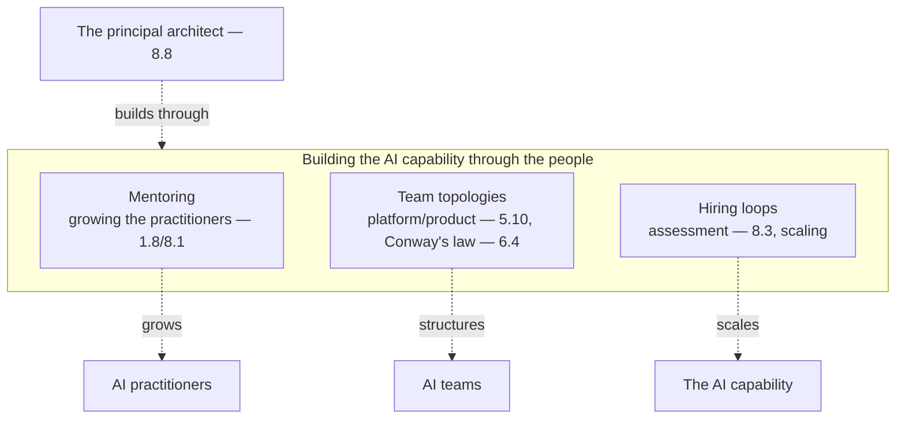

# Chapter 8.7 — Mentoring & Building AI Teams

| | |
|---|---|
| **Part** | 8 — Professional Excellence & Career Development |
| **Maturity level** | 5 — Principal Architect |
| **Difficulty** | Advanced |
| **Estimated study time** | 3 hours (reading 90 min, exercise 90 min) |
| **Prerequisites** | [1.8 Leadership & Influence](../part-1-professional-foundation/chapter-08-leadership-influence.md); [5.10](../part-5-cloud-infrastructure-platform/chapter-10-iac-platform-engineering.md) |

## Learning Objectives

After this chapter you will be able to:

1. Grow engineers into AI practitioners: the mentoring that builds the AI capability.
2. Design team topologies for AI work: the platform/product split, the roles, the structure.
3. Design hiring loops for AI roles: the assessment, the interview loops, the scaling.
4. Build the AI capability of the organization through the people (the mentoring, the teams, the hiring).

## Introduction

This chapter is mentoring and team-building — the Level-5 (Principal) work of growing the AI capability through the people. 8.1-8.6 built the individual architect's career; this chapter is the principal architect building *others* — the mentoring that grows engineers into AI practitioners, the team topologies that structure the AI work, and the hiring that scales the capability. This is the leadership scope (the organization's capability — the people), the principal architect's work (8.8).

The framing: **build the AI capability through the people — the mentoring, the team topologies, the hiring** — the principal work of growing the AI capability through the people (the mentoring — growing the practitioners, the team topologies — structuring the work, the hiring — scaling the capability), and this chapter is how.

## Business Motivation

The AI capability is a people capability — the organization's AI capability built through the people (the practitioners, the teams). The mentoring-and-team-building matters: the AI-capable practitioners are scarce (8.1's scarcity), so growing them (the mentoring — 8.7), structuring them (the team topologies — 5.10/8.7), and hiring them (the hiring loops — 8.7) is how the organization builds the AI capability. Without it: the AI capability is un-built (the practitioners un-grown, the teams un-structured, the hiring un-scaled); with it: the AI capability is built (the practitioners grown, the teams structured, the hiring scaled). The business case is the capability one: the AI capability is built through the people (the mentoring, the teams, the hiring), and the principal architect's mentoring-and-team-building is how — the organization's AI capability built through the people, the principal work (8.8) of growing the capability.

## Theory

### Mentoring: growing AI practitioners

The mentoring (growing the practitioners):

- **The growth path** (8.1) — the mentoring growing the practitioners along the maturity ladder (8.1 — the Understand-to-Principal, the engineer to the practitioner to the architect), the growth path (8.1's ladder); the growth path (the ladder — 8.1).
- **The mentoring** (1.8) — the mentoring (1.8's influence, the growing — the guidance, the feedback, the growth — the practitioner grown), the mentoring (the growing — 1.8); the mentoring (the growing — 1.8).
- **The give-back** (8.4) — the mentoring as give-back (8.4's community, the giving — the practitioners grown, the community), the give-back (8.4 — the giving); the give-back (the giving — 8.4).

### Team topologies for AI

The team topologies (5.10's platform/product, 6.4's Conway's law):

- **The platform/product split** (5.10) — the platform/product split (5.10 — the platform team building the platform — 5.10/7.9, the application teams building the systems — the split), the topology (5.10's split); the platform/product split (5.10).
- **The roles** — the AI roles (the solution architect — 8.1, the platform architect — 8.1, the ML engineer — 2.6, the AI engineer, the data engineer — 5.5), the roles (the AI team's roles — 8.1); the roles (the AI roles — 8.1).
- **Conway's law** (6.4) — the topology reflecting Conway's law (6.4 — the team structure shaping the architecture, the topology reflecting the architecture — 5.10's platform/product, the integration — 6.4), the Conway's law (6.4); the Conway's law (the topology-architecture — 6.4).

### Hiring loops for AI

The hiring (scaling the capability):

- **The assessment** (8.3) — the AI-role assessment (8.3's interviews — the judgment, the skills — the assessment), the assessment (8.3 — the interviews); the assessment (the interviews — 8.3).
- **The hiring loop** — the hiring loop (the multi-round — the system design — 8.3, the trade-offs — 8.3, the leadership — 8.8, the culture — the loop), the loop (the multi-round — 8.3); the hiring loop (the multi-round — 8.3).
- **The scaling** — the hiring scaling the capability (the practitioners hired, the capability scaled — the scaling), the scaling (the capability — 8.7); the scaling (the capability scaled).

## Architecture Perspective

Readings. **The AI capability is built through the people** — the mentoring (growing the practitioners — 1.8/8.1), the team topologies (structuring the teams — 5.10/6.4), the hiring (scaling the capability — 8.3) — the AI capability built through the people (the practitioners, the teams, the hiring). **The team topologies reflect Conway's law** — the platform/product split (5.10 — the platform team, the application teams), the topology reflecting the architecture (6.4's Conway's law — the team structure shaping the architecture — 5.10's platform/product), the topology-architecture (6.4). **And the principal architect builds through the people** — the mentoring (the practitioners grown), the topologies (the teams structured), the hiring (the capability scaled) — the principal work (8.8) of building the AI capability through the people (the leadership scope — the organization's capability).

## Real-world Example

Vantora's platform arc (the recurring platform — 5.10) illustrates the mentoring-and-team-building — Adaeze building the AI capability through the people. Consider Vantora's team-building (5.10's platform/product split, 8.7's building): the team topology (5.10 — the platform team building the gateway/eval/observability — 5.10/7.9, the application teams building the systems — the platform/product split, Conway's law — 6.4); the mentoring (1.8/8.1 — the engineers grown into AI practitioners — the growth path, the guidance — 1.8); the hiring (8.3 — the AI roles hired — the assessment, the loops — scaling the capability). And the capability built (5.10's platform arc — the capability): the AI capability built through the people (the practitioners grown, the teams structured, the hiring scaled), the platform enabling the teams (5.10's golden paths — the teams building on the platform). The mentoring-and-team-building note (Vantora's arc, echoing 5.10/8.7): *"Adaeze built Vantora's AI capability through the people. The team topology (the platform team building the gateway/eval/observability — 5.10/7.9, the application teams building the systems — the platform/product split, Conway's law — 6.4). The mentoring (the engineers grown into AI practitioners — the growth path — 8.1, the guidance — 1.8). The hiring (the AI roles hired — the assessment — 8.3, the loops — scaling). The AI capability built through the people — the practitioners grown, the teams structured, the hiring scaled, the platform enabling. That's the principal work (8.8) — building the AI capability through the people, the mentoring, the topologies, the hiring — the organization's capability built through the people."*

## Hands-on Exercise

**Design the AI team and capability-building.** ~90 minutes. For an organization building AI capability (real or hypothetical).

1. **The team topology (30 min).** Design the AI team topology (5.10 — the platform/product split, the roles — 8.1 — the architects, engineers, data engineers), reflecting Conway's law (6.4 — the topology-architecture). Document the topology.
2. **The mentoring plan (20 min).** Design a mentoring plan (1.8/8.1 — growing an engineer into an AI practitioner along the maturity ladder — 8.1, the guidance — 1.8). Document the growth path.
3. **The hiring loop (25 min).** Design the AI-role hiring loop (8.3 — the assessment, the multi-round — the system design, the trade-offs, the leadership — 8.8, the culture). Document the loop.
4. **The capability plan (15 min).** Plan the capability-building: the mentoring (the practitioners), the topology (the teams), the hiring (the scaling) — the AI capability through the people.

**Acceptance criteria:**
- [ ] The team topology designed (platform/product — 5.10, roles — 8.1, Conway's law — 6.4)
- [ ] The mentoring plan (growing the practitioner — 1.8/8.1)
- [ ] The hiring loop (assessment, multi-round — 8.3)
- [ ] The capability plan (mentoring, topology, hiring — the AI capability through the people)

## Enterprise Considerations

The mentoring-and-team-building is a core principal-and-organizational concern. **The team topology is an org-design decision** (5.10/6.4): the AI team topology (5.10's platform/product, 6.4's Conway's law) is an org-design decision (the org structure — the platform team, the application teams), so the team-building is org design (6.4/5.10). **The mentoring is a culture-and-retention concern** (1.8): the mentoring (the growing, the guidance — 1.8) is a culture-and-retention concern (the practitioners grown — the retention, the culture — the growth culture), so the mentoring is culture-and-retention (1.8). **The hiring is a scaling-and-market concern** (8.1): the hiring (the AI-role hiring — 8.3, the scaling) is a scaling-and-market concern (8.1's scarce market — the hiring in the scarce market), so the hiring is scaling-and-market (8.1). **And the capability is a strategic concern** (6.10/8.8): the AI capability (the people — the practitioners, the teams) is a strategic concern (6.10's business case — the capability the strategic asset, 8.8's principal — the capability building), so the capability-building is strategic (6.10/8.8).

## Trade-offs

| Decision | Option A | Option B | Choose A when… | Choose B when… |
|----------|----------|----------|----------------|----------------|
| Capability | Build through the people (mentoring, hiring) | Buy (contractors) | Building the durable capability (the people — the moat) | Buy for the temporary/specialized — but build the durable (the people) |
| Team topology | Platform/product split | Flat teams | Beyond a few systems — the platform amortizes (5.10) | Genuinely small — but plan the split (5.10) |
| Growth | Mentoring (grow the practitioners) | Hire fully-formed | Growing the capability (the mentoring — the durable) | Hire for the immediate — but the mentoring builds the durable |
| Hiring | Multi-round loop (assessment) | Single interview | Always — the assessment (the judgment — 8.3) | Never single; the un-assessed (8.3) |

## Common Mistakes

1. **The un-built capability** — the AI capability un-built (the practitioners un-grown, the teams un-structured); the capability through the people (the mentoring, the teams, the hiring).
2. **The flat team** — the AI team flat (no platform/product split — the sprawl — 5.10); the platform/product split (5.10).
3. **The un-mentored practitioners** — the practitioners un-mentored (the un-grown); the mentoring (the growing — 1.8/8.1).
4. **The un-assessed hiring** — the hiring un-assessed (the single interview — 8.3); the multi-round loop (8.3).
5. **The buy-only capability** — the capability bought (the contractors), not built (the durable — the people); the build through the people (the durable).
6. **Ignoring Conway's law** — the topology ignoring Conway's law (6.4 — the topology-architecture); the Conway's law (the topology-architecture — 6.4).
7. **The un-strategic capability** — the capability un-strategic (not the strategic asset — 6.10); the strategic capability (6.10/8.8).

## Best Practices

1. **Build the capability through the people** — the mentoring (the practitioners), the topologies (the teams), the hiring (the scaling) — the durable AI capability.
2. **Design the platform/product team topology** — the platform team (the platform — 5.10/7.9), the application teams (the systems), the split (5.10), Conway's law (6.4).
3. **Mentor along the growth path** — the maturity ladder (8.1 — the Understand-to-Principal), the guidance (1.8), the give-back (8.4).
4. **Design the multi-round hiring loop** — the assessment (8.3 — the judgment, the skills), the multi-round (the system design, the trade-offs, the leadership — 8.8).
5. **Reflect Conway's law in the topology** — the topology-architecture (6.4 — the team structure shaping the architecture).
6. **Build the durable capability** — the people (the practitioners, the teams — the moat), not the buy-only (the contractors).
7. **Treat the capability as strategic** — the AI capability the strategic asset (6.10/8.8).

## Architecture Checklist

For building the AI capability:

- [ ] The AI capability built through the people (the mentoring, the topologies, the hiring)
- [ ] The team topology (platform/product split — 5.10, the roles — 8.1, Conway's law — 6.4)
- [ ] The mentoring along the growth path (the maturity ladder — 8.1, the guidance — 1.8)
- [ ] The hiring loop (the assessment — 8.3, the multi-round)
- [ ] The Conway's law reflected in the topology (6.4)
- [ ] The durable capability built (the people, not the buy-only)
- [ ] The capability treated as strategic (6.10/8.8)

## Interview Questions

1. *"How do you build an AI team?"* — Strong answers give the team topology (the platform/product split — 5.10, the roles — 8.1, Conway's law — 6.4), the mentoring (growing the practitioners — 1.8/8.1), the hiring (the multi-round loop — 8.3), the AI capability built through the people.
2. *"How do you structure teams for AI work?"* — Strong answers give the platform/product split (5.10 — the platform team building the platform, the application teams building the systems), Conway's law (6.4 — the topology reflecting the architecture), the roles (8.1 — the architects, engineers, data engineers), the topology.
3. *"How do you grow engineers into AI practitioners?"* — Strong answers give the mentoring (1.8's guidance, the growth path — the maturity ladder — 8.1, the Understand-to-Practitioner-to-Architect), the give-back (8.4's community), the growing (the durable capability through the people).
4. *"How do you hire for AI roles?"* — Strong answers give the multi-round hiring loop (8.3 — the assessment, the system design, the trade-offs, the leadership — 8.8, the culture), the assessment (8.3 — the judgment, the skills), the scaling (the capability scaled in the scarce market — 8.1).

## Further Reading

- 1.8 Leadership & Influence (the mentoring, the growing) and 5.10 IaC & Platform Engineering (the platform/product split) — the mentoring and topology disciplines.
- Team Topologies (Skelton & Pais, re-linked from 5.10) — the team-topology model this chapter applies to AI.
- 6.4 Enterprise Integration (Conway's law) and 8.1 The Role & Market (the roles, the scarcity) — the topology and market context.
- 8.8 Operating as a Principal Architect (the principal work) — the leadership scope this chapter is part of.

## Summary

- **Build the AI capability through the people** — the mentoring (growing the practitioners — 1.8/8.1), the team topologies (structuring the work — 5.10/6.4), the hiring (scaling the capability — 8.3) — the principal work (8.8) of building the capability.
- The **team topologies reflect Conway's law** — the platform/product split (5.10 — the platform team, the application teams), the topology reflecting the architecture (6.4 — the team structure shaping the architecture).
- The **mentoring grows the practitioners** along the maturity ladder (8.1 — the Understand-to-Principal), the guidance (1.8), the give-back (8.4's community).
- The **hiring scales the capability** — the multi-round loop (8.3 — the assessment, the system design, the trade-offs, the leadership), the scaling in the scarce market (8.1).
- The AI capability is a **strategic, durable asset** built through the people (6.10/8.8) — the principal architect building the organization's AI capability through the mentoring, the topologies, the hiring. The principal architect role that this leadership work is part of is the curriculum's final chapter: **operating as a principal architect** (8.8).

---

**Previous:** [Chapter 8.6 — Staying Current Without Chasing Frameworks](chapter-06-staying-current.md) · **Next:** [Chapter 8.8 — Operating as a Principal Architect](chapter-08-principal-architect.md) · **Related:** [1.8 Leadership & Influence](../part-1-professional-foundation/chapter-08-leadership-influence.md), [5.10 IaC & Platform Engineering](../part-5-cloud-infrastructure-platform/chapter-10-iac-platform-engineering.md), [8.8 Operating as a Principal Architect](chapter-08-principal-architect.md)
