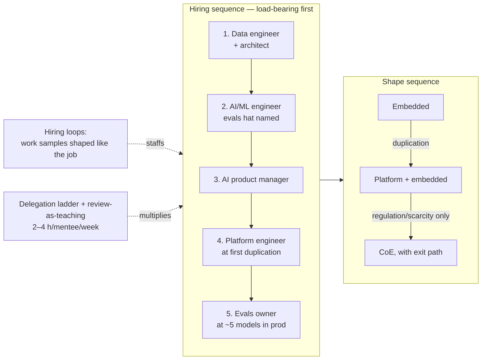

# Chapter 8.7 — Mentoring & Building AI Teams

| | |
|---|---|
| **Part** | 8 — Professional Excellence & Career Development |
| **Maturity level** | 5 — Principal Architect |
| **Difficulty** | Advanced |
| **Estimated study time** | 3 hours (reading 90 min, exercise 90 min) |
| **Prerequisites** | [1.8 Leadership & Influence](../part-1-professional-foundation/chapter-08-leadership-influence.md); [5.10](../part-5-cloud-infrastructure-platform/chapter-10-iac-platform-engineering.md) |

## Learning Objectives

After this chapter you will be able to:

1. Define the six roles an enterprise AI capability actually needs, what each is accountable for, and the hiring sequence that doesn't strand early hires.
2. Choose among the three team shapes — embedded, platform, center of excellence — using the organization's size and maturity rather than fashion.
3. Design hiring loops per role around work samples that predict the job, and know the screening signals that separate practitioners from vocabulary.
4. Mentor deliberately: the delegation ladder, review-as-teaching, and the multiplication math that makes growing architects part of the principal's job description.

## Introduction

Every architecture in this curriculum is operated by people the architect usually had a hand in hiring, organizing, and growing — and team design fails exactly like system design: wrong decomposition, missing interfaces, single points of failure, no monitoring. This chapter treats the team as the architect's second system. It is written for the reader arriving at Level 5 responsibilities — asked not just "design the platform" but "build the group that runs it" — and for the more common intermediate case: you are the first senior AI person somewhere, and every hire for the next year will be shaped by advice you give this quarter.

## Business Motivation

Team-design errors cost more than architecture errors because they compound through every subsequent decision and they take longer to reverse. The canonical, expensively repeated sequence: an enterprise hires four ML/data scientists first ("we're doing AI now"), discovers there are no pipelines for them to build on, no serving path, and no product problem assigned, and eighteen months later has notebooks, attrition, and a written-off program — a pattern documented across industry surveys of failed AI initiatives, and visible in the fact that data-engineering openings have outnumbered data-science openings at most enterprises since the early 2020s as organizations learned the ordering the hard way. The unit economics make the point sharper: a senior AI engineer costs $200–400K fully loaded in Western markets (8.1's bands plus overheads); a five-person team mis-sequenced for a year is a seven-figure write-off before counting the opportunity cost. On the mentoring side the math runs positive with the same magnitude: a principal who develops two engineers to independent architect-level work has added more design capacity than they personally possess — multiplication is not a soft virtue; it is the only way the principal role scales ([8.8](chapter-08-principal-architect.md)).

## Theory

### The six roles, by accountability

Titles vary; accountabilities are stable. An enterprise AI capability needs these six covered — by six people at scale, or by three people wearing pairs of hats early, but *covered knowingly*:

| Role | Accountable for | Curriculum backbone | First-hire signal |
|---|---|---|---|
| **Data engineer** | The estate models live on: pipelines, contracts, quality gates, features ([2.12](../part-2-artificial-intelligence/chapter-12-data-engineering-feature-platforms.md)) | 2.12, 5.5 | Almost always the correct first or second hire |
| **AI/ML engineer** | Models and LLM systems shipped as software: training, evals, serving integration | 2.9–2.15, Parts 3–4 | Hire after there is data to build on |
| **Platform engineer** | The shared machinery: gateway, registries, delivery pipelines, observability ([2.15](../part-2-artificial-intelligence/chapter-15-mlops-engineering.md), 5.10) | 2.15, Part 5 | Hire when the second team starts duplicating the first |
| **Evals/quality owner** | Golden sets, judges, gates, monitoring honesty (4.7, [2.17](../part-2-artificial-intelligence/chapter-17-online-experimentation.md)) | 4.7, 2.7, 2.17 | A hat before a hire — but a *named* hat from day one |
| **AI product manager** | The problem's worth and the deployment's adoption: KPI trees, workflow fit, human-in-loop design | 1.3, 1.6, 7.5 | The difference between shipped and adopted |
| **Architect** | Decisions, trade-offs, and the coherence of all of the above | This curriculum | You |

Two anti-patterns hide in the table. **The unnamed hat**: evals ownership assigned to nobody produces exactly the eval-free shipping that [7.10](../part-7-enterprise-ai-architecture-patterns/chapter-10-anti-patterns.md) catalogs — early teams must name the hat even when it is one person's twenty percent. **The prestige-ordered hiring plan**: hiring the most impressive-sounding role first (research-titled scientists) instead of the most load-bearing (data engineering) — the sequence below exists because the failure is so common.

**The sequence that works** for a first enterprise AI team: (1) data engineer + the architect (you), building the estate and the first thin system end-to-end; (2) AI/ML engineer when there is something to build on, with the evals hat named; (3) product manager as the second use case appears (adoption problems surface with the second stakeholder group); (4) platform engineer when duplication appears; (5) specialize the evals hat into a role as model count crosses roughly five in production. Each hire lands on prepared ground; nobody spends their first quarter discovering there is nothing to do.

### The three team shapes

| Shape | What it is | Right when | Failure mode |
|---|---|---|---|
| **Embedded** | AI engineers inside product teams | Few use cases, adoption-critical, early maturity | Duplication and drift as use cases multiply; no shared platform emerges |
| **Platform + embedded** | A platform team serving embedded builders ([5.10](../part-5-cloud-infrastructure-platform/chapter-10-iac-platform-engineering.md)'s shape) | Multiple teams building; duplication visible; the usual steady state | Platform drifts from users' reality unless run as a product with internal customers |
| **Center of excellence** | Central AI group owning delivery | Scarce expertise, regulated estates needing one governed door, program-level funding | The ivory tower: a queue forms, teams route around it, governance becomes theater ([6.9](../part-6-enterprise-architecture/chapter-09-architecture-governance.md)) |

The honest guidance: shapes are a *sequence*, not a choice — embedded first, platform extracted when duplication demands it, CoE only where regulation or genuine scarcity forces central delivery, and even then with an explicit path to redistribute. Choosing the end-state shape at the beginning is how organizations buy an ivory tower before they have anything to be excellent at.

### Hiring: work samples over vocabulary

AI hiring is noisy because the field rewards fluent vocabulary, and interviews that quiz vocabulary select for it. The correction is the same one [8.3](chapter-03-architecture-interviews.md) teaches from the candidate's chair: **probe evidence, not terminology** — and the strongest instrument is a work sample shaped like the actual job:

- **Data engineer**: here is a messy extract with a late-arriving-data problem; design the pipeline and the quality gates; where does this break? (2.12's replay test as an interview.)
- **AI/ML engineer**: here is a model, a golden set, and a failing eval; diagnose. Or: review this pull request that contains a leaked feature. The diagnostic shape beats the build-from-scratch shape — the job is mostly diagnosis.
- **Evals owner**: here are ten model outputs and a rubric; score them, then critique the rubric. (Rubric critique is the signal; scoring is the setup.)
- **Platform engineer**: here is a promotion gate that auto-shipped a bad model; what was missing? (2.15's corrupted-batch drill, inverted.)
- **Any senior role**: walk me through the most important decision in *your* repo — the 8.2/8.3 discipline, now your best screening tool.

Screening signals that generalize: candidates who name what their numbers *don't* show (the honest-hand tell); who reach for baselines before models; who ask about the label pipeline before the architecture. Red flags that generalize: portfolio claims that dissolve under one follow-up; framework enthusiasm without a failure story; "we didn't really measure it" delivered without discomfort.

### Mentoring: the delegation ladder and review-as-teaching

Mentoring architects is a designed process, not proximity. Two mechanisms carry most of it:

**The delegation ladder** — for any recurring decision class, move the mentee up explicit rungs: (1) watch me decide, hear the narration; (2) recommend, I decide — the gap between their recommendation and the decision is the syllabus; (3) decide, I review within a day; (4) decide, tell me weekly; (5) own it, I hear about it in the ADR log. The rungs are per decision-class, not per person — the same engineer can be rung 5 on retrieval design and rung 2 on vendor negotiation — and *saying the rung out loud* ("this one's yours; I'll review Thursday") prevents both micromanagement and abandonment, the two default failure modes.

**Review-as-teaching** — design reviews are the principal's classroom, and the questioning discipline decides whether they teach: ask "what else did you consider?" before critiquing the proposal ([1.4](../part-1-professional-foundation/chapter-04-tradeoff-analysis.md)'s discipline, Socratically applied); require the trade-off narration, not just the design; let wrong-but-recoverable decisions ship with a dated revisit trigger rather than overriding them — the reversible mistake a mentee owns teaches more than the correct answer they were handed ([1.4](../part-1-professional-foundation/chapter-04-tradeoff-analysis.md)'s one-way-door test, applied to pedagogy). Budget reality: real mentoring costs the mentor 2–4 hours per mentee per week at the intensive rungs; a principal claiming five intensive mentees is doing proximity, not mentoring.

## Architecture Perspective

The two sequences are the chapter's load-bearing claims: hire in dependency order (the estate before its builders), and let the team shape follow observed duplication rather than org-chart ambition. Mentoring is drawn as the multiplier on the whole structure because that is its economic function: every rung-5 delegation is capacity the hiring plan no longer has to buy.

## Real-world Example

**Bellhaven Insurance** (the recurring fictional carrier) built its first AI team twice — the second time under a new principal architect, after the first attempt produced the canonical failure. Attempt one, pre-principal: three data scientists hired in a quarter ("the AI team"), no data engineer, no assigned product problem; fourteen months later, eleven notebooks, zero production systems, two resignations, and a program review that nearly ended the budget. Attempt two ran this chapter's sequence: a data engineer and the principal spent one quarter building the estate's thin slice (2.12's contracts and gates around the claims tables) and shipping *one* small scored system end-to-end with the evals hat explicitly on the principal; an ML engineer joined against that working substrate (her work sample: diagnose a planted leaked feature — she found it in forty minutes and, better, asked for the replay test); a product manager arrived with use case two (renewal pricing support), and the platform engineer only when the second team started duplicating the first's registry scripts — month eleven, exactly when the duplication was visible rather than predicted. Eighteen months in: four systems in production, the delegation ladder had the ML engineer at rung 4 on model-promotion decisions (her gate rejections no longer paged the principal), and the program review that had nearly killed attempt one approved headcount six and seven. The principal's retrospective one-liner to the CTO: "The first team was hired for what AI sounds like. This one was hired in the order the work actually stacks."

## Hands-on Exercise

Design the team for a realistic scenario: a 3,000-person insurer (or your own organization, disguised) with two funded use cases — claims-intake automation and a renewal-risk model — and budget for four hires over twelve months plus you.

1. **Role plan (30 min):** which four roles, in what order, with a one-line accountability each and the month each starts; name every unfilled hat and who wears it meanwhile.
2. **Shape memo (20 min):** embedded, platform, or CoE for year one — argued from this scenario's size and regulation, with the trigger that would change the shape in year two.
3. **One hiring loop (30 min):** design the full loop for your *first* hire — the work sample (shaped like their actual first quarter), the two probes, the three signals you will score, the red flags.
4. **One delegation plan (20 min):** pick a decision class you would hand your second hire; write the rung schedule for their first six months and the evidence that moves them up each rung.

**Acceptance criteria:**
- [ ] The hiring order survives the question "what will this person build on, day one?" for every hire
- [ ] Every one of the six accountabilities has a named owner or a named hat at every month of the plan
- [ ] The work sample could not be passed with vocabulary alone
- [ ] The shape memo names its year-two trigger observably
- [ ] The delegation plan states the rung out loud, per the ladder, with promotion evidence

## Enterprise Considerations

At enterprise scale the chapter's units compose: multiple product groups each running platform-plus-embedded, one governance layer ([6.9](../part-6-enterprise-architecture/chapter-09-architecture-governance.md)/[6.11](../part-6-enterprise-architecture/chapter-11-model-risk-management.md)) rather than one delivery CoE, and a deliberate community of practice carrying the mentoring function across team boundaries (the delegation ladder works between teams too — platform engineers at rung 5 locally can be rung 2 mentees on governance). Two enterprise-specific realities deserve planning: **the market clock** — AI-engineering tenure medians run short (2–3 years at many enterprises), so the multiplication math is also retention math: engineers stay where they are visibly climbing rungs, and the delegation ladder is the cheapest retention instrument you own; and **the build-borrow-buy triangle** — every role can be filled by hiring, growing (this curriculum is a growth instrument: a strong platform engineer plus the classical track is often your ML engineer in two quarters), or renting ([8.5](chapter-05-consulting-client-engagement.md)'s consultants — right for spikes and discovery, wrong for the estate's owners; a team that rents its data engineering owns nothing).

## Trade-offs

| Decision | Option A | Option B | Choose A when… | Choose B when… |
|----------|----------|----------|----------------|----------------|
| First hire | Data engineer | ML/AI engineer | Default — the estate precedes its builders | The estate genuinely exists (rare, verify by 2.12's replay test, not by assurance) |
| Filling a role | Grow internal (curriculum + ladder) | Hire external senior | The base skill exists and two quarters is acceptable | The gap is load-bearing *now*, or no internal base exists |
| Team shape year one | Embedded with named hats | Platform team up front | Fewer than ~3 building teams; adoption is the risk | Duplication already observable across existing teams |
| Mentoring investment | Deep on 1–2 mentees (2–4 h/wk each) | Broad light-touch across the team | Building successors and multiplication capacity | Baseline uplift of a large team — do both, but never confuse the second for the first |

## Common Mistakes

1. **Scientists before plumbing.** The prestige-ordered hiring plan; fourteen months of notebooks. The estate comes first, every time it is honestly checked.
2. **The unnamed evals hat.** Quality ownership assigned to everyone is assigned to no one; the gate that nobody owns is the gate that quietly stops gating ([7.10](../part-7-enterprise-ai-architecture-patterns/chapter-10-anti-patterns.md)).
3. **CoE-first ambition.** Central excellence declared before anything exists to be excellent at; the queue forms, the routing-around begins, and governance becomes the theater 6.9 warns about.
4. **Vocabulary hiring.** Loops that quiz terminology select fluent talkers; the work sample shaped like the job is the correction, and it is cheaper than the mis-hire it prevents.
5. **Delegation without rungs.** "You own this now" with no ladder produces either abandonment (rung 5 assigned at rung 1 readiness) or micromanagement (rung 1 forever); saying the rung out loud is the whole trick.
6. **Mentoring as proximity.** Five "mentees" and no scheduled hours is a metaphor, not a practice; the 2–4 hours are real or the multiplication isn't.

## Best Practices

1. **Hire in dependency order and verify the dependency** — "what does this person build on, day one?" asked of every hire, with 2.12's replay test as the estate's honesty check.
2. **Name every hat, every month** — the six accountabilities covered knowingly even when three people wear them.
3. **Let duplication pull the platform into existence** — extracted platforms serve real needs; predicted platforms serve org charts ([5.10](../part-5-cloud-infrastructure-platform/chapter-10-iac-platform-engineering.md)).
4. **Interview with the job, not about the job** — work samples shaped like the first quarter; diagnosis over greenfield; their repo's decisions over your trivia.
5. **Run the ladder explicitly and per decision-class** — rung stated aloud, promotion evidence named, the mentee's gap-to-decision as the syllabus.
6. **Count multiplication in the principal's output** — engineers moved to rung 5, successors readied, capacity created without headcount; [8.8](chapter-08-principal-architect.md) makes this a job requirement.

## Architecture Checklist

For any team you are building or inheriting:

- [ ] All six accountabilities mapped to owners or named hats, dated
- [ ] Hiring sequence justified by dependency, not prestige; each hire's day-one substrate named
- [ ] Team shape chosen from observed conditions, with the shape-change trigger written down
- [ ] Every open role's loop includes a work sample shaped like the actual job
- [ ] Evals ownership named and resourced before the second model ships
- [ ] Delegation rungs explicit for each senior's decision classes; promotion evidence defined
- [ ] Mentoring hours real and scheduled; multiplication (rung-5 promotions) tracked as an outcome
- [ ] Retention read honestly: who is climbing, who is plateaued, who is renting-not-owning their area

## Interview Questions

1. *"You have budget for four AI hires at a company with no AI capability. Who, in what order, and why?"* — Strong answers run the dependency sequence (data engineering first, with the estate-verification caveat), name the hats during the gaps, and tie each hire to what exists for them to build on. Prestige-ordered answers are the failure the question hunts.
2. *"Embedded, platform, or center of excellence?"* — Strong answers refuse the static choice: the sequence, the duplication trigger, the regulated-industry CoE exception with its exit path, and the ivory-tower failure mode named.
3. *"How do you interview an ML engineer without quizzing vocabulary?"* — Strong answers design the work sample (diagnostic-shaped, job-shaped), name the generalizing signals (baselines first, limits volunteered, label-pipeline questions), and probe the candidate's own repo per 8.2/8.3.
4. *"Walk me through how you'd grow a strong platform engineer into an ML engineer."* — Strong answers use the ladder with real rungs and evidence, budget the mentor hours honestly, pick the decision classes deliberately (start with promotion gates — closest to their existing instincts), and name the two-quarter horizon rather than promising osmosis.

## Further Reading

- *Team Topologies* (Skelton & Pais) — the platform/stream-aligned vocabulary this chapter's shapes formalize; the cognitive-load framing maps directly onto AI team design.
- *The Manager's Path* (Fournier) — the delegation and mentoring mechanics from the management side; the ladder here is its architecture-flavored cousin.
- *An Elegant Puzzle* (Larson) — team sizing, hiring funnels, and the systems view of organizations; the strongest treatment in print of teams-as-systems.
- Your own organization's last two AI hires' first-90-day retrospectives, if they exist — and if they don't, that absence is finding one about your team's monitoring plane.

## Summary

- Six accountabilities — data engineering, AI/ML engineering, platform, evals, product, architecture — covered knowingly at every team size, with unnamed hats as the standing anti-pattern.
- Hire in dependency order: the estate before its builders, product with the second use case, platform when duplication is observed, the evals role as model count compounds. The prestige-ordered plan is a seven-figure, eighteen-month write-off with a well-documented shape.
- Team shapes are a sequence — embedded → platform+embedded → (rarely, with an exit path) CoE — pulled by observed conditions, not declared from ambition.
- Hire with work samples shaped like the job and probes shaped like 8.3's depth probe; vocabulary fluency is the field's cheapest and least predictive signal.
- Mentor with the explicit delegation ladder and review-as-teaching, at honest hours (2–4/week per intensive mentee); multiplication — capacity created without headcount — is the principal's real output and the cheapest retention instrument available.

---

**Previous:** [8.6 Staying Current Without Chasing Frameworks](chapter-06-staying-current.md) · **Next:** [8.8 Operating as a Principal Architect](chapter-08-principal-architect.md) · **Related:** [1.8 Leadership & Influence](../part-1-professional-foundation/chapter-08-leadership-influence.md), [5.10 IaC & Platform Engineering](../part-5-cloud-infrastructure-platform/chapter-10-iac-platform-engineering.md), [6.9 Architecture Governance](../part-6-enterprise-architecture/chapter-09-architecture-governance.md)
