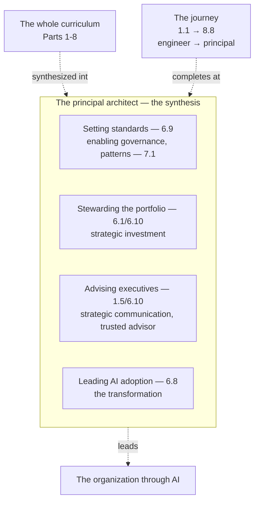

# Chapter 8.8 — Operating as a Principal Architect

| | |
|---|---|
| **Part** | 8 — Professional Excellence & Career Development |
| **Maturity level** | 5 — Principal Architect |
| **Difficulty** | Expert |
| **Estimated study time** | 3 hours (reading 90 min, exercise 90 min) |
| **Prerequisites** | All of Parts 1–8 (the principal architect synthesizes the whole curriculum) |

## Learning Objectives

After this chapter you will be able to:

1. Operate as a principal architect: setting standards, stewarding a portfolio, advising executives, and leading an organization through AI adoption.
2. Synthesize the whole curriculum's competence into the principal's organizational leadership.
3. Lead the organization through AI adoption: the strategy, the standards, the portfolio, the transformation.
4. Complete the journey from software engineer to enterprise AI Solution Architect at the principal level.

## Introduction

This is the curriculum's final chapter — the principal architect, the Level-5 synthesis of everything Parts 1–8 built. The journey began at 1.1 (from software engineer to solution architect) and arrives here (operating as a principal architect) — the top of the maturity ladder (8.1), the organizational leadership scope. The principal architect synthesizes the whole curriculum: the judgment (Part 1), the AI fundamentals (Part 2), the building blocks (Part 3), the production systems (Part 4), the infrastructure (Part 5), the enterprise architecture (Part 6), the patterns (Part 7), and the professional excellence (Part 8) — all synthesized into the principal's work of leading the organization through AI.

The framing: **the principal architect synthesizes the whole curriculum into organizational leadership** — the principal setting the standards (6.9), stewarding the portfolio (6.1/6.10), advising the executives (6.10/1.5), and leading the organization through AI adoption (6.8) — the synthesis of the whole curriculum's competence into the organizational leadership, and this chapter is the completion of the journey.

## Business Motivation

The principal architect is the organization's AI leadership — the synthesis that leads the organization through AI. The principal's work matters most: the standards (6.9 — the enabling governance, the portfolio coherence), the portfolio stewardship (6.1/6.10 — the AI portfolio, the strategic investment), the executive advising (6.10/1.5 — the AI strategy at the board), and the AI adoption leadership (6.8 — the transformation). Without the principal: the organization's AI is un-led (the standards un-set, the portfolio un-stewarded, the executives un-advised, the adoption un-led); with the principal: the organization's AI is led (the standards, the portfolio, the advising, the adoption). The business case is the organizational-leadership one: the principal architect is the organization's AI leadership (the standards, the portfolio, the advising, the adoption), the synthesis of the whole curriculum's competence into the organizational leadership — the principal leading the organization through AI, and this chapter is the completion of the journey (the software-engineer-to-principal-architect — 1.1 to 8.8).

## Theory

### Setting standards

The principal setting the standards (6.9's enabling governance):

- **The standards** (6.9) — the principal setting the standards (6.9 — the enabling governance, the golden paths — 5.10/6.9, the patterns — 7.1, the standards that enable — 6.9), the standards (6.9 — the enabling); the standards (the enabling — 6.9).
- **The enabling governance** (6.9) — the principal's enabling governance (6.9 — the help not block, the paved road — 5.10/6.9, the standards the teams adopt), the enabling (6.9); the enabling governance (6.9).
- **The portfolio coherence** (6.1) — the standards for the portfolio coherence (6.1 — the coherent portfolio, the standards — 6.9), the coherence (6.1); the portfolio coherence (6.1).

### Stewarding the portfolio

The principal stewarding the portfolio (6.1/6.10):

- **The portfolio** (6.1) — the principal stewarding the AI portfolio (6.1 — the capability-mapped portfolio, the target-state, the roadmap — 6.1/6.8), the portfolio (6.1); the portfolio (6.1).
- **The strategic investment** (6.10) — the principal directing the strategic investment (6.10 — the business case, the risk-adjusted ROI, the portfolio prioritization — 6.10), the investment (6.10); the strategic investment (6.10).
- **The stewardship** — the portfolio stewardship (the portfolio directed — 6.1, the investment prioritized — 6.10, the target-state pursued — 6.1), the stewardship (the portfolio — 6.1/6.10); the stewardship (the portfolio — 6.1/6.10).

### Advising executives

The principal advising the executives (6.10/1.5):

- **The executive advising** (1.5/6.10) — the principal advising the executives (1.5's communication, 6.10's business case — the AI strategy at the board, the capability view — 6.1, the risk-adjusted ROI — 6.10), the advising (1.5/6.10); the executive advising (1.5/6.10).
- **The strategic communication** (1.5) — the strategic communication (1.5 — the SCQA, the capability view — 6.1, the board-level — 1.5/6.1), the communication (1.5); the strategic communication (1.5).
- **The trusted advisor** (1.8) — the principal as the trusted advisor (1.8's trust, the influence — 1.8, the executive trust — the advisor), the trusted advisor (1.8); the trusted advisor (1.8).

### Leading AI adoption

The principal leading the AI adoption (6.8):

- **The adoption leadership** (6.8) — the principal leading the AI adoption (6.8 — the pilot-to-platform, the target-state — 6.1, the transformation — 6.8), the adoption (6.8); the adoption leadership (6.8).
- **The transformation** (6.8) — the AI transformation (6.8 — the scattered-pilots-to-enterprise-enabled, the transformation — 6.8), the transformation (6.8); the transformation (6.8).
- **The organizational change** (1.8/8.7) — the organizational change (1.8's influence, 8.7's team-building — the change management, the capability — 8.7), the change (1.8/8.7); the organizational change (1.8/8.7).

## Architecture Perspective

Readings. **The principal synthesizes the whole curriculum** — the judgment (Part 1), the AI fundamentals (Part 2), the building blocks (Part 3), the production systems (Part 4), the infrastructure (Part 5), the enterprise architecture (Part 6), the patterns (Part 7), the professional excellence (Part 8) — all synthesized into the principal's organizational leadership (the standards — 6.9, the portfolio — 6.1/6.10, the advising — 1.5/6.10, the adoption — 6.8). **The principal leads the organization through AI** — the standards (the enabling governance, the portfolio coherence — 6.9/6.1), the portfolio stewardship (the strategic investment — 6.1/6.10), the executive advising (the AI strategy, the trusted advisor — 1.5/6.10/1.8), the adoption leadership (the transformation — 6.8) — the organizational leadership (the organization led through AI). **And the journey completes at the principal** — the journey from 1.1 (the software engineer to the solution architect) to 8.8 (the principal architect), the top of the maturity ladder (8.1 — the Level-5 Principal), the journey completed (the software-engineer-to-enterprise-AI-Solution-Architect — the curriculum's primary goal, achieved at the principal level).

## Real-world Example

The recurring architects' arcs complete at the principal level — the architects' journeys from the solution to the principal. Consider Adaeze's arc (Vantora — 1.8 to 8.8): the journey from the platform architect (1.8's influence, 5.10's platform) to the principal (8.8's organizational leadership — the standards — 6.9's enabling governance, the portfolio — 6.1, the advising — the CFO ally — 1.8/6.10, the adoption — 5.10's platform enabling the organization). And Tomás's arc (Bellhaven — 1.3 to 8.8): the journey from the solution architect (1.3's business case) to the enterprise-and-principal (6.1's portfolio, 6.10's business case, 8.8's organizational leadership — the AI strategy, the transformation — 6.8). The principal note (the architects' arcs, completing the journey): *"The recurring architects' journeys complete at the principal level. Adaeze's arc — from the platform architect (the influence — 1.8, the platform — 5.10) to the principal (the organizational leadership — the standards — 6.9's enabling governance, the portfolio — 6.1, the advising — the CFO ally, the adoption — the platform enabling the organization). Tomás's arc — from the solution architect (the business case — 1.3) to the enterprise-and-principal (the portfolio — 6.1, the business case — 6.10, the transformation — 6.8). The principal synthesizes the whole curriculum — the judgment, the fundamentals, the building blocks, the production systems, the infrastructure, the enterprise architecture, the patterns, the professional excellence — into the organizational leadership. The journey from the software engineer (1.1) to the principal architect (8.8) — the curriculum's primary goal — completes here: leading the organization through AI, the synthesis of the whole competence into the organizational leadership."*

## Hands-on Exercise

**Operate as a principal architect.** ~90 minutes. Capstone synthesis, for an organization's AI leadership (real or hypothetical).

1. **The standards (25 min).** As the principal, set the AI standards (6.9 — the enabling governance, the golden paths — 5.10, the patterns — 7.1) for the organization. Document the standards (the enabling).
2. **The portfolio (25 min).** Steward the AI portfolio (6.1 — the capability-mapped portfolio, the target-state, the roadmap — 6.1/6.8, the strategic investment — 6.10). Document the portfolio stewardship.
3. **The executive advising (20 min).** Advise the executives (1.5/6.10 — the AI strategy at the board, the capability view — 6.1, the risk-adjusted ROI — 6.10). Write the board-level pitch (1.5's SCQA).
4. **The adoption leadership (20 min).** Lead the AI adoption (6.8 — the pilot-to-platform, the target-state — 6.1, the transformation). Document the adoption leadership (the transformation).

**Acceptance criteria:**
- [ ] The AI standards set (6.9 — the enabling governance, the golden paths — 5.10, the patterns — 7.1)
- [ ] The AI portfolio stewarded (6.1 — the capability-mapped, the target-state, the strategic investment — 6.10)
- [ ] The executives advised (1.5/6.10 — the AI strategy, the board-level pitch — 1.5's SCQA)
- [ ] The AI adoption led (6.8 — the pilot-to-platform, the transformation)

## Enterprise Considerations

The principal architect is the organization's AI leadership at the highest level. **The principal is the organization's AI authority** (6.9/8.1): the principal architect is the organization's AI authority (6.9's standards, 8.1's top-of-ladder — the authority), the AI leadership (the organization's AI led by the principal), so the principal is the AI authority (6.9/8.1). **The principal advises the board** (6.10/1.5): the principal advises the board (6.10's business case, 1.5's communication — the AI strategy at the board, the trusted advisor — 1.8), the board advising (the AI strategy — the board), so the principal is the board advisor (6.10/1.5). **The principal leads the AI transformation** (6.8): the principal leads the AI transformation (6.8's adoption — the organization transformed, the enterprise-enabled — 6.1/6.8), the transformation leadership (the organization transformed), so the principal leads the transformation (6.8). **And the principal builds the AI capability** (8.7): the principal builds the AI capability (8.7's mentoring/team-building — the people, the capability), the capability building (the organization's capability), so the principal builds the capability (8.7).

## Trade-offs

The principal architect's work is synthesis and leadership — the trades are the curriculum's, at the organizational level:

| The principal's work | Draws on | The synthesis |
|----------|----------|----------|
| Setting standards | Governance (6.9), patterns (7.1), platform (5.10) | The enabling standards for the coherent portfolio |
| Stewarding the portfolio | EA (6.1), business case (6.10), adoption (6.8) | The strategic portfolio directed toward the target-state |
| Advising executives | Communication (1.5), business case (6.10), influence (1.8) | The AI strategy, the trusted advisor |
| Leading AI adoption | Adoption strategy (6.8), influence (1.8), team-building (8.7) | The organizational transformation |

## Common Mistakes

1. **The un-synthesized principal** — the principal not synthesizing the whole curriculum (the judgment, the fundamentals, the systems, the enterprise, the patterns, the professional); the synthesis (the whole curriculum).
2. **The blocking standards** — the principal's standards blocking (6.9's blocking governance); the enabling standards (6.9's enabling).
3. **The un-stewarded portfolio** — the portfolio un-stewarded (6.1 — the un-directed); the portfolio stewardship (6.1/6.10).
4. **The un-advised executives** — the executives un-advised (6.10 — the un-advised board); the executive advising (1.5/6.10).
5. **The un-led adoption** — the AI adoption un-led (6.8 — the un-led transformation); the adoption leadership (6.8).
6. **The un-built capability** — the AI capability un-built (8.7 — the un-built); the capability building (8.7).
7. **The un-completed journey** — the journey un-completed (the software-engineer-to-principal — 1.1 to 8.8); the journey completed (the principal — 8.8).

## Best Practices

1. **Synthesize the whole curriculum** — the judgment (Part 1), the fundamentals (Part 2), the building blocks (Part 3), the systems (Part 4), the infrastructure (Part 5), the enterprise architecture (Part 6), the patterns (Part 7), the professional excellence (Part 8) — into the organizational leadership.
2. **Set enabling standards** — the enabling governance (6.9), the golden paths (5.10), the patterns (7.1) — the standards the teams adopt (6.9).
3. **Steward the portfolio strategically** — the capability-mapped portfolio (6.1), the strategic investment (6.10), the target-state (6.1).
4. **Advise the executives as the trusted advisor** — the AI strategy (6.10), the strategic communication (1.5), the trust (1.8).
5. **Lead the AI adoption** — the pilot-to-platform (6.8), the transformation (6.8), the change (1.8/8.7).
6. **Build the AI capability** — the mentoring (8.7), the teams (8.7), the hiring (8.7) — the people.
7. **Complete the journey** — the software-engineer-to-principal-architect (1.1 to 8.8), the organizational leadership.

## Architecture Checklist

For operating as a principal architect:

- [ ] The whole curriculum synthesized into the organizational leadership (Parts 1-8)
- [ ] The enabling standards set (6.9, the golden paths — 5.10, the patterns — 7.1)
- [ ] The portfolio stewarded strategically (6.1, the strategic investment — 6.10)
- [ ] The executives advised as the trusted advisor (1.5/6.10, the trust — 1.8)
- [ ] The AI adoption led (6.8, the transformation)
- [ ] The AI capability built (8.7, the people)
- [ ] The journey completed (the software-engineer-to-principal-architect — 1.1 to 8.8)

## Interview Questions

1. *"What does a principal architect do?"* — Strong answers give the principal's work (setting the standards — 6.9's enabling governance, stewarding the portfolio — 6.1/6.10, advising the executives — 1.5/6.10, leading the AI adoption — 6.8), the synthesis of the whole curriculum's competence into the organizational leadership, the organization led through AI.
2. *"How does a principal architect lead an organization through AI adoption?"* — Strong answers give the adoption leadership (6.8 — the pilot-to-platform, the target-state — 6.1, the transformation — 6.8), the standards (6.9 — the enabling), the portfolio (6.1 — the strategic), the executive advising (6.10 — the AI strategy), the capability building (8.7 — the people) — the organizational transformation led.
3. *"How do you advise executives on AI strategy?"* — Strong answers give the executive advising (1.5's strategic communication — the SCQA, the capability view — 6.1, 6.10's business case — the risk-adjusted ROI, the trusted advisor — 1.8's trust), the AI strategy at the board (the board-level — 1.5/6.1).
4. *"What's the culmination of the AI Solution Architect journey?"* — Strong answers give the principal architect (8.8 — the top of the maturity ladder — 8.1, the organizational leadership — the standards, the portfolio, the advising, the adoption), the synthesis of the whole curriculum (Parts 1-8), the journey from the software engineer (1.1) to the principal architect (8.8) — the curriculum's primary goal achieved.

## Further Reading

- All of Parts 1-8 — the whole curriculum the principal synthesizes.
- 6.9 Architecture Governance (the standards), 6.1 EA Frameworks and 6.10 TCO & the Business Case (the portfolio, the advising), 6.8 Legacy Modernization & AI Adoption (the adoption) — the principal's work.
- 8.7 Mentoring & Building AI Teams (the capability) and 1.8 Leadership & Influence (the trust, the advising) — the leadership.
- Gregor Hohpe, *The Software Architect Elevator* (re-linked, the final time) — the architect at the highest altitude (the boardroom to the engine room), the principal's scope.

## Summary

- The **principal architect synthesizes the whole curriculum into organizational leadership** — the judgment (Part 1), the AI fundamentals (Part 2), the building blocks (Part 3), the production systems (Part 4), the infrastructure (Part 5), the enterprise architecture (Part 6), the patterns (Part 7), the professional excellence (Part 8) — into the principal's work.
- The principal **sets the standards** (6.9's enabling governance, the golden paths — 5.10, the patterns — 7.1), **stewards the portfolio** (6.1's capability-mapped portfolio, 6.10's strategic investment), **advises the executives** (1.5's strategic communication, 6.10's business case, 1.8's trusted advisor), and **leads the AI adoption** (6.8's transformation).
- The principal **leads the organization through AI** — the organizational leadership (the standards, the portfolio, the advising, the adoption, the capability — 8.7) — the organization's AI led by the principal.
- The **journey completes at the principal** — from 1.1 (the software engineer to the solution architect) to 8.8 (the principal architect), the top of the maturity ladder (8.1), the curriculum's primary goal (the software-engineer-to-enterprise-AI-Solution-Architect) achieved at the principal level.
- This completes the curriculum — the complete learning system from software engineer to enterprise AI Solution Architect, timeless concepts before frameworks, both lanes of the discipline, the judgment and the competence and the leadership synthesized into the principal architect leading the organization through AI. **The journey is complete; the practice begins.**

---

**Previous:** [Chapter 8.7 — Mentoring & Building AI Teams](chapter-07-mentoring-building-teams.md) · **Back to:** [Curriculum home](../../README.md) · **Related:** [1.1 From Software Engineer to Solution Architect](../part-1-professional-foundation/chapter-01-from-engineer-to-architect.md) (where the journey began), [6.9 Architecture Governance](../part-6-enterprise-architecture/chapter-09-architecture-governance.md), [6.10 TCO & the Business Case](../part-6-enterprise-architecture/chapter-10-tco-business-case.md)
