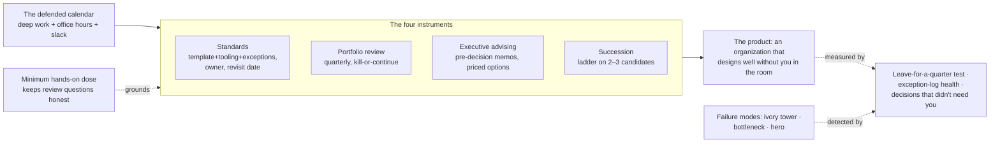

# Chapter 8.8 — Operating as a Principal Architect

| | |
|---|---|
| **Part** | 8 — Professional Excellence & Career Development |
| **Maturity level** | 5 — Principal Architect |
| **Difficulty** | Expert |
| **Estimated study time** | 3 hours (reading 90 min, exercise 90 min) |
| **Prerequisites** | [6.9](../part-6-enterprise-architecture/chapter-09-architecture-governance.md); [6.10](../part-6-enterprise-architecture/chapter-10-tco-business-case.md); [8.7](chapter-07-mentoring-building-teams.md) |

## Learning Objectives

After this chapter you will be able to:

1. Make the altitude shift deliberately: from owning systems to owning the conditions under which many systems get designed well — and know what you must stop doing to afford it.
2. Operate the principal's four instruments: standards that stick, portfolio stewardship, executive advising, and succession — each with its concrete artifact and cadence.
3. Defend a working calendar against the role's default failure (becoming a meeting), using the time-budget arithmetic principals who survive actually use.
4. Recognize the three failure modes — ivory tower, bottleneck, hero — early enough to correct, in yourself.

## Introduction

The principal architect's product is not architecture; it is **an organization that produces good architecture at a rate one person never could**. Everything strange about the role follows from that inversion. Your calendar fills with things that are not design. Your best work is invisible when it succeeds (the disaster that didn't happen, the standard nobody fights because it is obviously the paved road). Your output is measured in other people's decisions. Engineers promoted to the role on the strength of their designs frequently spend an unhappy first year doing their old job with a worse calendar, because nobody told them the product changed.

This chapter is the operating manual for the changed product: the instruments, the calendar, and the failure modes. It is the shortest-feeling chapter in Part 8 to read and the longest to live; treat its exercise as the start of a practice, not a completion.

## Business Motivation

Principals are expensive and their leverage is real, so the business case cuts both ways. The cost side: a principal runs $350–700K+ fully loaded at larger Western tech companies (8.1's bands plus overheads), and a principal operating as a senior engineer — personally designing one system at a time — returns roughly one senior engineer's output at three times the price. The leverage side is what justifies the title: a standard that prevents each product team from re-solving LLM gateway security saves multiple team-weeks per team per year across forty teams ([5.4](../part-5-cloud-infrastructure-platform/chapter-04-api-integration-layer.md)'s arithmetic writ organizational); a portfolio intervention that kills two doomed initiatives early returns their entire remaining budgets ([6.10](../part-6-enterprise-architecture/chapter-10-tco-business-case.md)); a succession pipeline that produces two independent architects doubles design capacity without a requisition ([8.7](chapter-07-mentoring-building-teams.md)'s multiplication). The uncomfortable accounting truth that makes this chapter necessary: every one of those returns routes through *other people's* work, which means a principal whose week is full of personal heroics is, in strict economic terms, underperforming a cheaper employee.

## Theory

### The altitude shift, and its price

The shift is from *decisions* to *decision conditions*: from "is this design right?" to "will the next forty designs be right without me in the room?" Three concrete changes of substance:

- **Your unit of work becomes the artifact that scales**: the standard, the reference architecture, the review process, the memo — not the design. A principal's diagram is a template; a principal's opinion is a review question other people ask.
- **Your information diet inverts**: senior engineers push information down (explaining designs); principals spend most of their attention pulling it up (what is actually breaking, which teams are quietly routing around the standard, where the portfolio's assumptions are decaying — [8.6](chapter-06-staying-current.md)'s radar, plus an internal one).
- **The price is paid in identity**: you must visibly stop doing some things you are excellent at. The principal who keeps the fun design work starves the organization of exactly the delegation that grows successors ([8.7](chapter-07-mentoring-building-teams.md)'s ladder, applied to yourself, downward).

### The four instruments

**1. Standards that stick.** A standard sticks when compliance is *easier than deviation* — the paved-road rule ([6.9](../part-6-enterprise-architecture/chapter-09-architecture-governance.md), [5.10](../part-5-cloud-infrastructure-platform/chapter-10-iac-platform-engineering.md)). The principal's discipline: few standards (an estate carries perhaps 8–15 that matter, not fifty), each shipped as *template plus tooling plus exception process* rather than as a decree, each with a named owner and a revisit date ([8.6](chapter-06-staying-current.md)'s trigger discipline at portfolio scale). The exception log is the standard's monitoring plane: three exceptions in a quarter is engagement; zero exceptions forever means either perfection or — far more often — quiet routing-around that governance hasn't noticed ([6.9](../part-6-enterprise-architecture/chapter-09-architecture-governance.md)'s signal).

**2. Portfolio stewardship.** The principal reads the whole AI portfolio the way an architect reads one system: where the concentration risks are (five systems on one provider's deprecated tier), where the duplication is (three teams building ingestion — [8.7](chapter-07-mentoring-building-teams.md)'s platform trigger at portfolio scale), which initiatives' business cases have quietly expired ([6.10](../part-6-enterprise-architecture/chapter-10-tco-business-case.md)'s revisit clause, enforced), and where the estate's next bet should land. The artifact is a quarterly portfolio review — one page per initiative: health, cost trend, risk delta, kill-or-continue recommendation — and the hardest instrument in it is the **kill recommendation**: principals earn their leverage disproportionately by ending things, because nobody below the role has the standing and nobody above has the evidence.

**3. Executive advising.** The principal is the translation layer between the estate's technical reality and the organization's capital allocation ([1.3](../part-1-professional-foundation/chapter-03-business-understanding.md)/[1.5](../part-1-professional-foundation/chapter-05-communicating-architecture.md) at their highest-stakes setting). The working rules: bring options with priced trade-offs, never single recommendations dressed as inevitabilities; convert technical risk into the executive's units (money, time, regulatory exposure — [6.11](../part-6-enterprise-architecture/chapter-11-model-risk-management.md)'s vocabulary where it applies); and protect credibility as the asset it is — the first time a principal's numbers are caught inflated, every subsequent memo is discounted ([8.2](chapter-02-architecture-portfolio.md)'s credibility rules never stop applying; the audience just gets more expensive). The recurring high-value move is the *pre-decision memo*: one page, before the steering meeting, so the meeting decides rather than discovers.

**4. Succession.** The bluntest test of a principal's tenure: **could you leave for a quarter without the standard decaying, the reviews stopping, or the portfolio drifting?** If not, the leverage is an illusion — the organization has rented a very senior engineer and a bus-factor problem. The instrument is 8.7's ladder run deliberately on 2–3 candidates, with the principal's own most interesting decision classes as the curriculum — which is precisely why the identity price above is non-negotiable.

### The calendar, defended

The role's default failure is dissolution into meetings. Principals who survive budget the week explicitly; a defensible allocation for a 45-hour week:

| Block | Hours | Content |
|---|---|---|
| Reviews & office hours | 10–12 | Design reviews run as teaching ([8.7](chapter-07-mentoring-building-teams.md)); standing office hours so guidance doesn't require scheduling |
| Deep work | 8–10 | The scaling artifacts: standards, reference architectures, portfolio review, pre-decision memos — *defended on the calendar or it does not happen* |
| Executive & stakeholder | 6–8 | Steering, advising, the translation layer |
| Mentoring | 4–6 | 8.7's honest hours, on the calendar by name |
| Radar | 3–4 | 8.6's external diet plus the internal one (skip-levels, incident reviews, exception logs) |
| Hands-on | 3–4 | One small build a month ([8.6](chapter-06-staying-current.md)) and reading real code/traces weekly — the minimum dose that keeps judgment attached and review questions honest |
| Slack | remainder | The week's fires; a calendar without slack converts every fire into a deep-work casualty |

Two defenses do most of the work: **office hours** (converting ad-hoc interruptions into a scheduled surface) and the **delegation reflex** — every request answered first with "who else could own this, at which rung?" before "yes."

### The three failure modes

- **The ivory tower**: standards written far from the work, reviews that teams route around, authority spent on decrees. Detection: the exception log goes silent while estate drift continues. Correction: go where the work is — build one real thing on your own paved road quarterly; the potholes you hit are the standard's backlog.
- **The bottleneck**: everything routes through you; the queue *is* the org chart. Feels like indispensability, is actually failure — the organization's design throughput has been capped at one person's calendar. Detection: decision latency rising, your inbox as the critical path. Correction: the ladder, aggressively; publish decision principles so the queue can self-serve; measure yourself by decisions that *didn't* need you.
- **The hero**: the principal keeps taking the hardest, most visible design work personally. Locally optimal every single time, ruinous in aggregate — successors don't grow, the portfolio work doesn't happen, and the organization learns that hard problems wait for the hero. Detection: your name on the quarter's most interesting ADRs. Correction: hardest-problem-goes-to-the-strongest-mentee-with-rung-3-review, as policy.

All three share a root: reverting to the old product (designs) because it is measurable and beloved, while the new product (conditions) is diffuse. The quarterly self-audit in the checklist below exists because the reversion is comfortable and therefore invisible from inside.

## Architecture Perspective

The diagram's point is the measurement problem: the principal's product is a property of the *organization*, so the role's health checks (right side) are all indirect — log health, latency of decisions you weren't in, survivability of your absence. A principal who only measures their own visible output will optimize back into the failure modes by accident.

## Real-world Example

**Ingrid** (fictional) became principal architect at a 4,000-person logistics company with nineteen AI initiatives, no standards, and a CTO one failed program away from freezing the budget. Her first ninety days deliberately produced no designs. Weeks 1–4: the listening tour (every initiative's lead, one hour each) and a one-page portfolio map — which surfaced that three teams were independently building document-ingestion pipelines and two initiatives' business cases assumed a provider price that had lapsed. Weeks 5–8: the first artifacts — a portfolio review that recommended killing two initiatives (freeing €1.1M of remaining budget; both leads reassigned to the duplication problem, which became the shared ingestion platform's founding team) and the estate's first two standards (gateway routing, promotion gating), shipped as templates with a one-page exception process rather than as policy PDFs. Weeks 9–13: the pre-decision memo for the steering committee — three options for the estate's provider concentration risk, priced — which the CTO later called the first technology paper the committee had *decided on* rather than received. She protected ten weekly deep-work hours by moving all guidance into two office-hour blocks, put two senior engineers on the ladder with her own review-process design as their curriculum, and built one small service on her own paved road in month three (finding four potholes that became the standard's first revisions). The eighteen-month scorecard: initiatives 19 → 12, two kills celebrated rather than litigated (the memo discipline), both ladder candidates running reviews independently — and her calendar's most-defended block still labeled, in her own words, "the work only altitude can see."

## Hands-on Exercise

Run the principal's instruments at whatever scale you can access (your team, your program, or a fictional estate built from three case studies):

1. **Portfolio one-pager (40 min):** for 3–5 real or case-study initiatives, write the quarterly review line each: health, cost trend, risk delta, kill/continue/redirect — with one sentence of evidence per verdict. Include at least one kill or redirect recommendation and write its pre-decision memo paragraph.
2. **One standard, shipped properly (30 min):** pick a decision your context re-makes badly (chunking defaults, promotion gates, prompt versioning). Draft it as the triple: the template, the tooling hook that makes compliance the path of least resistance, the exception process with owner and revisit date.
3. **Calendar audit (20 min):** map your last two weeks against the table above. Name the block that doesn't exist, and the standing commitment you would trade for it.
4. **The self-audit (10 min):** score yourself honestly against the three failure modes' detection signals — including the flattering one (whose name is on the interesting ADRs?).

**Acceptance criteria:**
- [ ] Every portfolio verdict carries evidence, and at least one is a kill/redirect with its memo paragraph
- [ ] The standard ships as template + tooling + exception process, not as prose policy
- [ ] The calendar audit names a specific trade, not an aspiration
- [ ] The self-audit produces at least one uncomfortable answer (a clean sheet means it wasn't run honestly)

## Enterprise Considerations

The role's shape varies by employer class and the differences are worth pricing into 8.1's positioning file: at large tech companies the principal is typically an IC-track role with organizational influence but no reports (the instruments run through persuasion and artifact quality — [1.8](../part-1-professional-foundation/chapter-08-leadership-influence.md) at maximum load); at enterprises it often carries a small team and formal governance authority (the instruments run partly through 6.9's boards, with the ivory-tower risk correspondingly higher); at consultancies "principal" is usually a selling title (8.5's machinery dominates the calendar). Regulated estates add a fifth instrument: the principal frequently owns the technical half of the model-risk relationship ([6.11](../part-6-enterprise-architecture/chapter-11-model-risk-management.md)) — examiner meetings, attestation sign-offs, the governance evidence trail — and the credibility asset of the advising instrument is, in that context, a regulatory asset too. Finally, succession has an enterprise-political dimension the textbook version omits: a principal whose leave-for-a-quarter test passes has also made themselves organizationally movable — which is precisely what makes the next, larger role possible, and what distinguishes leverage from indispensability in the eyes of the people deciding who gets it.

## Trade-offs

| Decision | Option A | Option B | Choose A when… | Choose B when… |
|----------|----------|----------|----------------|----------------|
| Hard problem lands | Strongest mentee owns it, rung-3 review | Principal takes it personally | Default — the aggregate case; succession is the product | Genuine one-way door at company-bet stakes ([1.4](../part-1-professional-foundation/chapter-04-tradeoff-analysis.md)), and even then: pair, don't solo |
| Standards posture | Few, tooled, exception-logged | Comprehensive written policy | Always for the 8–15 that matter; tooling is the enforcement | A regulator requires the written corpus; write it *and* tool the subset that must actually hold |
| Influence channel | Artifacts + paved roads + office hours | Positional authority and mandates | IC-track roles and healthy cultures — durable and portable | Genuine emergencies and compliance floors; spend mandate-capital knowingly, it does not refill |
| Time under pressure | Defend deep work, decline meetings | Absorb the meetings, defer artifacts | The steady state — "later" is where scaling artifacts go to die | A genuine crisis fortnight, explicitly time-boxed, with the deep-work blocks restored on a named date |

## Common Mistakes

1. **Doing the old job at the new price.** The promoted designer who keeps designing; one senior engineer's output at principal cost, and no conditions built.
2. **Standards as decrees.** Policy PDFs without templates, tooling, or exception processes get routed around within two quarters, and the routing is silent ([6.9](../part-6-enterprise-architecture/chapter-09-architecture-governance.md)).
3. **The unread portfolio.** Initiatives reviewed only at funding time; business cases expire silently ([6.10](../part-6-enterprise-architecture/chapter-10-tco-business-case.md)'s revisit clause exists to be enforced, and the principal is who enforces it).
4. **Single-recommendation advising.** Executives handed inevitabilities instead of priced options learn to distrust the hand; the memo with three real options is the credibility instrument.
5. **Indispensability worn as success.** The bottleneck failure mode, misread as importance; the leave-for-a-quarter test is the honest mirror.
6. **Losing the hands-on minimum.** Two years without touching real code or traces, and the review questions go abstract — teams notice before the principal does.
7. **Skipping the self-audit.** All three failure modes are comfortable from inside; unexamined principals drift into one within a year of promotion, reliably.

## Best Practices

1. **Ship every standard as template + tooling + exceptions**, with an owner and a revisit date; read the exception log monthly as the standard's telemetry.
2. **Run the quarterly portfolio review and put kills in it** — ending things well is the least-supplied, highest-leverage act available to the role.
3. **Write the pre-decision memo** — one page, priced options, before every steering decision; meetings decide, memos prepare.
4. **Defend deep work structurally** — office hours absorb interruptions; the delegation reflex ("who else, at which rung?") precedes every yes.
5. **Keep the minimum hands-on dose** — one small build monthly, real code or traces weekly; it is what keeps your review questions worth answering.
6. **Run the ladder on your own favorite work** — succession is built from exactly the decision classes you least want to give up.
7. **Audit yourself quarterly against the three failure modes** — with the detection signals, in writing, because comfort is the disease's first symptom.

## Architecture Checklist

The principal's quarterly self-review:

- [ ] Standards: ≤15 live, each tooled, owned, revisit-dated; exception logs read and healthy (some exceptions, none silent)
- [ ] Portfolio: reviewed this quarter with evidence-carrying verdicts; at least the honest consideration of a kill
- [ ] Advising: pre-decision memos preceded the quarter's steering decisions; no inflated number anywhere near your name
- [ ] Succession: 2–3 candidates on explicit rungs; at least one rung-promotion this quarter; the leave-for-a-quarter test answered honestly
- [ ] Calendar: deep-work hours actually occurred (count them); office hours held; slack existed
- [ ] Hands-on: the monthly build happened; you read real traces or code this week
- [ ] Failure-mode audit done, with at least one corrective action named

## Interview Questions

1. *"What changes on day one when a staff engineer becomes a principal architect?"* — Strong answers name the product inversion (conditions, not designs), the identity price (what you visibly stop doing), and one concrete instrument they would stand up first. Answers that describe doing better designs at larger scope are the failure mode wearing an interview suit.
2. *"How do you make a standard stick across forty teams that don't report to you?"* — Strong answers run the paved-road argument: template plus tooling plus exception process, compliance easier than deviation, the exception log as telemetry — and treat mandates as scarce capital for floors, not defaults.
3. *"Tell me about killing an initiative."* — Strong answers have the mechanics (the evidence-carrying portfolio verdict, the pre-decision memo, the reassignment plan that made the kill survivable for its people) and the scar (kills done badly litigate for quarters). No kill story at principal level is itself a signal.
4. *"How would we know, a year after hiring you, that it worked?"* — Strong answers refuse personal-output metrics and offer the organizational ones: decision latency without them in the room, standards' exception-log health, successors running reviews, the leave-for-a-quarter test — the honest measurements of a role whose product is other people's work.

## Further Reading

- *The Software Architect Elevator* (Hohpe) — the definitive account of riding between engine room and boardroom; the advising instrument's book-length treatment.
- *Staff Engineer* (Larson) and *The Staff Engineer's Path* (Reilly) — the IC-track leadership canon; principal is their trajectory continued, and both treat the calendar problem seriously.
- *Turn the Ship Around!* (Marquet) — intent-based leadership; the delegation ladder's philosophy at organizational scale.
- Your own organization's last two killed initiatives — how the kills happened, what they cost, who decided. If no initiative has ever been killed, you have found the portfolio's most expensive fact.

## Summary

- The principal's product is the organization's design capability, not designs; the shift is paid for in identity — visibly giving up work you are excellent at, so the conditions can be built.
- Four instruments carry the role: few well-tooled standards with living exception logs, quarterly portfolio stewardship with real kill recommendations, executive advising through priced-option memos, and succession run deliberately on the ladder.
- The calendar is defended structurally — deep work blocked, office hours absorbing interruptions, slack preserved — or the role dissolves into meetings and the scaling artifacts never ship.
- Three failure modes (ivory tower, bottleneck, hero) share one root: reverting to the beloved old product; the quarterly self-audit with detection signals is the correction, because all three are comfortable from inside.
- The health checks are organizational by nature — the leave-for-a-quarter test, decisions that didn't need you, exception-log vitality — and a principal who measures only personal output will optimize into failure by accident. The journey this curriculum maps ends here deliberately: the last skill is making yourself progressively less necessary, which is what the first chapter meant by judgment all along.

---

**Previous:** [8.7 Mentoring & Building AI Teams](chapter-07-mentoring-building-teams.md) · **Next:** [ROADMAP — Phase 5 capstones](../../ROADMAP.md) · **Related:** [6.9 Architecture Governance](../part-6-enterprise-architecture/chapter-09-architecture-governance.md), [6.10 TCO & Business Case](../part-6-enterprise-architecture/chapter-10-tco-business-case.md), [1.8 Leadership & Influence](../part-1-professional-foundation/chapter-08-leadership-influence.md)
