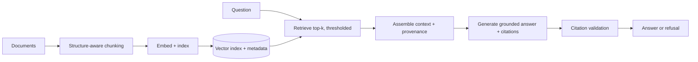

# Project P01 — Document Q&A Assistant

| | |
|---|---|
| **Tier** | Beginner |
| **Maturity level** | 2 — Build |
| **Estimated effort** | 2 weekends |
| **Prerequisite chapters** | [3.5 Embeddings & Semantic Search](../../curriculum/part-3-core-building-blocks-of-genai/chapter-05-embeddings-semantic-search.md), [3.6 RAG Fundamentals](../../curriculum/part-3-core-building-blocks-of-genai/chapter-06-rag-fundamentals.md) |
| **Skills exercised** | Chunking, embeddings, grounding, citation, "I don't know" behavior |

## Business Problem

A team has a policy/handbook corpus (dozens of documents) that people constantly ask questions about — and they either can't find the answer or misremember it. "What's our remote-work policy?" gets asked in Slack ten times a week. The value: a Q&A assistant that answers from the documents with citations, and — crucially — says "I don't know" rather than guessing when the answer isn't in the corpus. KPI moved: time-to-answer for policy questions, and a reduction in repeated Slack questions.

**Suggested corpus/dataset:** assemble your own from public policy documents — e.g., GitLab's public employee handbook or US federal HR policy documents; a few dozen files is enough.

## Requirements

### Functional
- FR-1: Ingest a document corpus (PDFs, markdown) into a searchable index.
- FR-2: Answer questions grounded in the corpus, with citations to the source document/section.
- FR-3: Refuse (say "not in the documents") when no relevant content is retrieved.

### Non-functional
- NFR-1 (Grounding): Answers cite sources; no ungrounded claims — faithfulness on the golden set ≥90%.
- NFR-2 (Refusal): On no-answer questions, refuses in ≥90% of cases (rather than improvising).
- NFR-3 (Latency): p95 < 4s.
- NFR-4 (Cost ceiling): < $50/month at expected volume (small team).

## Architecture Diagram

Build the 3.6 RAG loop: chunk → embed → index → retrieve → assemble → generate with citations → validate. Implement the explicit empty-case (refuse when nothing clears the threshold).

## Technology Choices

| Concern | Choice | Alternatives considered | Why |
|---------|--------|------------------------|-----|
| Embedding model | A general embedding model (bake off on your corpus) | Multiple providers | Bake off on your own docs (2.4/3.5) |
| Vector store | A local library (FAISS) or a simple managed store | Dedicated vector DB | Small corpus — local is sufficient (5.6) |
| LLM | A capable mid-tier model | Frontier | Mid-tier suffices for grounded Q&A; tier by evals (3.10) |

## Security

Low-risk (internal, non-sensitive corpus assumed). Apply the [security checklist](../../checklists/security-checklist.md): fence the retrieved content and the question (data-not-instructions — 3.3), validate citations (no fabricated references). If the corpus has any sensitive content, add ACL scoping (4.1).

## Deployment

Simple: a service (container) + the vector index. Environments: dev + prod. Apply the [deployment checklist](../../checklists/deployment-checklist.md): version the prompt, model, and index together (5.7's manifest, even minimally).

## Monitoring

Apply the [evaluation checklist](../../checklists/evaluation-checklist.md): build a golden set (real questions + expected answers, including no-answer questions), measure faithfulness and refusal calibration. Log traces (question, retrieved chunks, answer, citations — 4.10) for debugging.

## Estimated Cost

| Item | Assumption | Monthly estimate |
|------|-----------|------------------|
| Inference | ~500 questions/mo, mid-tier, ~3K tokens each | ~$5 |
| Embedding (initial + incremental) | Small corpus | ~$2 |
| Hosting | Small service | ~$20 |
| **Total** | | **~$27** |

Dominant: hosting. First optimization: prompt caching if the corpus context is stable (2.5/4.11).

## Future Improvements

1. Hybrid retrieval (add lexical for identifiers/names — 4.2).
2. Freshness pipeline (auto-reindex on document changes — 7.7).
3. Feedback capture (thumbs → golden set — 7.7).

## Definition of Done

- [ ] All functional requirements demonstrated end-to-end
- [ ] Golden set exists (including no-answer questions); faithfulness + refusal measured
- [ ] Citation validation implemented (no fabricated citations)
- [ ] Refuses on no-answer questions (demonstrated)
- [ ] Traces logged for debugging
- [ ] Cost measured against estimate
- [ ] README lets another engineer run it in <15 minutes

**Related case study:** [CS05 Hospital Knowledge Hub](../../case-studies/cs05-hospital-knowledge-hub.md)
