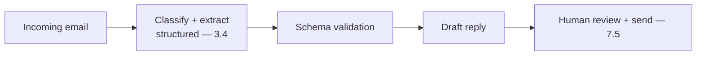

# Project P02 — Support Email Triage & Draft

| | |
|---|---|
| **Tier** | Beginner |
| **Maturity level** | 2 — Build |
| **Estimated effort** | 2 weekends |
| **Prerequisite chapters** | [3.3 Prompt Engineering](../../curriculum/part-3-core-building-blocks-of-genai/chapter-03-prompt-engineering.md), [3.4 Structured Outputs](../../curriculum/part-3-core-building-blocks-of-genai/chapter-04-structured-outputs.md) |
| **Skills exercised** | Structured outputs, classification, draft-not-send |

## Business Problem

A support team manually triages incoming emails (categorize, prioritize, extract details) and drafts responses — slow and inconsistent. The value: classify incoming email, extract key fields, and draft a reply for a human to review and send (draft-not-send). KPI moved: triage time, response consistency.

**Suggested corpus/dataset:** synthesize 100–200 inbound support emails against a public product's documentation (labels come free from the synthesis); the Enron email corpus supplies realistic email tone and formatting to mimic.

## Requirements

### Functional
- FR-1: Classify incoming email (category, urgency).
- FR-2: Extract structured fields (customer, issue, product).
- FR-3: Draft a reply for human review (draft-not-send — 7.5).

### Non-functional
- NFR-1 (Structured output): Reliable JSON classification/extraction (schema-validated — 3.4).
- NFR-2 (Draft quality): Drafts are review-ready (human edits and sends).
- NFR-3 (Latency): p95 < 5s.
- NFR-4 (Cost ceiling): < $30/month at small volume.

## Architecture Diagram

Prompt chaining (7.3): classify+extract (structured — 3.4) → draft. Draft-not-send: a human reviews and sends every reply.

## Technology Choices

| Concern | Choice | Alternatives | Why |
|---------|--------|--------------|-----|
| LLM | Mid-tier with structured output mode | Frontier | Mid-tier suffices; structured mode for reliable JSON (3.4) |
| Structured output | Provider schema mode | JSON-in-prompt | Guaranteed schema (3.4 rung 2) |

## Security

Fence the email content (untrusted input — 3.3/4.9); an email could contain injection. Draft-not-send bounds the blast radius (no autonomous send). Apply the [security checklist](../../checklists/security-checklist.md).

## Deployment

Service + email integration. Draft-not-send means no autonomous action. Apply the [deployment checklist](../../checklists/deployment-checklist.md).

## Monitoring

Golden set of emails with expected classifications/extractions; measure classification accuracy (2.7's confusion matrix), extraction accuracy (span-check), draft quality (human edit rate). Traces logged.

## Estimated Cost

| Item | Assumption | Monthly |
|------|-----------|---------|
| Inference | ~1K emails/mo, chained | ~$8 |
| Hosting | Small service | ~$20 |
| **Total** | | **~$28** |

## Future Improvements

1. Routing to specialized handlers per category (7.3).
2. Auto-send for high-confidence, low-risk categories (with evidence — 4.4/7.5).
3. Feedback loop (human edits → improve — 7.7).

## Definition of Done

- [ ] Classification + extraction with schema validation
- [ ] Drafts generated for human review (draft-not-send)
- [ ] Email content fenced (injection test passes)
- [ ] Golden set; classification/extraction accuracy measured
- [ ] Cost measured
- [ ] README runnable in <15 min

**Related case study:** [CS09 Retail Bank Support Assistant](../../case-studies/cs09-retail-bank-support-assistant.md)
