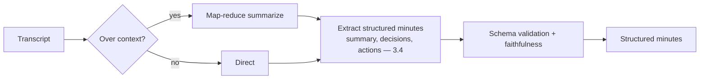

# Project P03 — Meeting Intelligence Pipeline

| | |
|---|---|
| **Tier** | Beginner |
| **Maturity level** | 2 — Build |
| **Estimated effort** | 2 weekends |
| **Prerequisite chapters** | [3.2 Tokens, Context & Sampling](../../curriculum/part-3-core-building-blocks-of-genai/chapter-02-tokens-context-sampling.md), [3.4 Structured Outputs](../../curriculum/part-3-core-building-blocks-of-genai/chapter-04-structured-outputs.md) |
| **Skills exercised** | Summarization, schema outputs, long-input handling |

## Business Problem

Meeting transcripts are long and rarely turned into actionable outputs; decisions and action items get lost. The value: transform a transcript into structured minutes — summary, decisions, action items (with owners) — in a consistent format. KPI moved: follow-through on action items, meeting documentation time.

**Suggested corpus/dataset:** the AMI Meeting Corpus (public, ~100 hours of meetings with transcripts); transcripts of public city-council or standards-body meetings also work.

## Requirements

### Functional
- FR-1: Ingest a meeting transcript (long input — context handling — 3.2).
- FR-2: Produce structured minutes: summary, decisions, action items (owner, task).
- FR-3: Handle long transcripts (chunking/map-reduce if over context).

### Non-functional
- NFR-1 (Faithfulness): Minutes faithful to the transcript (no invented decisions/actions).
- NFR-2 (Structure): Reliable structured output (3.4).
- NFR-3 (Long-input): Handles transcripts exceeding context (3.2).
- NFR-4 (Cost ceiling): < $30/month.

## Architecture Diagram

Prompt chaining (7.3) with long-input handling (map-reduce for over-context — 3.2). Structured extraction (3.4) with evidence-first ordering (decisions/actions grounded in the transcript).

## Technology Choices

| Concern | Choice | Alternatives | Why |
|---------|--------|--------------|-----|
| LLM | Mid-tier, long context | Frontier | Mid-tier suffices; long context for transcripts (3.2) |
| Long-input | Map-reduce or long-context | Truncation | Map-reduce for very long; long-context otherwise (3.2) |

## Security

Transcripts may contain sensitive discussion — govern the data (4.14). Fence the transcript content.

## Deployment

Batch or on-demand pipeline. Apply the [deployment checklist](../../checklists/deployment-checklist.md).

## Monitoring

Golden set of transcripts with expected minutes; measure faithfulness (no invented decisions/actions — span-check to transcript), structure validity. Traces logged.

## Estimated Cost

| Item | Assumption | Monthly |
|------|-----------|---------|
| Inference | ~200 meetings/mo, long transcripts | ~$10 |
| Hosting | Small service | ~$20 |
| **Total** | | **~$30** |

## Future Improvements

1. Action-item tracking (route to task systems — 6.4).
2. Multi-meeting synthesis (themes across meetings).
3. Speaker attribution (multimodal audio — 3.9).

## Definition of Done

- [ ] Structured minutes (summary, decisions, actions) with schema validation
- [ ] Long transcripts handled (map-reduce or long-context)
- [ ] Faithfulness measured (no invented decisions/actions — span-checked)
- [ ] Golden set
- [ ] Cost measured
- [ ] README runnable in <15 min

**Related case study:** [CS41 Incident Postmortem Assistant](../../case-studies/cs41-incident-postmortem-assistant.md)
