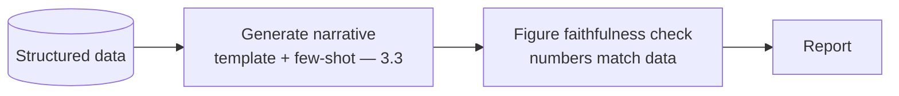

# Project P04 — Report Generator

| | |
|---|---|
| **Tier** | Beginner |
| **Maturity level** | 2 — Build |
| **Estimated effort** | 1–2 weekends |
| **Prerequisite chapters** | [3.3 Prompt Engineering](../../curriculum/part-3-core-building-blocks-of-genai/chapter-03-prompt-engineering.md) |
| **Skills exercised** | Prompt templates, few-shot, factual grounding in data |

## Business Problem

Teams produce recurring narrative reports (weekly status, monthly business review) from structured data — repetitive, and the data must be reported accurately. The value: generate the narrative report from data + a template, with figure faithfulness (numbers match the data). KPI moved: reporting time, consistency.

## Requirements

### Functional
- FR-1: Generate a narrative report from structured data + a template.
- FR-2: Figure faithfulness (numbers in narrative match the data).
- FR-3: Consistent format/voice (few-shot examples).

### Non-functional
- NFR-1 (Figure faithfulness): Numbers match the source data exactly (verified).
- NFR-2 (Consistency): Consistent format/voice.
- NFR-3 (Cost ceiling): < $20/month.

## Architecture Diagram

Prompt-templated generation (3.3, few-shot for consistency) + figure-faithfulness check (numbers match the data — the accuracy control, like CS48).

## Technology Choices

| Concern | Choice | Alternatives | Why |
|---------|--------|--------------|-----|
| LLM | Mid-tier | Frontier | Templated generation; mid-tier suffices |
| Grounding | Data injected + figure check | Free generation | Figures must match data (faithfulness) |

## Security

Low-risk if data is non-sensitive. Govern the data (4.14) if sensitive.

## Deployment

Scheduled or on-demand. Apply the [deployment checklist](../../checklists/deployment-checklist.md); version the prompt template.

## Monitoring

Golden set of data→report; measure figure faithfulness (numbers match), format consistency. The figure-faithfulness check is the key measurement.

## Estimated Cost

| Item | Assumption | Monthly |
|------|-----------|---------|
| Inference | ~100 reports/mo | ~$3 |
| Hosting | Minimal | ~$15 |
| **Total** | | **~$18** |

## Future Improvements

1. Forecast disclaimers (CS48).
2. Multi-format output (deck, email, doc).
3. Human review workflow (7.5).

## Definition of Done

- [ ] Report generated from data + template
- [ ] Figure faithfulness check (numbers match data)
- [ ] Consistent format (few-shot)
- [ ] Golden set; faithfulness measured
- [ ] Cost measured
- [ ] README runnable in <15 min

**Related case study:** [CS48 FP&A Narrative Reporting](../../case-studies/cs48-fpa-narrative-reporting.md)
