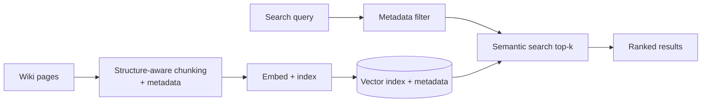

# Project P05 — Internal Knowledge Search

| | |
|---|---|
| **Tier** | Beginner |
| **Maturity level** | 2 — Build |
| **Estimated effort** | 2 weekends |
| **Prerequisite chapters** | [3.5 Embeddings & Semantic Search](../../curriculum/part-3-core-building-blocks-of-genai/chapter-05-embeddings-semantic-search.md) |
| **Skills exercised** | Embeddings, indexing, retrieval quality measurement |

## Business Problem

A team wiki is hard to search — keyword search misses relevant pages because people don't remember the exact words. The value: semantic search over the wiki with metadata filters, returning relevant pages by meaning. This is the foundational retrieval project (the RAG systems build on it). KPI moved: time to find information, search satisfaction.

**Suggested corpus/dataset:** an exported docs site of a large open-source project (e.g., the Kubernetes documentation) or a single-domain slice of a Wikipedia dump, with page metadata (section, date) preserved for the filters.

## Requirements

### Functional
- FR-1: Index a wiki corpus (semantic + metadata).
- FR-2: Semantic search returning relevant pages.
- FR-3: Metadata filters (by space, date, author).

### Non-functional
- NFR-1 (Retrieval quality): recall@5 measured on a golden set (3.5's binding constraint).
- NFR-2 (Latency): p95 < 1s.
- NFR-3 (Cost ceiling): < $30/month.

## Architecture Diagram

Semantic search (3.5): structure-aware chunking + embedding + metadata + filtered retrieval. Build the golden set and measure recall@k — the core retrieval-quality discipline.

## Technology Choices

| Concern | Choice | Alternatives | Why |
|---------|--------|--------------|-----|
| Embedding model | Bake off on the wiki | Multiple | Bake off on your corpus (2.4/3.5) |
| Vector store | Local library or managed | Dedicated DB | Small-medium corpus |

## Security

If the wiki has access controls, apply ACL-aware retrieval (4.1) — filter by user permissions. Otherwise low-risk.

## Deployment

Search service + index + ingestion pipeline. Apply the [deployment checklist](../../checklists/deployment-checklist.md); version the embedding model + chunker + index (5.6).

## Monitoring

Apply the [RAG design checklist](../../checklists/rag-design-checklist.md) (retrieval sections). Build the golden set (queries + judged relevant pages, hard negatives); measure recall@k and MRR (3.5). Monitor freshness (re-index on wiki changes).

## Estimated Cost

| Item | Assumption | Monthly |
|------|-----------|---------|
| Embedding (initial + incremental) | Wiki corpus | ~$5 |
| Vector store + hosting | Search service | ~$25 |
| **Total** | | **~$30** |

## Future Improvements

1. Hybrid retrieval (lexical + semantic — 4.2).
2. RAG on top (answer, not just search — 3.6 → becomes P01/P06).
3. ACL-aware retrieval if permissions matter (4.1).

## Definition of Done

- [ ] Semantic search with metadata filters
- [ ] Golden set (queries + judged pages + hard negatives)
- [ ] recall@k and MRR measured
- [ ] Freshness (re-index on changes)
- [ ] Cost measured
- [ ] README runnable in <15 min

**Related case study:** [CS05 Hospital Knowledge Hub](../../case-studies/cs05-hospital-knowledge-hub.md)
