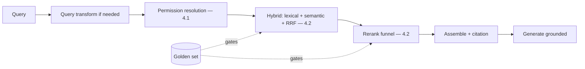

# Project P06 — Production RAG Service

| | |
|---|---|
| **Tier** | Intermediate |
| **Maturity level** | 2→3 — Build → Engineer |
| **Estimated effort** | 3–4 weekends |
| **Prerequisite chapters** | [4.1 Production RAG](../../curriculum/part-4-enterprise-genai-systems/chapter-01-production-rag.md), [4.2 Advanced Retrieval](../../curriculum/part-4-enterprise-genai-systems/chapter-02-advanced-retrieval.md) |
| **Skills exercised** | Advanced retrieval, access control, component evals |

## Business Problem

The Beginner RAG (P01) works for a small corpus but doesn't scale: multiple users with different permissions, a larger corpus, and quality that plateaus. The value: a production RAG service with hybrid search, reranking, ACL-aware retrieval, and a retrieval eval harness — the reference RAG implementation. KPI moved: answer quality (recall), permission compliance, and a reusable service other apps consume.

**Suggested corpus/dataset:** documentation of 2–3 open-source projects as separate "spaces" (simulate ACLs per space); MS MARCO passages if you want a large ready-made retrieval-eval corpus with relevance judgments.

## Requirements

### Functional
- FR-1: Hybrid retrieval (lexical + semantic, RRF — 4.2).
- FR-2: Reranking (cross-encoder funnel — 4.2).
- FR-3: ACL-aware retrieval (filter-before-similarity — 4.1).
- FR-4: A retrieval eval harness (recall@k, per-class — 4.2).

### Non-functional
- NFR-1 (Retrieval quality): recall@5 ≥ 0.9 on the golden set (4.2's improvement loop).
- NFR-2 (Permissions): Users see only permitted content; existence-leak-free (4.1).
- NFR-3 (Latency): p95 < 3s (funnel fits the budget — 4.12).
- NFR-4 (Cost): Attributed per consumer (4.11).

## Architecture Diagram

Production RAG (4.1) + advanced retrieval (4.2 — hybrid, reranked). Built as a service (the retrieval layer other apps consume). ACL-aware (filter-before-similarity). The eval harness (recall@k) gates changes.

## Technology Choices

| Concern | Choice | Alternatives | Why |
|---------|--------|--------------|-----|
| Retrieval | Hybrid (BM25 + vector, RRF) | Semantic only | Query-class coverage (4.2) |
| Reranker | Cross-encoder | None | Precision (4.2), justified by uplift |
| Vector store | Dedicated (pre-filtering) | Existing DB | ACL pre-filtering (5.6) |

## Security

Apply the [security checklist](../../checklists/security-checklist.md) and [RAG design checklist](../../checklists/rag-design-checklist.md): ACL-aware retrieval (filter-before-similarity), existence-leak prevention (4.1), fenced content. Test permissions adversarially.

## Deployment

Service with blue/green index deployments (4.1). Apply the [deployment checklist](../../checklists/deployment-checklist.md): version the artifact set (embedding + chunker + index — 5.6), eval-gate index changes.

## Monitoring

Retrieval eval harness (recall@k, MRR, per query class — 4.2), two-sided RAG evals if generation included (faithfulness, citation validity — 3.6). Per-consumer cost attribution (4.11). Freshness lag (4.1).

## Estimated Cost

| Item | Assumption | Monthly |
|------|-----------|---------|
| Inference (rerank + generation) | ~10K queries/mo | ~$40 |
| Vector store (hybrid, reranker) | Medium corpus | ~$60 |
| Hosting | Service | ~$50 |
| **Total** | | **~$150** |

Dominant: vector store + reranker. Optimization: rerank on flagged only, tiering (7.8).

## Future Improvements

1. Agentic retrieval for multi-hop (4.2).
2. Query transformations (rewriting — 4.2).
3. Feedback-to-dataset flywheel (7.7).

## Definition of Done

- [ ] Hybrid + reranked retrieval, recall@5 ≥ 0.9 measured
- [ ] ACL-aware retrieval; existence-leak test passes
- [ ] Eval harness gates retrieval changes
- [ ] Blue/green index deployment
- [ ] Per-consumer cost attribution
- [ ] Threat model reviewed; RAG + security checklists applied
- [ ] Dashboards live; freshness monitored
- [ ] Cost measured against estimate
- [ ] README runnable in <15 min

**Related case study:** [CS23 Contract Review Platform](../../case-studies/cs23-contract-review-platform.md)
