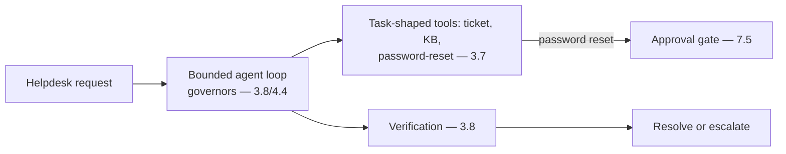

# Project P07 — IT Helpdesk Agent

| | |
|---|---|
| **Tier** | Intermediate |
| **Maturity level** | 2→3 — Build → Engineer |
| **Estimated effort** | 3–4 weekends |
| **Prerequisite chapters** | [3.8 Agents](../../curriculum/part-3-core-building-blocks-of-genai/chapter-08-agents-concepts.md), [4.4 Agent Architectures](../../curriculum/part-4-enterprise-genai-systems/chapter-04-agent-architectures-production.md) |
| **Skills exercised** | Tool design, bounded loops, human approval |

## Business Problem

IT helpdesk handles routine requests (ticket lookup, KB search, password reset) — an agent can resolve or advance many, with a human approving the consequential actions. The value: a tool-using agent that looks up tickets, searches the KB, and requests password resets — with approval gates on consequential actions. KPI moved: helpdesk resolution time, ticket deflection. This is Vantora's helpdesk agent (4.4).

**Suggested corpus/dataset:** no good public helpdesk-ticket corpus exists — export a public product's documentation as the KB and synthesize ~50 tickets (lookups, how-tos, reset requests) against it; keep the synthesis script as your golden-set generator.

## Requirements

### Functional
- FR-1: Tool-using agent (ticket lookup, KB search, password-reset request — task-shaped tools — 3.7).
- FR-2: Bounded loop (governors — 3.8).
- FR-3: Approval gate on password reset (consequential — 7.5).
- FR-4: Escalation for out-of-scope.

### Non-functional
- NFR-1 (Safety): Consequential actions gated (7.5); no autonomous password resets.
- NFR-2 (Bounded): Governors (caps, budgets, kill switch — 3.8).
- NFR-3 (Tool reliability): Election accuracy measured (3.7).
- NFR-4 (Traceability): Full trajectory logged (4.4).

## Architecture Diagram

Bounded agent (3.8/4.4) + task-shaped tools (3.7, consequence-classified) + approval gate (7.5, password reset) + verification (3.8). Apply the full [agent design checklist](../../checklists/agent-design-checklist.md).

## Technology Choices

| Concern | Choice | Alternatives | Why |
|---------|--------|--------------|-----|
| Tools | Task-shaped (6 tools) | API-mirror | Election accuracy (3.7) |
| Agent runtime | Bounded loop + governors | Framework | Understand the governors (3.8); framework evaluated (7.10) |

## Security

Apply the [security checklist](../../checklists/security-checklist.md) and [agent design checklist](../../checklists/agent-design-checklist.md): user-scoped tool credentials (3.7/6.6), consequence gates (password reset), fenced tool results (injection — 4.9), sandbox. Test the injection case (ticket content with instructions — 3.7).

## Deployment

Agent runtime with sandbox. Apply the [deployment checklist](../../checklists/deployment-checklist.md). Agent definition versioned (4.4).

## Monitoring

Fleet observability (4.4): trajectory logging, tool-election accuracy (3.7), verification-disagreement, exit distributions, approval-queue metrics (rubber-stamp monitoring — 7.5). Scenario suite for elections.

## Estimated Cost

| Item | Assumption | Monthly |
|------|-----------|---------|
| Agent inference | ~5K requests/mo, multi-step | ~$30 |
| Tools + trajectory | Systems, audit | ~$15 |
| Hosting | Runtime | ~$40 |
| **Total** | | **~$85** |

## Future Improvements

1. More tools (expand scope, consequence-classed).
2. Evidence-based auto-approval for earned classes (4.4).
3. Multi-agent for complex cases (4.5).

## Definition of Done

- [ ] Bounded agent with all four governors (3.8)
- [ ] Task-shaped tools; election accuracy measured (scenario suite)
- [ ] Approval gate on password reset; no autonomous consequential actions
- [ ] Injection test passes (fenced tool results)
- [ ] Trajectory logging; verification implemented
- [ ] Agent design + security checklists applied
- [ ] Cost measured
- [ ] README runnable in <15 min

**Related case study:** [CS31 Network Operations Copilot](../../case-studies/cs31-network-operations-copilot.md)
