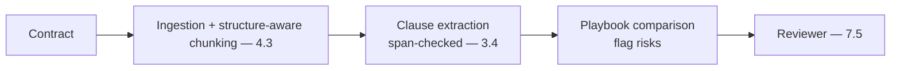

# Project P08 — Contract Analysis Pipeline

| | |
|---|---|
| **Tier** | Intermediate |
| **Maturity level** | 3 — Engineer |
| **Estimated effort** | 3–4 weekends |
| **Prerequisite chapters** | [4.3 Document Ingestion](../../curriculum/part-4-enterprise-genai-systems/chapter-03-document-ingestion.md), [3.4 Structured Outputs](../../curriculum/part-3-core-building-blocks-of-genai/chapter-04-structured-outputs.md) |
| **Skills exercised** | Document ingestion, structured extraction, review UX |

## Business Problem

Contracts are dense; extracting clauses, flagging risks, and comparing against a playbook is manual. The value: a pipeline that extracts clauses, flags risks, and compares against a playbook for a reviewer. KPI moved: contract review time, risk-flagging consistency. (Scaled-down CS23.)

**Suggested corpus/dataset:** CUAD (Contract Understanding Atticus Dataset) — ~500 real contracts with expert clause annotations; point your playbook rules at its labeled clause categories.

## Requirements

### Functional
- FR-1: Ingest and extract clauses (structure-aware, span-checked — 3.4/4.3).
- FR-2: Flag risks/deviations against a playbook.
- FR-3: Reviewer workflow (reviewer decides — 7.5).

### Non-functional
- NFR-1 (Extraction accuracy): Span-checked (no fabricated clauses — 3.4).
- NFR-2 (Recall on risks): High recall on risky clauses.
- NFR-3 (Citation): Clauses cited to source location.

## Architecture Diagram

Ingestion (4.3, structure-aware for clauses) + extraction (3.4, span-checked) + playbook comparison + reviewer (7.5).

## Technology Choices

| Concern | Choice | Alternatives | Why |
|---------|--------|--------------|-----|
| Extraction | Structure-aware + span-check | Naive | Clause integrity + anti-fabrication (3.4/4.3) |
| Comparison | RAG over playbook | Rules | Flexible playbook matching |

## Security

Contracts are confidential — govern the data (4.14), fence content. Apply the [security checklist](../../checklists/security-checklist.md).

## Deployment

Pipeline + reviewer UI. Apply the [deployment checklist](../../checklists/deployment-checklist.md).

## Monitoring

Golden set of contracts with expected clauses/risks; measure extraction accuracy (span-check), risk recall, citation validity. Reviewer flag-acceptance.

## Estimated Cost

| Item | Assumption | Monthly |
|------|-----------|---------|
| Inference | ~500 contracts/mo, document-heavy | ~$40 |
| Ingestion + retrieval | Playbook, contracts | ~$15 |
| Hosting | Pipeline + UI | ~$45 |
| **Total** | | **~$100** |

## Future Improvements

1. Reranking for risk relevance (4.2).
2. Multi-hop for cross-reference clauses (4.2/3.8).
3. Contract obligations tracking (CS49).

## Definition of Done

- [ ] Clause extraction with span-checks
- [ ] Risk flagging against playbook; high recall measured
- [ ] Clauses cited to source
- [ ] Reviewer workflow (reviewer decides)
- [ ] Golden set; extraction + risk-recall measured
- [ ] Cost measured
- [ ] README runnable in <15 min

**Related case study:** [CS23 Contract Review Platform](../../case-studies/cs23-contract-review-platform.md)
