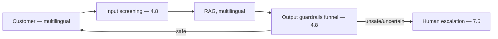

# Project P09 — Multilingual Support Assistant

| | |
|---|---|
| **Tier** | Intermediate |
| **Maturity level** | 3 — Engineer |
| **Estimated effort** | 3 weekends |
| **Prerequisite chapters** | [4.8 Guardrails & Content Safety](../../curriculum/part-4-enterprise-genai-systems/chapter-08-guardrails-content-safety.md), [2.4 NLP Essentials](../../curriculum/part-2-artificial-intelligence/chapter-04-nlp-essentials.md) |
| **Skills exercised** | Guardrails, safety, multilingual evals |

## Business Problem

A customer-facing support bot must handle multiple languages, stay safe (no harmful/off-policy content), and escalate when needed. The value: a multilingual, guarded support assistant with escalation. KPI moved: deflection, safety, multilingual coverage. (Customer-facing — the guardrail and multilingual project.)

## Requirements

### Functional
- FR-1: Answer support questions (RAG, multilingual).
- FR-2: Guardrails (safety, off-policy — 4.8).
- FR-3: Escalation to humans (7.5).
- FR-4: Multilingual (top languages, per-language quality — 2.4).

### Non-functional
- NFR-1 (Safety): Zero unsafe outputs (adversarial suite — 4.8).
- NFR-2 (Multilingual): Per-language quality floors (2.4).
- NFR-3 (Deflection): Paired with CSAT (1.2).

## Architecture Diagram

RAG (multilingual) + layered guardrails (4.8 funnel) + escalation (7.5). Per-language evals (2.4). Apply the [security checklist](../../checklists/security-checklist.md) (abuse/safety).

## Technology Choices

| Concern | Choice | Alternatives | Why |
|---------|--------|--------------|-----|
| Model | Multilingual, bake off per language | English-centric | Per-language coverage (2.4) |
| Guardrails | Funnel (rules → classifier → LLM) | Single-tier | Economics + coverage (4.8) |

## Security

Apply the [security checklist](../../checklists/security-checklist.md): safety guardrails (4.8), injection resistance (4.9, customer-facing untrusted input), fenced input. Bypass sampling (4.8).

## Deployment

Customer-facing service. Apply the [deployment checklist](../../checklists/deployment-checklist.md); staged rollout (4.4).

## Monitoring

Safety + quality: unsafe-output rate (zero, bypass-sampled — 4.8), per-language quality (2.4), deflection paired with CSAT (1.2), escalation quality. Guardrail trigger rates (4.8).

## Estimated Cost

| Item | Assumption | Monthly |
|------|-----------|---------|
| Inference | ~50K conversations/mo, tiered | ~$40 |
| Guardrails | Per-message funnel | ~$15 |
| Hosting + retrieval | Service, corpus | ~$45 |
| **Total** | | **~$100** |

## Future Improvements

1. More languages (per-language floors).
2. Account tools with gates (CS09).
3. Semantic caching for FAQ (7.8).

## Definition of Done

- [ ] Multilingual RAG with per-language quality floors
- [ ] Layered guardrails; zero unsafe outputs (adversarial suite)
- [ ] Escalation; deflection paired with CSAT
- [ ] Injection resistance (customer-facing); bypass sampling
- [ ] Security checklist applied
- [ ] Cost measured
- [ ] README runnable in <15 min

**Related case study:** [CS02 Patient Portal Triage Chatbot](../../case-studies/cs02-patient-portal-triage-chatbot.md)
