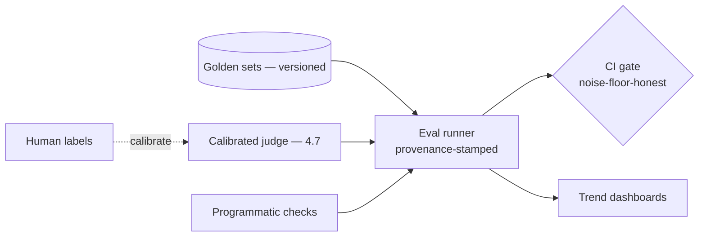

# Project P10 — Evaluation Harness

| | |
|---|---|
| **Tier** | Intermediate |
| **Maturity level** | 3 — Engineer |
| **Estimated effort** | 3–4 weekends |
| **Prerequisite chapters** | [4.7 Evaluation Systems & LLM-as-Judge](../../curriculum/part-4-enterprise-genai-systems/chapter-07-evaluation-systems.md), [2.7 Evaluating ML Systems](../../curriculum/part-2-artificial-intelligence/chapter-07-evaluating-ml-systems.md) |
| **Skills exercised** | Eval design, judge validation, regression detection |

## Business Problem

Every GenAI system needs evals, but teams reinvent them. The value: a reusable evaluation harness — golden sets, LLM-as-judge (calibrated), CI gates, dashboards — that any project can consume. This is the eval platform (4.7), the precondition for everything else's velocity. KPI moved: eval consistency, regression prevention across projects.

**Suggested corpus/dataset:** the harness consumes other projects' golden sets — seed it with P01/P06's; for judge-calibration practice, SQuAD 2.0's answerable/unanswerable questions provide ready-made human labels to calibrate a refusal-dimension judge against.

## Requirements

### Functional
- FR-1: Golden-set management (versioned, stratified — 4.7).
- FR-2: LLM-as-judge (calibrated against human labels — 4.7/2.7).
- FR-3: CI gates (threshold, noise-floor-honest — 2.7).
- FR-4: Trend dashboards (4.10).

### Non-functional
- NFR-1 (Judge calibration): Judge validated against human labels per dimension (4.7).
- NFR-2 (Provenance): Every result carries system/instrument/dataset/rubric versions (4.7).
- NFR-3 (Noise floor): Gates sized to the deltas they detect (2.7).

## Architecture Diagram

The eval platform (4.7): supply chain (golden sets), instrument fleet (judges + programmatic), consumers (gates, dashboards). Judge calibration and four-way provenance are core.

## Technology Choices

| Concern | Choice | Alternatives | Why |
|---------|--------|--------------|-----|
| Judge | Decomposed dimensions, calibrated | Mega-judge | Diagnosability + validation (4.7) |
| Gates | Threshold + trend, sized | Deterministic | Probabilistic outputs (5.7) |

## Security

Golden sets may contain sensitive data — classify and access-control (4.7/4.14).

## Deployment

A service/library consumed by projects; wired into CI (5.7). Apply the [deployment checklist](../../checklists/deployment-checklist.md).

## Monitoring

The harness monitors others; monitor the harness itself: judge calibration status, eval-run cost, gate outcomes. Apply the [evaluation checklist](../../checklists/evaluation-checklist.md) (this project implements it).

## Estimated Cost

| Item | Assumption | Monthly |
|------|-----------|---------|
| Judge inference | Eval runs (batch) | ~$25 |
| Human labeling | Calibration | (labor) |
| Hosting | Service | ~$40 |
| **Total** | | **~$65 + labeling** |

## Future Improvements

1. Production sampling into golden sets (4.7's supply chain).
2. Offline↔online correlation checks (4.7).
3. Shared eval service for the org (7.9).

## Definition of Done

- [ ] Versioned golden sets; provenance quadruple on every result
- [ ] Calibrated judge (agreement measured per dimension)
- [ ] CI gates, noise-floor-honest
- [ ] Trend dashboards
- [ ] Wired into a project's CI (demonstrated)
- [ ] Evaluation checklist implemented
- [ ] Cost measured
- [ ] README runnable in <15 min

**Related case study:** [CS39 Internal Developer Copilot Platform](../../case-studies/cs39-internal-developer-copilot-platform.md)
