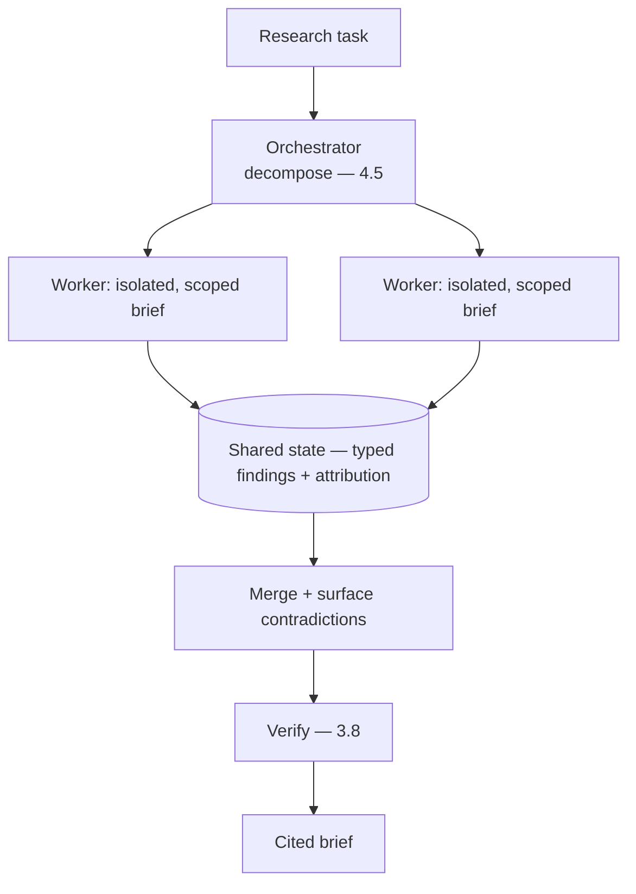

# Project P11 — Multi-agent Research Assistant

| | |
|---|---|
| **Tier** | Advanced |
| **Maturity level** | 3 — Engineer |
| **Estimated effort** | 4 weekends |
| **Prerequisite chapters** | [4.5 Multi-Agent Systems](../../curriculum/part-4-enterprise-genai-systems/chapter-05-multi-agent-systems.md), [4.4 Agent Architectures](../../curriculum/part-4-enterprise-genai-systems/chapter-04-agent-architectures-production.md) |
| **Skills exercised** | Multi-agent coordination, trajectory evals |

## Business Problem

Research tasks (gather from many sources, verify, synthesize) benefit from parallel exploration. The value: an orchestrator-workers research assistant that fans out research across sources, verifies, and produces a cited brief. KPI moved: research throughput. **Critically**: prove the multi-agent structure beats a single agent (4.5's baseline discipline) — don't build multi-agent theater.

**Suggested corpus/dataset:** a fixed offline source pool beats the live web for reproducible evals — a Wikipedia-dump slice plus arXiv abstracts in one topic area, with 10–20 research questions whose answers you can verify by hand.

## Requirements

### Functional
- FR-1: Orchestrator decomposes research into subtasks; workers gather in parallel (4.5).
- FR-2: Source verification (evidence-attributed).
- FR-3: Merge with contradiction surfacing (4.5).
- FR-4: Cited final brief.

### Non-functional
- NFR-1 (Justified structure): The multi-agent structure beats a single-agent baseline on evals (4.5).
- NFR-2 (Attribution): Findings attributed to sources (verification — 3.8).
- NFR-3 (Tree governance): Budgets/trajectories tree-structured (4.5/4.4).

## Architecture Diagram

Orchestrator-workers (4.5): scoped briefs, isolated worker contexts, typed attributed findings, contradiction-surfacing merge, independent verification. Tree-structured governance (4.4).

## Technology Choices

| Concern | Choice | Alternatives | Why |
|---------|--------|--------------|-----|
| Decomposition | Deterministic where known, else orchestrator | Model-only | Code decomposes known structures (4.5) |
| Coordination | Structured shared state | Transcript-sharing | Contamination control (4.5) |

## Security

Apply the [security checklist](../../checklists/security-checklist.md) and [agent design checklist](../../checklists/agent-design-checklist.md): read-only tools (research), fenced sources (injection — 4.9), contamination control (span-checks — 4.5).

## Deployment

Agent platform (on P16 or standalone). Apply the [deployment checklist](../../checklists/deployment-checklist.md).

## Monitoring

Per-role + end-to-end evals (4.5): decomposition quality, worker faithfulness, merge quality, contradiction detection, contamination traces. Tree-structured trajectory/cost (4.4). The single-agent baseline comparison is the key eval.

## Estimated Cost

| Item | Assumption | Monthly |
|------|-----------|---------|
| Agent inference (fan-out) | Research tasks × workers | ~$70 |
| Tools + trajectory | Sources, audit | ~$20 |
| **Total** | | **~$90** |

Dominant: fan-out cost. Optimization: bounded workers, tiering (7.8).

## Future Improvements

1. Wider fan-out for larger research.
2. Bounded investigation agent for the hard residue (4.5).
3. GraphRAG for cross-document synthesis (7.2).

## Definition of Done

- [ ] Orchestrator-workers with scoped briefs, isolated contexts, attributed findings
- [ ] Merge surfaces contradictions; independent verification
- [ ] Single-agent baseline measured; multi-agent structure justified (4.5)
- [ ] Tree-structured budgets/trajectories
- [ ] Contamination controlled (span-checks)
- [ ] Agent + security checklists applied
- [ ] Cost measured
- [ ] README runnable in <15 min

**Related case study:** [CS17 Quality Incident Analysis](../../case-studies/cs17-quality-incident-analysis.md)
