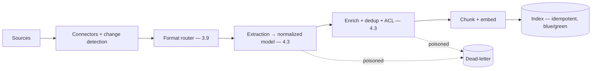

# Project P12 — Enterprise Ingestion Platform

| | |
|---|---|
| **Tier** | Advanced |
| **Maturity level** | 3 — Engineer |
| **Estimated effort** | 4–5 weekends |
| **Prerequisite chapters** | [4.3 Document Ingestion](../../curriculum/part-4-enterprise-genai-systems/chapter-03-document-ingestion.md), [5.5 Data Architecture](../../curriculum/part-5-cloud-infrastructure-platform/chapter-05-data-architecture.md) |
| **Skills exercised** | Pipelines, idempotency, index lifecycle |

## Business Problem

Real enterprise corpora are messy (formats, tables, duplicates, freshness, deletion) — naive ingestion produces poor retrieval. The value: an industrial ingestion platform handling the format zoo, dedup, freshness, and deletion, feeding the retrieval service (P06). KPI moved: corpus quality (which caps retrieval — 3.5), ingestion reliability.

**Suggested corpus/dataset:** SEC EDGAR filings — a public, realistic format zoo (HTML, PDF exhibits, heavy tables); inject duplicates and near-duplicates yourself to exercise dedup, and scanned pages to exercise the OCR path.

## Requirements

### Functional
- FR-1: Format routing (digital, scanned, office, tables — 4.3/3.9).
- FR-2: Extraction with a normalized document model (4.3).
- FR-3: Dedup (exact + near, canonicalization — 4.3).
- FR-4: Freshness (change detection, re-index) + deletion propagation (4.1/4.3).

### Non-functional
- NFR-1 (Idempotency): Stages idempotent on stable identity (4.3).
- NFR-2 (Failure isolation): Dead-letter lane; per-source DLQ monitoring (4.3).
- NFR-3 (Reprocessing): Stage-targeted reprocessing (4.3).
- NFR-4 (Deletion): Propagation verified by probes (4.1).

## Architecture Diagram

Industrial ingestion (4.3): format router, normalized document model, dedup, idempotent stages, DLQ, reprocessing campaigns, deletion propagation. Apply the [RAG design checklist](../../checklists/rag-design-checklist.md) (corpus/ingestion).

## Technology Choices

| Concern | Choice | Alternatives | Why |
|---------|--------|--------------|-----|
| Extraction | Format router (vision for tables) | Blanket | Route by structure (3.9/4.3) |
| Orchestration | Durable pipeline (4.6) | Ad-hoc | Reliability, reprocessing |

## Security

ACL resolution + sensitive-content scanning at ingestion (4.3). Apply the [security checklist](../../checklists/security-checklist.md).

## Deployment

Pipeline platform. Apply the [deployment checklist](../../checklists/deployment-checklist.md): normalized model as internal contract, blue/green index.

## Monitoring

Ingestion observability (4.3): per-source/stage DLQ rates, freshness lag, extraction quality sampling, distribution monitors, deletion probes.

## Estimated Cost

| Item | Assumption | Monthly |
|------|-----------|---------|
| Extraction | Corpus volume, batch | ~$60 |
| Embedding + index | Medium-large corpus | ~$40 |
| Hosting | Pipeline | ~$50 |
| **Total** | | **~$150** |

## Future Improvements

1. GraphRAG ingestion (entity-relation — 7.7).
2. More source connectors.
3. Feedback-to-dataset (7.7).

## Definition of Done

- [ ] Format router with table path; normalized document model
- [ ] Idempotent stages; DLQ with per-source monitoring
- [ ] Dedup (exact + near, canonicalized)
- [ ] Freshness + deletion propagation (probes pass)
- [ ] Stage-targeted reprocessing demonstrated
- [ ] ACL + sensitive-content scanning at ingestion
- [ ] RAG design + security checklists applied
- [ ] Cost measured
- [ ] README runnable in <15 min

**Related case study:** [CS16 Supplier Document Intelligence](../../case-studies/cs16-supplier-document-intelligence.md)
