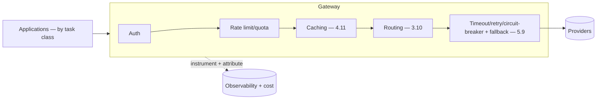

# Project P13 — GenAI Gateway

| | |
|---|---|
| **Tier** | Advanced |
| **Maturity level** | 3 — Engineer |
| **Estimated effort** | 4–5 weekends |
| **Prerequisite chapters** | [5.4 API & Integration Layer](../../curriculum/part-5-cloud-infrastructure-platform/chapter-04-api-integration-layer.md), [4.11 Cost Engineering](../../curriculum/part-4-enterprise-genai-systems/chapter-11-cost-engineering.md) |
| **Skills exercised** | Model tiering, caching, resilience, metering |

## Business Problem

Applications talking directly to model providers re-implement (or skip) the cross-cutting concerns — routing, caching, cost, observability, resilience. The value: a GenAI gateway centralizing these, with task-class routing, caching, failover, and cost metering. This is Vantora's gateway (5.4) — the platform keystone. KPI moved: cost (caching/tiering), model reversibility, cost attribution.

**Suggested corpus/dataset:** none external — build a replay set of ~1,000 requests sampled from your P01/P02/P06 golden sets, adding paraphrase clusters so the semantic cache has genuine near-duplicates to find (and near-misses it must not conflate).

## Requirements

### Functional
- FR-1: Task-class routing (applications call by task class, not model ID — 3.10/5.4).
- FR-2: Caching (prompt + semantic — 4.11).
- FR-3: Resilience (timeout, retry, circuit breaker, fallback — 5.9).
- FR-4: Cost metering per consumer (4.11).

### Non-functional
- NFR-1 (Reversibility): Model swappable behind task class without app changes (3.10).
- NFR-2 (Capacity): Provider limits pooled, lane-allocated (5.4).
- NFR-3 (Reliability): Highest tier (5.9); gateway-added latency overhead p95 ≤ 50 ms / p99 ≤ 100 ms, excluding model time (4.12).
- NFR-4 (Non-bypassable): Direct provider access blocked (5.4).
- NFR-5 (Failover): Circuit breaker trips to the fallback provider automatically within 30 s of sustained provider failure; in-flight requests drain or retry — none dropped beyond a 0.1% monthly error budget (5.9).
- NFR-6 (Cache effectiveness): ≥30% combined hit rate on the replay set (semantic tier ≥20% of hits), with a semantic false-hit rate ≤1% on a paraphrase/near-miss suite.

## Architecture Diagram

The gateway (5.4): routing, auth, rate limits, caching, resilience, observability, cost attribution. Applications call by task class (the reversibility keystone).

## Technology Choices

| Concern | Choice | Alternatives | Why |
|---------|--------|--------------|-----|
| Build vs. buy | Build (or adopt with lock-in care) | Product | Central component (5.4/7.10) |
| Routing | Task-class config | Hard-coded | Reversibility (3.10) |

## Security

Non-bypassable (network egress control — 5.1); auth + identity propagation (6.6). Apply the [security checklist](../../checklists/security-checklist.md).

## Deployment

Critical shared service — highest reliability (5.9), on every path. Apply the [deployment checklist](../../checklists/deployment-checklist.md).

## Monitoring

Observability (4.10): per-consumer cost/usage, latency (gateway overhead), cache hit rate, routing distribution, provider failover events, circuit-breaker state.

## Estimated Cost

| Item | Assumption | Monthly |
|------|-----------|---------|
| Gateway operation | Service (the inference cost is the consumers') | ~$60 |
| **Total** | | **~$60 (platform op) + consumer inference** |

The gateway *reduces* consumer cost (caching, tiering — 4.11).

## Future Improvements

1. Multi-provider failover (5.9).
2. Chargeback (7.9).
3. Central model governance (3.10/7.9).

## Definition of Done

- [ ] Task-class routing; model swappable without app changes
- [ ] Caching (prompt + semantic); ≥30% hit rate on the replay set, semantic false-hit rate ≤1% measured
- [ ] Resilience (circuit breaker → fallback); failover demonstrated: automatic within 30 s, no in-flight requests dropped beyond the 0.1% error budget
- [ ] Gateway latency overhead measured: p95 ≤ 50 ms excluding model time
- [ ] Cost metering per consumer
- [ ] Non-bypassable (egress control)
- [ ] Lane allocation (interactive protected)
- [ ] Security checklist applied; highest reliability tier
- [ ] Cost measured
- [ ] README runnable in <15 min

**Related case study:** [CS32 Customer Care Deflection](../../case-studies/cs32-customer-care-deflection.md)
