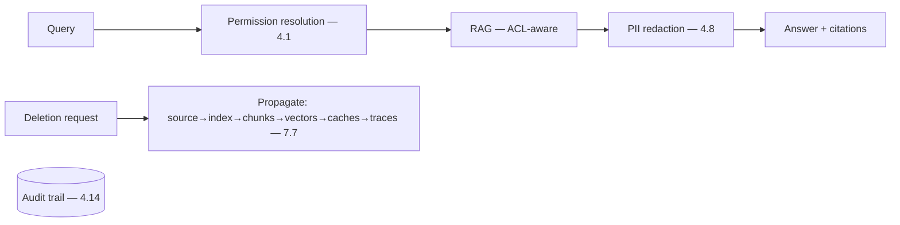

# Project P14 — Compliance-aware RAG

| | |
|---|---|
| **Tier** | Advanced |
| **Maturity level** | 3 — Engineer |
| **Estimated effort** | 4 weekends |
| **Prerequisite chapters** | [4.14 Privacy, Compliance & Governance](../../curriculum/part-4-enterprise-genai-systems/chapter-14-privacy-compliance-governance.md), [4.1 Production RAG](../../curriculum/part-4-enterprise-genai-systems/chapter-01-production-rag.md) |
| **Skills exercised** | Privacy engineering, governance evidence |

## Business Problem

A RAG system over personal data must meet privacy obligations — PII redaction, audit trail, retention, right-to-be-forgotten. The value: a compliance-aware RAG demonstrating the full privacy/governance architecture. KPI moved: deployability in regulated contexts (the governance is the license to operate — 4.14).

**Suggested corpus/dataset:** the Enron email corpus — real personal data (names, addresses, personal messages) in a public dataset, which makes redaction, retention, and right-to-be-forgotten exercises concrete.

## Requirements

### Functional
- FR-1: RAG over personal-data corpus (ACL-aware — 4.1).
- FR-2: PII redaction (before prompts and traces — 4.8/4.10).
- FR-3: Audit trail (every query reconstructable — 4.1/4.14).
- FR-4: Right-to-be-forgotten (deletion propagation — 7.7).

### Non-functional
- NFR-1 (Privacy): PII handled per obligations; data-flow diagrammed (4.14).
- NFR-2 (Deletion): Propagation through all stores, probed (7.7/4.1).
- NFR-3 (Auditability): Query audit reconstructable (4.1).
- NFR-4 (Evidence): Compliance evidence from engineering artifacts (4.14).

## Architecture Diagram

Compliance-aware RAG (4.14): the data-flow diagram, PII redaction, audit trail, deletion propagation. Apply the [security checklist](../../checklists/security-checklist.md) and the governance sections of Part 4/6.

## Technology Choices

| Concern | Choice | Alternatives | Why |
|---------|--------|--------------|-----|
| Provider | Contracted terms (no-training, in-region) | Any | Processor-transfer compliance (4.14) |
| Redaction | Detect + redact before prompts/traces | None | Data minimization (4.14) |

## Security

The whole project is security/privacy. Data-flow diagram, threat model, deletion propagation, redaction, audit. Apply the [security checklist](../../checklists/security-checklist.md) fully.

## Deployment

Governed deployment; classification-register entry (4.14). Apply the [deployment checklist](../../checklists/deployment-checklist.md).

## Monitoring

Compliance monitoring: PII-redaction effectiveness, deletion-propagation probes, audit-trail completeness, retention compliance. The deletion probes are the key compliance monitor.

## Estimated Cost

| Item | Assumption | Monthly |
|------|-----------|---------|
| Inference | RAG volume | ~$30 |
| Redaction + retrieval + audit | Governance overhead | ~$20 |
| Hosting | Service | ~$45 |
| **Total** | | **~$95** |

## Future Improvements

1. Model risk management overlay (4.14).
2. Consent-based personalization (4.14).
3. Cross-jurisdiction handling (5.11).

## Definition of Done

- [ ] ACL-aware RAG; data-flow diagram
- [ ] PII redaction (prompts + traces)
- [ ] Audit trail (query reconstructable)
- [ ] Right-to-be-forgotten (deletion propagation probed, passes)
- [ ] Compliance evidence assembled from artifacts
- [ ] Classification-register entry; security checklist applied
- [ ] Cost measured
- [ ] README runnable in <15 min

**Related case study:** [CS01 Clinical Documentation Assistant](../../case-studies/cs01-clinical-documentation-assistant.md)
