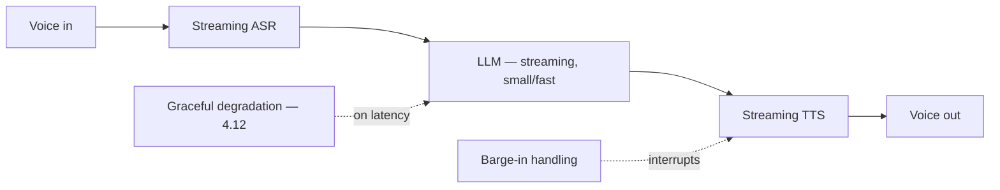

# Project P15 — Real-time Voice Assistant

| | |
|---|---|
| **Tier** | Advanced |
| **Maturity level** | 3 — Engineer |
| **Estimated effort** | 4 weekends |
| **Prerequisite chapters** | [3.9 Multimodal Models](../../curriculum/part-3-core-building-blocks-of-genai/chapter-09-multimodal-models.md), [4.12 Latency & Performance](../../curriculum/part-4-enterprise-genai-systems/chapter-12-latency-performance.md) |
| **Skills exercised** | Streaming, latency engineering, multimodal |

## Business Problem

A voice assistant needs real-time interaction (speech in/out) with a conversational latency budget — the latency-critical extreme. The value: a real-time voice assistant with barge-in and graceful degradation, meeting the conversational-turn budget. KPI moved: voice interaction quality, latency (the defining challenge — 4.12).

## Requirements

### Functional
- FR-1: Speech-to-text → LLM → text-to-speech, streaming.
- FR-2: Barge-in (user interrupts).
- FR-3: Graceful degradation (on latency/failure).

### Non-functional
- NFR-1 (Latency): Conversational-turn budget (~sub-second-feeling — 4.12); the defining requirement.
- NFR-2 (Streaming): Streaming throughout (4.12).
- NFR-3 (Degradation): Graceful under latency/failure (3.1/4.12).

## Architecture Diagram

Real-time voice stack (4.12's hard case): streaming ASR → fast LLM → streaming TTS, barge-in, graceful degradation. Latency engineering (4.12) is the whole project.

## Technology Choices

| Concern | Choice | Alternatives | Why |
|---------|--------|--------------|-----|
| Model | Smallest viable (latency) | Frontier | Conversational latency (4.12) |
| Stack | Real-time voice API/stack | Standard request | Real-time (4.12) |

## Security

Voice is biometric-adjacent (4.14/3.9); govern the audio. Fence any retrieved content.

## Deployment

Real-time stack. Apply the [deployment checklist](../../checklists/deployment-checklist.md).

## Monitoring

Latency-first (4.12): time-to-first-audio (TTFT-equivalent), turn latency (p95/p99 — the tail), barge-in responsiveness, degradation events. Latency SLOs are the critical monitors.

## Estimated Cost

| Item | Assumption | Monthly |
|------|-----------|---------|
| Inference (ASR + LLM + TTS) | Voice minutes | ~$60 |
| Real-time stack | Streaming infra | ~$40 |
| **Total** | | **~$100** |

## Future Improvements

1. Speculative techniques for latency (4.12).
2. Multi-turn memory (3.2).
3. Domain grounding (RAG — 3.6).

## Definition of Done

- [ ] Streaming speech-to-text → LLM → text-to-speech
- [ ] Barge-in works
- [ ] Conversational latency budget met (p95/p99 measured)
- [ ] Graceful degradation on latency/failure
- [ ] Audio governed (biometric-adjacent)
- [ ] Latency SLOs monitored (tail)
- [ ] Cost measured
- [ ] README runnable in <15 min

**Related case study:** [CS32 Customer Care Deflection](../../case-studies/cs32-customer-care-deflection.md)
