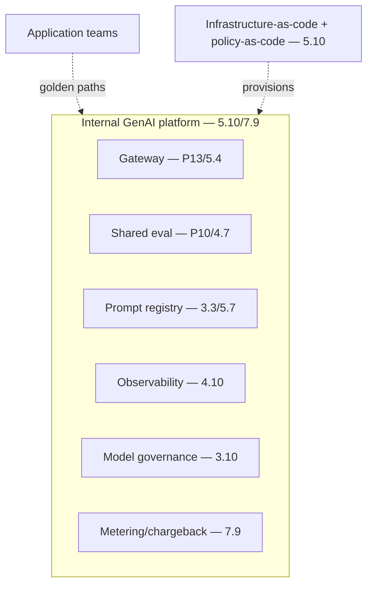

# Project P16 — Multi-tenant GenAI Platform

| | |
|---|---|
| **Tier** | Architect |
| **Maturity level** | 4 — Architect |
| **Estimated effort** | Capstone (multi-week; architecture doc primary, vertical slice implementation) |
| **Prerequisite chapters** | [7.9 Platform & Multi-tenancy Patterns](../../curriculum/part-7-enterprise-ai-architecture-patterns/chapter-09-platform-multitenancy-patterns.md), [5.10 Platform Engineering](../../curriculum/part-5-cloud-infrastructure-platform/chapter-10-iac-platform-engineering.md) |
| **Skills exercised** | Platform patterns, tenancy, org design |

## Business Problem

An enterprise with many teams building GenAI needs a shared platform (the alternative is sprawl). The value: an internal GenAI platform — gateway, prompt registry, eval service, metering/chargeback, governance — offered as self-service with golden paths. This is Vantora's platform (5.10/7.9), the capstone consolidating P06/P10/P13. **Architect capstone: the architecture document is the primary deliverable; implement a vertical slice.** KPI moved: consolidation, amortization, governance-by-default across the org.

**Suggested corpus/dataset:** none external — the vertical slice reuses your P01/P06 corpora as tenant workloads; two tenants with distinct corpora are enough to demonstrate isolation and chargeback.

## Requirements

### Functional
- FR-1: The platform-pattern composition: gateway (P13), shared eval (P10), prompt registry, observability, model governance, metering/chargeback (7.9).
- FR-2: Self-service with golden paths (5.10 — compliant-by-default).
- FR-3: Multi-tenancy (tenant isolation — 4.1/7.7).
- FR-4: Policy-as-code governance (5.10).

### Non-functional
- NFR-1 (Platform): Reliable, self-service, amortized (5.10).
- NFR-2 (Governance-at-scale): Golden paths make compliance the default (6.9/5.10).
- NFR-3 (Tenancy): Tenant isolation (7.7).
- NFR-4 (Metering): Per-tenant chargeback (7.9).

## Architecture Diagram

The full platform-pattern composition (7.9), IaC + policy-as-code (5.10), self-service golden paths. The architecture document covers the full platform; the vertical slice implements one golden path end-to-end.

## Technology Choices

| Concern | Choice | Alternatives | Why |
|---------|--------|--------------|-----|
| Build vs. buy | Build (central) or assemble (lock-in care) | — | Platform centrality (7.10) |
| Tenancy | Namespaces (external) / filter (internal) | — | Consequence-driven (4.1) |
| Governance | Golden paths (enabling) | Mandates | Governance-at-scale (6.9/5.10) |

## Security

Full security architecture (6.5): zero-trust, tenant isolation, non-bypassable gateway, identity (6.6). Apply the [security checklist](../../checklists/security-checklist.md) and [architecture review checklist](../../checklists/architecture-review-checklist.md).

## Deployment

Shared-services accounts (5.1), IaC (5.10), highest reliability (5.9). Apply the [deployment checklist](../../checklists/deployment-checklist.md).

## Monitoring

Platform observability (4.10): per-tenant usage/cost (chargeback), platform SLOs, golden-path adoption. The chargeback and adoption are key.

## Estimated Cost

| Item | Assumption | Monthly |
|------|-----------|---------|
| Platform operation | Gateway, eval, observability, metering | ~$100+ |
| **Total** | | **Amortized across tenants** |

## Future Improvements

1. Agent platform (P19).
2. Central model governance maturity (3.10/7.9).
3. Cross-org standards (6.9).

## Definition of Done

- [ ] **Architecture document**: full platform (gateway, eval, registry, observability, model governance, metering, tenancy, golden paths, IaC/policy-as-code)
- [ ] Vertical slice: one golden path end-to-end (a team builds a compliant system on it)
- [ ] Tenant isolation; per-tenant chargeback
- [ ] Golden paths make compliance default
- [ ] Security architecture; architecture-review + security checklists applied
- [ ] ADRs for the significant decisions
- [ ] Cost model; portfolio-grade documentation
- [ ] README/architecture doc reviewable by another architect

**Related case study:** [CS39 Internal Developer Copilot Platform](../../case-studies/cs39-internal-developer-copilot-platform.md)
