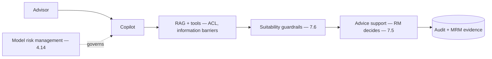

# Project P17 — Regulated-industry Assistant (Banking)

| | |
|---|---|
| **Tier** | Architect |
| **Maturity level** | 4 — Architect |
| **Estimated effort** | Capstone (architecture doc primary + vertical slice) |
| **Prerequisite chapters** | [4.14 Privacy, Compliance & Governance](../../curriculum/part-4-enterprise-genai-systems/chapter-14-privacy-compliance-governance.md), [6.5 Security Architecture](../../curriculum/part-6-enterprise-architecture/chapter-05-security-architecture-zero-trust.md) |
| **Skills exercised** | Regulated architecture, governance paper trail |

## Business Problem

A banking advisor copilot under strict compliance (suitability, model risk management, auditability, sign-offs) is the archetypal regulated-industry deployment. The value: a fully-governed advisor copilot with auditability, MRM, and the complete governance paper trail. This is Nordhaven's RM copilot (CS06). **Architect capstone: architecture + governance document primary; vertical slice.** KPI moved: deployability under strict financial regulation.

**Suggested corpus/dataset:** assemble from public financial materials — SEC investor-education pages (investor.gov) plus fund prospectuses and factsheets from EDGAR — as the advice-support RAG corpus; suitability test cases are yours to script.

## Requirements

### Functional
- FR-1: RAG + tools advisor copilot (advice-support, human decides — CS06/7.5).
- FR-2: Suitability guardrails (7.6).
- FR-3: Model risk management (validation independence, monitoring — 4.14).
- FR-4: Full audit trail + sign-offs.

### Non-functional
- NFR-1 (Compliance): Suitability, MRM, auditability, the governance paper trail (4.14).
- NFR-2 (Security): Zero-trust, information barriers (6.5).
- NFR-3 (Human decision): Advice-support, not autonomous advice (7.5).

## Architecture Diagram

Regulated architecture: RAG + tools + suitability guardrails + human decision + MRM + full audit. The governance document (data-flow, threat model, MRM, evidence) is the primary deliverable.

## Technology Choices

| Concern | Choice | Alternatives | Why |
|---------|--------|--------------|-----|
| Provider | Contracted, in-region | — | Compliance (4.14) |
| Governance | MRM overlay | — | Regulated models (4.14) |

## Security

Full security architecture (6.5), zero-trust, information barriers, identity (6.6). Apply the [security checklist](../../checklists/security-checklist.md) and [architecture review checklist](../../checklists/architecture-review-checklist.md).

## Deployment

Governed, classification-registered (4.14). Apply the [deployment checklist](../../checklists/deployment-checklist.md).

## Monitoring

Compliance + MRM (4.14): suitability-violation rate (zero), model drift, audit completeness, override rates (7.5). MRM monitoring.

## Estimated Cost

| Item | Assumption | Monthly |
|------|-----------|---------|
| Inference | Advisor volume | ~$50 |
| Governance overhead | MRM, audit | ~$25 |
| Hosting | Service | ~$50 |
| **Total** | | **~$125** |

## Future Improvements

1. Evidence-based auto-support for earned classes (4.4).
2. Cross-jurisdiction (5.11).

## Definition of Done

- [ ] **Architecture + governance document**: data-flow, threat model, MRM, suitability controls, audit, evidence assembly (4.14)
- [ ] Vertical slice: advisor copilot with suitability guardrails + human decision
- [ ] MRM overlay (validation independence, monitoring)
- [ ] Full audit trail; the "how do you know?" test passes (4.14)
- [ ] Security architecture; checklists applied
- [ ] ADRs for significant decisions
- [ ] Cost model; portfolio-grade documentation
- [ ] Reviewable by another architect

**Related case study:** [CS06 Relationship Manager Copilot](../../case-studies/cs06-relationship-manager-copilot.md)
