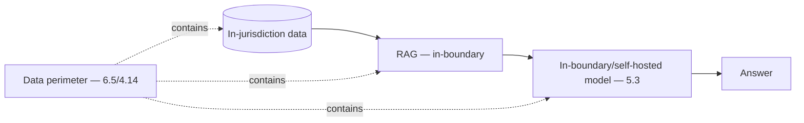

# Project P18 — Sovereign / Hybrid RAG

| | |
|---|---|
| **Tier** | Architect |
| **Maturity level** | 4 — Architect |
| **Estimated effort** | Capstone (architecture doc primary + vertical slice) |
| **Prerequisite chapters** | [5.11 Multi-cloud, Hybrid & Sovereignty](../../curriculum/part-5-cloud-infrastructure-platform/chapter-11-multicloud-hybrid-sovereignty.md), [5.3 Model Serving](../../curriculum/part-5-cloud-infrastructure-platform/chapter-03-model-serving.md) |
| **Skills exercised** | Hybrid architecture, data perimeters |

## Business Problem

A data-residency-constrained deployment must keep data on-premises/in-jurisdiction while using GenAI capability. The value: a sovereign/hybrid RAG demonstrating the data-gravity resolution (models to the data, or minimize-and-cloud) with the capability trade handled honestly. This is Bellhaven's sovereign market entry (5.11). **Architect capstone: the architecture document (driver assessment + data-gravity design) is primary.** KPI moved: deployability under sovereignty constraints.

**Suggested corpus/dataset:** any corpus you already run (P01's works) — the point is the boundary, not the content; for realism, pick something plausibly residency-bound, e.g., a national government's public policy documents kept in-jurisdiction.

## Requirements

### Functional
- FR-1: RAG with data staying in-jurisdiction/on-prem (5.11).
- FR-2: Self-hosted or in-region model (5.2/5.3), capability trade eval-gated (3.10).
- FR-3: Data perimeters (data doesn't leave — 6.5/4.14).

### Non-functional
- NFR-1 (Sovereignty): Data + processing in-boundary (5.11); the driver is genuine.
- NFR-2 (Capability): Eval-gated acceptance of the in-boundary model (3.10/5.11).
- NFR-3 (Serving): Self-hosted serving if required (5.3).

## Architecture Diagram

Sovereign/hybrid RAG (5.11): the driver assessment (is sovereignty genuine?), the data-gravity resolution (models-to-data), self-hosted serving (5.3), the capability trade (eval-gated in-boundary model). The architecture document leads with the driver assessment.

## Technology Choices

| Concern | Choice | Alternatives | Why |
|---------|--------|--------------|-----|
| Model | In-boundary/self-hosted (open-weights) | Cloud API | Sovereignty (5.11) |
| Serving | Self-hosted (5.3) | Managed | In-boundary control (5.3) |

## Security

Data perimeters (6.5), in-boundary isolation. Apply the [security checklist](../../checklists/security-checklist.md) and [architecture review checklist](../../checklists/architecture-review-checklist.md).

## Deployment

In-jurisdiction/on-prem, self-hosted serving (5.3/5.11). Apply the [deployment checklist](../../checklists/deployment-checklist.md).

## Monitoring

Sovereignty + quality: data-boundary compliance, in-boundary model quality (the capability trade — eval-gated), serving reliability (5.9). Sovereignty compliance is the critical monitor.

## Estimated Cost

| Item | Assumption | Monthly |
|------|-----------|---------|
| Self-hosted serving | GPU (5.2) | ~$150+ |
| Retrieval + infra | In-boundary | ~$50 |
| **Total** | | **~$200+ (self-host)** |

Higher than managed — the sovereignty cost (5.11).

## Future Improvements

1. Minimize-and-cloud where residency permits (5.11).
2. In-boundary model updates as capability improves (revisit trigger — 5.11).

## Definition of Done

- [ ] **Architecture document**: driver assessment (sovereignty genuine), data-gravity resolution, capability trade
- [ ] Vertical slice: RAG with in-boundary data + self-hosted/in-region model
- [ ] Data perimeters; no data leaves boundary (verified)
- [ ] Capability trade eval-gated (in-boundary model clears the bar)
- [ ] Self-hosted serving (if required)
- [ ] Security architecture; checklists applied
- [ ] ADRs (esp. the sovereignty driver and capability trade)
- [ ] Cost model (sovereignty cost stated); portfolio-grade documentation
- [ ] Reviewable by another architect

**Related case study:** [CS35 Citizen Services Portal Assistant](../../case-studies/cs35-citizen-services-portal-assistant.md)
