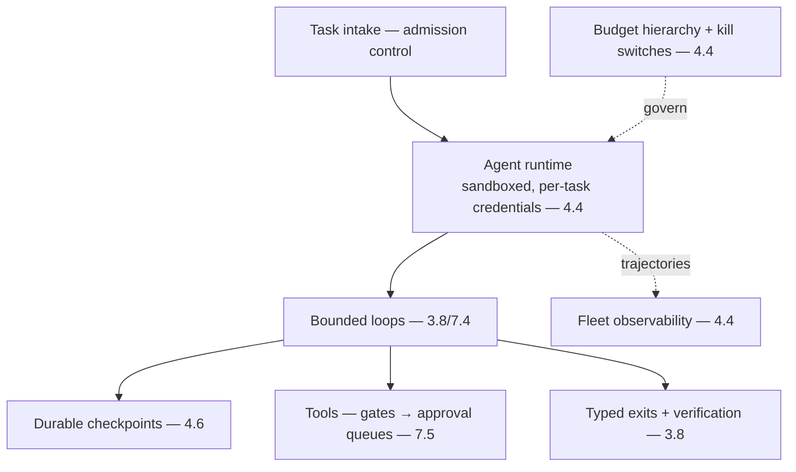

# Project P19 — Agent Orchestration Platform

| | |
|---|---|
| **Tier** | Architect |
| **Maturity level** | 4 — Architect |
| **Estimated effort** | Capstone (architecture doc primary + vertical slice) |
| **Prerequisite chapters** | [4.6 Orchestration & Workflow Design](../../curriculum/part-4-enterprise-genai-systems/chapter-06-orchestration-workflows.md), [7.4 Agentic Patterns](../../curriculum/part-7-enterprise-ai-architecture-patterns/chapter-04-agentic-patterns.md) |
| **Skills exercised** | Durable execution, agent ops at scale |

## Business Problem

Long-running, durable, resumable agents with checkpoints, approvals, and fleet observability need a platform. The value: an agent orchestration platform providing durable execution, the production envelope (4.4), and fleet observability for long-running agents. This extends P07/P11 to platform scale. **Architect capstone: architecture document primary; vertical slice of one durable agent.** KPI moved: reliable long-running agent operations at scale.

**Suggested corpus/dataset:** none external — the durable-agent vertical slice needs a genuinely long-running task; reuse P11's research task over a Wikipedia-dump slice, or a batch document-processing run over P12's corpus.

## Requirements

### Functional
- FR-1: Durable agent execution (checkpoint-and-resume — 4.6/7.4).
- FR-2: Production envelope (sandboxing, budget hierarchies, approval queues, kill switches — 4.4).
- FR-3: Fleet observability (trajectory store, dashboards, sampling — 4.4).
- FR-4: Human approval workflows (7.5).

### Non-functional
- NFR-1 (Durability): Long tasks survive failures/pauses, resumable (4.6).
- NFR-2 (Governance): Budget hierarchies, breakers, kill switches (4.4).
- NFR-3 (Observability): Fleet-scale trajectory + verification-disagreement (4.4).
- NFR-4 (Accountability): Per-agent-type owner, risk classification (4.4/2.8).

## Architecture Diagram

Agent orchestration platform (4.6 durable + 4.4 envelope + 7.4 agentic patterns): durable execution, sandboxing, budget hierarchies, approval queues, fleet observability, kill switches. The architecture document covers the platform; the vertical slice is one durable, governed agent.

## Technology Choices

| Concern | Choice | Alternatives | Why |
|---------|--------|--------------|-----|
| Execution | Durable-execution engine | Queue-assembly | Durability, resumption (4.6) |
| Runtime | Sandboxed, per-task credentials | Shared | Blast radius (4.4/4.9) |

## Security

Sandboxing, per-task user-scoped credentials, egress control (4.4/4.9), non-bypassable gates. Apply the [security checklist](../../checklists/security-checklist.md) and [agent design checklist](../../checklists/agent-design-checklist.md).

## Deployment

Platform (on P16 or standalone). Apply the [deployment checklist](../../checklists/deployment-checklist.md).

## Monitoring

Fleet observability (4.4): trajectory store, exit distributions, cost tails, verification-disagreement (honesty gauge), approval-queue metrics, budget/breaker state. Sampling policy → failure taxonomy.

## Estimated Cost

| Item | Assumption | Monthly |
|------|-----------|---------|
| Agent inference | Fleet volume | ~$100+ |
| Orchestration + state + trajectory | Durable, audit | ~$40 |
| **Total** | | **~$140+** |

## Future Improvements

1. Multi-agent orchestration (4.5).
2. Evidence-based auto-approval (4.4).
3. Cross-team agent composition (4.5/7.9).

## Definition of Done

- [ ] **Architecture document**: durable execution, production envelope, fleet observability, governance
- [ ] Vertical slice: one durable, governed, resumable agent
- [ ] Budget hierarchies + kill switches (task/type/fleet), rehearsed
- [ ] Approval queues with rubber-stamp monitoring
- [ ] Fleet observability (verification-disagreement)
- [ ] Per-task credentials, sandboxing, egress control
- [ ] Agent + security checklists applied
- [ ] ADRs for significant decisions
- [ ] Cost model; portfolio-grade documentation
- [ ] Reviewable by another architect

**Related case study:** [CS07 AML Investigation Assistant](../../case-studies/cs07-aml-investigation-assistant.md)
