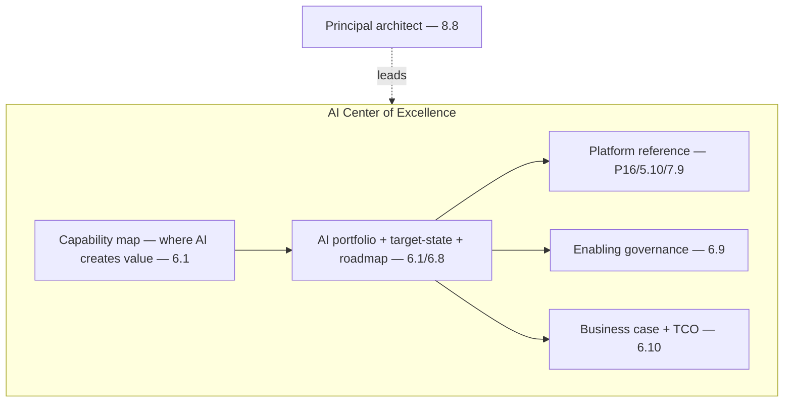

# Project P20 — AI Center of Excellence Reference Architecture

| | |
|---|---|
| **Tier** | Architect |
| **Maturity level** | 4→5 — Architect → Principal |
| **Estimated effort** | Capstone of capstones (architecture + strategy document; the portfolio centerpiece) |
| **Prerequisite chapters** | [6.8 Legacy Modernization & AI Adoption](../../curriculum/part-6-enterprise-architecture/chapter-08-legacy-modernization-ai-adoption.md), [6.9 Architecture Governance](../../curriculum/part-6-enterprise-architecture/chapter-09-architecture-governance.md), [8.8 Operating as a Principal Architect](../../curriculum/part-8-professional-excellence/chapter-08-principal-architect.md) |
| **Skills exercised** | EA, governance, business case, leadership |

## Business Problem

A 5,000-person enterprise needs an AI strategy — not more pilots, but a target-state architecture, standards, review process, and adoption roadmap. The value: an AI Center of Excellence reference architecture — the principal-architect synthesis of the whole curriculum applied to leading an enterprise through AI. This is the portfolio centerpiece (8.2/8.8). **This is a pure architecture-and-strategy document (no implementation) — the synthesis of Parts 1–8.** KPI moved: the enterprise's AI transformation from scattered pilots to a capability-aligned, governed portfolio.

## Requirements

### Functional
- FR-1: Capability-mapped AI portfolio (6.1) with target-state and roadmap (6.1/6.8).
- FR-2: The platform reference (P16 — gateway, eval, observability, governance — 5.10/7.9).
- FR-3: Governance (enabling — 6.9): standards, review boards, golden paths.
- FR-4: The business case (TCO, risk-adjusted ROI, portfolio prioritization — 6.10).
- FR-5: The adoption strategy (pilot-to-platform, build-vs-buy, legacy modernization — 6.8).

### Non-functional
- NFR-1 (Coherence): The portfolio is capability-aligned and coherent (6.1).
- NFR-2 (Governance-at-scale): Enabling governance, golden paths (6.9/5.10).
- NFR-3 (Strategic): Board-level business case and strategy (6.10/8.8).

## Architecture Diagram

The full principal-architect synthesis (8.8): the capability-mapped portfolio (6.1), the platform reference (P16/7.9), enabling governance (6.9), the business case (6.10), the adoption strategy (6.8) — the AI CoE reference architecture leading the enterprise through AI.

## Technology Choices

The document *specifies the standards and platform reference* (P16) — it's the architecture-and-strategy, not an implementation. It recommends the platform patterns (7.9), the model portfolio approach (3.10), the governance model (6.9), and the adoption sequencing (6.8).

## Security

The security architecture reference (6.5): zero-trust, identity (6.6), data perimeters, the security governance. Apply the [architecture review checklist](../../checklists/architecture-review-checklist.md) and [security checklist](../../checklists/security-checklist.md) as the CoE's standards.

## Deployment

The reference specifies the platform deployment (P16/5.10), the cloud foundation (5.1), the reliability (5.9), and the adoption roadmap (6.8).

## Monitoring

The reference specifies the observability platform (4.10), the eval platform (4.7), the cost governance (4.11/6.10), and the portfolio governance metrics (6.9).

## Estimated Cost

The business case (6.10): the full portfolio TCO (build + run + maintain + organizational), risk-adjusted ROI, portfolio prioritization — the strategic AI investment for the 5,000-person enterprise. (Document the model, not a single number.)

## Future Improvements

The reference includes its own evolution: the roadmap phases (6.8), the target-state pursuit (6.1), the capability maturation, and the principal's ongoing leadership (8.8).

## Definition of Done

- [ ] **The complete architecture-and-strategy document** synthesizing Parts 1–8:
  - [ ] Capability-mapped AI portfolio (6.1) with target-state and roadmap
  - [ ] Platform reference architecture (P16/5.10/7.9)
  - [ ] Enabling governance model: standards, review boards, golden paths (6.9)
  - [ ] Security architecture reference (6.5/6.6)
  - [ ] Business case: full TCO, risk-adjusted ROI, portfolio prioritization (6.10)
  - [ ] Adoption strategy: pilot-to-platform, build-vs-buy, legacy modernization (6.8)
  - [ ] Responsible-AI and compliance governance (2.8/4.14)
  - [ ] ADRs for the foundational decisions
- [ ] Board-level executive summary (SCQA — 1.5)
- [ ] The document survives a mock architecture-review-board and executive presentation
- [ ] **Portfolio centerpiece**: presents the architect's judgment at principal level (8.2/8.8)

**Related case study:** [CS39 Internal Developer Copilot Platform](../../case-studies/cs39-internal-developer-copilot-platform.md) · **Synthesizes:** the entire curriculum (Parts 1–8) and all prior projects (P01–P19).
