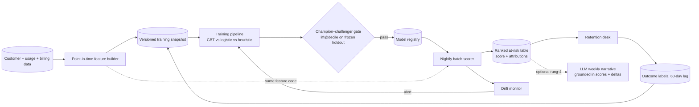

# Project P21 — Churn Prediction Service (Classical ML Track)

| | |
|---|---|
| **Tier** | Intermediate |
| **Maturity level** | 2→3 — Build → Engineer |
| **Estimated effort** | 3 weekends |
| **Prerequisite chapters** | [2.9 Classical ML System Design](../../curriculum/part-2-artificial-intelligence/chapter-09-classical-ml-system-design.md), [2.10 MLOps and LLMOps](../../curriculum/part-2-artificial-intelligence/chapter-10-mlops-vs-llmops.md), [2.7 Evaluating ML Systems](../../curriculum/part-2-artificial-intelligence/chapter-07-evaluating-ml-systems.md) |
| **Skills exercised** | Point-in-time feature engineering, GBT modeling, batch serving, drift monitoring, champion–challenger promotion |

## Business Problem

A subscription business (telco, SaaS, or OTT — pick a public dataset accordingly) loses ~2% of customers monthly and its retention desk calls customers *after* they cancel. The desk can proactively contact 5,000 customers/month; today it picks them by tenure, a heuristic barely better than random. The value: a nightly-scored, ranked at-risk list with reason codes, so the desk spends its fixed capacity on the customers most likely to leave *and* most likely to be saved. KPI moved: churn saves per 1,000 calls (lift at capacity), measured against a held-out control group.

**Why this project exists in a GenAI curriculum:** it is the portfolio proof that you are an *AI* Solution Architect, not a GenAI-only one — and it exercises the 2.11 discipline: a problem where the correct architecture contains **no LLM at all** (with one optional, honestly-scoped exception below).

## Requirements

### Functional
- FR-1: Nightly batch scoring of the full active customer base; ranked list with score + top-3 feature attributions per customer (2.9).
- FR-2: Reproducible training pipeline: data snapshot → point-in-time features → train → evaluate vs champion → register (2.10's classical lane).
- FR-3: Champion–challenger gate: a new model deploys only if it beats the incumbent on the frozen evaluation set at the operating point.
- FR-4: Drift monitor comparing live feature and score distributions to the training snapshot, with alerting.
- FR-5 *(optional, rung-4 add-on)*: an LLM drafts the desk's weekly variance narrative *grounded in the model's own outputs* — the 2.11 Suvarna pattern, clearly separated as its own component.

### Non-functional
- NFR-1 (Quality): ≥2.5× lift over random in the top decile on the holdout; must also beat the tenure heuristic and a logistic baseline (2.9's baseline-first rule).
- NFR-2 (Reproducibility): any registered model regenerable from its snapshot + feature code + seed; data + features + model versioned as one unit.
- NFR-3 (Timeliness): nightly run completes in the batch window (<30 min at dataset scale).
- NFR-4 (Cost ceiling): near-zero marginal serving cost — this is the point; document it against P06's per-query economics.

## Architecture Diagram

Walkthrough: the **feature builder** is the system's core asset — every feature computed as-known-at-prediction-time, and the *same code path* feeds training and scoring (training–serving consistency without a feature-store product, which this scale doesn't justify — record that as an ADR). The **gate** enforces 2.10's discipline: promotion is an evaluated event. The **label loop** closes through the desk's outcomes with an explicit untreated control slice, so retraining data isn't poisoned by the model's own interventions (2.9's action-bias mitigation). The optional **narrative component** is deliberately outside the scoring path: it can fail, be wrong, or be deleted without touching the system of record.

## Technology Choices

| Concern | Choice | Alternatives considered | Why |
|---------|--------|------------------------|-----|
| Model | Gradient-boosted trees (XGBoost/LightGBM) | Logistic regression; deep tabular | Tabular SOTA at trivial cost; attributions for reason codes (2.9) — logistic kept as mandatory baseline |
| Feature pipeline | Python + SQL, versioned in git | Feature-store platform | One model, one team; consistency via shared code, not infrastructure (ADR it) |
| Serving | Nightly batch to a table | Online endpoint | Decision cadence is daily desk planning — batch by 2.9's rule; note what would force online |
| Registry & tracking | MLflow (or a disciplined files+manifest scheme) | Cloud ML platform registry | Portable, free, sufficient; swap-in path to cloud registry documented |
| Attributions | Native GBT feature importances + per-row SHAP-style top-3 | None | Reason codes are a functional requirement, not decoration |

## Security

Smaller LLM-era surface, different classical one: customer PII in features and outputs (minimize columns; pseudonymize IDs in the scored table where the desk workflow allows), access control on the at-risk list (it is a list of *your most leavable customers* — competitively sensitive), and poisoning-adjacent risks via upstream data quality. If FR-5 is built: the narrative LLM sees only aggregated scores and deltas, never row-level PII — enforce at the data boundary, not the prompt. Apply the [security checklist](../../checklists/security-checklist.md); record results here.

## Deployment

Two deployables on 2.10's classical lane: the *training pipeline* (run on schedule or drift trigger; produces candidates) and the *scoring job* (runs nightly against the registry's champion pointer). Rollback = registry pointer flip to the previous champion — rehearse it. IaC for the scheduler + storage; environments: dev (sampled data) and prod. Apply the [deployment checklist](../../checklists/deployment-checklist.md) — note how many items apply unchanged from the GenAI projects; that convergence is 2.10's thesis.

## Monitoring

Three layers (2.9): **system** (job success, runtime vs window), **drift** (per-feature population-stability vs training snapshot; score-distribution shift — alert thresholds you choose and justify), **outcome** (lift at capacity once 60-day labels arrive; control-group churn vs treated). Dashboard the decay curve of the champion across months — the single chart that teaches why retraining triggers exist. Apply the [evaluation checklist](../../checklists/evaluation-checklist.md) where it maps.

## Estimated Cost

| Item | Assumption | Monthly estimate |
|------|-----------|------------------|
| Training compute | Weekly retrain, <1 GPU-free CPU-hour | ~₹300 / ~$4 |
| Batch scoring | Nightly, minutes of CPU | ~₹200 / ~$2.50 |
| Storage (snapshots, registry) | <50 GB versioned | ~₹250 / ~$3 |
| Optional narrative LLM | 4 runs/month × ~10k tokens | ~₹150 / ~$2 |
| **Total** | | **~₹900 / ~$11** |

The dominant "cost" is engineering time, not compute — which is the pedagogical point: contrast this line with P06's token economics in your portfolio write-up. First optimization if scale grew 100×: incremental feature computation before anything else.

## Future Improvements

1. Uplift modeling: predict *persuadability*, not just churn risk — the desk's true targeting variable (and a strong Part 8 interview story).
2. Online scoring path for an in-app save-offer trigger — document what changes (2.9's batch→online trade-off, made real).
3. Migrate the manifest registry to a cloud ML platform and record the lock-in delta as an ADR.
4. Feed the at-risk list into P02's email-drafting pattern for desk agents — a governed, human-reviewed hybrid seam.

## Definition of Done

- [ ] All functional requirements demonstrated end-to-end
- [ ] Evals exist and pass in CI (gate blocks a deliberately degraded challenger)
- [ ] Threat model reviewed; high risks mitigated
- [ ] Dashboards live; drift alert fires on a corrupted-column test
- [ ] Cost measured against estimate
- [ ] README written so another engineer can run it in <15 minutes
- [ ] **Portfolio memo:** one page arguing why this system contains no LLM in the scoring path — your 2.11 exercise, applied to your own build
