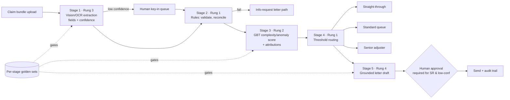

# Project P22 — Hybrid Claims Intake (Vision + Classical ML + GenAI)

| | |
|---|---|
| **Tier** | Advanced |
| **Maturity level** | 3→4 — Engineer → Architect |
| **Estimated effort** | 4–5 weekends |
| **Prerequisite chapters** | [2.11 Choosing the Right AI Approach](../../curriculum/part-2-artificial-intelligence/chapter-11-choosing-the-right-ai-approach.md), [2.9](../../curriculum/part-2-artificial-intelligence/chapter-09-classical-ml-system-design.md), [4.3 Document Ingestion](../../curriculum/part-4-enterprise-genai-systems/chapter-03-document-ingestion.md), P21, and P02's draft-not-send pattern |
| **Skills exercised** | Per-stage approach assignment, OCR/vision extraction, classical risk scoring, rules routing, grounded generation with human review, per-stage evaluation |

## Business Problem

A mid-size insurer receives 3,000 claims/day as photographed or scanned document bundles (claim forms, invoices, reports). Today, intake clerks re-key fields (4 min/claim), a senior adjuster triages severity by eyeball, and customers wait days for a first status letter. The value: an intake pipeline where documents become structured fields automatically, a risk/complexity score routes each claim (straight-through, standard queue, senior adjuster), and every customer receives a grounded, human-approved status letter same-day. KPIs moved: intake cost per claim, straight-through-processing (STP) rate, time-to-first-communication.

**Why this project exists:** it is the capstone of Chapter 2.11 — one business problem, four capability rungs, each earning its place. This is the system shape enterprises actually build, and the portfolio piece almost no candidate has. The architecture memo defending the per-stage assignments is as much the deliverable as the code.

## Requirements

### Functional
- FR-1 (Rung 3): Extract a defined field schema from uploaded claim documents (vision/OCR — a document-AI API or open-source OCR + an extraction model), with per-field confidence.
- FR-2 (Rung 1): Deterministic validation and completeness rules (dates parse, policy number exists, amounts reconcile); failed validations generate a specific customer information-request, not a guess.
- FR-3 (Rung 2): Classical model scores claim complexity/anomaly from extracted + historical tabular features (synthetic or public dataset), with attributions.
- FR-4 (Rung 1): Threshold-based routing: STP / standard / senior review — thresholds set with a stated capacity model, changeable without code deploys.
- FR-5 (Rung 4): LLM drafts the status letter grounded *only* in the case record (extracted fields, validation results, route); low-confidence or senior-routed cases require human approval before send (P02's pattern); the letter cites which documents each fact came from.
- FR-6: Every stage emits its decision + inputs to an audit trail; a claim's full journey is reconstructable.

### Non-functional
- NFR-1 (Extraction quality): field-level accuracy ≥98% on the golden document set for critical fields; per-field confidence calibrated (low-confidence → human key-in queue, never silent acceptance).
- NFR-2 (Routing safety): senior-review recall on the "should-have-escalated" golden slice ≥95% — mis-routing severity downward is the costly error; state the asymmetry.
- NFR-3 (Letter integrity): zero unsupported factual claims on the letter eval set (faithfulness — 3.6/4.7); refusal-to-draft on incomplete records.
- NFR-4 (Latency): document-to-routed <5 min p95; letter draft <30 s after routing.
- NFR-5 (Cost ceiling): ≤₹4 per claim all-in at 3,000/day; per-stage cost attributed.

## Architecture Diagram

Walkthrough: each stage is the *cheapest rung that meets its requirement* (2.11's prime directive) — and each has its own eval regime and failure modes, which is the argument against the monolithic "claims agent" alternative (record that rejection as the project's first ADR, with the triage answers). The **confidence seams** are the design's load-bearing joints: extraction confidence gates entry to automation; risk score + validation state gate the letter's approval requirement. The LLM touches nothing upstream of it and asserts nothing outside the case record — its blast radius is a draft.

## Technology Choices

| Concern | Choice | Alternatives considered | Why |
|---------|--------|------------------------|-----|
| Extraction | Cloud document-AI API (or open-source OCR + LLM field extraction with strict schema — 3.4) | Hand-built CV | Buy perception; per-field confidence out of the box; swap cost documented |
| Risk model | GBT on tabular features | LLM scoring the claim text | Labels exist (synthetic history); calibration + attributions required; 100× cheaper — the 2.11 memo writes itself |
| Routing | Config-file thresholds | Learned router | Auditability and capacity-tuning by ops, not deploys |
| Letter LLM | Mid-tier hosted model, pinned version | Premium model | Templated, grounded drafting doesn't need frontier capability (4.11's tiering); eval harness proves it |
| Orchestration | Explicit pipeline (queue/step-function style) | Agent loop | Fixed stages, no dynamic planning — 2.11's agent-where-pipeline anti-pattern, avoided and documented |

## Security

Threat surface spans all rungs: **prompt injection via claim documents** (a document containing instructions must not steer extraction or the letter — fence document content as data, 3.3; test with adversarial documents in the golden set), PII throughout (retention windows per stage; masked logs; the letter model receives the case record, not raw documents), fraud-side adversaries probing routing thresholds (thresholds and attributions are internal-only), and authz on the approval queue (approvers ≠ uploaders). Apply the [security checklist](../../checklists/security-checklist.md) per stage and record results — the per-stage threat model is itself a portfolio artifact.

## Deployment

Each stage independently deployable behind queue seams; the promotable units differ by lane (2.10): the risk model promotes via champion–challenger; the letter composite (prompt + model-ID + template version) promotes via the letter eval gate; rules and thresholds via config review. Blue/green for the extraction dependency swap. Apply the [deployment checklist](../../checklists/deployment-checklist.md); rollback drill for each stage separately.

## Monitoring

Per-stage dashboards: extraction field-accuracy sampling + confidence-distribution drift; validation failure rates by rule (a spike = upstream form change); risk-score drift vs training snapshot (2.9); routing mix vs capacity model; letter faithfulness spot-checks + approval-edit-distance (how much do humans change drafts — the letter's real quality metric); end-to-end STP rate, cost/claim, time-to-first-letter. Alerts: NFR breaches and any zero-traffic stage. Apply the [evaluation checklist](../../checklists/evaluation-checklist.md).

## Estimated Cost

| Item | Assumption | Monthly estimate |
|------|-----------|------------------|
| Document AI / OCR | 90k claims × ~4 pages × per-page price | ~₹65,000 / ~$780 |
| Letter LLM | 90k drafts × ~2k tokens, mid-tier | ~₹18,000 / ~$215 |
| Risk model train + score | CPU, negligible | ~₹500 / ~$6 |
| Compute / queues / storage | Modest managed services | ~₹12,000 / ~$145 |
| **Total** | | **~₹95,500 / ~$1,150 (≈₹1.1/claim)** |

Dominant driver: perception (extraction), not generation — a finding worth stating in the memo because it surprises GenAI-first stakeholders. First optimization: page-classification to skip non-informative pages before OCR.

## Future Improvements

1. Fraud-signal enrichment: dedicated anomaly features and a second model head (stays rung 2 — argue why).
2. Uplift the letter path to multilingual with per-language eval sets (P09's discipline).
3. Learned routing *assistant* proposing threshold changes from outcome data — human-approved config PRs, not a live learned router (governance argument in the ADR).
4. Feed senior-adjuster outcomes back as labels: the 2.9 loop, closing across a hybrid.

## Definition of Done

- [ ] All functional requirements demonstrated end-to-end on the golden claim set
- [ ] Per-stage evals exist and pass in CI; the letter gate blocks an unfaithful draft; the routing gate catches an under-escalation
- [ ] Threat model reviewed per stage; adversarial-document test passes
- [ ] Dashboards live; alerts tested; cost per claim measured against estimate
- [ ] Audit trail reconstructs a claim's full journey
- [ ] README runs in <15 minutes
- [ ] **Portfolio memo:** the per-stage assignment table with triage answers, the rejected monolith ADR, and the cost finding — this document is your Chapter 2.11 credential
