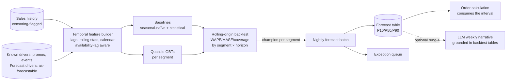

# Project P23 — Demand Forecasting Service (Classical ML Track)

| | |
|---|---|
| **Tier** | Intermediate |
| **Maturity level** | 2→3 — Build → Engineer |
| **Estimated effort** | 3 weekends |
| **Prerequisite chapters** | [2.13 Forecasting Systems](../../curriculum/part-2-artificial-intelligence/chapter-13-forecasting-systems.md), [2.12 Data Engineering & Feature Platforms](../../curriculum/part-2-artificial-intelligence/chapter-12-data-engineering-feature-platforms.md), [2.7 Evaluating ML Systems](../../curriculum/part-2-artificial-intelligence/chapter-07-evaluating-ml-systems.md) |
| **Skills exercised** | Rolling-origin backtesting, quantile GBT forecasting, baseline discipline, censoring handling, batch pipeline, segment reporting |

## Business Problem

A retailer (use a public multi-series retail dataset — M5-class) replenishes stores from a nightly order calculation that currently consumes "last year same week × trend." Fresh-category waste and promoted-item stockouts are both chronic; planners firefight the worst SKUs by hand. The value: nightly SKU(-group)×store quantile forecasts with calibrated intervals feeding the order quantity, plus an exception queue for the forecasts least worth trusting. KPI moved: weighted MAPE vs. the incumbent rule *by segment*, and interval coverage that the order calculation can actually consume ([CS51](../../case-studies/cs51-demand-forecasting-replenishment.md) is this project at enterprise scale — build the miniature honestly).

**Why this project exists:** forecasting is the classical family with the fastest label loop — the best first system for practicing the whole 2.9 discipline — and it is where naive evaluation lies most fluently. The deliverable that matters is the *honest backtest harness*, not the model.

## Requirements

### Functional
- FR-1: Nightly batch forecasts, horizons 1–14 days, at P10/P50/P90, for every series in the chosen scope.
- FR-2: Rolling-origin backtest harness (≥6 origins) that replays the production information set: data-availability lags and *forecast-not-actual* exogenous drivers (2.13's weather trap, demonstrated).
- FR-3: Permanent baselines: seasonal-naïve and one statistical per-series method, scored on every backtest and every production run; champions assigned **per segment**.
- FR-4: Censoring handling: stockout-flagged periods excluded or corrected, with the before/after delta reported (sales ≠ demand).
- FR-5: Exception queue: the ~1% of forecasts with widest intervals or largest champion-vs-baseline disagreement, ranked.
- FR-6 *(optional, rung-4 add-on)*: an LLM drafts the weekly forecast-review narrative grounded in the backtest tables — never touching a number it didn't read.

### Non-functional
- NFR-1 (Quality): beat seasonal-naïve by ≥10% WAPE overall, **reported by segment and horizon step** — and honestly show the segments where naïve wins (expect them).
- NFR-2 (Calibration): P10–P90 coverage 76–84% per volume tercile (nominal 80%; over-wide intervals inflate safety stock and are a defect too), or the miscalibration diagnosed in the run report.
- NFR-3 (Timeliness): full batch inside a stated window; a failed batch falls back to the incumbent rule loudly.
- NFR-4 (Reproducibility): every reported metric regenerable from a versioned snapshot + feature code + config (2.12's replay test).

## Architecture Diagram

Walkthrough: the **backtest harness** is the system's core asset — it replays what production would have known (lags, driver forecasts, retrain cadence), which is the difference between a simulation of operating the system and a simulation of clairvoyance. **Baselines are permanent residents**: MASE against seasonal-naïve is the honesty floor, and per-segment champion assignment is expected to leave some segments on naïve — that is a finding, not a failure. The **interval is the product**: the order calculation consumes P-levels chosen from the error asymmetry, so coverage testing outranks point-accuracy vanity.

## Technology Choices

| Concern | Choice | Alternatives considered | Why |
|---------|--------|------------------------|-----|
| Model | Quantile-objective GBTs (LightGBM-class), per segment | Per-series ARIMA/ETS everywhere; deep forecasters | Global learning across series with drivers; quantiles native; statistical methods kept as the rung-2 baseline (2.13's ladder) |
| Baselines | seasonal-naïve + one statistical method | Skip baselines | Never skip — MASE needs the denominator and finance needs the honest delta |
| Backtesting | Hand-built rolling-origin harness | Library CV utilities | The harness *is* the learning objective; libraries hide the information-set replay |
| Pipeline | Scheduled batch (2.12 shared feature code) | Streaming/online | Orders are nightly — batch by decision cadence (2.9) |
| Reconciliation | Bottom-up to store/category totals | Optimal combination | Sufficient at project scale; note the upgrade trigger |

## Security

Low-PII by nature (sales aggregates), but not zero-surface: promotion calendars and demand forecasts are commercially sensitive (a competitor reading your forecast table reads your strategy); access-control the outputs. Data-quality poisoning is the classical risk: a corrupted sales feed trains a corrupted forecaster — the 2.12 gates are the mitigation, and the DoD tests one. If FR-6 is built: the narrative LLM reads aggregated tables only. Apply the [security checklist](../../checklists/security-checklist.md) where it maps; record the classical deltas here.

## Deployment

Two deployables (2.10's classical lane): the *backtest/training pipeline* (weekly retrain + on-demand for experiments) and the *nightly forecast job* (reads the per-segment champion pointers). Rollback = pointer flip. The incumbent-rule fallback is a deployable too — test it by killing a batch. Apply the [deployment checklist](../../checklists/deployment-checklist.md); note which items translate unchanged.

## Monitoring

Three layers (2.9): **pipeline** (batch completion, gate pass rates, driver-coverage checks), **drift** (per-segment PSI on features and forecast distributions; baseline-vs-champion divergence), **outcome** (WAPE/MASE and coverage as actuals land — the 1–14-day label loop makes this weekly-reviewable, which is why this is the right first forecasting system). The chart that matters: champion-vs-naïve by segment over time — demotion is a page, not a shrug ([drift & model monitoring checklist](../../checklists/drift-model-monitoring-checklist.md)).

## Estimated Cost

| Item | Assumption | Monthly estimate |
|------|-----------|------------------|
| Backtests + weekly retrain | CPU, minutes-to-an-hour at dataset scale | ~₹400 / ~$5 |
| Nightly scoring | CPU, minutes | ~₹200 / ~$2.50 |
| Storage (snapshots, forecasts, registry) | <50 GB versioned | ~₹250 / ~$3 |
| Optional narrative LLM | 4 runs/month × ~10k tokens | ~₹150 / ~$2 |
| **Total** | | **~₹1,000 / ~$12.50** |

Contrast line for the portfolio: this system's *entire* monthly cost is a rounding error against any GenAI project's token bill — classical unit economics, demonstrated on your own invoice ([CS51](../../case-studies/cs51-demand-forecasting-replenishment.md)'s memo point).

## Future Improvements

1. Hierarchical reconciliation upgrade (optimal combination) with a before/after coherence report.
2. FVA layer: simulate planner overrides on a slice and score every stage of the process (2.13's governance instrument).
3. Intermittent-demand handling for the long tail (separate method family; MASE-reported).
4. Feed the exception queue into a review UI; capture dispositions as labels (the 2.12 label factory).

## Definition of Done

- [ ] All functional requirements demonstrated end-to-end
- [ ] Backtest harness replays the information set — the leakage demonstration (actual vs. forecast driver) is reproducible in one command
- [ ] Per-segment champion table produced; at least one segment honestly left on a baseline
- [ ] Coverage within band per tercile, or diagnosed in the run report
- [ ] Batch-failure fallback tested; drift alert fires on a corrupted-column test
- [ ] Cost measured against estimate
- [ ] README lets another engineer run it in <15 minutes
- [ ] **Portfolio memo:** one page on what the backtest harness caught that a random split would have shipped

**Related case study:** [CS51 Demand Forecasting for Store Replenishment](../../case-studies/cs51-demand-forecasting-replenishment.md) · **Related patterns:** Batch Scoring, Champion–Challenger, Drift-Triggered Retraining ([7.11](../../curriculum/part-7-enterprise-ai-architecture-patterns/chapter-11-predictive-scoring-patterns.md))
