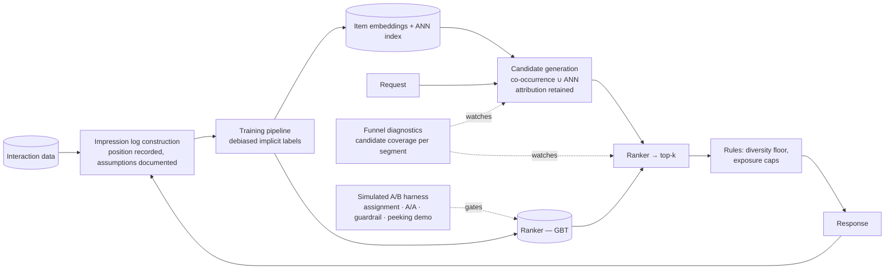

# Project P24 — Two-Stage Product Recommender (Classical ML Track)

| | |
|---|---|
| **Tier** | Advanced |
| **Maturity level** | 3 — Engineer |
| **Estimated effort** | 4 weekends |
| **Prerequisite chapters** | [2.14 Ranking, Recommenders & Anomaly Detection](../../curriculum/part-2-artificial-intelligence/chapter-14-ranking-recommenders-anomaly-detection.md), [2.17 Online Experimentation](../../curriculum/part-2-artificial-intelligence/chapter-17-online-experimentation.md), [2.12 Data Engineering & Feature Platforms](../../curriculum/part-2-artificial-intelligence/chapter-12-data-engineering-feature-platforms.md) |
| **Skills exercised** | Implicit-feedback logging, candidate generation (ANN + co-occurrence), GBT ranking, funnel diagnostics, coverage/diversity guardrails, simulated experimentation |

## Business Problem

An e-commerce catalog (use a public implicit-feedback dataset — retail clicks/purchases or MovieLens-as-implicit) serves every visitor the same bestseller list. The value: personalized recommendations from a two-stage system whose *stages are separately measurable* — candidate generation that doesn't lose the right items, ranking that orders them well, and rules that keep the catalog's long tail alive. KPI moved: NDCG@k and recall@k against popularity on a time-split holdout, *plus* catalog-coverage guardrails — and a simulated experiment that demonstrates why offline wins don't automatically ship ([CS54](../../case-studies/cs54-product-recommendations.md) at miniature scale).

**Why this project exists:** the recommender is where instrumentation-before-modeling is most unforgiving — impression logs with position are unrecoverable after the fact — and where the funnel teaches failure localization (retrieval miss vs. ranking miss) better than any other system shape.

## Requirements

### Functional
- FR-1: **Impression simulation and logging first**: from the raw interaction data, construct an impression log (what was shown, at which position) — simulated where the dataset lacks it, with the simulation's bias assumptions documented.
- FR-2: Two candidate generators (item-item co-occurrence; content/embedding similarity via ANN) whose union feeds the ranker; per-generator attribution retained.
- FR-3: GBT ranker over candidates with user, item, and context features; position-debiased implicit labels (impressions-without-clicks as weighted negatives).
- FR-4: Business-rules layer after the ranker: category diversity floor and per-item exposure cap, applied deterministically.
- FR-5: **Funnel diagnostics**: candidate-coverage metric (was the held-out chosen item in the candidate set?) reported separately from ranking metrics, per segment.
- FR-6: Cold-start paths: new items via content features; new users via segment priors — evaluated on a deliberately held-out cold slice.
- FR-7: A **simulated A/B harness** (2.17): user-level assignment, a primary metric, one guardrail (coverage), an A/A validation run, and a demonstration of peeking inflation on the simulated traffic.

### Non-functional
- NFR-1 (Quality): two-stage beats popularity-by-segment on NDCG@20 on a *time-split* holdout — and the catalog-coverage price of the win is reported beside it.
- NFR-2 (Latency): retrieve+rank+rules under a stated budget (e.g., 150 ms) at dataset scale, with the fallback ladder (personalized → segment-popular) implemented.
- NFR-3 (Honesty): every offline claim carries its bias caveat — the README states why these numbers select challengers and would not, alone, ship a model.
- NFR-4 (Reproducibility): logs, features, models, and metrics versioned; any figure regenerable.

## Architecture Diagram

Walkthrough: the **impression log is the system's core asset** — built first, because the negatives and the position correction live or die on it, and because "the log is the model" is the lesson this project exists to make unforgettable. The **funnel is separately instrumented**: when quality disappoints, candidate coverage answers *which stage* before anyone tunes anything (Loomora's plateau, [2.14](../../curriculum/part-2-artificial-intelligence/chapter-14-ranking-recommenders-anomaly-detection.md)). The **rules layer is code, not model**: floors and caps must hold exactly. The **A/B harness is simulated but real in structure** — assignment, A/A, guardrail, peeking demonstration — so the promotion discipline is rehearsed even without live traffic.

## Technology Choices

| Concern | Choice | Alternatives considered | Why |
|---------|--------|------------------------|-----|
| Candidate gen | Item-item co-occurrence + content-embedding ANN (FAISS-class) | Matrix factorization; popularity only | Two generators teach union/attribution; ANN reuses the 5.6 machinery on product embeddings |
| Ranker | GBT with quantifiable features | Neural ranker | Tabular workhorse (2.9); feature attributions aid debugging; neural is the documented upgrade path |
| Labels | Position-weighted implicit (clicks/carts; impressions as negatives) | Clicks-only | Clicks-only trains on survivorship — the mistake the project exists to prevent |
| Serving | In-process scoring at dataset scale | Online feature store + service | Project scale doesn't justify it; the ADR names what would (CS52-style freshness needs) |
| Experimentation | Hand-built simulated harness | Platform/library | The assignment/A-A/peeking mechanics *are* the 2.17 learning objective |

## Security

Behavioral data is personal data: pseudonymize user IDs throughout; document what consent scoping would mean in production (GDPR-class), and exclude any demographic-proxy features from the ranker with the exclusion recorded. Manipulation surface: co-occurrence is gameable (coordinated interactions) — note the anomaly-lane hook ([2.14](../../curriculum/part-2-artificial-intelligence/chapter-14-ranking-recommenders-anomaly-detection.md)) as the production mitigation. Apply the [security checklist](../../checklists/security-checklist.md) where it maps.

## Deployment

Nightly offline path (embedding + index build, ranker retrain, blue/green index swap) and a request path (candidates → rank → rules) with the fallback ladder wired. Promotion runs through the simulated experiment harness: a challenger ranker ships only after an A/A-validated, guardrail-clean simulated test — the 2.15/2.17 discipline in miniature. Apply the [deployment checklist](../../checklists/deployment-checklist.md).

## Monitoring

**Funnel plane**: candidate coverage per segment (the headline diagnostic), per-generator contribution, fallback rate. **Model plane**: NDCG/recall trends on rolling holdouts, feature freshness, index age. **Ecosystem plane**: catalog coverage, long-tail exposure share, diversity — the guarded metrics that keep the engagement win honest ([2.14](../../curriculum/part-2-artificial-intelligence/chapter-14-ranking-recommenders-anomaly-detection.md)). **Experiment plane**: active simulated tests, A/A health, guardrail status. The chart that matters: coverage-vs-NDCG over time — the funnel's two stages, visibly separated.

## Estimated Cost

| Item | Assumption | Monthly estimate |
|------|-----------|------------------|
| Nightly training + index builds | CPU + small embedding runs | ~₹500 / ~$6 |
| Serving (dev-scale) | In-process, negligible | ~₹100 / ~$1.50 |
| Storage (logs, indexes, registry) | Impression logs dominate — the honest line | ~₹700 / ~$8.50 |
| **Total** | | **~₹1,300 / ~$16** |

Note which line dominates: *impression logging* — the order-of-magnitude event-volume cost of recording what was shown. That proportion holds at enterprise scale ([CS54](../../case-studies/cs54-product-recommendations.md)) and is the project's most transferable budget lesson.

## Future Improvements

1. Exploration slice in the simulated serving loop; measure the coverage and label-diet effects over simulated weeks ([7.11](../../curriculum/part-7-enterprise-ai-architecture-patterns/chapter-11-predictive-scoring-patterns.md)'s pattern, exercised).
2. Session-sequence features (recency-weighted within-session signals) with an honest before/after.
3. Position-bias estimation from the logs themselves (rather than assumed weights) — compare.
4. A conversational discovery layer over the engine (CS12's seam) — the GenAI complement, cleanly separated.

## Definition of Done

- [ ] All functional requirements demonstrated end-to-end
- [ ] Impression log built first; its simulation assumptions documented
- [ ] Candidate coverage and NDCG reported separately; one failure case localized to its stage in writing
- [ ] Two-stage beats popularity on the time-split holdout, with the coverage price reported
- [ ] Cold-start slice evaluated; rules layer verified exact (floor/cap tests)
- [ ] A/A validates the harness; peeking inflation demonstrated with numbers
- [ ] Cost measured against estimate
- [ ] README lets another engineer run it in <15 minutes
- [ ] **Portfolio memo:** one page on why the offline win would not, alone, justify shipping — and what the experiment adds

**Related case study:** [CS54 Product Recommendations at Marketplace Scale](../../case-studies/cs54-product-recommendations.md) · **Related patterns:** Two-Stage Retrieve-then-Rank, Exploration Slice, Shadow Scoring ([7.11](../../curriculum/part-7-enterprise-ai-architecture-patterns/chapter-11-predictive-scoring-patterns.md))
