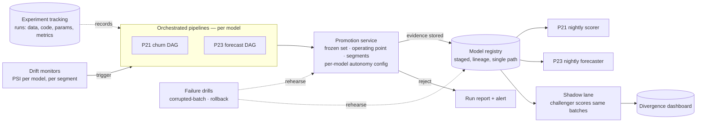

# Project P25 — ML Delivery Platform (Classical ML Track)

| | |
|---|---|
| **Tier** | Advanced |
| **Maturity level** | 3 — Engineer |
| **Estimated effort** | 4 weekends (assumes P21 and/or P23 exist to platformize) |
| **Prerequisite chapters** | [2.15 MLOps Engineering](../../curriculum/part-2-artificial-intelligence/chapter-15-mlops-engineering.md), [2.12 Data Engineering & Feature Platforms](../../curriculum/part-2-artificial-intelligence/chapter-12-data-engineering-feature-platforms.md), [2.10 MLOps and LLMOps](../../curriculum/part-2-artificial-intelligence/chapter-10-mlops-vs-llmops.md) |
| **Skills exercised** | Pipeline orchestration, experiment tracking, model registry, eval-gated promotion, shadow scoring, drift-triggered retraining, failure drills |

## Business Problem

You now own two production models (P21's churn scorer, P23's forecaster) delivered as hand-run scripts — the Bellhaven configuration ([2.15](../../curriculum/part-2-artificial-intelligence/chapter-15-mlops-engineering.md)): retraining is a human chore, promotion is enthusiasm, and one person leaving freezes the estate. The value: a **shared delivery platform** — orchestrated pipelines, tracked experiments, a registry that is the single path to production, gated promotion, shadow comparison, and drift-triggered retraining — serving *both* models, so the marginal cost of operating model #2 (and #3) collapses. KPI moved: time-from-challenger-to-safe-promotion, and the platform's survivability test — *no single human is load-bearing for any retrain*.

**Why this project exists:** it is the classical twin of P13/P16's platform thinking, and the portfolio proof that you can build the *machinery that makes model quality durable* — which is what separates an engineer who trained a model from an architect who operates an estate. It is also the direct rehearsal of [7.11](../../curriculum/part-7-enterprise-ai-architecture-patterns/chapter-11-predictive-scoring-patterns.md)'s honesty patterns as *infrastructure*.

## Requirements

### Functional
- FR-1: **Orchestrated pipelines**: P21's and P23's training flows as scheduled DAGs (snapshot → features → train → evaluate → register), re-runnable, alerting on failure — no notebook in the path.
- FR-2: **Experiment tracking**: every run records data version, feature version, code commit, params, metrics, and artifact; any reported number traces to a run ID.
- FR-3: **Registry as the single path**: staged lifecycle (candidate → staging → production → archived) with lineage; both scoring jobs load *only* from the registry's production pointer.
- FR-4: **Gated promotion**: a promotion service that compares challenger vs. champion on the frozen set at the operating point, by segment, and promotes/rejects with the evidence stored — one gate, two models, per-model configs.
- FR-5: **Shadow lane**: challengers score the same batches as champions; divergence logged and dashboarded before any promotion.
- FR-6: **Drift-triggered retraining**: PSI-class monitors per model; a breach triggers the DAG; the retrained candidate faces the same gate (automation never bypasses evaluation).
- FR-7: **Failure drills as first-class artifacts**: the corrupted-batch drill (gate rejects a model trained on poisoned data) and the rollback drill (pointer flip, timed) — scripted, repeatable, documented.

### Non-functional
- NFR-1 (Survivability): a documented cold-start — a new engineer retrains, evaluates, and promotes either model using only the README and the platform, no oral tradition.
- NFR-2 (Autonomy policy): promotion autonomy is per-model configuration (auto-promote on green vs. human approval), each recorded as a one-page ADR (2.15's autonomy ADR).
- NFR-3 (Reproducibility): a rerun of any registered model reproduces its metrics within stated variance; the variance is measured, not asserted.
- NFR-4 (Proportionality): assembled from portable open tooling; the memo names the pain threshold at which a managed platform would earn its cost (2.15's maturity ladder, honestly applied).

## Architecture Diagram

Walkthrough: **one platform, two tenants** — the DAGs differ per model; the tracking, registry, gate, shadow, and drill machinery are shared, which is the entire economic argument (the second model's operating cost is a config file). The **gate is the constitution**: nothing reaches the production stage except through it, including drift-triggered automation — the corrupted-batch drill exists to prove that sentence true. **Autonomy is configuration**: P23's forecaster can auto-promote on green (fast labels, low blast radius); P21's churn model takes a human click (customer-facing actions) — the Tembusu two-lane principle ([2.15](../../curriculum/part-2-artificial-intelligence/chapter-15-mlops-engineering.md)) at hobby scale.

## Technology Choices

| Concern | Choice | Alternatives considered | Why |
|---------|--------|------------------------|-----|
| Orchestration | A lightweight scheduler/DAG runner (or disciplined cron + make) | Airflow/Dagster-class | Project scale; the *properties* (re-runnable, alerting, no-human) matter, not the product — ADR the upgrade trigger |
| Tracking + registry | MLflow (tracking + model registry) | Cloud ML platform; files+manifest | Portable, free, teaches the concepts the platforms sell; swap path documented |
| Promotion gate | Custom script consuming tracking data | Platform-native gates | The comparison logic (operating point, segments) *is* the learning objective |
| Data/feature versioning | Snapshots + versioned feature modules (from P21/P23) | DVC | Reuse what the projects built; DVC as a documented upgrade |
| Dashboards | Simple generated reports/notebooks | BI stack | Sufficient; the divergence and decay charts matter, not the chrome |

## Security

The platform concentrates what was scattered: registry artifacts and scored outputs need access control (a signed model artifact is an execution vector — treat the registry like a package repo); tracking data leaks feature semantics (access-scope it); and the gate is a privileged actor (only writer to the production stage — audit its log). Secrets for data access live in the orchestrator's secret store, not in DAG code. Apply the [security checklist](../../checklists/security-checklist.md); note the supply-chain flavor of the classical surface.

## Deployment

The platform itself is IaC-lite: the scheduler, tracking server, and registry as reproducible services (containers + volumes suffice at this scale); environments dev/prod. Model deployment *through* the platform is the point: promotion = registry stage transition; rollback = pointer flip (timed in the drill); the scorers are dumb consumers. Apply the [deployment checklist](../../checklists/deployment-checklist.md) — and note in the README which of its GenAI items map onto this estate unchanged (2.10's convergence thesis, verified from the classical side).

## Monitoring

The platform monitors the models; this section monitors the platform: DAG success rates and durations, tracking-server health, registry integrity (production pointers resolve; artifacts hash-verified), gate throughput (time-from-challenger-to-decision), shadow-lane coverage (are challengers actually scoring?), drill recency (last corrupted-batch and rollback rehearsal dates — staleness here is a finding). Plus the per-model planes inherited from P21/P23 ([drift & model monitoring checklist](../../checklists/drift-model-monitoring-checklist.md)).

## Estimated Cost

| Item | Assumption | Monthly estimate |
|------|-----------|------------------|
| Orchestrator + tracking + registry services | Small always-on containers | ~₹600 / ~$7.50 |
| Pipeline compute | Both models' retrains + shadow scoring | ~₹500 / ~$6 |
| Storage (artifacts, runs, snapshots) | <100 GB versioned | ~₹400 / ~$5 |
| **Total** | | **~₹1,500 / ~$19** |

The line to write in the memo: operating the *second* model added ~₹300 of this — the platform amortization argument ([2.12](../../curriculum/part-2-artificial-intelligence/chapter-12-data-engineering-feature-platforms.md)/[2.15](../../curriculum/part-2-artificial-intelligence/chapter-15-mlops-engineering.md)), measured on your own invoice.

## Future Improvements

1. Onboard a third model (P24's ranker) and time the onboarding — the platform's real benchmark.
2. Canary-inside-experiment promotion for behavior-shaping models, wiring P24's simulated A/B harness into the gate ([2.17](../../curriculum/part-2-artificial-intelligence/chapter-17-online-experimentation.md)).
3. Attestation pack generation (monthly per-model evidence bundles) — the [6.11](../../curriculum/part-6-enterprise-architecture/chapter-11-model-risk-management.md) MRM output, produced by pipeline.
4. Evaluate a managed ML platform against this build and write the honest migration/retirement ADR.

## Definition of Done

- [ ] All functional requirements demonstrated end-to-end, for both models
- [ ] Cold-start test passed: someone else (or you, from a clean machine) retrains and promotes using only the README
- [ ] The corrupted-batch drill *fails the gate* with an actionable report; the rollback drill completes with a measured time
- [ ] Every metric in every report traces to a run ID; rerun variance measured and stated
- [ ] Both autonomy ADRs written (who approves what, and why the settings differ)
- [ ] Shadow divergence dashboard live for at least one challenger cycle
- [ ] Cost measured against estimate; the second-model marginal cost stated
- [ ] README lets another engineer run it in <15 minutes
- [ ] **Portfolio memo:** one page on the maturity ladder — where this platform sits, what pain drove each component, and what would trigger the next rung

**Related case studies:** [CS52](../../case-studies/cs52-card-fraud-scoring.md)/[CS55](../../case-studies/cs55-credit-risk-scoring-mrm.md) (the two-lane autonomy principle at bank scale) · **Related patterns:** Champion–Challenger, Shadow Scoring, Drift-Triggered Retraining ([7.11](../../curriculum/part-7-enterprise-ai-architecture-patterns/chapter-11-predictive-scoring-patterns.md)) · **Related chapters:** [2.15](../../curriculum/part-2-artificial-intelligence/chapter-15-mlops-engineering.md), [6.11](../../curriculum/part-6-enterprise-architecture/chapter-11-model-risk-management.md)
